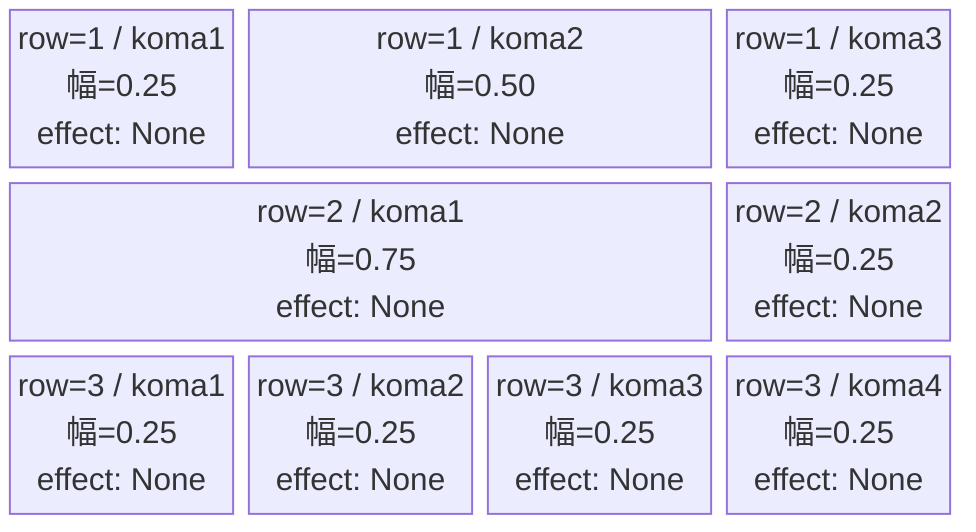
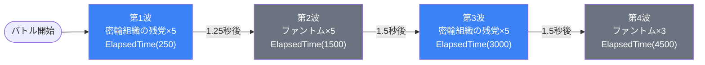

# vd_spy_normal_00001 インゲームデータ詳細解説

> 参照リポジトリ: `projects/glow-masterdata`（MstEnemyStageParameter は `generated/ファントムマスター/` バッチを参照）
> リリースキー: `202509010`

## インゲーム要件テキスト

SPY×FAMILY（spy）作品の限界チャレンジ（VD）ノーマルブロック。フェーズ切り替えなし・ボスなしのシンプルな雑魚波状攻撃構成。砦HPは100（VDノーマルブロック固定仕様）でダメージは有効。

登場する敵は2種類。Blue属性の密輸組織の残党は攻撃ロール（Attack）でノックバック2を持ち、遠めの位置（well_distance=0.40）から攻撃する中距離型。drop_bp=300と高く、スコアの主力源。Colorless属性のファントムはVD全作品共通の汎用雑魚で、砦付近（well_distance=0.22）まで接近してから攻撃する接近型。ノックバックは3と多く、処理に時間がかかる。

シーケンスは4波構成で計18体が登場する（VDノーマルブロック最低15体要件を満たす）。密輸組織の残党→ファントム→密輸組織の残党→ファントムと2種が交互に出現し、属性の切り替えによって単調さを回避した設計となっている。

BGMはVDノーマルブロック共通の `SSE_SBG_003_010`。

---

## レベルデザイン

### 敵キャラ設計

#### 敵キャラ選定（MstEnemyCharacter）

本ブロックで使用する敵キャラクターモデルは2種類。

| mst_enemy_character_id | 日本語名 | 役割 | 備考 |
|------------------------|---------|------|------|
| `enemy_spy_00001` | 密輸組織の残党 | 主力雑魚（Blue） | drop_bp=300、ノックバック2。well_dist=0.40の中距離攻撃型 |
| `enemy_glo_00001` | ファントム | 共通雑魚（Colorless） | drop_bp=150、ノックバック3。well_dist=0.22の接近型 |

#### 敵キャラステータス（MstEnemyStageParameter）

> **MstEnemyStageParameterは `generated/ファントムマスター/` バッチ（release_key=202509010）の既存行を参照。今回新規作成なし。**
> MstInGameのcoef（normal_enemy_hp_coef / normal_enemy_attack_coef / normal_enemy_speed_coef）は全て1.0（無調整）。

| MstEnemyStageParameter ID | 日本語名 | kind | role | color | base_hp | base_atk | base_spd | well_dist | knockback | combo | drop_bp |
|--------------------------|---------|------|------|-------|---------|---------|---------|-----------|-----------|---------| ------- |
| `e_spy_00001_vd_Normal_Blue` | 密輸組織の残党 | Normal | Attack | Blue | 10,000 | 50 | 34 | 0.40 | 2 | 1 | 300 |
| `e_glo_00001_vd_Normal_Colorless` | ファントム | Normal | Attack | Colorless | 5,000 | 100 | 34 | 0.22 | 3 | 1 | 150 |

---

### コマ設計

3行構成。全コマ effect=None（コマ効果なし）。

| row | height | 選択パターン | コマ数 | 各幅 | 幅合計 |
|-----|--------|-------------|--------|------|--------|
| 1 | 0.33 | パターン9「中央広い」 | 3コマ | 0.25 / 0.50 / 0.25 | 1.00 |
| 2 | 0.33 | パターン4「がっつり右長2コマ」 | 2コマ | 0.75 / 0.25 | 1.00 |
| 3 | 0.34 | パターン12「4等分」 | 4コマ | 0.25 / 0.25 / 0.25 / 0.25 | 1.00 |

---

### 敵キャラシーケンス設計

#### どのフェーズで、どの敵を、いつ、どこに、どのくらい出現させるか

フェーズ切り替えなし（デフォルトグループのみ）。ElapsedTimeで4波に分けて計18体を出現させる線形構成。

**デフォルトグループ（単一グループ・ループなし）**

| elem | 出現タイミング | 敵 | 数 | 累計出現数 |
|------|-------------|---|---|-----------|
| 1 | ElapsedTime(250) | 密輸組織の残党（Blue/Normal） | 5 | 5体 |
| 2 | ElapsedTime(1500) | ファントム（Colorless/Normal） | 5 | 10体 |
| 3 | ElapsedTime(3000) | 密輸組織の残党（Blue/Normal） | 5 | 15体 |
| 4 | ElapsedTime(4500) | ファントム（Colorless/Normal） | 3 | **18体** |

合計: **18体**（VDノーマルブロック最低15体要件 ✓）

#### 敵キャラの固有ステータス調整（hp_coef / atk_coef）

MstAutoPlayerSequenceのenemy_hp_coef・enemy_attack_coef・enemy_speed_coefはすべてデフォルト（1.0 = 素値そのまま）。MstInGameのcoefも全て1.0。

| 波 | 敵 | base_hp | hp_coef | 実HP | base_atk | atk_coef | 実ATK |
|----|---|---------|---------|------|---------|---------|-------|
| 第1・3波 | 密輸組織の残党（Blue/Normal） | 10,000 | 1.0 | 10,000 | 50 | 1.0 | 50 |
| 第2・4波 | ファントム（Colorless/Normal） | 5,000 | 1.0 | 5,000 | 100 | 1.0 | 100 |

#### フェーズ切り替えはあるか

**なし。**

VDノーマルブロック仕様に基づき `SwitchSequenceGroup` は使用しない。デフォルトグループのみで完結する。

---

## 演出

### アセット

#### 背景

| 設定箇所 | アセットキー | 備考 |
|---------|------------|------|
| ループ背景（MstInGame） | `koma_background_vd_00001` | VDフロア0以上用背景。フロア進行で `vd_00003`（20以上）・`vd_00005`（40以上）に切り替わる |
| 砦背景（MstEnemyOutpost） | 未設定 | VD共通 |

#### BGM

| 設定 | 値 | 備考 |
|------|-----|------|
| 通常BGM（bgm_asset_key） | `SSE_SBG_003_010` | VDノーマルブロック共通BGM |
| ボスBGM（boss_bgm_asset_key） | なし | normalブロックのためボスBGM未設定 |

---

### 敵キャラオーラ

| オーラ種別 | 使用箇所 |
|---------|---------|
| `Default` | 全敵（密輸組織の残党・ファントムとも） |

VDノーマルブロックはボスなしのためBossオーラは使用しない。

---

### 敵キャラ召喚アニメーション

全敵の `summon_animation_type` は未設定（デフォルト）。
