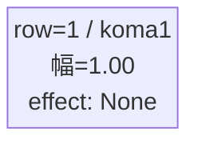
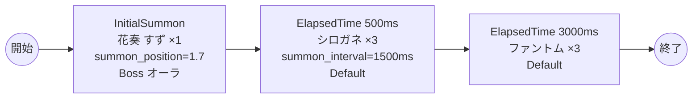

# vd_aya_boss_00001 インゲームデータ詳細解説

> 参照リポジトリ: `projects/glow-masterdata`
> リリースキー: 202604010

## インゲーム要件テキスト

「あやかしトライアングル」の世界観を反映したボスブロックです。ボスとして「花奏 すず」（chara_aya_00101 / Green属性・ディフェンスロール）が敵ゲート前に降臨します。プレイヤーはボスを倒すまで敵ゲートへのダメージが無効であるため、花奏 すずの撃破が最優先課題となります。花奏 すずはノックバック1回・コンボ5・攻撃射程（well_dist=0.3）を持ち、1ダメージ受けると即座に進軍を開始します。ボス登場から0.5秒後にシロガネ（enemy_aya_00001）が3体、時間差で1体ずつ出現してプレッシャーを加え、3.0秒後にはファントム（enemy_glo_00001）が3体追加出現することで継続的な圧力を維持します。あやかしが住まう神秘的な世界観を演出する、緊張感のある攻略構成です。フロア係数 1.00 を基準とした設計です。

> **c_キャラ召喚制約**: 花奏 すず（chara_aya_00101）はプレイアブルキャラが敵として登場するc_キャラです。同一トリガーでsummon_count >= 2かつsummon_interval = 0の瞬間複数召喚は禁止されているため、InitialSummonでsummon_count = 1で設定します。

---

## レベルデザイン

### 敵キャラ設計

#### 敵キャラ選定（MstEnemyCharacter）

| mst_enemy_character_id | 日本語名 | 役割 | 備考 |
|------------------------|---------|------|------|
| chara_aya_00101 | 花奏 すず | ボス | Green属性・ディフェンスロール |
| enemy_aya_00001 | シロガネ | 雑魚 | Green属性・攻撃ロール・高速移動 |
| enemy_glo_00001 | ファントム | 雑魚（共通） | Colorless属性・攻撃ロール |

#### 敵キャラステータス（MstEnemyStageParameter）

> 既存参照: `domain/tasks/20260310_115400_vd_ingame_masterdata_generation/generated/ファントムマスター/MstEnemyStageParameter.csv` (release_key: 202604010 / 202509010)
> 新規生成不要（既存IDをそのままMstAutoPlayerSequence.action_valueで参照）

| MstEnemyStageParameter ID | 日本語名 | kind | role | color | base_hp | base_atk | base_spd | well_dist | knockback | combo | drop_bp |
|--------------------------|---------|------|------|-------|---------|----------|----------|-----------|-----------|-------|---------|
| c_aya_00101_vd_Boss_Green | 花奏 すず | Boss | Defense | Green | 10,000 | 100 | 35 | 0.3 | 1 | 5 | 300 |
| e_aya_00001_vd_Normal_Green | シロガネ | Normal | Attack | Green | 5,000 | 10 | 50 | 0.35 | 3 | 0 | 250 |
| e_glo_00001_vd_Normal_Colorless | ファントム | Normal | Attack | Colorless | 5,000 | 100 | 34 | 0.22 | 3 | 1 | 150 |

---

### コマ設計

ボスブロックは1行1コマ固定。

| row | height | コマ数 | koma1_width | 幅合計 |
|-----|--------|-------|-------------|--------|
| 1 | 1.0 | 1コマ | 1.0 | 1.0 |

---

### 敵キャラシーケンス設計

#### どのフェーズで、どの敵を、いつ、どこに、どのくらい出現させるか

| elem | 出現タイミング | 敵 | 数 | 累計出現数/召喚位置 |
|------|-------------|---|---|-----------------|
| 1 | InitialSummon | 花奏 すず (c_aya_00101_vd_Boss_Green) | 1 | 1 / summon_position=1.7 |
| 2 | ElapsedTime 500ms | シロガネ (e_aya_00001_vd_Normal_Green) | 3 (summon_interval=1500ms) | 4 |
| 3 | ElapsedTime 3000ms | ファントム (e_glo_00001_vd_Normal_Colorless) | 3 | 7 |

> **c_キャラ召喚制約について**: 花奏 すず（c_aya_00101）はプレイアブルキャラが敵として登場するc_キャラです。同一トリガーでsummon_count >= 2かつsummon_interval = 0の瞬間複数召喚は禁止されているため、InitialSummonでsummon_count = 1で設定します。シロガネ（e_aya_00001）はe_キャラ（敵専用キャラ）のため制約対象外ですが、自然な出現演出のためsummon_interval=1500msを設定し、時間差で1体ずつ出現させます。

#### 敵キャラの固有ステータス調整（hp_coef / atk_coef）

| 波/フェーズ | 敵 | base_hp | hp_coef | 実HP | base_atk | atk_coef | 実ATK |
|-----------|---|---------|---------|------|----------|----------|-------|
| InitialSummon | 花奏 すず | 10,000 | 1.0 | 10,000 | 100 | 1.0 | 100 |
| ElapsedTime 500ms | シロガネ | 5,000 | 1.0 | 5,000 | 10 | 1.0 | 10 |
| ElapsedTime 3000ms | ファントム | 5,000 | 1.0 | 5,000 | 100 | 1.0 | 100 |

#### フェーズ切り替えはあるか

なし（VDではSwitchSequenceGroup使用禁止）

---

## 演出

### アセット

#### 背景

| 設定箇所 | アセットキー | 備考 |
|---------|------------|------|
| loop_background_asset_key | （空） | VDの背景切り替えはゲームロジック側で管理 |
| フロア0以上 | koma_background_vd_00002 | クライアント側でフロア係数に応じて切り替え |
| フロア20以上 | koma_background_vd_00004 | 同上 |
| フロア40以上 | koma_background_vd_00006 | 同上 |

#### BGM

| 設定 | 値 | 備考 |
|-----|---|------|
| bgm_asset_key | SSE_SBG_003_004 | ボスブロック用BGM |

---

### 敵キャラオーラ

| オーラ種別 | 使用箇所 |
|----------|---------|
| Boss | 花奏 すず（InitialSummon時） |
| Default | シロガネ、ファントム（雑魚2種） |

---

### 敵キャラ召喚アニメーション

ボス（花奏 すず）は `InitialSummon` で `summon_position=1.7`（ゲート付近）に配置。1ダメージ受けると進軍を開始する（`move_start_condition_type=Damage, move_start_condition_value=1`）。
雑魚キャラ（シロガネ・ファントム）は `SummonEnemy` アクションによるElapsedTime時間差召喚。シロガネは `summon_interval=1500ms` で3体を順次出現させ、高速移動（speed=50）により素早く前線へ進行する演出となる。

---

## 生成テーブルまとめ

| テーブル | 状態 | 備考 |
|---------|------|------|
| MstEnemyStageParameter | 既存参照 | generated/ファントムマスター/ の既存データ使用（release_key: 202604010 / 202509010） |
| MstEnemyOutpost | 新規生成 | id=vd_aya_boss_00001、HP=1,000固定、is_damage_invalidation=空 |
| MstPage | 新規生成 | id=vd_aya_boss_00001 |
| MstKomaLine | 新規生成 | 1行固定（row=1, height=1.0, koma1_width=1.0） |
| MstAutoPlayerSequence | 新規生成 | 3要素（ボス1体+雑魚6体） |
| MstInGame | 新規生成 | id=vd_aya_boss_00001、ボスあり（boss_mst_enemy_stage_parameter_id=c_aya_00101_vd_Boss_Green）、ENABLE=e、release_key=202604010 |

---

## マスタデータ設計詳細

### MstEnemyStageParameter

> 既存バッチデータ参照（新規追加不要）

| ENABLE | release_key | id | mst_enemy_character_id | character_unit_kind | role_type | color | sort_order | hp | damage_knock_back_count | move_speed | well_distance | attack_power | attack_combo_cycle | drop_battle_point |
|--------|-------------|---|------------------------|---------------------|-----------|-------|------------|---|------------------------|------------|---------------|-------------|-------------------|------------------|
| e | 202604010 | c_aya_00101_vd_Boss_Green | chara_aya_00101 | Boss | Defense | Green | 4 | 10000 | 1 | 35 | 0.3 | 100 | 5 | 300 |
| e | 202604010 | e_aya_00001_vd_Normal_Green | enemy_aya_00001 | Normal | Attack | Green | 1 | 5000 | 3 | 50 | 0.35 | 10 | 0 | 250 |
| e | 202509010 | e_glo_00001_vd_Normal_Colorless | enemy_glo_00001 | Normal | Attack | Colorless | 1001 | 5000 | 3 | 34 | 0.22 | 100 | 1 | 150 |

> 注: `c_aya_00101_vd_Boss_Green` および `e_aya_00001_vd_Normal_Green` は release_key=202604010 で既存登録済み（generated/ファントムマスター/MstEnemyStageParameter.csv）。`e_glo_00001_vd_Normal_Colorless` は release_key=202509010 で既存登録済み。今回バッチでは新規追加不要。

### MstEnemyOutpost

| ENABLE | release_key | id | hp | is_damage_invalidation |
|--------|-------------|---|---|----------------------|
| e | 202604010 | vd_aya_boss_00001 | 1000 | （空） |

### MstPage

| ENABLE | release_key | id |
|--------|-------------|---|
| e | 202604010 | vd_aya_boss_00001 |

### MstKomaLine

| ENABLE | release_key | id | mst_page_id | row | height | koma1_width | koma1_effect_type | koma1_effect_target_side |
|--------|-------------|---|------------|-----|--------|------------|------------------|------------------------|
| e | 202604010 | vd_aya_boss_00001_row1 | vd_aya_boss_00001 | 1 | 1.0 | 1.0 | None | All |

### MstAutoPlayerSequence

| ENABLE | release_key | id | sequence_set_id | sequence_group_id | sequence_element_id | condition_type | condition_value | action_type | action_value | summon_count | summon_interval | summon_position | move_start_condition_type | move_start_condition_value | aura_type | enemy_hp_coef | enemy_attack_coef | enemy_speed_coef | koma_effect_type |
|--------|-------------|---|----------------|------------------|--------------------|--------------|-----------------|-----------|--------------|-----------|-----------------|-----------------|--------------------------|--------------------------|-----------|--------------|-----------------|--------------------|-----------------|
| e | 202604010 | vd_aya_boss_00001_1 | vd_aya_boss_00001 | （空） | 1 | InitialSummon | 0 | SummonEnemy | c_aya_00101_vd_Boss_Green | 1 | 0 | 1.7 | Damage | 1 | Boss | 1 | 1 | 1 | None |
| e | 202604010 | vd_aya_boss_00001_2 | vd_aya_boss_00001 | （空） | 2 | ElapsedTime | 500 | SummonEnemy | e_aya_00001_vd_Normal_Green | 3 | 1500 | | | | Default | 1 | 1 | 1 | None |
| e | 202604010 | vd_aya_boss_00001_3 | vd_aya_boss_00001 | （空） | 3 | ElapsedTime | 3000 | SummonEnemy | e_glo_00001_vd_Normal_Colorless | 3 | 0 | | | | Default | 1 | 1 | 1 | None |

### MstInGame

| ENABLE | release_key | id | mst_auto_player_sequence_set_id | bgm_asset_key | mst_page_id | mst_enemy_outpost_id | boss_mst_enemy_stage_parameter_id | normal_enemy_hp_coef | normal_enemy_attack_coef | normal_enemy_speed_coef | normal_enemy_roulette_point | rare_enemy_roulette_point | boss_enemy_roulette_point | boss_enemy_hp_coef | boss_enemy_attack_coef | boss_enemy_speed_coef |
|--------|-------------|---|--------------------------------|--------------|------------|---------------------|----------------------------------|---------------------|------------------------|-----------------------|---------------------------|--------------------------|--------------------------|------------------|----------------------|---------------------|
| e | 202604010 | vd_aya_boss_00001 | vd_aya_boss_00001 | SSE_SBG_003_004 | vd_aya_boss_00001 | vd_aya_boss_00001 | c_aya_00101_vd_Boss_Green | 1.0 | 1.0 | 1 | 5 | 50 | 20 | 1.0 | 1.0 | 1 |
