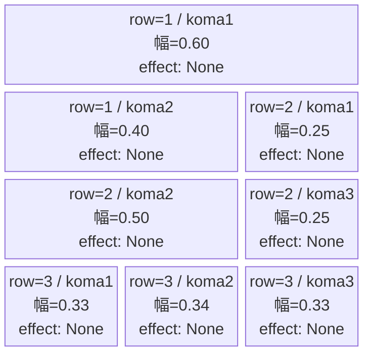
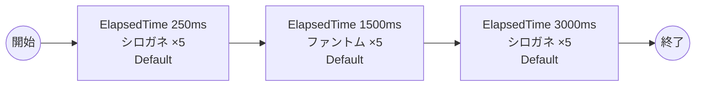

# vd_aya_normal_00001 インゲームデータ詳細解説

> 参照リポジトリ: `projects/glow-masterdata`
> リリースキー: 202604010

## インゲーム要件テキスト

「あやかしトライアングル」の世界観を反映したノーマルブロックです。シロガネ（Green属性・攻撃ロール）とファントム（Colorless属性・攻撃ロール）が時間差で出現します。難易度はフロア係数 1.00 を基準に設計されており、2種類の敵が波状に現れることで変化のある戦闘体験を提供します。シロガネは高速移動（speed=50）と広いウェル距離（well_dist=0.35）を持ち、素早く前線へ迫る脅威を演出します。ファントムは共通の雑魚敵として攻撃的な補助役を担います。3波構成（0.25秒後・1.5秒後・3.0秒後）で合計15体が登場し、プレイヤーへの適度なプレッシャーを与えつつ、十分なバトルポイント獲得機会も確保しています。

---

## レベルデザイン

### 敵キャラ設計

#### 敵キャラ選定（MstEnemyCharacter）

| mst_enemy_character_id | 日本語名 | 役割 | 備考 |
|------------------------|---------|------|------|
| enemy_aya_00001 | シロガネ | 雑魚 | Green属性・攻撃ロール・高速移動 |
| enemy_glo_00001 | ファントム | 雑魚（共通） | Colorless属性・攻撃ロール |

#### 敵キャラステータス（MstEnemyStageParameter）

> 既存参照: `domain/tasks/20260310_115400_vd_ingame_masterdata_generation/generated/ファントムマスター/MstEnemyStageParameter.csv` (release_key: 202604010)
> 今回のバッチ（release_key=202604010）で新規追加する

| MstEnemyStageParameter ID | 日本語名 | kind | role | color | base_hp | base_atk | base_spd | well_dist | knockback | combo | drop_bp |
|--------------------------|---------|------|------|-------|---------|----------|----------|-----------|-----------|-------|---------|
| e_aya_00001_vd_Normal_Green | シロガネ | Normal | Attack | Green | 5,000 | 10 | 50 | 0.35 | 3 | 0 | 250 |
| e_glo_00001_vd_Normal_Colorless | ファントム | Normal | Attack | Colorless | 5,000 | 100 | 34 | 0.22 | 3 | 1 | 150 |

---

### コマ設計

各行独立ランダム抽選（12パターンから）の結果:

| row | height | 選択パターン | コマ数 | 各幅 | 幅合計 |
|-----|--------|------------|-------|------|--------|
| 1 | 0.33 | パターン2「右ちょい長2コマ」 | 2コマ | 0.60, 0.40 | 1.0 |
| 2 | 0.33 | パターン9「中央広い」 | 3コマ | 0.25, 0.50, 0.25 | 1.0 |
| 3 | 0.34 | パターン7「3等分」 | 3コマ | 0.33, 0.34, 0.33 | 1.0 |

---

### 敵キャラシーケンス設計

#### どのフェーズで、どの敵を、いつ、どこに、どのくらい出現させるか

| elem | 出現タイミング | 敵 | 数 | 累計出現数 |
|------|-------------|---|---|---------|
| 1 | ElapsedTime 250ms | シロガネ (e_aya_00001_vd_Normal_Green) | 5 | 5 |
| 2 | ElapsedTime 1500ms | ファントム (e_glo_00001_vd_Normal_Colorless) | 5 | 10 |
| 3 | ElapsedTime 3000ms | シロガネ (e_aya_00001_vd_Normal_Green) | 5 | 15 |

合計: **15体**（要件「最低15体以上」を満たす）

#### 敵キャラの固有ステータス調整（hp_coef / atk_coef）

| 波 | 敵 | base_hp | hp_coef | 実HP | base_atk | atk_coef | 実ATK |
|---|---|---------|---------|------|----------|----------|-------|
| 1 | シロガネ | 5,000 | 1.0 | 5,000 | 10 | 1.0 | 10 |
| 2 | ファントム | 5,000 | 1.0 | 5,000 | 100 | 1.0 | 100 |
| 3 | シロガネ | 5,000 | 1.0 | 5,000 | 10 | 1.0 | 10 |

#### フェーズ切り替えはあるか

なし（VDではSwitchSequenceGroup使用禁止）

---

## 演出

### アセット

#### 背景

| 設定箇所 | アセットキー | 備考 |
|---------|------------|------|
| loop_background_asset_key | （空） | VDの背景切り替えはゲームロジック側で管理 |
| フロア0以上 | koma_background_vd_00001 | クライアント側でフロア係数に応じて切り替え |
| フロア20以上 | koma_background_vd_00003 | 同上 |
| フロア40以上 | koma_background_vd_00005 | 同上 |

#### BGM

| 設定 | 値 | 備考 |
|-----|---|------|
| bgm_asset_key | SSE_SBG_003_010 | ノーマルブロック用BGM |

---

### 敵キャラオーラ

| オーラ種別 | 使用箇所 |
|----------|---------|
| Default | 全敵キャラ（ノーマルブロックはボスなし、全行Default） |

---

### 敵キャラ召喚アニメーション

全キャラ `SummonEnemy` アクションによるElapsedTime時間差召喚。InitialSummonは使用しない（normalブロックはボスなし）。シロガネは `speed=50` の高速移動キャラであるため、召喚直後に素早く前線へ進行する演出となる。

---

## 生成テーブルまとめ

| テーブル | 状態 | 備考 |
|---------|------|------|
| MstEnemyStageParameter | 既存参照（バッチ内新規追加） | e_aya_00001_vd_Normal_Green / e_glo_00001_vd_Normal_Colorless、release_key=202604010 |
| MstEnemyOutpost | 新規生成 | id=vd_aya_normal_00001、HP=100固定、is_damage_invalidation=空 |
| MstPage | 新規生成 | id=vd_aya_normal_00001 |
| MstKomaLine | 新規生成 | 3行固定（row1-3）、各行独立ランダム抽選 |
| MstAutoPlayerSequence | 新規生成 | sequence_set_id=vd_aya_normal_00001、3要素（計15体） |
| MstInGame | 新規生成 | id=vd_aya_normal_00001、stage_type=vd_normal、ボスなし |

---

## マスタデータ設計詳細

### MstEnemyStageParameter

> リリースキー: 202604010

| ENABLE | release_key | id | mst_enemy_character_id | character_unit_kind | role_type | color | sort_order | hp | damage_knock_back_count | move_speed | well_distance | attack_power | attack_combo_cycle | drop_battle_point |
|--------|-------------|---|------------------------|---------------------|-----------|-------|------------|---|------------------------|------------|---------------|-------------|-------------------|------------------|
| e | 202604010 | e_aya_00001_vd_Normal_Green | enemy_aya_00001 | Normal | Attack | Green | 1 | 5000 | 3 | 50 | 0.35 | 10 | 0 | 250 |
| e | 202604010 | e_glo_00001_vd_Normal_Colorless | enemy_glo_00001 | Normal | Attack | Colorless | 1001 | 5000 | 3 | 34 | 0.22 | 100 | 1 | 150 |

> 注: `e_glo_00001_vd_Normal_Colorless` は release_key=202509010 で既存登録済み。今回バッチでは新規追加不要の場合は既存IDをそのまま参照する。

### MstEnemyOutpost

| ENABLE | release_key | id | hp | is_damage_invalidation |
|--------|-------------|---|---|----------------------|
| e | 202604010 | vd_aya_normal_00001 | 100 | （空） |

### MstPage

| ENABLE | release_key | id |
|--------|-------------|---|
| e | 202604010 | vd_aya_normal_00001 |

### MstKomaLine

| ENABLE | release_key | id | mst_page_id | row | height | koma1_width | koma2_width | koma3_width | koma4_width | koma1_effect_type | koma2_effect_type | koma3_effect_type | koma4_effect_type | koma1_effect_target_side | koma2_effect_target_side | koma3_effect_target_side | koma4_effect_target_side |
|--------|-------------|---|------------|-----|--------|------------|------------|------------|------------|------------------|------------------|------------------|------------------|------------------------|------------------------|------------------------|------------------------|
| e | 202604010 | vd_aya_normal_00001_row1 | vd_aya_normal_00001 | 1 | 0.33 | 0.60 | 0.40 | | | None | None | | | All | All | | |
| e | 202604010 | vd_aya_normal_00001_row2 | vd_aya_normal_00001 | 2 | 0.33 | 0.25 | 0.50 | 0.25 | | None | None | None | | All | All | All | |
| e | 202604010 | vd_aya_normal_00001_row3 | vd_aya_normal_00001 | 3 | 0.34 | 0.33 | 0.34 | 0.33 | | None | None | None | | All | All | All | |

### MstAutoPlayerSequence

| ENABLE | release_key | id | sequence_set_id | sequence_group_id | sequence_element_id | condition_type | condition_value | action_type | action_value | summon_count | summon_interval | summon_position | move_start_condition_type | move_start_condition_value | aura_type | enemy_hp_coef | enemy_attack_coef | enemy_speed_coef | koma_effect_type |
|--------|-------------|---|----------------|------------------|--------------------|--------------|-----------------|-----------|--------------|-----------|-----------------|-----------------|--------------------------|--------------------------|-----------|--------------|-----------------|--------------------|-----------------|
| e | 202604010 | vd_aya_normal_00001_1 | vd_aya_normal_00001 | （空） | 1 | ElapsedTime | 250 | SummonEnemy | e_aya_00001_vd_Normal_Green | 5 | 0 | | | | Default | 1 | 1 | 1 | None |
| e | 202604010 | vd_aya_normal_00001_2 | vd_aya_normal_00001 | （空） | 2 | ElapsedTime | 1500 | SummonEnemy | e_glo_00001_vd_Normal_Colorless | 5 | 0 | | | | Default | 1 | 1 | 1 | None |
| e | 202604010 | vd_aya_normal_00001_3 | vd_aya_normal_00001 | （空） | 3 | ElapsedTime | 3000 | SummonEnemy | e_aya_00001_vd_Normal_Green | 5 | 0 | | | | Default | 1 | 1 | 1 | None |

### MstInGame

| ENABLE | release_key | id | mst_auto_player_sequence_set_id | bgm_asset_key | mst_page_id | mst_enemy_outpost_id | boss_mst_enemy_stage_parameter_id | normal_enemy_hp_coef | normal_enemy_attack_coef | normal_enemy_speed_coef | normal_enemy_roulette_point | rare_enemy_roulette_point | boss_enemy_roulette_point | boss_enemy_hp_coef | boss_enemy_attack_coef | boss_enemy_speed_coef |
|--------|-------------|---|--------------------------------|--------------|------------|---------------------|----------------------------------|---------------------|------------------------|-----------------------|---------------------------|--------------------------|--------------------------|------------------|----------------------|---------------------|
| e | 202604010 | vd_aya_normal_00001 | vd_aya_normal_00001 | SSE_SBG_003_010 | vd_aya_normal_00001 | vd_aya_normal_00001 | （空） | 1.0 | 1.0 | 1 | 5 | 50 | 20 | 1.0 | 1.0 | 1 |
