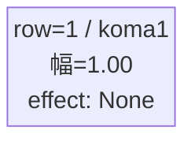
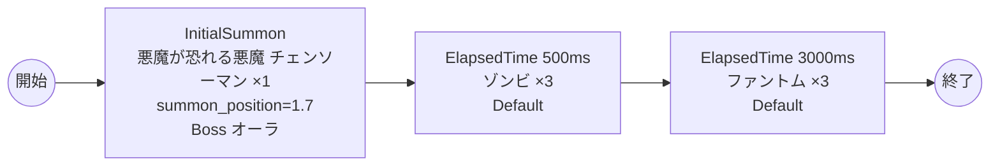

# vd_chi_boss_00001 インゲームデータ詳細解説

> 参照リポジトリ: `projects/glow-masterdata`
> リリースキー: 202604010

## インゲーム要件テキスト

チェンソーマンの世界観を反映したボスブロックです。ボスとして「悪魔が恐れる悪魔 チェンソーマン」（Blue属性・テクニカルロール）が敵ゲート前に降臨します。プレイヤーはボスを倒すまで敵ゲートへのダメージが無効であるため、ボスの撃破が最優先課題となります。ボス登場から0.5秒後にゾンビが3体出現してプレッシャーを与え、さらに3秒後にファントムが3体追加出現することで継続的な圧力を維持します。チェンソーマンはBlue属性・テクニカルロールで高い移動速度（spd=50）と高コンボ（combo=5）を持つ強敵であり、「悪魔が恐れる悪魔」の名に恥じない圧倒的な存在感を演出します。フロア係数 1.00 を基準とした設計で、1ダメージ受けるとすぐに進軍を開始する仕様により、緊張感のある戦闘体験を提供します。

---

## レベルデザイン

### 敵キャラ設計

#### 敵キャラ選定（MstEnemyCharacter）

| mst_enemy_character_id | 日本語名 | 役割 | 備考 |
|------------------------|---------|------|------|
| chara_chi_00002 | 悪魔が恐れる悪魔 チェンソーマン | ボス | Blue属性・テクニカルロール |
| enemy_chi_00101 | ゾンビ | 雑魚 | Blue属性・防御ロール |
| enemy_glo_00001 | ファントム | 雑魚（共通） | Colorless属性・攻撃ロール |

#### 敵キャラステータス（MstEnemyStageParameter）

> 既存参照: `domain/tasks/20260310_115400_vd_ingame_masterdata_generation/generated/ファントムマスター/MstEnemyStageParameter.csv` (release_key: 202509010)
> 新規生成不要（既存IDをそのままMstAutoPlayerSequence.action_valueで参照）

| MstEnemyStageParameter ID | 日本語名 | kind | role | color | base_hp | base_atk | base_spd | well_dist | knockback | combo | drop_bp |
|--------------------------|---------|------|------|-------|---------|----------|----------|-----------|-----------|-------|---------|
| c_chi_00002_vd_Boss_Blue | 悪魔が恐れる悪魔 チェンソーマン | Boss | Technical | Blue | 400,000 | 450 | 50 | 0.15 | 2 | 5 | 50 |
| e_chi_00101_vd_Normal_Blue | ゾンビ | Normal | Defense | Blue | 5,000 | 320 | 35 | 0.11 | 1 | 1 | 50 |
| e_glo_00001_vd_Normal_Colorless | ファントム | Normal | Attack | Colorless | 5,000 | 100 | 34 | 0.22 | 3 | 1 | 150 |

---

### コマ設計

ボスブロックは1行1コマ固定。

| row | height | コマ数 | koma1_width | 幅合計 |
|-----|--------|-------|-------------|--------|
| 1 | 1.0 | 1コマ | 1.0 | 1.0 |

---

### 敵キャラシーケンス設計

#### どのフェーズで、どの敵を、いつ、どこに、どのくらい出現させるか

| elem | 出現タイミング | 敵 | 数 | 累計出現数/召喚位置 |
|------|-------------|---|---|-----------------|
| 1 | InitialSummon | 悪魔が恐れる悪魔 チェンソーマン (c_chi_00002_vd_Boss_Blue) | 1 | 1 / summon_position=1.7 |
| 2 | ElapsedTime 500ms | ゾンビ (e_chi_00101_vd_Normal_Blue) | 3 | 4 |
| 3 | ElapsedTime 3000ms | ファントム (e_glo_00001_vd_Normal_Colorless) | 3 | 7 |

> **ボスはc_キャラ（chara_chi_00002）**: チェンソーマンはプレイアブルキャラが敵として登場するc_キャラです。InitialSummonで1体のみ配置し、summon_count=1で設定します。c_キャラの同一トリガーでsummon_count >= 2かつsummon_interval = 0の瞬間複数召喚は禁止されています。

#### 敵キャラの固有ステータス調整（hp_coef / atk_coef）

| 波/フェーズ | 敵 | base_hp | hp_coef | 実HP | base_atk | atk_coef | 実ATK |
|-----------|---|---------|---------|------|----------|----------|-------|
| InitialSummon | 悪魔が恐れる悪魔 チェンソーマン | 400,000 | 1.0 | 400,000 | 450 | 1.0 | 450 |
| ElapsedTime 500ms | ゾンビ | 5,000 | 1.0 | 5,000 | 320 | 1.0 | 320 |
| ElapsedTime 3000ms | ファントム | 5,000 | 1.0 | 5,000 | 100 | 1.0 | 100 |

#### フェーズ切り替えはあるか

なし（VDではSwitchSequenceGroup使用禁止）

---

## 演出

### アセット

#### 背景

| 設定箇所 | アセットキー | 備考 |
|---------|------------|------|
| loop_background_asset_key | （空） | VDの背景切り替えはゲームロジック側で管理 |
| フロア0以上 | koma_background_vd_00002 | クライアント側でフロア係数に応じて切り替え |
| フロア20以上 | koma_background_vd_00004 | 同上 |
| フロア40以上 | koma_background_vd_00006 | 同上 |

#### BGM

| 設定 | 値 | 備考 |
|-----|---|------|
| bgm_asset_key | SSE_SBG_003_004 | ボスブロック用BGM |

---

### 敵キャラオーラ

| オーラ種別 | 使用箇所 |
|----------|---------|
| Boss | 悪魔が恐れる悪魔 チェンソーマン（InitialSummon時） |
| Default | ゾンビ、ファントム（雑魚2種） |

---

### 敵キャラ召喚アニメーション

ボス（悪魔が恐れる悪魔 チェンソーマン）は `InitialSummon` で `summon_position=1.7`（ゲート付近）に配置。1ダメージ受けると進軍を開始する（`move_start_condition_type=Damage, move_start_condition_value=1`）。
雑魚キャラ（ゾンビ・ファントム）は `SummonEnemy` アクションによるElapsedTime時間差召喚。

---

## 生成テーブルまとめ

| テーブル | 状態 | 備考 |
|---------|------|------|
| MstEnemyStageParameter | 既存参照 | generated/ファントムマスター/ の既存データ使用（release_key: 202509010） |
| MstEnemyOutpost | 新規生成 | HP=1,000固定、is_damage_invalidation=空 |
| MstPage | 新規生成 | id=vd_chi_boss_00001 |
| MstKomaLine | 新規生成 | 1行固定（row=1, koma1_width=1.0） |
| MstAutoPlayerSequence | 新規生成 | 3要素（ボス1体+雑魚6体） |
| MstInGame | 新規生成 | ボスあり（boss_mst_enemy_stage_parameter_id=c_chi_00002_vd_Boss_Blue） |
