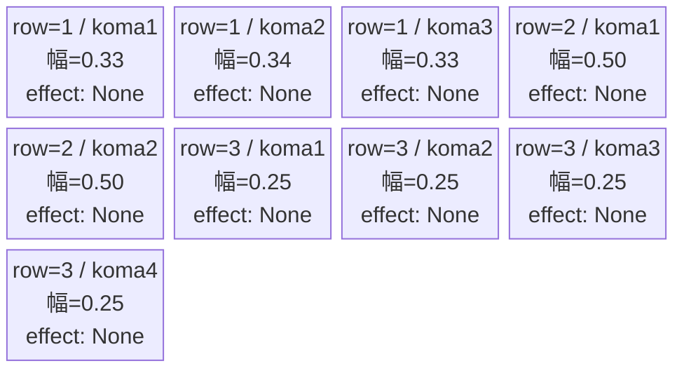
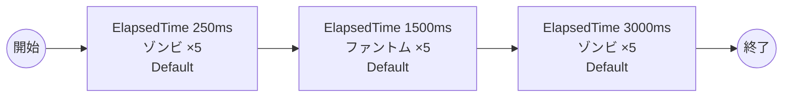

# vd_chi_normal_00001 インゲームデータ詳細解説

> 参照リポジトリ: `projects/glow-masterdata`
> リリースキー: 202604010

## インゲーム要件テキスト

チェンソーマンの世界観を反映したノーマルブロックです。ゾンビ（Blue属性・防御ロール）とファントム（Colorless属性・攻撃ロール）が時間差で出現します。ゾンビはチェンソーマン作品を象徴する雑魚敵であり、Blue属性・防御型として粘り強く戦列を維持します。ファントムは全作品共通の雑魚敵としてColorless属性・攻撃型で変化を加えます。3波構成（0.25秒後・1.5秒後・3.0秒後）で合計15体が登場し、プレイヤーへ適度なプレッシャーを与えつつ、十分なバトルポイント獲得機会を確保します。難易度はフロア係数 1.00 を基準に設計されており、フロア到達数に応じた係数により自然なスケーリングが行われます。

---

## レベルデザイン

### 敵キャラ設計

#### 敵キャラ選定（MstEnemyCharacter）

| mst_enemy_character_id | 日本語名 | 役割 | 備考 |
|------------------------|---------|------|------|
| enemy_chi_00101 | ゾンビ | 雑魚 | Blue属性・防御ロール |
| enemy_glo_00001 | ファントム | 雑魚（共通） | Colorless属性・攻撃ロール |

#### 敵キャラステータス（MstEnemyStageParameter）

> 既存参照: `domain/tasks/20260310_115400_vd_ingame_masterdata_generation/generated/ファントムマスター/MstEnemyStageParameter.csv` (release_key: 202509010)
> 新規生成不要（既存IDをそのままMstAutoPlayerSequence.action_valueで参照）
> ただし、今回のバッチでは release_key=202604010 で新規追加する

| MstEnemyStageParameter ID | 日本語名 | kind | role | color | base_hp | base_atk | base_spd | well_dist | knockback | combo | drop_bp |
|--------------------------|---------|------|------|-------|---------|----------|----------|-----------|-----------|-------|---------|
| e_chi_00101_vd_Normal_Blue | ゾンビ | Normal | Defense | Blue | 5,000 | 320 | 35 | 0.11 | 1 | 1 | 50 |
| e_glo_00001_vd_Normal_Colorless | ファントム | Normal | Attack | Colorless | 5,000 | 100 | 34 | 0.22 | 3 | 1 | 150 |

---

### コマ設計

各行独立ランダム抽選（12パターンから）の結果:

| row | height | 選択パターン | コマ数 | 各幅 | 幅合計 |
|-----|--------|------------|-------|------|--------|
| 1 | 0.33 | パターン7「3等分」 | 3コマ | 0.33, 0.34, 0.33 | 1.0 |
| 2 | 0.33 | パターン6「2等分」 | 2コマ | 0.50, 0.50 | 1.0 |
| 3 | 0.34 | パターン12「4等分」 | 4コマ | 0.25, 0.25, 0.25, 0.25 | 1.0 |

---

### 敵キャラシーケンス設計

#### どのフェーズで、どの敵を、いつ、どこに、どのくらい出現させるか

| elem | 出現タイミング | 敵 | 数 | 累計出現数 |
|------|-------------|---|---|---------|
| 1 | ElapsedTime 250ms | ゾンビ (e_chi_00101_vd_Normal_Blue) | 5 | 5 |
| 2 | ElapsedTime 1500ms | ファントム (e_glo_00001_vd_Normal_Colorless) | 5 | 10 |
| 3 | ElapsedTime 3000ms | ゾンビ (e_chi_00101_vd_Normal_Blue) | 5 | 15 |

合計: **15体**（要件「最低15体以上」を満たす）

#### 敵キャラの固有ステータス調整（hp_coef / atk_coef）

| 波 | 敵 | base_hp | hp_coef | 実HP | base_atk | atk_coef | 実ATK |
|---|---|---------|---------|------|----------|----------|-------|
| 1 | ゾンビ | 5,000 | 1.0 | 5,000 | 320 | 1.0 | 320 |
| 2 | ファントム | 5,000 | 1.0 | 5,000 | 100 | 1.0 | 100 |
| 3 | ゾンビ | 5,000 | 1.0 | 5,000 | 320 | 1.0 | 320 |

#### フェーズ切り替えはあるか

なし（VDではSwitchSequenceGroup使用禁止）

---

## 演出

### アセット

#### 背景

| 設定箇所 | アセットキー | 備考 |
|---------|------------|------|
| loop_background_asset_key | （空） | VDの背景切り替えはゲームロジック側で管理 |
| フロア0以上 | koma_background_vd_00001 | クライアント側でフロア係数に応じて切り替え |
| フロア20以上 | koma_background_vd_00003 | 同上 |
| フロア40以上 | koma_background_vd_00005 | 同上 |

#### BGM

| 設定 | 値 | 備考 |
|-----|---|------|
| bgm_asset_key | SSE_SBG_003_010 | ノーマルブロック用BGM |

---

### 敵キャラオーラ

| オーラ種別 | 使用箇所 |
|----------|---------|
| Default | 全敵キャラ（ノーマルブロックはボスなし、全行Default） |

---

### 敵キャラ召喚アニメーション

全キャラ `SummonEnemy` アクションによるElapsedTime時間差召喚。InitialSummonは使用しない（normalブロックはボスなし）。

---

## 生成テーブルまとめ

| テーブル | 状態 | 備考 |
|---------|------|------|
| MstEnemyStageParameter | 新規生成 | release_key=202604010 で追加（e_chi_00101_vd_Normal_Blue, e_glo_00001_vd_Normal_Colorless） |
| MstEnemyOutpost | 新規生成 | HP=100固定、is_damage_invalidation=空、id=vd_chi_normal_00001 |
| MstPage | 新規生成 | id=vd_chi_normal_00001 |
| MstKomaLine | 新規生成 | 3行固定（row1-3）、各行独立ランダム選択 |
| MstAutoPlayerSequence | 新規生成 | sequence_set_id=vd_chi_normal_00001、3要素（計15体） |
| MstInGame | 新規生成 | id=vd_chi_normal_00001、content_type=Dungeon、stage_type=vd_normal、ボスなし |
