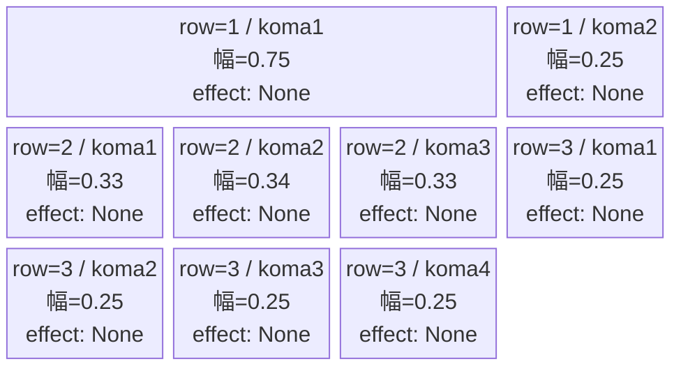
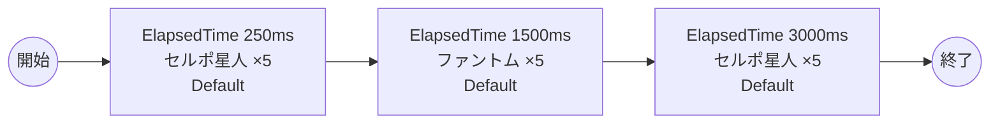

# vd_dan_normal_00001 インゲームデータ詳細解説

> 参照リポジトリ: `projects/glow-masterdata`
> リリースキー: 202604010

## インゲーム要件テキスト

ダンダダンの世界観を反映したノーマルブロックです。セルポ星人（Red属性・防御ロール）とファントム（Colorless属性・攻撃ロール）が時間差で出現します。難易度はフロア係数 1.00 を基準に設計されており、2種類の敵が交互に出現することで変化のある戦闘体験を提供します。3波構成（0.25秒後・1.5秒後・3.0秒後）で合計15体が登場し、プレイヤーへの適度なプレッシャーを与えつつ、十分なバトルポイント獲得機会も確保しています。

---

## レベルデザイン

### 敵キャラ設計

#### 敵キャラ選定（MstEnemyCharacter）

| mst_enemy_character_id | 日本語名 | 役割 | 備考 |
|------------------------|---------|------|------|
| enemy_dan_00001 | セルポ星人 | 雑魚 | Red属性・防御ロール |
| enemy_glo_00001 | ファントム | 雑魚（共通） | Colorless属性・攻撃ロール |

#### 敵キャラステータス（MstEnemyStageParameter）

> 既存参照: `domain/tasks/20260310_115400_vd_ingame_masterdata_generation/generated/ファントムマスター/MstEnemyStageParameter.csv` (release_key: 202509010)
> 新規生成不要（既存IDをそのままMstAutoPlayerSequence.action_valueで参照）
> ただし、今回のバッチでは release_key=202604010 で新規追加する

| MstEnemyStageParameter ID | 日本語名 | kind | role | color | base_hp | base_atk | base_spd | well_dist | knockback | combo | drop_bp |
|--------------------------|---------|------|------|-------|---------|----------|----------|-----------|-----------|-------|---------|
| e_dan_00001_vd_Normal_Red | セルポ星人 | Normal | Defense | Red | 10,000 | 50 | 34 | 0.24 | 0 | 1 | 100 |
| e_glo_00001_vd_Normal_Colorless | ファントム | Normal | Attack | Colorless | 5,000 | 100 | 34 | 0.22 | 3 | 1 | 150 |

---

### コマ設計

各行独立ランダム抽選（12パターンから）の結果:

| row | height | 選択パターン | コマ数 | 各幅 | 幅合計 |
|-----|--------|------------|-------|------|--------|
| 1 | 0.33 | パターン4「がっつり右長2コマ」 | 2コマ | 0.75, 0.25 | 1.0 |
| 2 | 0.33 | パターン7「3等分」 | 3コマ | 0.33, 0.34, 0.33 | 1.0 |
| 3 | 0.34 | パターン12「4等分」 | 4コマ | 0.25, 0.25, 0.25, 0.25 | 1.0 |

---

### 敵キャラシーケンス設計

#### どのフェーズで、どの敵を、いつ、どこに、どのくらい出現させるか

| elem | 出現タイミング | 敵 | 数 | 累計出現数 |
|------|-------------|---|---|---------|
| 1 | ElapsedTime 250ms | セルポ星人 (e_dan_00001_vd_Normal_Red) | 5 | 5 |
| 2 | ElapsedTime 1500ms | ファントム (e_glo_00001_vd_Normal_Colorless) | 5 | 10 |
| 3 | ElapsedTime 3000ms | セルポ星人 (e_dan_00001_vd_Normal_Red) | 5 | 15 |

合計: **15体**（要件「最低15体以上」を満たす）

#### 敵キャラの固有ステータス調整（hp_coef / atk_coef）

| 波 | 敵 | base_hp | hp_coef | 実HP | base_atk | atk_coef | 実ATK |
|---|---|---------|---------|------|----------|----------|-------|
| 1 | セルポ星人 | 10,000 | 1.0 | 10,000 | 50 | 1.0 | 50 |
| 2 | ファントム | 5,000 | 1.0 | 5,000 | 100 | 1.0 | 100 |
| 3 | セルポ星人 | 10,000 | 1.0 | 10,000 | 50 | 1.0 | 50 |

#### フェーズ切り替えはあるか

なし（VDではSwitchSequenceGroup使用禁止）

---

## 演出

### アセット

#### 背景

| 設定箇所 | アセットキー | 備考 |
|---------|------------|------|
| loop_background_asset_key | （空） | VDの背景切り替えはゲームロジック側で管理 |
| フロア0以上 | koma_background_vd_00001 | クライアント側でフロア係数に応じて切り替え |
| フロア20以上 | koma_background_vd_00003 | 同上 |
| フロア40以上 | koma_background_vd_00005 | 同上 |

#### BGM

| 設定 | 値 | 備考 |
|-----|---|------|
| bgm_asset_key | SSE_SBG_003_010 | ノーマルブロック用BGM |

---

### 敵キャラオーラ

| オーラ種別 | 使用箇所 |
|----------|---------|
| Default | 全敵キャラ（ノーマルブロックはボスなし、全行Default） |

---

### 敵キャラ召喚アニメーション

全キャラ `SummonEnemy` アクションによるElapsedTime時間差召喚。InitialSummonは使用しない（normalブロックはボスなし）。

---

## 生成テーブルまとめ

| テーブル | 状態 | 備考 |
|---------|------|------|
| MstEnemyStageParameter | 新規生成 | release_key=202604010 で追加 |
| MstEnemyOutpost | 新規生成 | HP=100固定、is_damage_invalidation=空 |
| MstPage | 新規生成 | id=vd_dan_normal_00001 |
| MstKomaLine | 新規生成 | 3行固定（row1-3） |
| MstAutoPlayerSequence | 新規生成 | 3要素（計15体） |
| MstInGame | 新規生成 | stage_type=vd_normal、ボスなし |
