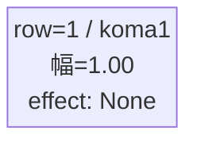
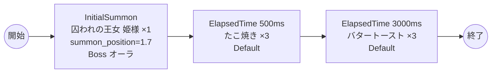

# vd_gom_boss_00001 インゲームデータ詳細解説

> 参照リポジトリ: `projects/glow-masterdata`
> リリースキー: 202604010

## インゲーム要件テキスト

「姫様"拷問"の時間です」の世界観を反映したボスブロックです。ボスとして「囚われの王女 姫様」（chara_gom_00001 / Yellow属性・防御ロール）が敵ゲート前に降臨します。同作のUR対抗キャラである姫様自身がボスとして立ちはだかる構成であり、ファンには馴染み深い対面が実現されます。

ボス撃破まで敵ゲートはダメージ無効であるため、姫様の撃破が最優先課題となります。姫様は combo=6・knockback=1 と手数と粘り強さを併せ持った防御ロールのボスであり、正面からの突破には一定の戦力が必要です。登場から0.5秒後にたこ焼き（Yellow属性・攻撃ロール）が3体出現して前線への圧力を加え、さらに3秒後にバタートースト（Yellow属性・防御ロール）が3体追加出現することで継続的な守り固めの状況を作り出します。

フロア係数 1.00 を基準とした設計で、ボス特有の「1ダメージ受けたら進軍開始」仕様により緊張感のある戦闘体験を提供します。Yellow属性が主軸のため、Blue属性キャラを軸に編成したプレイヤーには有利に働きます。ボスブロック固定の1行1コマ構成でシンプルな戦場を設計します。

---

## レベルデザイン

### 敵キャラ設計

#### 敵キャラ選定（MstEnemyCharacter）

| mst_enemy_character_id | 日本語名 | 役割 | 備考 |
|------------------------|---------|------|------|
| chara_gom_00001 | 囚われの王女 姫様 | ボス | Yellow属性・防御ロール |
| enemy_gom_00402 | たこ焼き | 雑魚 | Yellow属性・攻撃ロール |
| enemy_gom_00501 | バタートースト | 雑魚 | Yellow属性・防御ロール |

#### 敵キャラステータス（MstEnemyStageParameter）

> 既存参照: `domain/tasks/20260310_115400_vd_ingame_masterdata_generation/generated/ファントムマスター/MstEnemyStageParameter.csv` (release_key: 202509010)
> 新規生成不要（既存IDをそのままMstAutoPlayerSequence.action_valueで参照）

| MstEnemyStageParameter ID | 日本語名 | kind | role | color | base_hp | base_atk | base_spd | well_dist | knockback | combo | drop_bp |
|--------------------------|---------|------|------|-------|---------|----------|----------|-----------|-----------|-------|---------|
| c_gom_00001_vd_Boss_Yellow | 囚われの王女 姫様 | Boss | Defense | Yellow | 10,000 | 50 | 25 | 0.16 | 1 | 6 | 500 |
| e_gom_00402_vd_Normal_Yellow | たこ焼き | Normal | Attack | Yellow | 1,000 | 50 | 34 | 0.11 | 1 | 1 | 100 |
| e_gom_00501_vd_Normal_Yellow | バタートースト | Normal | Defense | Yellow | 1,000 | 50 | 34 | 0.14 | 0 | 1 | 200 |

---

### コマ設計

ボスブロックは1行1コマ固定。

| row | height | コマ数 | koma1_width | 幅合計 |
|-----|--------|-------|-------------|--------|
| 1 | 1.0 | 1コマ | 1.0 | 1.0 |

---

### 敵キャラシーケンス設計

#### どのフェーズで、どの敵を、いつ、どこに、どのくらい出現させるか

| elem | 出現タイミング | 敵 | 数 | 累計出現数/召喚位置 |
|------|-------------|---|---|-----------------|
| 1 | InitialSummon | 囚われの王女 姫様 (c_gom_00001_vd_Boss_Yellow) | 1 | 1 / summon_position=1.7 |
| 2 | ElapsedTime 500ms | たこ焼き (e_gom_00402_vd_Normal_Yellow) | 3 | 4 |
| 3 | ElapsedTime 3000ms | バタートースト (e_gom_00501_vd_Normal_Yellow) | 3 | 7 |

#### 敵キャラの固有ステータス調整（hp_coef / atk_coef）

| 波/フェーズ | 敵 | base_hp | hp_coef | 実HP | base_atk | atk_coef | 実ATK |
|-----------|---|---------|---------|------|----------|----------|-------|
| InitialSummon | 囚われの王女 姫様 | 10,000 | 1.0 | 10,000 | 50 | 1.0 | 50 |
| ElapsedTime 500ms | たこ焼き | 1,000 | 1.0 | 1,000 | 50 | 1.0 | 50 |
| ElapsedTime 3000ms | バタートースト | 1,000 | 1.0 | 1,000 | 50 | 1.0 | 50 |

#### フェーズ切り替えはあるか

なし（VDではSwitchSequenceGroup使用禁止）

---

## 演出

### アセット

#### 背景

| 設定箇所 | アセットキー | 備考 |
|---------|------------|------|
| loop_background_asset_key | （空） | VDの背景切り替えはゲームロジック側で管理 |
| フロア0以上 | koma_background_vd_00002 | クライアント側でフロア係数に応じて切り替え |
| フロア20以上 | koma_background_vd_00004 | 同上 |
| フロア40以上 | koma_background_vd_00006 | 同上 |

#### BGM

| 設定 | 値 | 備考 |
|-----|---|------|
| bgm_asset_key | SSE_SBG_003_004 | ボスブロック用BGM |

---

### 敵キャラオーラ

| オーラ種別 | 使用箇所 |
|----------|---------|
| Boss | 囚われの王女 姫様（InitialSummon時） |
| Default | たこ焼き、バタートースト（雑魚2種） |

---

### 敵キャラ召喚アニメーション

ボス（囚われの王女 姫様）は `InitialSummon` で `summon_position=1.7`（ゲート付近）に配置。1ダメージ受けると進軍を開始する（`move_start_condition_type=Damage, move_start_condition_value=1`）。姫様は防御ロールのボスとして体力・コンボが高く、前衛を押しとどめながら後続の雑魚部隊が追い打ちをかける設計。
雑魚キャラ（たこ焼き・バタートースト）は `SummonEnemy` アクションによるElapsedTime時間差召喚。全員 `aura_type=Default`。

---

## 生成テーブルまとめ

| テーブル | 状態 | 備考 |
|---------|------|------|
| MstEnemyStageParameter | 既存参照 | generated/ファントムマスター/ の既存データ使用（release_key=202509010） |
| MstEnemyOutpost | 新規生成 | HP=1,000固定、is_damage_invalidation=空 |
| MstPage | 新規生成 | id=vd_gom_boss_00001 |
| MstKomaLine | 新規生成 | 1行固定（row=1, height=1.0, koma1_width=1.0） |
| MstAutoPlayerSequence | 新規生成 | 3要素（ボス1体+雑魚6体） |
| MstInGame | 新規生成 | ボスあり（boss_mst_enemy_stage_parameter_id=c_gom_00001_vd_Boss_Yellow）、content_type=Dungeon、stage_type=vd_boss、ENABLE=e、release_key=202604010 |
