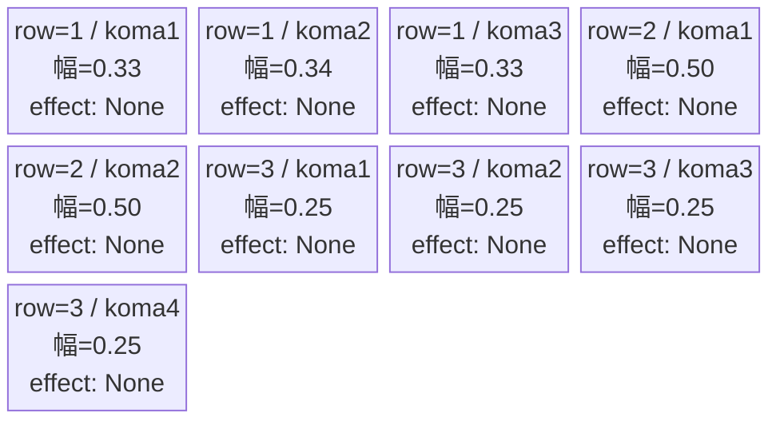
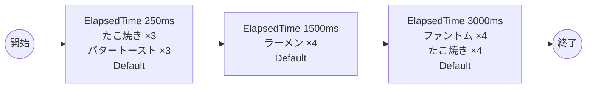

# vd_gom_normal_00001 インゲームデータ詳細解説

> 参照リポジトリ: `projects/glow-masterdata`
> リリースキー: 202604010

## インゲーム要件テキスト

「姫様"拷問"の時間です」の世界観を反映したノーマルブロックです。たこ焼き（Yellow属性・攻撃ロール）、バタートースト（Yellow属性・防御ロール）、ラーメン（Yellow属性・攻撃ロール）、ファントム（Colorless属性・攻撃ロール）の4種が時間差で出現します。同作の料理系の敵キャラを中心に構成することで作品らしいユーモラスな雰囲気を演出し、Yellow属性を軸としながらColorlessのファントムも交えることで属性対策の幅を持たせた設計にしています。3波構成（0.25秒後・1.5秒後・3.0秒後）で合計18体（最低15体以上の要件を満たす）が登場します。各波の出現タイミングと敵種の切り替えによって、単調さを排除しつつ適度なプレッシャーを与えるバトル体験を目指します。フロア係数 1.00 基準での設計であり、全行 `aura_type=Default`、フェーズ切り替えなしのシンプル構成です。

---

## レベルデザイン

### 敵キャラ設計

#### 敵キャラ選定（MstEnemyCharacter）

| mst_enemy_character_id | 日本語名 | 役割 | 備考 |
|------------------------|---------|------|------|
| enemy_gom_00402 | たこ焼き | 雑魚 | Yellow属性・攻撃ロール |
| enemy_gom_00501 | バタートースト | 雑魚 | Yellow属性・防御ロール |
| enemy_gom_00701 | ラーメン | 雑魚 | Yellow属性・攻撃ロール |
| enemy_glo_00001 | ファントム | 雑魚（共通） | Colorless属性・攻撃ロール |

#### 敵キャラステータス（MstEnemyStageParameter）

> 既存参照: `domain/tasks/20260310_115400_vd_ingame_masterdata_generation/generated/ファントムマスター/MstEnemyStageParameter.csv` (release_key: 202509010)
> 新規生成不要（既存IDをそのままMstAutoPlayerSequence.action_valueで参照）
> ただし、今回のバッチでは release_key=202604010 で新規追加する

| MstEnemyStageParameter ID | 日本語名 | kind | role | color | base_hp | base_atk | base_spd | well_dist | knockback | combo | drop_bp |
|--------------------------|---------|------|------|-------|---------|----------|----------|-----------|-----------|-------|---------|
| e_gom_00402_vd_Normal_Yellow | たこ焼き | Normal | Attack | Yellow | 1,000 | 50 | 34 | 0.11 | 1 | 1 | 100 |
| e_gom_00501_vd_Normal_Yellow | バタートースト | Normal | Defense | Yellow | 1,000 | 50 | 34 | 0.14 | 0 | 1 | 200 |
| e_gom_00701_vd_Normal_Yellow | ラーメン | Normal | Attack | Yellow | 10,000 | 50 | 34 | 0.11 | 0 | 1 | 100 |
| e_glo_00001_vd_Normal_Colorless | ファントム | Normal | Attack | Colorless | 5,000 | 100 | 34 | 0.22 | 3 | 1 | 150 |

---

### コマ設計

各行独立ランダム抽選（12パターンから）の結果:

| row | height | 選択パターン | コマ数 | 各幅 | 幅合計 |
|-----|--------|------------|-------|------|--------|
| 1 | 0.33 | パターン7「3等分」 | 3コマ | 0.33, 0.34, 0.33 | 1.0 |
| 2 | 0.33 | パターン6「2等分」 | 2コマ | 0.50, 0.50 | 1.0 |
| 3 | 0.34 | パターン12「4等分」 | 4コマ | 0.25, 0.25, 0.25, 0.25 | 1.0 |

---

### 敵キャラシーケンス設計

#### どのフェーズで、どの敵を、いつ、どこに、どのくらい出現させるか

| elem | 出現タイミング | 敵 | 数 | 累計出現数 |
|------|-------------|---|---|---------|
| 1 | ElapsedTime 250ms | たこ焼き (e_gom_00402_vd_Normal_Yellow) | 3 | 3 |
| 2 | ElapsedTime 250ms | バタートースト (e_gom_00501_vd_Normal_Yellow) | 3 | 6 |
| 3 | ElapsedTime 1500ms | ラーメン (e_gom_00701_vd_Normal_Yellow) | 4 | 10 |
| 4 | ElapsedTime 3000ms | ファントム (e_glo_00001_vd_Normal_Colorless) | 4 | 14 |
| 5 | ElapsedTime 3000ms | たこ焼き (e_gom_00402_vd_Normal_Yellow) | 4 | 18 |

合計: **18体**（要件「最低15体以上」を満たす）

> **シーケンス行設計メモ**:
> - elem 1, 2 は同一タイミング（250ms）だが別行に分けてaction_valueを変える（summon_interval=0で連続召喚）
> - elem 4, 5 も同一タイミング（3000ms）だが別行に分けて敵種を変える
> - MstAutoPlayerSequence の sequence_element_id を 1〜5 で採番

#### 敵キャラの固有ステータス調整（hp_coef / atk_coef）

| 波 | 敵 | base_hp | hp_coef | 実HP | base_atk | atk_coef | 実ATK |
|---|---|---------|---------|------|----------|----------|-------|
| 1 | たこ焼き | 1,000 | 1.0 | 1,000 | 50 | 1.0 | 50 |
| 1 | バタートースト | 1,000 | 1.0 | 1,000 | 50 | 1.0 | 50 |
| 2 | ラーメン | 10,000 | 1.0 | 10,000 | 50 | 1.0 | 50 |
| 3 | ファントム | 5,000 | 1.0 | 5,000 | 100 | 1.0 | 100 |
| 3 | たこ焼き | 1,000 | 1.0 | 1,000 | 50 | 1.0 | 50 |

#### フェーズ切り替えはあるか

なし（VDではSwitchSequenceGroup使用禁止）

---

## 演出

### アセット

#### 背景

| 設定箇所 | アセットキー | 備考 |
|---------|------------|------|
| loop_background_asset_key | （空） | VDの背景切り替えはゲームロジック側で管理 |
| フロア0以上 | koma_background_vd_00001 | クライアント側でフロア係数に応じて切り替え |
| フロア20以上 | koma_background_vd_00003 | 同上 |
| フロア40以上 | koma_background_vd_00005 | 同上 |

#### BGM

| 設定 | 値 | 備考 |
|-----|---|------|
| bgm_asset_key | SSE_SBG_003_010 | ノーマルブロック用BGM |

---

### 敵キャラオーラ

| オーラ種別 | 使用箇所 |
|----------|---------|
| Default | 全敵キャラ（ノーマルブロックはボスなし、全行Default） |

---

### 敵キャラ召喚アニメーション

全キャラ `SummonEnemy` アクションによるElapsedTime時間差召喚。InitialSummonは使用しない（normalブロックはボスなし）。たこ焼き・バタートーストは250ms時点で同時波として登場し、ラーメンが1.5秒後に続く。3秒後にファントムとたこ焼きの追加波で締めくくる構成。

---

## 生成テーブルまとめ

| テーブル | 状態 | 備考 |
|---------|------|------|
| MstEnemyStageParameter | 新規生成 | release_key=202604010 で追加（4種） |
| MstEnemyOutpost | 新規生成 | HP=100固定、is_damage_invalidation=空 |
| MstPage | 新規生成 | id=vd_gom_normal_00001 |
| MstKomaLine | 新規生成 | 3行固定（row1-3） |
| MstAutoPlayerSequence | 新規生成 | 5要素（計18体） |
| MstInGame | 新規生成 | stage_type=vd_normal、ボスなし |
