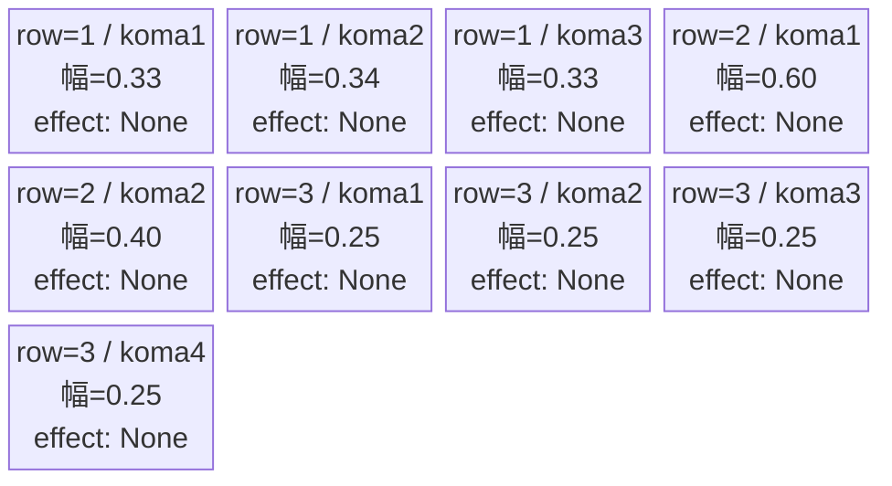
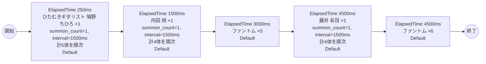

# vd_hut_normal_00001 インゲームデータ詳細解説

> 参照リポジトリ: `projects/glow-masterdata`
> リリースキー: 202604010

## インゲーム要件テキスト

「ふつうの軽音部」の世界観を反映したノーマルブロックです。ひたむきギタリスト 鳩野 ちひろ（chara_hut_00001 / Yellow属性・ディフェンスロール）、内田 桃（chara_hut_00201 / Yellow属性・テクニカルロール）、藤井 彩目（chara_hut_00301 / Yellow属性・テクニカルロール）の3名が敵キャラ（c_キャラ）として登場し、ファントム（enemy_glo_00001 / Colorless属性）も混入します。軽音部の仲間たちが手強い敵として次々と出現するという、作品ファンにとって感情移入しやすい構成です。c_キャラはプレイアブルキャラが敵として登場するため、同一トリガーでの瞬間複数召喚は禁止とし、必ず1体ずつ時間差・または撃破トリガーで出現させます。Yellow属性統一の敵構成により、カラーデッキ選択の戦略性が生まれます。4波構成で合計20体が登場し、最低15体以上の要件を満たしつつ、序盤から終盤にかけて変化のある戦闘体験を提供します。フロア係数 1.00 を基準とした設計です。

---

## レベルデザイン

### 敵キャラ設計

#### 敵キャラ選定（MstEnemyCharacter）

| mst_enemy_character_id | 日本語名 | 役割 | 備考 |
|------------------------|---------|------|------|
| chara_hut_00001 | ひたむきギタリスト 鳩野 ちひろ | 雑魚（c_キャラ） | Yellow属性・ディフェンスロール |
| chara_hut_00201 | 内田 桃 | 雑魚（c_キャラ） | Yellow属性・テクニカルロール |
| chara_hut_00301 | 藤井 彩目 | 雑魚（c_キャラ） | Yellow属性・テクニカルロール |
| enemy_glo_00001 | ファントム | 雑魚（共通） | Colorless属性・攻撃ロール |

#### 敵キャラステータス（MstEnemyStageParameter）

> 既存参照: `domain/tasks/20260310_115400_vd_ingame_masterdata_generation/generated/ファントムマスター/MstEnemyStageParameter.csv`
> - `c_hut_00001_vd_Normal_Yellow`（release_key: 202603010）- 既存ID
> - `c_hut_00201_vd_Normal_Yellow`（release_key: 202603010）- 既存ID
> - `c_hut_00301_vd_Normal_Yellow`（release_key: 202603010）- 既存ID
> - `e_glo_00001_vd_Normal_Colorless`（release_key: 202509010）- 既存ID
> 今回バッチでの新規追加不要（既存IDをそのままMstAutoPlayerSequence.action_valueで参照）

| MstEnemyStageParameter ID | 日本語名 | kind | role | color | base_hp | base_atk | base_spd | well_dist | knockback | combo | drop_bp |
|--------------------------|---------|------|------|-------|---------|----------|----------|-----------|-----------|-------|---------|
| c_hut_00001_vd_Normal_Yellow | ひたむきギタリスト 鳩野 ちひろ | Normal | Defense | Yellow | 10,000 | 100 | 35 | 0.21 | 1 | 5 | 200 |
| c_hut_00201_vd_Normal_Yellow | 内田 桃 | Normal | Technical | Yellow | 10,000 | 100 | 35 | 0.50 | 2 | 5 | 200 |
| c_hut_00301_vd_Normal_Yellow | 藤井 彩目 | Normal | Technical | Yellow | 10,000 | 100 | 35 | 0.50 | 2 | 6 | 200 |
| e_glo_00001_vd_Normal_Colorless | ファントム | Normal | Attack | Colorless | 5,000 | 100 | 34 | 0.22 | 3 | 1 | 150 |

---

### コマ設計

各行独立ランダム抽選（12パターンから）の結果:

| row | height | 選択パターン | コマ数 | 各幅 | 幅合計 |
|-----|--------|------------|-------|------|--------|
| 1 | 0.33 | パターン7「3等分」 | 3コマ | 0.33, 0.34, 0.33 | 1.0 |
| 2 | 0.33 | パターン2「右ちょい長2コマ」 | 2コマ | 0.60, 0.40 | 1.0 |
| 3 | 0.34 | パターン12「4等分」 | 4コマ | 0.25, 0.25, 0.25, 0.25 | 1.0 |

---

### 敵キャラシーケンス設計

#### どのフェーズで、どの敵を、いつ、どこに、どのくらい出現させるか

| elem | 出現タイミング | 敵 | 数 | 累計出現数 |
|------|-------------|---|---|---------|
| 1 | ElapsedTime 250ms | ひたむきギタリスト 鳩野 ちひろ (c_hut_00001_vd_Normal_Yellow) | summon_count=5, summon_interval=1500 | 5 |
| 2 | ElapsedTime 1500ms | 内田 桃 (c_hut_00201_vd_Normal_Yellow) | summon_count=4, summon_interval=1500 | 9 |
| 3 | ElapsedTime 3000ms | ファントム (e_glo_00001_vd_Normal_Colorless) | summon_count=5, summon_interval=0 | 14 |
| 4 | ElapsedTime 4500ms | 藤井 彩目 (c_hut_00301_vd_Normal_Yellow) | summon_count=4, summon_interval=1500 | 18 |
| 5 | ElapsedTime 4500ms | ファントム (e_glo_00001_vd_Normal_Colorless) | summon_count=2, summon_interval=0 | 20 |

合計: **20体**（要件「最低15体以上」を満たす）

> **c_キャラ召喚制約について**:
> - ひたむきギタリスト 鳩野 ちひろ（c_hut_00001）、内田 桃（c_hut_00201）、藤井 彩目（c_hut_00301）はいずれもプレイアブルキャラが敵として登場するc_キャラです。
> - 同一トリガーでsummon_count >= 2 かつ summon_interval = 0 の瞬間複数召喚は禁止。
> - 各c_キャラはsummon_interval = 1500（1.5秒間隔）で1体ずつ順次召喚します。
> - elem 4・5 は同じElapsedTime(4500)で別行として定義する（MstAutoPlayerSequenceのsequence_element_idが異なる別エントリ）。
> - elem 5のファントム（e_キャラ）はsummon_count=2, summon_interval=0で問題なし（c_キャラ制約対象外）。

#### 敵キャラの固有ステータス調整（hp_coef / atk_coef）

| 波 | 敵 | base_hp | hp_coef | 実HP | base_atk | atk_coef | 実ATK |
|---|---|---------|---------|------|----------|----------|-------|
| 1 | ひたむきギタリスト 鳩野 ちひろ | 10,000 | 1.0 | 10,000 | 100 | 1.0 | 100 |
| 2 | 内田 桃 | 10,000 | 1.0 | 10,000 | 100 | 1.0 | 100 |
| 3 | ファントム | 5,000 | 1.0 | 5,000 | 100 | 1.0 | 100 |
| 4 | 藤井 彩目 | 10,000 | 1.0 | 10,000 | 100 | 1.0 | 100 |
| 5 | ファントム | 5,000 | 1.0 | 5,000 | 100 | 1.0 | 100 |

#### フェーズ切り替えはあるか

なし（VDではSwitchSequenceGroup使用禁止）

---

## 演出

### アセット

#### 背景

| 設定箇所 | アセットキー | 備考 |
|---------|------------|------|
| loop_background_asset_key | （空） | VDの背景切り替えはゲームロジック側で管理 |
| フロア0以上 | koma_background_vd_00001 | クライアント側でフロア係数に応じて切り替え |
| フロア20以上 | koma_background_vd_00003 | 同上 |
| フロア40以上 | koma_background_vd_00005 | 同上 |

#### BGM

| 設定 | 値 | 備考 |
|-----|---|------|
| bgm_asset_key | SSE_SBG_003_010 | ノーマルブロック用BGM |

---

### 敵キャラオーラ

| オーラ種別 | 使用箇所 |
|----------|---------|
| Default | 全敵キャラ（ノーマルブロックはボスなし、全行Default） |

---

### 敵キャラ召喚アニメーション

全キャラ `SummonEnemy` アクションによる ElapsedTime 時間差召喚。InitialSummon は使用しない（normalブロックはボスなし）。序盤はひたむきギタリスト 鳩野 ちひろが1体ずつ間隔を空けて出現し、続いて内田 桃、中盤にファントムが集団登場、終盤は藤井 彩目とファントムが同時タイミングで出現する演出構成とする。c_キャラ（鳩野 ちひろ・内田 桃・藤井 彩目）はsummon_interval=1500で順次召喚し、瞬間複数召喚制約を厳守する。

---

## 生成テーブルまとめ

| テーブル | 状態 | 備考 |
|---------|------|------|
| MstEnemyStageParameter | 既存参照 | generated/ファントムマスター/ の既存データ使用（release_key: 202603010 / 202509010）、今回新規追加不要 |
| MstEnemyOutpost | 新規生成 | HP=100固定、is_damage_invalidation=空 |
| MstPage | 新規生成 | id=vd_hut_normal_00001 |
| MstKomaLine | 新規生成 | 3行固定（row1-3）、各行独立ランダム抽選 |
| MstAutoPlayerSequence | 新規生成 | 5要素（計20体）、sequence_set_id=vd_hut_normal_00001 |
| MstInGame | 新規生成 | stage_type=vd_normal、ボスなし、bgm=SSE_SBG_003_010、ENABLE=e、release_key=202604010 |
