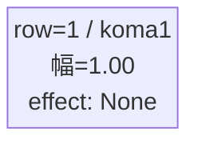
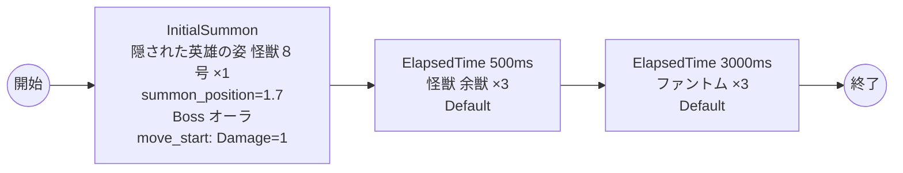

# vd_kai_boss_00001 インゲームデータ詳細解説

> 参照リポジトリ: `projects/glow-masterdata`
> リリースキー: 202604010

## インゲーム要件テキスト

怪獣8号の世界観を反映したボスブロックです。ボスとして「隠された英雄の姿 怪獣８号」（chara_kai_00002 / Yellow属性・Supportロール）が敵ゲート前に降臨します。プレイヤーはボスを倒すまで敵ゲートへのダメージが無効であるため、ボス撃破が最優先課題となります。

ボスである怪獣８号は `c_` プレフィックスのプレイアブルキャラクターが敵として登場する形式であり、InitialSummonで1体だけゲート付近（summon_position=1.7）に配置されます。1ダメージを受けた瞬間に進軍を開始する仕様のため、プレイヤーはボスに触れさせないよう即座に対応する必要があります。

ボス登場から0.5秒後に怪獣 余獣（e_kai_00101 / Yellow属性・Defenseロール）が3体出現し、プレイヤーへの圧力を高めます。さらに3秒後にファントム（enemy_glo_00001 / Colorless属性・Attackロール）が3体追加出現することで、継続的な脅威を演出します。Yellow属性のボスと余獣が画面を占める構成上、Yellow属性が不得意なプレイヤーにとっては色属性の意識が求められます。フロア係数 1.00 基準の設計で、ボスの高HPと高攻撃力（HP: 700,000、ATK: 1,700）が緊張感あるプレイ体験を提供します。

---

## レベルデザイン

### 敵キャラ設計

#### 敵キャラ選定（MstEnemyCharacter）

| mst_enemy_character_id | 日本語名 | 役割 | 備考 |
|------------------------|---------|------|------|
| chara_kai_00002 | 隠された英雄の姿 怪獣８号 | ボス | Yellow属性・Supportロール・c_プレフィックス |
| enemy_kai_00101 | 怪獣 余獣 | 雑魚 | Yellow属性・Defenseロール |
| enemy_glo_00001 | ファントム | 雑魚（共通） | Colorless属性・Attackロール |

#### 敵キャラステータス（MstEnemyStageParameter）

> 既存参照: `domain/tasks/20260310_115400_vd_ingame_masterdata_generation/generated/ファントムマスター/MstEnemyStageParameter.csv` (release_key: 202509010)
> 新規生成不要（既存IDをそのままMstAutoPlayerSequence.action_valueで参照）

| MstEnemyStageParameter ID | 日本語名 | kind | role | color | base_hp | base_atk | base_spd | well_dist | knockback | combo | drop_bp |
|--------------------------|---------|------|------|-------|---------|----------|----------|-----------|-----------|-------|---------|
| c_kai_00002_vd_Boss_Yellow | 隠された英雄の姿 怪獣８号 | Boss | Support | Yellow | 700,000 | 1,700 | 45 | 0.2 | 1 | 5 | 10 |
| e_kai_00101_vd_Normal_Yellow | 怪獣 余獣 | Normal | Defense | Yellow | 25,000 | 350 | 45 | 0.11 | 1 | 1 | 10 |
| e_glo_00001_vd_Normal_Colorless | ファントム | Normal | Attack | Colorless | 5,000 | 100 | 34 | 0.22 | 3 | 1 | 150 |

---

### コマ設計

ボスブロックは1行1コマ固定。

| row | height | コマ数 | koma1_width | 幅合計 |
|-----|--------|-------|-------------|--------|
| 1 | 1.0 | 1コマ | 1.0 | 1.0 |

---

### 敵キャラシーケンス設計

#### どのフェーズで、どの敵を、いつ、どこに、どのくらい出現させるか

| elem | 出現タイミング | 敵 | 数 | 累計出現数/召喚位置 |
|------|-------------|---|---|-----------------|
| 1 | InitialSummon | 隠された英雄の姿 怪獣８号 (c_kai_00002_vd_Boss_Yellow) | 1 | 1 / summon_position=1.7 |
| 2 | ElapsedTime 500ms | 怪獣 余獣 (e_kai_00101_vd_Normal_Yellow) | 3 | 4 |
| 3 | ElapsedTime 3000ms | ファントム (e_glo_00001_vd_Normal_Colorless) | 3 | 7 |

#### 敵キャラの固有ステータス調整（hp_coef / atk_coef）

MstAutoPlayerSequenceの `enemy_hp_coef` / `enemy_attack_coef` はすべてデフォルト値（1.0）を使用します。

| 波/フェーズ | 敵 | base_hp | hp_coef | 実HP | base_atk | atk_coef | 実ATK |
|-----------|---|---------|---------|------|----------|----------|-------|
| InitialSummon | 隠された英雄の姿 怪獣８号 | 700,000 | 1.0 | 700,000 | 1,700 | 1.0 | 1,700 |
| ElapsedTime 500ms | 怪獣 余獣 | 25,000 | 1.0 | 25,000 | 350 | 1.0 | 350 |
| ElapsedTime 3000ms | ファントム | 5,000 | 1.0 | 5,000 | 100 | 1.0 | 100 |

#### フェーズ切り替えはあるか

なし（VDではSwitchSequenceGroup使用禁止）

> **c_キャラ召喚ガードレール確認**: ボス（chara_kai_00002）は `InitialSummon` で `summon_count=1` の1体召喚のみ。同一トリガーでの瞬間複数召喚（summon_count >= 2 かつ summon_interval = 0）は行っていないため制約を満たしています。雑魚の怪獣 余獣・ファントムは `e_` プレフィックスの純粋な敵キャラクターのため、c_キャラ召喚制約の適用外です。

---

## 演出

### アセット

#### 背景

| 設定箇所 | アセットキー | 備考 |
|---------|------------|------|
| loop_background_asset_key | （空） | VDの背景切り替えはゲームロジック側で管理 |
| フロア0以上 | koma_background_vd_00002 | クライアント側でフロア係数に応じて切り替え（ボスブロック） |
| フロア20以上 | koma_background_vd_00004 | 同上 |
| フロア40以上 | koma_background_vd_00006 | 同上 |

#### BGM

| 設定 | 値 | 備考 |
|-----|---|------|
| bgm_asset_key | SSE_SBG_003_004 | ボスブロック用BGM（固定） |

---

### 敵キャラオーラ

| オーラ種別 | 使用箇所 |
|----------|---------|
| Boss | 隠された英雄の姿 怪獣８号（InitialSummon時）/ 降臨ボスオーラ1 |
| Default | 怪獣 余獣、ファントム（雑魚2種） |

---

### 敵キャラ召喚アニメーション

ボス（隠された英雄の姿 怪獣８号）は `InitialSummon` で `summon_position=1.7`（ゲート付近）に配置。1ダメージ受けると進軍を開始する（`move_start_condition_type=Damage, move_start_condition_value=1`）。ボスには `aura_type=Boss`（降臨ボスオーラ1）が付与される。

雑魚キャラ（怪獣 余獣・ファントム）は `SummonEnemy` アクションによるElapsedTime時間差召喚。各波で複数体まとめて召喚（summon_interval=0）し、`aura_type=Default` が適用される。

---

## 生成テーブルまとめ

| テーブル | 状態 | 備考 |
|---------|------|------|
| MstEnemyStageParameter | 既存参照 | generated/ファントムマスター/ の既存データ使用（c_kai_00002_vd_Boss_Yellow, e_kai_00101_vd_Normal_Yellow, e_glo_00001_vd_Normal_Colorless） |
| MstEnemyOutpost | 新規生成 | HP=1,000固定、is_damage_invalidation=空、id=vd_kai_boss_00001 |
| MstPage | 新規生成 | id=vd_kai_boss_00001 |
| MstKomaLine | 新規生成 | 1行固定（row=1, height=1.0, koma1_width=1.0, koma1_effect_target_side=All） |
| MstAutoPlayerSequence | 新規生成 | 3要素（ボス1体+雑魚6体、sequence_set_id=vd_kai_boss_00001） |
| MstInGame | 新規生成 | content_type=Dungeon、stage_type=vd_boss、boss_mst_enemy_stage_parameter_id=c_kai_00002_vd_Boss_Yellow、release_key=202604010 |

---

## ID一覧

| テーブル | カラム | 値 |
|---------|--------|-----|
| MstInGame | id | vd_kai_boss_00001 |
| MstInGame | boss_mst_enemy_stage_parameter_id | c_kai_00002_vd_Boss_Yellow |
| MstAutoPlayerSequence | sequence_set_id | vd_kai_boss_00001 |
| MstPage | id | vd_kai_boss_00001 |
| MstEnemyOutpost | id | vd_kai_boss_00001 |
| MstKomaLine | id（row1） | vd_kai_boss_00001_1 |
| MstAutoPlayerSequence | id（elem1） | vd_kai_boss_00001_1 |
| MstAutoPlayerSequence | id（elem2） | vd_kai_boss_00001_2 |
| MstAutoPlayerSequence | id（elem3） | vd_kai_boss_00001_3 |
