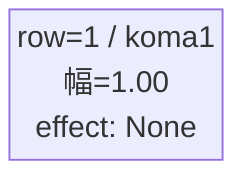
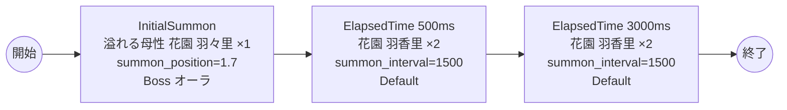

# vd_kim_boss_00001 インゲームデータ詳細解説

> 参照リポジトリ: `projects/glow-masterdata`
> リリースキー: 202604010

## インゲーム要件テキスト

「100カノ（百人の彼女が恋人になんてありえないから）」の世界観を反映したボスブロックです。ボスとして「溢れる母性 花園 羽々里」（Red属性・防御ロール）が敵ゲート前に降臨します。花園 羽々里は圧倒的な母性と包容力を持つキャラクターであり、プレイヤーが近づくほど強大な存在感でプレッシャーをかけてくる設計を目指します。

ボス撃破まで敵ゲートへのダメージは無効のため、花園 羽々里の撃破が最優先課題となります。ボス登場から0.5秒後に花園 羽香里（妹）が2体出現し、さらに3秒後に花園 羽香里が2体追加出現することで、同じ「花園」一家がプレイヤーを包囲する演出を演出します。フロア係数 1.00 を基準とした設計で、ボス特有の「1ダメージ受けたら進軍開始」仕様により、緊張感のある戦闘体験を提供します。

---

## レベルデザイン

### 敵キャラ設計

#### 敵キャラ選定（MstEnemyCharacter）

| mst_enemy_character_id | 日本語名 | 役割 | 備考 |
|------------------------|---------|------|------|
| chara_kim_00001 | 溢れる母性 花園 羽々里 | ボス | Red属性・防御ロール |
| chara_kim_00101 | 花園 羽香里 | 雑魚 | Red属性・攻撃ロール |

#### 敵キャラステータス（MstEnemyStageParameter）

> 既存参照: `domain/tasks/20260310_115400_vd_ingame_masterdata_generation/generated/ファントムマスター/MstEnemyStageParameter.csv`
> 新規生成不要（既存IDをそのままMstAutoPlayerSequence.action_valueで参照）

| MstEnemyStageParameter ID | 日本語名 | kind | role | color | base_hp | base_atk | base_spd | well_dist | knockback | combo | drop_bp |
|--------------------------|---------|------|------|-------|---------|----------|----------|-----------|-----------|-------|---------|
| c_kim_00001_vd_Boss_Red | 溢れる母性 花園 羽々里 | Boss | Defense | Red | 50,000 | 100 | 40 | 0.18 | 2 | 5 | 300 |
| c_kim_00101_vd_Normal_Red | 花園 羽香里 | Normal | Attack | Red | 10,000 | 100 | 35 | 0.21 | 1 | 6 | 300 |

---

### コマ設計

ボスブロックは1行1コマ固定。

| row | height | コマ数 | koma1_width | 幅合計 |
|-----|--------|-------|-------------|--------|
| 1 | 1.0 | 1コマ | 1.0 | 1.0 |

---

### 敵キャラシーケンス設計

#### どのフェーズで、どの敵を、いつ、どこに、どのくらい出現させるか

| elem | 出現タイミング | 敵 | 数 | 累計出現数/召喚位置 |
|------|-------------|---|---|-----------------|
| 1 | InitialSummon | 溢れる母性 花園 羽々里 (c_kim_00001_vd_Boss_Red) | 1 | 1 / summon_position=1.7 |
| 2 | ElapsedTime 500ms | 花園 羽香里 (c_kim_00101_vd_Normal_Red) | 2 (interval=1500ms) | 3 |
| 3 | ElapsedTime 3000ms | 花園 羽香里 (c_kim_00101_vd_Normal_Red) | 2 (interval=1500ms) | 5 |

> c_kim_00101（花園 羽香里）は c_ キャラのため、同一トリガーでの瞬間同時召喚（summon_interval=0 かつ summon_count>=2）は禁止。summon_interval=1500ms（1.5秒間隔）を設定して順次出現させる。

#### 敵キャラの固有ステータス調整（hp_coef / atk_coef）

| 波/フェーズ | 敵 | base_hp | hp_coef | 実HP | base_atk | atk_coef | 実ATK |
|-----------|---|---------|---------|------|----------|----------|-------|
| InitialSummon | 溢れる母性 花園 羽々里 | 50,000 | 1.0 | 50,000 | 100 | 1.0 | 100 |
| ElapsedTime 500ms | 花園 羽香里 | 10,000 | 1.0 | 10,000 | 100 | 1.0 | 100 |
| ElapsedTime 3000ms | 花園 羽香里 | 10,000 | 1.0 | 10,000 | 100 | 1.0 | 100 |

#### フェーズ切り替えはあるか

なし（VDではSwitchSequenceGroup使用禁止）

---

## 演出

### アセット

#### 背景

| 設定箇所 | アセットキー | 備考 |
|---------|------------|------|
| loop_background_asset_key | （空） | VDの背景切り替えはゲームロジック側で管理 |
| フロア0以上 | koma_background_vd_00002 | クライアント側でフロア係数に応じて切り替え |
| フロア20以上 | koma_background_vd_00004 | 同上 |
| フロア40以上 | koma_background_vd_00006 | 同上 |

#### BGM

| 設定 | 値 | 備考 |
|-----|---|------|
| bgm_asset_key | SSE_SBG_003_004 | ボスブロック用BGM |

---

### 敵キャラオーラ

| オーラ種別 | 使用箇所 |
|----------|---------|
| Boss | 溢れる母性 花園 羽々里（InitialSummon時） |
| Default | 花園 羽香里（雑魚） |

---

### 敵キャラ召喚アニメーション

ボス（溢れる母性 花園 羽々里）は `InitialSummon` で `summon_position=1.7`（ゲート付近）に配置。1ダメージ受けると進軍を開始する（`move_start_condition_type=Damage, move_start_condition_value=1`）。
雑魚キャラ（花園 羽香里）は `SummonEnemy` アクションによるElapsedTime時間差召喚。c_ キャラのため `summon_interval=1500ms` で1.5秒間隔の順次出現とする。

---

## 生成テーブルまとめ

| テーブル | 状態 | 備考 |
|---------|------|------|
| MstEnemyStageParameter | 既存参照 | generated/ファントムマスター/ の既存データ使用 |
| MstEnemyOutpost | 新規生成 | HP=1,000固定、is_damage_invalidation=空 |
| MstPage | 新規生成 | id=vd_kim_boss_00001 |
| MstKomaLine | 新規生成 | 1行固定（row=1, koma1_width=1.0） |
| MstAutoPlayerSequence | 新規生成 | 3要素（ボス1体+雑魚最大4体） |
| MstInGame | 新規生成 | ボスあり（boss_mst_enemy_stage_parameter_id=c_kim_00001_vd_Boss_Red） |
