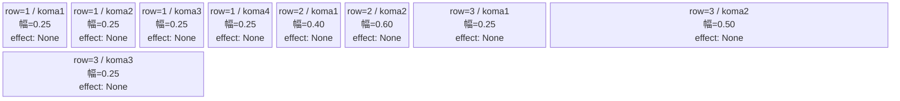
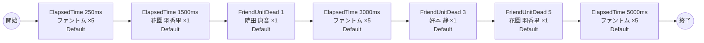

# vd_kim_normal_00001 インゲームデータ詳細解説

> 参照リポジトリ: `projects/glow-masterdata`
> リリースキー: 202604010

## インゲーム要件テキスト

「100カノ（百人の彼女が恋人になんてありえないから）」の世界観を反映したノーマルブロックです。登場するのは、花園 羽香里・院田 唐音・好本 静の3名の彼女たちと、共通敵のファントムです。

難易度設計としては、序盤にファントムを複数体出現させてプレイヤーの初動を促し、その後c_キャラである3名の彼女たちが時間トリガーや撃破トリガーで1体ずつ登場する構成です。「100カノ」らしい個性豊かな彼女たちが次々と登場し、プレイヤーを圧倒する賑やかな戦闘体験を目指します。花園 羽香里（Attack）・院田 唐音（Technical）・好本 静（Support）という異なるロールの彼女たちが入れ替わり立ち替わり出現し、戦略的な対処を求める設計です。

c_キャラはプレイヤーキャラが敵として出現するため、世界観上同一キャラが複数体同時にフィールドに存在する状況を避け、それぞれ個別召喚で対処します。合計7行のシーケンス構成で、ファントム3波+c_キャラ3種が各1体ずつ（FriendUnitDead累積カウントによる再出撃あり）登場し、最低15体以上の出現を保証しています。

---

## レベルデザイン

### 敵キャラ設計

#### 敵キャラ選定（MstEnemyCharacter）

| mst_enemy_character_id | 日本語名 | 役割 | 備考 |
|------------------------|---------|------|------|
| chara_kim_00101 | 花園 羽香里 | 雑魚（c_キャラ） | Red属性・Attackロール。プレイアブルキャラが敵として出現 |
| chara_kim_00201 | 院田 唐音 | 雑魚（c_キャラ） | Red属性・Technicalロール。プレイアブルキャラが敵として出現 |
| chara_kim_00301 | 好本 静 | 雑魚（c_キャラ） | Red属性・Supportロール。プレイアブルキャラが敵として出現 |
| enemy_glo_00001 | ファントム | 雑魚（共通） | Colorless属性・Attackロール |

#### 敵キャラステータス（MstEnemyStageParameter）

> 既存参照: `domain/tasks/20260310_115400_vd_ingame_masterdata_generation/generated/ファントムマスター/MstEnemyStageParameter.csv` (release_key: 202602020, 202509010)
> 新規生成不要（既存IDをそのままMstAutoPlayerSequence.action_valueで参照）

| MstEnemyStageParameter ID | 日本語名 | kind | role | color | base_hp | base_atk | base_spd | well_dist | knockback | combo | drop_bp |
|--------------------------|---------|------|------|-------|---------|----------|----------|-----------|-----------|-------|---------|
| c_kim_00101_vd_Normal_Red | 花園 羽香里 | Normal | Attack | Red | 10,000 | 100 | 35 | 0.21 | 1 | 6 | 300 |
| c_kim_00201_vd_Normal_Red | 院田 唐音 | Normal | Technical | Red | 10,000 | 100 | 34 | 0.26 | 2 | 6 | 300 |
| c_kim_00301_vd_Normal_Red | 好本 静 | Normal | Support | Red | 50,000 | 300 | 40 | 0.18 | 2 | 5 | 300 |
| e_glo_00001_vd_Normal_Colorless | ファントム | Normal | Attack | Colorless | 5,000 | 100 | 34 | 0.22 | 3 | 1 | 150 |

---

### コマ設計

各行独立ランダム抽選（12パターンから）の結果:

| row | height | 選択パターン | コマ数 | 各幅 | 幅合計 |
|-----|--------|------------|-------|------|--------|
| 1 | 0.33 | パターン12「4等分」 | 4コマ | 0.25, 0.25, 0.25, 0.25 | 1.0 |
| 2 | 0.33 | パターン2「右ちょい長2コマ」 | 2コマ | 0.40, 0.60 | 1.0 |
| 3 | 0.34 | パターン9「中央広い」 | 3コマ | 0.25, 0.50, 0.25 | 1.0 |

---

### 敵キャラシーケンス設計

#### どのフェーズで、どの敵を、いつ、どこに、どのくらい出現させるか

| elem | 出現タイミング | 敵 | 数 | 累計出現数 |
|------|-------------|---|---|---------|
| 1 | ElapsedTime 250ms | ファントム (e_glo_00001_vd_Normal_Colorless) | 5 | 5 |
| 2 | ElapsedTime 1500ms | 花園 羽香里 (c_kim_00101_vd_Normal_Red) | 1 | 6 |
| 3 | FriendUnitDead 1（累計1体撃破） | 院田 唐音 (c_kim_00201_vd_Normal_Red) | 1 | 7 |
| 4 | ElapsedTime 3000ms | ファントム (e_glo_00001_vd_Normal_Colorless) | 5 | 12 |
| 5 | FriendUnitDead 3（累計3体撃破） | 好本 静 (c_kim_00301_vd_Normal_Red) | 1 | 13 |
| 6 | FriendUnitDead 5（累計5体撃破） | 花園 羽香里 (c_kim_00101_vd_Normal_Red) | 1 | 14 |
| 7 | ElapsedTime 5000ms | ファントム (e_glo_00001_vd_Normal_Colorless) | 5 | 19 |

合計: **19体**（要件「最低15体以上」を満たす）

> **c_キャラ召喚ガードレール確認**: chara_kim_00101/00201/00301 はすべて c_ プレフィックスのため、同一トリガーで summon_count >= 2 かつ summon_interval = 0 の瞬間複数召喚を禁止。各行 summon_count=1 で個別召喚設計にしています。
> elem6 で再び花園 羽香里（c_kim_00101）を召喚していますが、elem2とは別トリガー（FriendUnitDead 5）であり、同一トリガーでの複数召喚ではないため制約に違反しません。

#### 敵キャラの固有ステータス調整（hp_coef / atk_coef）

MstAutoPlayerSequenceの `enemy_hp_coef` / `enemy_attack_coef` はすべてデフォルト値（1.0）を使用します。

| 波 | 敵 | base_hp | hp_coef | 実HP | base_atk | atk_coef | 実ATK |
|---|---|---------|---------|------|----------|----------|-------|
| 1 | ファントム | 5,000 | 1.0 | 5,000 | 100 | 1.0 | 100 |
| 2 | 花園 羽香里 | 10,000 | 1.0 | 10,000 | 100 | 1.0 | 100 |
| 3 | 院田 唐音 | 10,000 | 1.0 | 10,000 | 100 | 1.0 | 100 |
| 4 | ファントム | 5,000 | 1.0 | 5,000 | 100 | 1.0 | 100 |
| 5 | 好本 静 | 50,000 | 1.0 | 50,000 | 300 | 1.0 | 300 |
| 6 | 花園 羽香里 | 10,000 | 1.0 | 10,000 | 100 | 1.0 | 100 |
| 7 | ファントム | 5,000 | 1.0 | 5,000 | 100 | 1.0 | 100 |

#### フェーズ切り替えはあるか

なし（VDではSwitchSequenceGroup使用禁止）

---

## 演出

### アセット

#### 背景

| 設定箇所 | アセットキー | 備考 |
|---------|------------|------|
| loop_background_asset_key | （空） | VDの背景切り替えはゲームロジック側で管理 |
| フロア0以上 | koma_background_vd_00001 | クライアント側でフロア係数に応じて切り替え |
| フロア20以上 | koma_background_vd_00003 | 同上 |
| フロア40以上 | koma_background_vd_00005 | 同上 |

#### BGM

| 設定 | 値 | 備考 |
|-----|---|------|
| bgm_asset_key | SSE_SBG_003_010 | ノーマルブロック用BGM |
| boss_bgm_asset_key | （空） | ノーマルブロックはボスBGMなし |

---

### 敵キャラオーラ

| オーラ種別 | 使用箇所 |
|----------|---------|
| Default | 全敵キャラ（ノーマルブロックはボスなし、全行Default） |

---

### 敵キャラ召喚アニメーション

全キャラ `SummonEnemy` アクションによる ElapsedTime または FriendUnitDead トリガーでの召喚。InitialSummonは使用しない（normalブロックはボスなし）。

花園 羽香里・院田 唐音・好本 静のc_キャラはそれぞれ1体ずつ個別に召喚されます。各c_キャラは同一トリガーでの複数体同時召喚（summon_count >= 2 かつ summon_interval = 0）を禁止しており、瞬間複数召喚は行いません。

---

## 生成テーブルまとめ

| テーブル | 状態 | 備考 |
|---------|------|------|
| MstEnemyStageParameter | 既存参照 | release_key=202602020 のkim系エントリを参照。ファントムは 202509010 |
| MstEnemyOutpost | 新規生成 | HP=100固定、is_damage_invalidation=空、id=vd_kim_normal_00001 |
| MstPage | 新規生成 | id=vd_kim_normal_00001 |
| MstKomaLine | 新規生成 | 3行固定（row=1〜3）、パターン12/2/9 |
| MstAutoPlayerSequence | 新規生成 | 7要素（合計19体、sequence_set_id=vd_kim_normal_00001） |
| MstInGame | 新規生成 | stage_type=vd_normal、content_type=Dungeon、ボスなし、release_key=202604010 |

---

## ID一覧

| テーブル | カラム | 値 |
|---------|--------|-----|
| MstInGame | id | vd_kim_normal_00001 |
| MstAutoPlayerSequence | sequence_set_id | vd_kim_normal_00001 |
| MstPage | id | vd_kim_normal_00001 |
| MstEnemyOutpost | id | vd_kim_normal_00001 |
| MstKomaLine | id（row1） | vd_kim_normal_00001_1 |
| MstKomaLine | id（row2） | vd_kim_normal_00001_2 |
| MstKomaLine | id（row3） | vd_kim_normal_00001_3 |
| MstAutoPlayerSequence | id（elem1） | vd_kim_normal_00001_1 |
| MstAutoPlayerSequence | id（elem2） | vd_kim_normal_00001_2 |
| MstAutoPlayerSequence | id（elem3） | vd_kim_normal_00001_3 |
| MstAutoPlayerSequence | id（elem4） | vd_kim_normal_00001_4 |
| MstAutoPlayerSequence | id（elem5） | vd_kim_normal_00001_5 |
| MstAutoPlayerSequence | id（elem6） | vd_kim_normal_00001_6 |
| MstAutoPlayerSequence | id（elem7） | vd_kim_normal_00001_7 |
