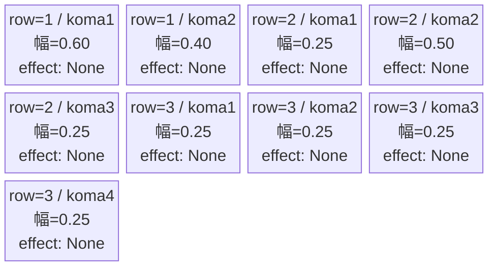
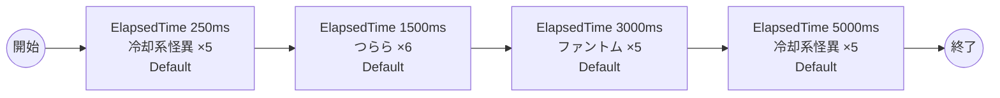

# vd_mag_normal_00001 インゲームデータ詳細解説

> 参照リポジトリ: `projects/glow-masterdata`
> リリースキー: 202604010

## インゲーム要件テキスト

株式会社マジルミエの世界観を反映したノーマルブロックです。マジルミエ社が日々対応している「冷却系怪異」と「つらら」、そして全作品共通の「ファントム」が時間差で出現します。冷却系怪異は高いHPと攻撃力（base_hp=1,000,000、base_atk=2,500）を持つ重量級の敵で、序盤から強い圧力をかけてくる構成です。つらら（冷却系怪異の亜種）は高い移動速度（spd=100）が特徴で、素早くゲートへ接近する厄介な存在です。4波構成（0.25秒後・1.5秒後・3.0秒後・5.0秒後）で合計21体が登場し、冷却系怪異の圧倒的な耐久力とつららの機動力が組み合わさることで、コマ配置の最適化が求められる戦略的なノーマルブロックを実現します。ファントムは3波目に出現し、エナジーゲージを稼ぐ機会を提供します。プレイヤーはマジルミエ社の怪異対応業務さながらに、高耐久の怪異を効率よく撃破する戦略を求められます。

---

## レベルデザイン

### 敵キャラ設計

#### 敵キャラ選定（MstEnemyCharacter）

| mst_enemy_character_id | 日本語名 | 役割 | 備考 |
|------------------------|---------|------|------|
| enemy_mag_00001 | 冷却系怪異 | 雑魚 | Green属性・攻撃ロール・超高HP・高ATK |
| enemy_mag_00101 | つらら | 雑魚 | Green属性・攻撃ロール・超高速移動 |
| enemy_glo_00001 | ファントム | 雑魚（共通） | Colorless属性・攻撃ロール |

#### 敵キャラステータス（MstEnemyStageParameter）

> 既存参照: `domain/tasks/20260310_115400_vd_ingame_masterdata_generation/generated/ファントムマスター/MstEnemyStageParameter.csv` (release_key: 202509010)
> 新規生成不要（既存IDをそのままMstAutoPlayerSequence.action_valueで参照）

| MstEnemyStageParameter ID | 日本語名 | kind | role | color | base_hp | base_atk | base_spd | well_dist | knockback | combo | drop_bp |
|--------------------------|---------|------|------|-------|---------|----------|----------|-----------|-----------|-------|---------|
| e_mag_00001_vd_Normal_Green | 冷却系怪異 | Normal | Attack | Green | 1,000,000 | 2,500 | 35 | 0.3 | 1 | 1 | 10 |
| e_mag_00101_vd_Normal_Green | つらら | Normal | Attack | Green | 20,000 | 400 | 100 | 0.11 | 1 | 1 | 10 |
| e_glo_00001_vd_Normal_Colorless | ファントム | Normal | Attack | Colorless | 5,000 | 100 | 34 | 0.22 | 3 | 1 | 150 |

---

### コマ設計

各行独立ランダム抽選（12パターンから）の結果:

| row | height | 選択パターン | コマ数 | 各幅 | 幅合計 |
|-----|--------|------------|-------|------|--------|
| 1 | 0.33 | パターン2「右ちょい長2コマ」 | 2コマ | 0.60, 0.40 | 1.0 |
| 2 | 0.33 | パターン9「中央広い」 | 3コマ | 0.25, 0.50, 0.25 | 1.0 |
| 3 | 0.34 | パターン12「4等分」 | 4コマ | 0.25, 0.25, 0.25, 0.25 | 1.0 |

---

### 敵キャラシーケンス設計

#### どのフェーズで、どの敵を、いつ、どこに、どのくらい出現させるか

| elem | 出現タイミング | 敵 | 数 | 累計出現数 |
|------|-------------|---|---|---------|
| 1 | ElapsedTime 250ms | 冷却系怪異 (e_mag_00001_vd_Normal_Green) | 5 | 5 |
| 2 | ElapsedTime 1500ms | つらら (e_mag_00101_vd_Normal_Green) | 6 | 11 |
| 3 | ElapsedTime 3000ms | ファントム (e_glo_00001_vd_Normal_Colorless) | 5 | 16 |
| 4 | ElapsedTime 5000ms | 冷却系怪異 (e_mag_00001_vd_Normal_Green) | 5 | 21 |

合計: **21体**（要件「最低15体以上」を満たす）

#### 敵キャラの固有ステータス調整（hp_coef / atk_coef）

| 波 | 敵 | base_hp | hp_coef | 実HP | base_atk | atk_coef | 実ATK |
|---|---|---------|---------|------|----------|----------|-------|
| 1 | 冷却系怪異 | 1,000,000 | 1.0 | 1,000,000 | 2,500 | 1.0 | 2,500 |
| 2 | つらら | 20,000 | 1.0 | 20,000 | 400 | 1.0 | 400 |
| 3 | ファントム | 5,000 | 1.0 | 5,000 | 100 | 1.0 | 100 |
| 4 | 冷却系怪異 | 1,000,000 | 1.0 | 1,000,000 | 2,500 | 1.0 | 2,500 |

#### フェーズ切り替えはあるか

なし（VDではSwitchSequenceGroup使用禁止）

---

## 演出

### アセット

#### 背景

| 設定箇所 | アセットキー | 備考 |
|---------|------------|------|
| loop_background_asset_key | （空） | VDの背景切り替えはゲームロジック側で管理 |
| フロア0以上 | koma_background_vd_00001 | クライアント側でフロア係数に応じて切り替え |
| フロア20以上 | koma_background_vd_00003 | 同上 |
| フロア40以上 | koma_background_vd_00005 | 同上 |

#### BGM

| 設定 | 値 | 備考 |
|-----|---|------|
| bgm_asset_key | SSE_SBG_003_010 | ノーマルブロック用BGM |

---

### 敵キャラオーラ

| オーラ種別 | 使用箇所 |
|----------|---------|
| Default | 全敵キャラ（ノーマルブロックはボスなし、全行Default） |

---

### 敵キャラ召喚アニメーション

全キャラ `SummonEnemy` アクションによるElapsedTime時間差召喚。InitialSummonは使用しない（normalブロックはボスなし）。冷却系怪異はbase_hp=1,000,000の超高耐久キャラで、マジルミエ社の業務対応対象となる大型怪異らしい迫力ある登場演出がデフォルトアニメーションで表現される。つらら（spd=100）は非常に速い移動速度を持ち、出現後に素早くゲートへ突進する緊張感のある演出が生まれる。

---

## 生成テーブルまとめ

| テーブル | 状態 | 備考 |
|---------|------|------|
| MstEnemyStageParameter | 既存参照 | generated/ファントムマスター/ の既存データ使用（e_mag_00001_vd_Normal_Green, e_mag_00101_vd_Normal_Green, e_glo_00001_vd_Normal_Colorless） |
| MstEnemyOutpost | 新規生成 | id=vd_mag_normal_00001、HP=100固定、is_damage_invalidation=空 |
| MstPage | 新規生成 | id=vd_mag_normal_00001 |
| MstKomaLine | 新規生成 | 3行固定（row1-3）、各行独立ランダム抽選 |
| MstAutoPlayerSequence | 新規生成 | sequence_set_id=vd_mag_normal_00001、4要素（計21体） |
| MstInGame | 新規生成 | id=vd_mag_normal_00001、content_type=Dungeon、stage_type=vd_normal、ボスなし |

---

## 設計詳細（CSV生成時の参照用）

### MstEnemyOutpost

| カラム | 値 |
|--------|-----|
| ENABLE | e |
| release_key | 202604010 |
| id | vd_mag_normal_00001 |
| hp | 100 |
| is_damage_invalidation | （空） |

### MstPage

| カラム | 値 |
|--------|-----|
| ENABLE | e |
| release_key | 202604010 |
| id | vd_mag_normal_00001 |

### MstKomaLine（3行分）

| ENABLE | release_key | id | mst_page_id | row | height | koma1_width | koma2_width | koma3_width | koma4_width | koma1_effect_type | koma1_effect_target_side |
|--------|-------------|-----|------------|-----|--------|------------|------------|------------|------------|-------------------|--------------------------|
| e | 202604010 | vd_mag_normal_00001_r1 | vd_mag_normal_00001 | 1 | 0.33 | 0.60 | 0.40 | | | None | All |
| e | 202604010 | vd_mag_normal_00001_r2 | vd_mag_normal_00001 | 2 | 0.33 | 0.25 | 0.50 | 0.25 | | None | All |
| e | 202604010 | vd_mag_normal_00001_r3 | vd_mag_normal_00001 | 3 | 0.34 | 0.25 | 0.25 | 0.25 | 0.25 | None | All |

### MstAutoPlayerSequence（4行分）

| ENABLE | release_key | id | sequence_set_id | sequence_group_id | sequence_element_id | condition_type | condition_value | action_type | action_value | summon_count | summon_position | summon_interval | move_start_condition_type | move_start_condition_value | aura_type | enemy_hp_coef | enemy_attack_coef | enemy_speed_coef | koma_effect_type |
|--------|-------------|-----|----------------|-------------------|-------------------|----------------|----------------|-------------|-------------|-------------|-----------------|----------------|--------------------------|--------------------------|-----------|--------------|------------------|-----------------|-----------------|
| e | 202604010 | vd_mag_normal_00001_1 | vd_mag_normal_00001 | （空） | 1 | ElapsedTime | 250 | SummonEnemy | e_mag_00001_vd_Normal_Green | 5 | | | | | Default | 1 | 1 | 1 | None |
| e | 202604010 | vd_mag_normal_00001_2 | vd_mag_normal_00001 | （空） | 2 | ElapsedTime | 1500 | SummonEnemy | e_mag_00101_vd_Normal_Green | 6 | | | | | Default | 1 | 1 | 1 | None |
| e | 202604010 | vd_mag_normal_00001_3 | vd_mag_normal_00001 | （空） | 3 | ElapsedTime | 3000 | SummonEnemy | e_glo_00001_vd_Normal_Colorless | 5 | | | | | Default | 1 | 1 | 1 | None |
| e | 202604010 | vd_mag_normal_00001_4 | vd_mag_normal_00001 | （空） | 4 | ElapsedTime | 5000 | SummonEnemy | e_mag_00001_vd_Normal_Green | 5 | | | | | Default | 1 | 1 | 1 | None |

### MstInGame

| カラム | 値 |
|--------|-----|
| ENABLE | e |
| release_key | 202604010 |
| id | vd_mag_normal_00001 |
| mst_auto_player_sequence_set_id | vd_mag_normal_00001 |
| bgm_asset_key | SSE_SBG_003_010 |
| boss_bgm_asset_key | （空） |
| loop_background_asset_key | （空） |
| mst_page_id | vd_mag_normal_00001 |
| mst_enemy_outpost_id | vd_mag_normal_00001 |
| boss_mst_enemy_stage_parameter_id | （空） |
| content_type | Dungeon |
| stage_type | vd_normal |
