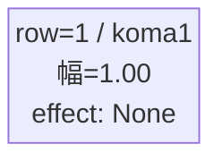
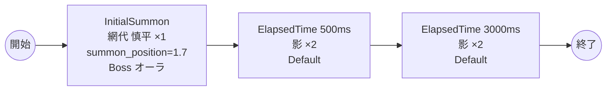

# vd_sum_boss_00001 インゲームデータ詳細解説

> 参照リポジトリ: `projects/glow-masterdata`
> リリースキー: 202604010

## インゲーム要件テキスト

サマータイムレンダの世界観を反映したボスブロックです。ボスとして「網代 慎平」（`chara_sum_00001`・Red属性・Technicalロール）が敵ゲート前に降臨します。プレイヤーはボスを倒すまで敵ゲートへのダメージが無効であるため、ボスの撃破が最優先課題となります。ボス登場から0.5秒後に「影」が2体出現してプレッシャーを与え、さらに3秒後に「影」が2体追加出現し継続的な圧力を維持します。フロア係数 1.00 を基準とした設計で、ボス特有の「1ダメージ受けたら進軍開始」仕様により、緊張感のある戦闘体験を提供します。サマータイムレンダのUR対抗キャラ「影のウシオ 小舟 潮」（`chara_sum_00101`）を持つプレイヤーにとって有利な攻略が可能となるよう、ボスのRed属性・Technicalロールを設定しています。

---

## レベルデザイン

### 敵キャラ設計

#### 敵キャラ選定（MstEnemyCharacter）

| mst_enemy_character_id | 日本語名 | 役割 | 備考 |
|------------------------|---------|------|------|
| chara_sum_00001 | 網代 慎平 | ボス | Red属性・Technicalロール |
| enemy_sum_00001 | 影 | 雑魚 | Red属性・Defenseロール |
| enemy_glo_00001 | ファントム | 雑魚（共通） | Colorless属性・Attackロール |

#### 敵キャラステータス（MstEnemyStageParameter）

> 既存参照: `domain/tasks/20260310_115400_vd_ingame_masterdata_generation/generated/ファントムマスター/MstEnemyStageParameter.csv`
> 新規生成不要（既存IDをそのままMstAutoPlayerSequence.action_valueで参照）

| MstEnemyStageParameter ID | 日本語名 | kind | role | color | base_hp | base_atk | base_spd | well_dist | knockback | combo | drop_bp |
|--------------------------|---------|------|------|-------|---------|----------|----------|-----------|-----------|-------|---------|
| c_sum_00001_vd_Boss_Red | 網代 慎平 | Boss | Technical | Red | 245,000 | 500 | 45 | 0.11 | 2 | 5 | 10 |
| e_sum_00001_vd_Normal_Red | 影 | Normal | Defense | Red | 350,000 | 600 | 40 | 0.2 | 1 | 1 | 10 |
| e_glo_00001_vd_Normal_Colorless | ファントム | Normal | Attack | Colorless | 5,000 | 100 | 34 | 0.22 | 3 | 1 | 150 |

---

### コマ設計

ボスブロックは1行1コマ固定。

| row | height | コマ数 | koma1_width | 幅合計 |
|-----|--------|-------|-------------|--------|
| 1 | 1.0 | 1コマ | 1.0 | 1.0 |

---

### 敵キャラシーケンス設計

#### どのフェーズで、どの敵を、いつ、どこに、どのくらい出現させるか

| elem | 出現タイミング | 敵 | 数 | 累計出現数/召喚位置 |
|------|-------------|---|---|-----------------|
| 1 | InitialSummon | 網代 慎平 (c_sum_00001_vd_Boss_Red) | 1 | 1 / summon_position=1.7 |
| 2 | ElapsedTime 500ms | 影 (e_sum_00001_vd_Normal_Red) | 2 | 3 |
| 3 | ElapsedTime 3000ms | 影 (e_sum_00001_vd_Normal_Red) | 2 | 5 |

#### 敵キャラの固有ステータス調整（hp_coef / atk_coef）

| 波/フェーズ | 敵 | base_hp | hp_coef | 実HP | base_atk | atk_coef | 実ATK |
|-----------|---|---------|---------|------|----------|----------|-------|
| InitialSummon | 網代 慎平 | 245,000 | 1.0 | 245,000 | 500 | 1.0 | 500 |
| ElapsedTime 500ms | 影 | 350,000 | 1.0 | 350,000 | 600 | 1.0 | 600 |
| ElapsedTime 3000ms | 影 | 350,000 | 1.0 | 350,000 | 600 | 1.0 | 600 |

#### フェーズ切り替えはあるか

なし（VDではSwitchSequenceGroup使用禁止）

---

## 演出

### アセット

#### 背景

| 設定箇所 | アセットキー | 備考 |
|---------|------------|------|
| loop_background_asset_key | （空） | VDの背景切り替えはゲームロジック側で管理 |
| フロア0以上 | koma_background_vd_00002 | クライアント側でフロア係数に応じて切り替え |
| フロア20以上 | koma_background_vd_00004 | 同上 |
| フロア40以上 | koma_background_vd_00006 | 同上 |

#### BGM

| 設定 | 値 | 備考 |
|-----|---|------|
| bgm_asset_key | SSE_SBG_003_004 | ボスブロック用BGM |

---

### 敵キャラオーラ

| オーラ種別 | 使用箇所 |
|----------|---------|
| Boss | 網代 慎平（InitialSummon時） |
| Default | 影、ファントム（雑魚2種） |

---

### 敵キャラ召喚アニメーション

ボス（網代 慎平）は `InitialSummon` で `summon_position=1.7`（ゲート付近）に配置。1ダメージ受けると進軍を開始する（`move_start_condition_type=Damage, move_start_condition_value=1`）。
雑魚キャラ（影）は `SummonEnemy` アクションによるElapsedTime時間差召喚。`chara_sum_00001` はプレイアブルキャラのため、瞬間同時複数召喚（`summon_interval=0` かつ `summon_count>=2`）は設定しない。

---

## 生成テーブルまとめ

| テーブル | 状態 | 備考 |
|---------|------|------|
| MstEnemyStageParameter | 既存参照 | generated/ファントムマスター/ の既存データ使用 |
| MstEnemyOutpost | 新規生成 | HP=1,000固定、is_damage_invalidation=空 |
| MstPage | 新規生成 | id=vd_sum_boss_00001 |
| MstKomaLine | 新規生成 | 1行固定（row=1, koma1_width=1.0） |
| MstAutoPlayerSequence | 新規生成 | 3要素（ボス1体+雑魚4体）sequence_set_id=vd_sum_boss_00001 |
| MstInGame | 新規生成 | ボスあり（boss_mst_enemy_stage_parameter_id=c_sum_00001_vd_Boss_Red） |

---

## テーブル設計詳細

### MstEnemyOutpost

| カラム | 値 | 備考 |
|--------|---|------|
| ENABLE | e | |
| release_key | 202604010 | |
| id | vd_sum_boss_00001 | MstInGame.idと同一 |
| hp | 1000 | 固定値（変更不可） |
| is_damage_invalidation | （空） | ダメージ有効 |

### MstPage

| カラム | 値 | 備考 |
|--------|---|------|
| ENABLE | e | |
| release_key | 202604010 | |
| id | vd_sum_boss_00001 | MstInGame.idと同一 |

### MstKomaLine

| カラム | 値 | 備考 |
|--------|---|------|
| ENABLE | e | |
| release_key | 202604010 | |
| mst_page_id | vd_sum_boss_00001 | |
| row | 1 | 1行固定 |
| height | 1.0 | |
| koma1_width | 1.0 | |
| koma1_effect_type | None | |
| koma1_effect_target_side | All | エフェクトなしでもAllを設定 |

### MstAutoPlayerSequence

| id | sequence_set_id | sequence_element_id | sequence_group_id | condition_type | condition_value | action_type | action_value | summon_count | summon_interval | summon_position | move_start_condition_type | move_start_condition_value | aura_type | enemy_hp_coef | enemy_attack_coef | enemy_speed_coef | koma_effect_type |
|----|-----------------|---------------------|------------------|----------------|-----------------|-------------|-------------|--------------|-----------------|-----------------|--------------------------|---------------------------|-----------|--------------|------------------|-----------------|-----------------|
| vd_sum_boss_00001_1 | vd_sum_boss_00001 | 1 | （空） | InitialSummon | 0 | SummonEnemy | c_sum_00001_vd_Boss_Red | 1 | 0 | 1.7 | Damage | 1 | Boss | 1 | 1 | 1 | None |
| vd_sum_boss_00001_2 | vd_sum_boss_00001 | 2 | （空） | ElapsedTime | 500 | SummonEnemy | e_sum_00001_vd_Normal_Red | 2 | 1500 | （空） | （空） | （空） | Default | 1 | 1 | 1 | None |
| vd_sum_boss_00001_3 | vd_sum_boss_00001 | 3 | （空） | ElapsedTime | 3000 | SummonEnemy | e_sum_00001_vd_Normal_Red | 2 | 1500 | （空） | （空） | （空） | Default | 1 | 1 | 1 | None |

> **注**: 雑魚の `summon_interval=1500` で2体を1.5秒間隔で順次出現させる。c_sum_00001（プレイアブルキャラ）はInitialSummon行のみに出現し、瞬間複数召喚禁止制約に準拠。

### MstInGame

| カラム | 値 | 備考 |
|--------|---|------|
| ENABLE | e | |
| release_key | 202604010 | |
| id | vd_sum_boss_00001 | |
| content_type | Dungeon | |
| stage_type | vd_boss | |
| mst_auto_player_sequence_set_id | vd_sum_boss_00001 | |
| bgm_asset_key | SSE_SBG_003_004 | ボスブロック用BGM |
| mst_page_id | vd_sum_boss_00001 | |
| mst_enemy_outpost_id | vd_sum_boss_00001 | |
| boss_mst_enemy_stage_parameter_id | c_sum_00001_vd_Boss_Red | ボスの二重設定（MstAutoPlayerSequenceのInitialSummonと対応） |
| normal_enemy_hp_coef | 1.0 | フロア係数はゲームロジック側で管理 |
| normal_enemy_attack_coef | 1.0 | |
| normal_enemy_speed_coef | 1 | |
| boss_enemy_hp_coef | 1.0 | |
| boss_enemy_attack_coef | 1.0 | |
| boss_enemy_speed_coef | 1 | |
