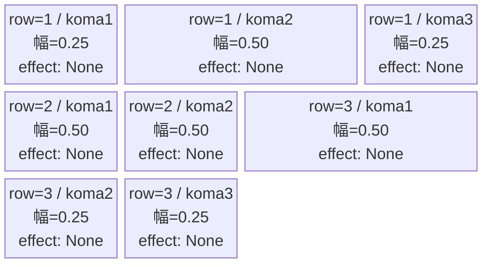
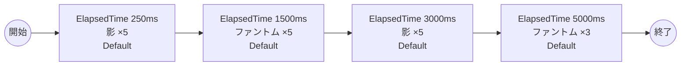

# vd_sum_normal_00001 インゲームデータ詳細解説

> 参照リポジトリ: `projects/glow-masterdata`
> リリースキー: 202604010

## インゲーム要件テキスト

サマータイムレンダの世界観を反映したノーマルブロックです。作品の核心的な存在である「影」（`enemy_sum_00001`・Red属性・Defenseロール）と共通雑魚の「ファントム」（`enemy_glo_00001`・Colorless属性・Attackロール）が時間差で交互に出現します。「影」はサマータイムレンダのキーとなる脅威的存在であり、防御ロールを持ちながらも高いHPを誇るため、プレイヤーへの継続的なプレッシャーを与えます。ファントムはColorlessの攻撃ロールとして中間波に挟まることで、攻撃パターンに変化を加えます。3波＋追加波の4波構成で合計18体が登場し、「最低15体以上」の要件を十分に満たします。難易度はフロア係数 1.00 を基準とした設計で、サマータイムレンダのUR対抗キャラ「影のウシオ 小舟 潮」（`chara_sum_00101`）を持つプレイヤーが有利に攻略できるよう、ボスブロックと同作品内で統一感のある敵構成としています。

---

## レベルデザイン

### 敵キャラ設計

#### 敵キャラ選定（MstEnemyCharacter）

| mst_enemy_character_id | 日本語名 | 役割 | 備考 |
|------------------------|---------|------|------|
| enemy_sum_00001 | 影 | 雑魚 | Red属性・Defenseロール |
| enemy_glo_00001 | ファントム | 雑魚（共通） | Colorless属性・Attackロール |

#### 敵キャラステータス（MstEnemyStageParameter）

> 既存参照: `domain/tasks/20260310_115400_vd_ingame_masterdata_generation/generated/ファントムマスター/MstEnemyStageParameter.csv` (release_key: 202509010)
> 新規生成不要（既存IDをそのままMstAutoPlayerSequence.action_valueで参照）

| MstEnemyStageParameter ID | 日本語名 | kind | role | color | base_hp | base_atk | base_spd | well_dist | knockback | combo | drop_bp |
|--------------------------|---------|------|------|-------|---------|----------|----------|-----------|-----------|-------|---------|
| e_sum_00001_vd_Normal_Red | 影 | Normal | Defense | Red | 350,000 | 600 | 40 | 0.2 | 1 | 1 | 10 |
| e_glo_00001_vd_Normal_Colorless | ファントム | Normal | Attack | Colorless | 5,000 | 100 | 34 | 0.22 | 3 | 1 | 150 |

---

### コマ設計

MstKomaLine 3行固定。各行独立ランダム抽選（12パターンから）の結果:

| row | height | 選択パターン | コマ数 | 各幅 | 幅合計 |
|-----|--------|------------|-------|------|--------|
| 1 | 0.33 | パターン9「中央広い」 | 3コマ | 0.25, 0.50, 0.25 | 1.0 |
| 2 | 0.33 | パターン6「2等分」 | 2コマ | 0.50, 0.50 | 1.0 |
| 3 | 0.34 | パターン8「右広い」 | 3コマ | 0.50, 0.25, 0.25 | 1.0 |

---

### 敵キャラシーケンス設計

#### どのフェーズで、どの敵を、いつ、どこに、どのくらい出現させるか

| elem | 出現タイミング | 敵 | 数 | 累計出現数 |
|------|-------------|---|---|---------|
| 1 | ElapsedTime 250ms | 影 (e_sum_00001_vd_Normal_Red) | 5 | 5 |
| 2 | ElapsedTime 1500ms | ファントム (e_glo_00001_vd_Normal_Colorless) | 5 | 10 |
| 3 | ElapsedTime 3000ms | 影 (e_sum_00001_vd_Normal_Red) | 5 | 15 |
| 4 | ElapsedTime 5000ms | ファントム (e_glo_00001_vd_Normal_Colorless) | 3 | 18 |

合計: **18体**（要件「最低15体以上」を満たす）

#### 敵キャラの固有ステータス調整（hp_coef / atk_coef）

| 波 | 敵 | base_hp | hp_coef | 実HP | base_atk | atk_coef | 実ATK |
|---|---|---------|---------|------|----------|----------|-------|
| 1波（250ms） | 影 | 350,000 | 1.0 | 350,000 | 600 | 1.0 | 600 |
| 2波（1500ms） | ファントム | 5,000 | 1.0 | 5,000 | 100 | 1.0 | 100 |
| 3波（3000ms） | 影 | 350,000 | 1.0 | 350,000 | 600 | 1.0 | 600 |
| 4波（5000ms） | ファントム | 5,000 | 1.0 | 5,000 | 100 | 1.0 | 100 |

#### フェーズ切り替えはあるか

なし（VDではSwitchSequenceGroup使用禁止）

---

## 演出

### アセット

#### 背景

| 設定箇所 | アセットキー | 備考 |
|---------|------------|------|
| loop_background_asset_key | （空） | VDの背景切り替えはゲームロジック側で管理 |
| フロア0以上 | koma_background_vd_00001 | クライアント側でフロア係数に応じて切り替え |
| フロア20以上 | koma_background_vd_00003 | 同上 |
| フロア40以上 | koma_background_vd_00005 | 同上 |

#### BGM

| 設定 | 値 | 備考 |
|-----|---|------|
| bgm_asset_key | SSE_SBG_003_010 | ノーマルブロック用BGM |

---

### 敵キャラオーラ

| オーラ種別 | 使用箇所 |
|----------|---------|
| Default | 全敵キャラ（ノーマルブロックはボスなし、全行Default） |

---

### 敵キャラ召喚アニメーション

全キャラ `SummonEnemy` アクションによるElapsedTime時間差召喚。InitialSummonは使用しない（normalブロックはボスなし）。`enemy_sum_00001`・`enemy_glo_00001` はいずれも `e_` プレフィックス（敵専用キャラ）のため、c_キャラ召喚制約（瞬間同時複数召喚禁止）の対象外。各波 `summon_count=5`（または3）、`summon_interval=1500` で体を1.5秒間隔で順次出現させる。

---

## 生成テーブルまとめ

| テーブル | 状態 | 備考 |
|---------|------|------|
| MstEnemyStageParameter | 既存参照 | generated/ファントムマスター/ の既存データ使用（新規生成不要） |
| MstEnemyOutpost | 新規生成 | HP=100固定、is_damage_invalidation=空 |
| MstPage | 新規生成 | id=vd_sum_normal_00001 |
| MstKomaLine | 新規生成 | 3行固定（row1-3） |
| MstAutoPlayerSequence | 新規生成 | 4要素（計18体）sequence_set_id=vd_sum_normal_00001 |
| MstInGame | 新規生成 | stage_type=vd_normal、ボスなし |

---

## テーブル設計詳細

### MstEnemyOutpost

| カラム | 値 | 備考 |
|--------|---|------|
| ENABLE | e | |
| release_key | 202604010 | |
| id | vd_sum_normal_00001 | MstInGame.idと同一 |
| hp | 100 | 固定値（変更不可） |
| is_damage_invalidation | （空） | ダメージ有効 |

### MstPage

| カラム | 値 | 備考 |
|--------|---|------|
| ENABLE | e | |
| release_key | 202604010 | |
| id | vd_sum_normal_00001 | MstInGame.idと同一 |

### MstKomaLine

| カラム | row=1 | row=2 | row=3 | 備考 |
|--------|-------|-------|-------|------|
| ENABLE | e | e | e | |
| release_key | 202604010 | 202604010 | 202604010 | |
| mst_page_id | vd_sum_normal_00001 | vd_sum_normal_00001 | vd_sum_normal_00001 | |
| row | 1 | 2 | 3 | |
| height | 0.33 | 0.33 | 0.34 | 合計=1.0 |
| koma1_width | 0.25 | 0.50 | 0.50 | |
| koma2_width | 0.50 | 0.50 | 0.25 | |
| koma3_width | 0.25 | （空） | 0.25 | |
| koma1_effect_type | None | None | None | |
| koma1_effect_target_side | All | All | All | エフェクトなしでもAllを設定 |

### MstAutoPlayerSequence

| id | sequence_set_id | sequence_element_id | sequence_group_id | condition_type | condition_value | action_type | action_value | summon_count | summon_interval | aura_type | enemy_hp_coef | enemy_attack_coef | enemy_speed_coef | koma_effect_type |
|----|-----------------|---------------------|------------------|----------------|-----------------|-------------|-------------|--------------|-----------------|-----------|--------------|------------------|-----------------|-----------------|
| vd_sum_normal_00001_1 | vd_sum_normal_00001 | 1 | （空） | ElapsedTime | 250 | SummonEnemy | e_sum_00001_vd_Normal_Red | 5 | 1500 | Default | 1 | 1 | 1 | None |
| vd_sum_normal_00001_2 | vd_sum_normal_00001 | 2 | （空） | ElapsedTime | 1500 | SummonEnemy | e_glo_00001_vd_Normal_Colorless | 5 | 1500 | Default | 1 | 1 | 1 | None |
| vd_sum_normal_00001_3 | vd_sum_normal_00001 | 3 | （空） | ElapsedTime | 3000 | SummonEnemy | e_sum_00001_vd_Normal_Red | 5 | 1500 | Default | 1 | 1 | 1 | None |
| vd_sum_normal_00001_4 | vd_sum_normal_00001 | 4 | （空） | ElapsedTime | 5000 | SummonEnemy | e_glo_00001_vd_Normal_Colorless | 3 | 1500 | Default | 1 | 1 | 1 | None |

> 各波 `summon_interval=1500` で複数体を1.5秒間隔で順次出現させる。`e_` プレフィックスキャラのためc_キャラ制約（同一トリガーでsummon_count>=2かつsummon_interval=0禁止）は対象外。

### MstInGame

| カラム | 値 | 備考 |
|--------|---|------|
| ENABLE | e | |
| release_key | 202604010 | |
| id | vd_sum_normal_00001 | |
| content_type | Dungeon | |
| stage_type | vd_normal | |
| mst_auto_player_sequence_set_id | vd_sum_normal_00001 | |
| bgm_asset_key | SSE_SBG_003_010 | ノーマルブロック用BGM |
| mst_page_id | vd_sum_normal_00001 | |
| mst_enemy_outpost_id | vd_sum_normal_00001 | |
| boss_mst_enemy_stage_parameter_id | （空） | ボスなし（normalブロック） |
| normal_enemy_hp_coef | 1.0 | フロア係数はゲームロジック側で管理 |
| normal_enemy_attack_coef | 1.0 | |
| normal_enemy_speed_coef | 1 | |
| boss_enemy_hp_coef | 1.0 | |
| boss_enemy_attack_coef | 1.0 | |
| boss_enemy_speed_coef | 1 | |
