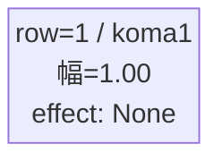
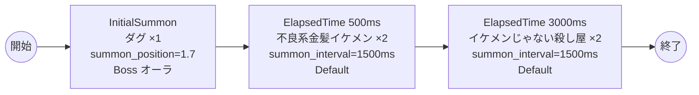

# vd_you_boss_00001 インゲームデータ詳細解説

> 参照リポジトリ: `projects/glow-masterdata`
> リリースキー: 202604010

## インゲーム要件テキスト

幼稚園WARSの世界観を反映したボスブロックです。ボスとして「ダグ」（Green属性・テクニカルロール）が敵ゲート前に降臨します。ダグは元殺し屋という設定を活かした、タフで素早い近接戦闘型ボスとして設計します。プレイヤーはボスを倒すまで敵ゲートへのダメージが無効であるため、ダグの撃破が最優先課題となります。ダグはc_（プレイアブルキャラ）のため、瞬間複数召喚は禁止とし、1体のみInitialSummonでゲート付近に配置します。ボス登場から0.5秒後に不良系金髪イケメンが2体時間差で出現してプレッシャーを与え、さらに3秒後にイケメンじゃない殺し屋が2体追加出現することで継続的な圧力を維持します。フロア係数 1.00 を基準とした設計で、ボス特有の「1ダメージ受けたら進軍開始」仕様により、緊張感のある戦闘体験を提供します。

---

## レベルデザイン

### 敵キャラ設計

#### 敵キャラ選定（MstEnemyCharacter）

| mst_enemy_character_id | 日本語名 | 役割 | 備考 |
|------------------------|---------|------|------|
| chara_you_00201 | ダグ | ボス | Green属性・テクニカルロール |
| enemy_you_00001 | 不良系金髪イケメン | 雑魚 | Green属性・攻撃ロール |
| enemy_you_00101 | イケメンじゃない殺し屋 | 雑魚 | Green属性・攻撃ロール |

#### 敵キャラステータス（MstEnemyStageParameter）

> 既存参照: `domain/tasks/20260310_115400_vd_ingame_masterdata_generation/generated/ファントムマスター/MstEnemyStageParameter.csv`
> 新規生成不要（既存IDをそのままMstAutoPlayerSequence.action_valueで参照）

| MstEnemyStageParameter ID | 日本語名 | kind | role | color | base_hp | base_atk | base_spd | well_dist | knockback | combo | drop_bp |
|--------------------------|---------|------|------|-------|---------|----------|----------|-----------|-----------|-------|---------|
| c_you_00201_vd_Boss_Green | ダグ | Boss | Technical | Green | 10,000 | 500 | 32 | 0.45 | 2 | 6 | 100 |
| e_you_00001_vd_Normal_Green | 不良系金髪イケメン | Normal | Attack | Green | 1,000 | 100 | 37 | 0.20 | 2 | 1 | 100 |
| e_you_00101_vd_Normal_Green | イケメンじゃない殺し屋 | Normal | Attack | Green | 1,000 | 100 | 30 | 0.40 | 2 | 1 | 100 |

---

### コマ設計

ボスブロックは1行1コマ固定。

| row | height | コマ数 | koma1_width | 幅合計 |
|-----|--------|-------|-------------|--------|
| 1 | 1.0 | 1コマ | 1.0 | 1.0 |

---

### 敵キャラシーケンス設計

#### どのフェーズで、どの敵を、いつ、どこに、どのくらい出現させるか

| elem | 出現タイミング | 敵 | 数 | 累計出現数/召喚位置 |
|------|-------------|---|---|-----------------|
| 1 | InitialSummon | ダグ (c_you_00201_vd_Boss_Green) | 1 | 1 / summon_position=1.7 |
| 2 | ElapsedTime 500ms | 不良系金髪イケメン (e_you_00001_vd_Normal_Green) | 2（interval=1500ms） | 3 |
| 3 | ElapsedTime 3000ms | イケメンじゃない殺し屋 (e_you_00101_vd_Normal_Green) | 2（interval=1500ms） | 5 |

#### 敵キャラの固有ステータス調整（hp_coef / atk_coef）

| 波/フェーズ | 敵 | base_hp | hp_coef | 実HP | base_atk | atk_coef | 実ATK |
|-----------|---|---------|---------|------|----------|----------|-------|
| InitialSummon | ダグ | 10,000 | 1.0 | 10,000 | 500 | 1.0 | 500 |
| ElapsedTime 500ms | 不良系金髪イケメン | 1,000 | 1.0 | 1,000 | 100 | 1.0 | 100 |
| ElapsedTime 3000ms | イケメンじゃない殺し屋 | 1,000 | 1.0 | 1,000 | 100 | 1.0 | 100 |

#### フェーズ切り替えはあるか

なし（VDではSwitchSequenceGroup使用禁止）

---

## 演出

### アセット

#### 背景

| 設定箇所 | アセットキー | 備考 |
|---------|------------|------|
| loop_background_asset_key | （空） | VDの背景切り替えはゲームロジック側で管理 |
| フロア0以上 | koma_background_vd_00002 | クライアント側でフロア係数に応じて切り替え |
| フロア20以上 | koma_background_vd_00004 | 同上 |
| フロア40以上 | koma_background_vd_00006 | 同上 |

#### BGM

| 設定 | 値 | 備考 |
|-----|---|------|
| bgm_asset_key | SSE_SBG_003_004 | ボスブロック用BGM |

---

### 敵キャラオーラ

| オーラ種別 | 使用箇所 |
|----------|---------|
| Boss | ダグ（InitialSummon時） |
| Default | 不良系金髪イケメン、イケメンじゃない殺し屋（雑魚2種） |

---

### 敵キャラ召喚アニメーション

ボス（ダグ）は `InitialSummon` で `summon_position=1.7`（ゲート付近）に配置。1ダメージ受けると進軍を開始する（`move_start_condition_type=Damage, move_start_condition_value=1`）。ダグはc_キャラ（プレイアブルキャラが敵として登場）のため、瞬間同時複数召喚は行わず1体のみ配置する。
雑魚キャラ（不良系金髪イケメン・イケメンじゃない殺し屋）は `SummonEnemy` アクションによるElapsedTime時間差召喚。同一トリガー内で複数体を召喚する場合は `summon_interval=1500ms` を設定し、順次出現させる。

---

## 生成テーブルまとめ

| テーブル | 状態 | 備考 |
|---------|------|------|
| MstEnemyStageParameter | 既存参照 | generated/ファントムマスター/ の既存データ使用 |
| MstEnemyOutpost | 新規生成 | HP=1,000固定、is_damage_invalidation=空 |
| MstPage | 新規生成 | id=vd_you_boss_00001 |
| MstKomaLine | 新規生成 | 1行固定（row=1, koma1_width=1.0） |
| MstAutoPlayerSequence | 新規生成 | 3要素（ボス1体+雑魚4体） |
| MstInGame | 新規生成 | ボスあり（boss_mst_enemy_stage_parameter_id=c_you_00201_vd_Boss_Green） |

## MstAutoPlayerSequence ID設計

| id | sequence_set_id | sequence_group_id | sequence_element_id | condition_type | condition_value | action_type | action_value | summon_count | summon_interval | summon_position | move_start_condition_type | move_start_condition_value | aura_type | enemy_hp_coef | enemy_attack_coef | enemy_speed_coef | koma_effect_type |
|----|-----------------|-------------------|---------------------|----------------|-----------------|-------------|--------------|--------------|-----------------|-----------------|--------------------------|---------------------------|-----------|---------------|-------------------|------------------|-----------------|
| vd_you_boss_00001_1 | vd_you_boss_00001 | （空） | 1 | InitialSummon | 0 | SummonEnemy | c_you_00201_vd_Boss_Green | 1 | 0 | 1.7 | Damage | 1 | Boss | 1 | 1 | 1 | None |
| vd_you_boss_00001_2 | vd_you_boss_00001 | （空） | 2 | ElapsedTime | 500 | SummonEnemy | e_you_00001_vd_Normal_Green | 2 | 1500 | （空） | （空） | （空） | Default | 1 | 1 | 1 | None |
| vd_you_boss_00001_3 | vd_you_boss_00001 | （空） | 3 | ElapsedTime | 3000 | SummonEnemy | e_you_00101_vd_Normal_Green | 2 | 1500 | （空） | （空） | （空） | Default | 1 | 1 | 1 | None |

## MstInGame 主要設定

| カラム | 値 |
|--------|-----|
| ENABLE | e |
| id | vd_you_boss_00001 |
| content_type | Dungeon |
| stage_type | vd_boss |
| bgm_asset_key | SSE_SBG_003_004 |
| boss_mst_enemy_stage_parameter_id | c_you_00201_vd_Boss_Green |
| release_key | 202604010 |
