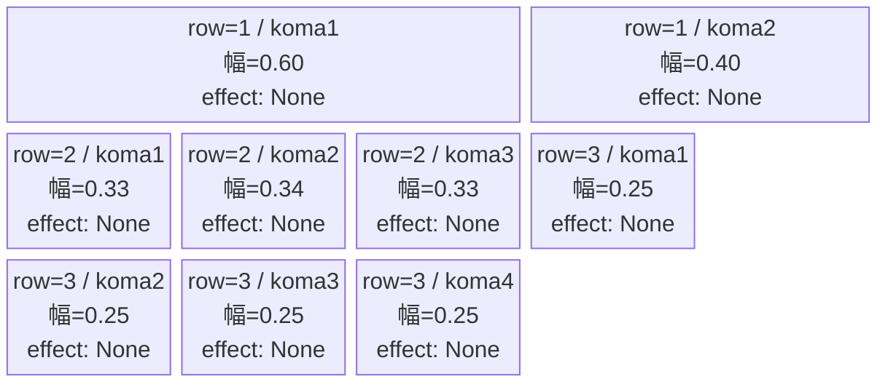
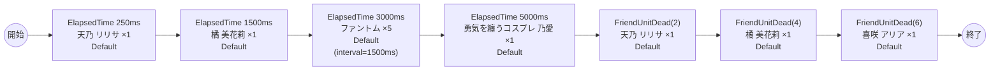

# vd_yuw_normal_00001 インゲームデータ詳細解説

> 参照リポジトリ: `projects/glow-masterdata`
> リリースキー: 202604010

## インゲーム要件テキスト

「2.5次元の誘惑」の世界観を反映したノーマルブロックです。天乃 リリサ・橘 美花莉・乃愛・喜咲 アリアの4名のプレイアブルキャラクター（Blue属性）とファントム（Colorless属性）が時間差で出現します。全員がコスプレ・アニメ好きの乙女たちという設定に合わせ、テンションが徐々に高まるような波状攻撃を演出します。c_キャラは瞬間複数召喚禁止制約のため、各キャラクターを1体ずつ間隔をあけて順次登場させる構成とします。

難易度はフロア係数 1.00 を基準に設計しており、多様なロールタイプ（Attack・Technical・Defense）と体力帯の差異（hp=10,000〜50,000）によって単調さを防ぎます。7波構成で合計17体が登場し、要件の「最低15体以上」を満たしつつ、十分なバトルポイント獲得機会も確保しています。ファントムが中盤に割り込むことで、単一属性に偏ったパーティへの挑戦要素も加えています。

---

## レベルデザイン

### 敵キャラ設計

#### 敵キャラ選定（MstEnemyCharacter）

| mst_enemy_character_id | 日本語名 | 役割 | 備考 |
|------------------------|---------|------|------|
| chara_yuw_00001 | リリエルに捧ぐ愛 天乃 リリサ | 雑魚（c_キャラ） | Blue属性・Attack・hp=10,000 |
| chara_yuw_00101 | コスプレに託す乙女心 橘 美花莉 | 雑魚（c_キャラ） | Blue属性・Technical・hp=50,000 |
| chara_yuw_00301 | 勇気を纏うコスプレ 乃愛 | 雑魚（c_キャラ） | Blue属性・Technical・hp=50,000 |
| chara_yuw_00401 | 伝えたいウチの想い 喜咲 アリア | 雑魚（c_キャラ） | Blue属性・Defense・hp=50,000 |
| enemy_glo_00001 | ファントム | 雑魚（共通） | Colorless属性・Attack |

#### 敵キャラステータス（MstEnemyStageParameter）

> 既存参照: `domain/tasks/20260310_115400_vd_ingame_masterdata_generation/generated/ファントムマスター/MstEnemyStageParameter.csv` (release_key: 202511020)
> c_yuw_00001 / c_yuw_00101 / c_yuw_00301 / c_yuw_00401 は release_key=202511020 で既存登録済み。今回バッチ（release_key=202604010）では新規追加不要、既存IDをそのまま参照する。
> e_glo_00001_vd_Normal_Colorless は release_key=202509010 で既存登録済み。同様に既存IDを参照する。

| MstEnemyStageParameter ID | 日本語名 | kind | role | color | base_hp | base_atk | base_spd | well_dist | knockback | combo | drop_bp |
|--------------------------|---------|------|------|-------|---------|----------|----------|-----------|-----------|-------|---------|
| c_yuw_00001_vd_Normal_Blue | リリエルに捧ぐ愛 天乃 リリサ | Normal | Attack | Blue | 10,000 | 300 | 30 | 0.24 | 3 | 4 | 1,000 |
| c_yuw_00101_vd_Normal_Blue | コスプレに託す乙女心 橘 美花莉 | Normal | Technical | Blue | 50,000 | 300 | 29 | 0.25 | 2 | 5 | 100 |
| c_yuw_00301_vd_Normal_Blue | 勇気を纏うコスプレ 乃愛 | Normal | Technical | Blue | 50,000 | 300 | 29 | 0.26 | 3 | 4 | 500 |
| c_yuw_00401_vd_Normal_Blue | 伝えたいウチの想い 喜咲 アリア | Normal | Defense | Blue | 50,000 | 300 | 30 | 0.17 | 2 | 6 | 100 |
| e_glo_00001_vd_Normal_Colorless | ファントム | Normal | Attack | Colorless | 5,000 | 100 | 34 | 0.22 | 3 | 1 | 150 |

---

### コマ設計

各行独立ランダム抽選（12パターンから）の結果:

| row | height | 選択パターン | コマ数 | 各幅 | 幅合計 |
|-----|--------|------------|-------|------|--------|
| 1 | 0.33 | パターン2「右ちょい長2コマ」 | 2コマ | 0.60, 0.40 | 1.0 |
| 2 | 0.33 | パターン7「3等分」 | 3コマ | 0.33, 0.34, 0.33 | 1.0 |
| 3 | 0.34 | パターン12「4等分」 | 4コマ | 0.25, 0.25, 0.25, 0.25 | 1.0 |

---

### 敵キャラシーケンス設計

#### どのフェーズで、どの敵を、いつ、どこに、どのくらい出現させるか

c_キャラ制約: `summon_count >= 2` かつ `summon_interval=0` の瞬間同時召喚禁止。1体ずつ `summon_count=1` で出現させる、または `summon_interval > 0` を設定する。

| elem | 出現タイミング | 敵 | 数 | 累計出現数 |
|------|-------------|---|---|---------|
| 1 | ElapsedTime 250ms | リリエルに捧ぐ愛 天乃 リリサ (c_yuw_00001_vd_Normal_Blue) | 1 | 1 |
| 2 | ElapsedTime 1500ms | コスプレに託す乙女心 橘 美花莉 (c_yuw_00101_vd_Normal_Blue) | 1 | 2 |
| 3 | ElapsedTime 3000ms | ファントム (e_glo_00001_vd_Normal_Colorless) | 5 (interval=1500ms) | 7 |
| 4 | ElapsedTime 5000ms | 勇気を纏うコスプレ 乃愛 (c_yuw_00301_vd_Normal_Blue) | 1 | 8 |
| 5 | FriendUnitDead(2) | リリエルに捧ぐ愛 天乃 リリサ (c_yuw_00001_vd_Normal_Blue) | 1 | 9 |
| 6 | FriendUnitDead(4) | コスプレに託す乙女心 橘 美花莉 (c_yuw_00101_vd_Normal_Blue) | 1 | 10 |
| 7 | FriendUnitDead(6) | 伝えたいウチの想い 喜咲 アリア (c_yuw_00401_vd_Normal_Blue) | 1 | 11 |
| 8 | FriendUnitDead(8) | 勇気を纏うコスプレ 乃愛 (c_yuw_00301_vd_Normal_Blue) | 1 | 12 |
| 9 | FriendUnitDead(10) | ファントム (e_glo_00001_vd_Normal_Colorless) | 5 (interval=1000ms) | 17 |

合計: **17体**（要件「最低15体以上」を満たす）

> **c_キャラ制約チェック**: 全c_キャラ（chara_yuw_*）は各elementで `summon_count=1`（summon_interval=0）、または `summon_interval > 0` を設定。瞬間同時複数召喚（同一トリガーで `summon_count >= 2` かつ `summon_interval=0`）は使用しない。

#### 敵キャラの固有ステータス調整（hp_coef / atk_coef）

| 波/elem | 敵 | base_hp | hp_coef | 実HP | base_atk | atk_coef | 実ATK |
|---------|---|---------|---------|------|----------|----------|-------|
| 1 | 天乃 リリサ | 10,000 | 1.0 | 10,000 | 300 | 1.0 | 300 |
| 2 | 橘 美花莉 | 50,000 | 1.0 | 50,000 | 300 | 1.0 | 300 |
| 3 | ファントム×5 | 5,000 | 1.0 | 5,000 | 100 | 1.0 | 100 |
| 4 | 乃愛 | 50,000 | 1.0 | 50,000 | 300 | 1.0 | 300 |
| 5 | 天乃 リリサ（再） | 10,000 | 1.0 | 10,000 | 300 | 1.0 | 300 |
| 6 | 橘 美花莉（再） | 50,000 | 1.0 | 50,000 | 300 | 1.0 | 300 |
| 7 | 喜咲 アリア | 50,000 | 1.0 | 50,000 | 300 | 1.0 | 300 |
| 8 | 乃愛（再） | 50,000 | 1.0 | 50,000 | 300 | 1.0 | 300 |
| 9 | ファントム×5（再） | 5,000 | 1.0 | 5,000 | 100 | 1.0 | 100 |

#### フェーズ切り替えはあるか

なし（VDではSwitchSequenceGroup使用禁止）

---

## 演出

### アセット

#### 背景

| 設定箇所 | アセットキー | 備考 |
|---------|------------|------|
| loop_background_asset_key | （空） | VDの背景切り替えはゲームロジック側で管理 |
| フロア0以上 | koma_background_vd_00001 | クライアント側でフロア係数に応じて切り替え |
| フロア20以上 | koma_background_vd_00003 | 同上 |
| フロア40以上 | koma_background_vd_00005 | 同上 |

#### BGM

| 設定 | 値 | 備考 |
|-----|---|------|
| bgm_asset_key | SSE_SBG_003_010 | ノーマルブロック用BGM |

---

### 敵キャラオーラ

| オーラ種別 | 使用箇所 |
|----------|---------|
| Default | 全敵キャラ（ノーマルブロックはボスなし、全行Default） |

---

### 敵キャラ召喚アニメーション

全キャラ `SummonEnemy` アクションによるElapsedTime・FriendUnitDeadトリガーの時間差・撃破連動召喚。InitialSummonは使用しない（normalブロックはボスなし）。

c_キャラ（天乃 リリサ・橘 美花莉・乃愛・喜咲 アリア）は `summon_count=1` で1体ずつ登場する。中盤にファントム5体（interval=1500ms）が順次出現し、プレイヤーへの圧力を高める。後半はFriendUnitDead（累積撃破）トリガーによって各c_キャラが再登場し、倒し続けることで次々と新たな挑戦者が現れる演出となる。

---

## 生成テーブルまとめ

| テーブル | 状態 | 備考 |
|---------|------|------|
| MstEnemyStageParameter | 既存参照（新規追加不要） | c_yuw_00001/00101/00301/00401_vd_Normal_Blue は release_key=202511020 で登録済み、e_glo_00001_vd_Normal_Colorless は release_key=202509010 で登録済み |
| MstEnemyOutpost | 新規生成 | id=vd_yuw_normal_00001、HP=100固定、is_damage_invalidation=空 |
| MstPage | 新規生成 | id=vd_yuw_normal_00001 |
| MstKomaLine | 新規生成 | 3行固定（row1-3）、各行独立ランダム抽選 |
| MstAutoPlayerSequence | 新規生成 | sequence_set_id=vd_yuw_normal_00001、9要素（計17体） |
| MstInGame | 新規生成 | id=vd_yuw_normal_00001、stage_type=vd_normal、ボスなし |

---

## マスタデータ設計詳細（参考）

### MstEnemyOutpost

| ENABLE | release_key | id | hp | is_damage_invalidation |
|--------|-------------|---|---|----------------------|
| e | 202604010 | vd_yuw_normal_00001 | 100 | （空） |

### MstPage

| ENABLE | release_key | id |
|--------|-------------|---|
| e | 202604010 | vd_yuw_normal_00001 |

### MstKomaLine

| ENABLE | release_key | id | mst_page_id | row | height | koma1_width | koma2_width | koma3_width | koma4_width | koma1_effect_type | koma2_effect_type | koma3_effect_type | koma4_effect_type | koma1_effect_target_side | koma2_effect_target_side | koma3_effect_target_side | koma4_effect_target_side |
|--------|-------------|---|------------|-----|--------|------------|------------|------------|------------|------------------|------------------|------------------|------------------|------------------------|------------------------|------------------------|------------------------|
| e | 202604010 | vd_yuw_normal_00001_row1 | vd_yuw_normal_00001 | 1 | 0.33 | 0.60 | 0.40 | | | None | None | | | All | All | | |
| e | 202604010 | vd_yuw_normal_00001_row2 | vd_yuw_normal_00001 | 2 | 0.33 | 0.33 | 0.34 | 0.33 | | None | None | None | | All | All | All | |
| e | 202604010 | vd_yuw_normal_00001_row3 | vd_yuw_normal_00001 | 3 | 0.34 | 0.25 | 0.25 | 0.25 | 0.25 | None | None | None | None | All | All | All | All |

### MstAutoPlayerSequence

| ENABLE | release_key | id | sequence_set_id | sequence_group_id | sequence_element_id | condition_type | condition_value | action_type | action_value | summon_count | summon_interval | summon_position | move_start_condition_type | move_start_condition_value | aura_type | enemy_hp_coef | enemy_attack_coef | enemy_speed_coef | koma_effect_type |
|--------|-------------|---|----------------|------------------|--------------------|--------------|-----------------|-----------|--------------|-----------|-----------------|-----------------|--------------------------|--------------------------|-----------|--------------|-----------------|--------------------|-----------------|
| e | 202604010 | vd_yuw_normal_00001_1 | vd_yuw_normal_00001 | （空） | 1 | ElapsedTime | 250 | SummonEnemy | c_yuw_00001_vd_Normal_Blue | 1 | 0 | | | | Default | 1 | 1 | 1 | None |
| e | 202604010 | vd_yuw_normal_00001_2 | vd_yuw_normal_00001 | （空） | 2 | ElapsedTime | 1500 | SummonEnemy | c_yuw_00101_vd_Normal_Blue | 1 | 0 | | | | Default | 1 | 1 | 1 | None |
| e | 202604010 | vd_yuw_normal_00001_3 | vd_yuw_normal_00001 | （空） | 3 | ElapsedTime | 3000 | SummonEnemy | e_glo_00001_vd_Normal_Colorless | 5 | 1500 | | | | Default | 1 | 1 | 1 | None |
| e | 202604010 | vd_yuw_normal_00001_4 | vd_yuw_normal_00001 | （空） | 4 | ElapsedTime | 5000 | SummonEnemy | c_yuw_00301_vd_Normal_Blue | 1 | 0 | | | | Default | 1 | 1 | 1 | None |
| e | 202604010 | vd_yuw_normal_00001_5 | vd_yuw_normal_00001 | （空） | 5 | FriendUnitDead | 2 | SummonEnemy | c_yuw_00001_vd_Normal_Blue | 1 | 0 | | | | Default | 1 | 1 | 1 | None |
| e | 202604010 | vd_yuw_normal_00001_6 | vd_yuw_normal_00001 | （空） | 6 | FriendUnitDead | 4 | SummonEnemy | c_yuw_00101_vd_Normal_Blue | 1 | 0 | | | | Default | 1 | 1 | 1 | None |
| e | 202604010 | vd_yuw_normal_00001_7 | vd_yuw_normal_00001 | （空） | 7 | FriendUnitDead | 6 | SummonEnemy | c_yuw_00401_vd_Normal_Blue | 1 | 0 | | | | Default | 1 | 1 | 1 | None |
| e | 202604010 | vd_yuw_normal_00001_8 | vd_yuw_normal_00001 | （空） | 8 | FriendUnitDead | 8 | SummonEnemy | c_yuw_00301_vd_Normal_Blue | 1 | 0 | | | | Default | 1 | 1 | 1 | None |
| e | 202604010 | vd_yuw_normal_00001_9 | vd_yuw_normal_00001 | （空） | 9 | FriendUnitDead | 10 | SummonEnemy | e_glo_00001_vd_Normal_Colorless | 5 | 1000 | | | | Default | 1 | 1 | 1 | None |

### MstInGame

| ENABLE | release_key | id | mst_auto_player_sequence_set_id | bgm_asset_key | mst_page_id | mst_enemy_outpost_id | boss_mst_enemy_stage_parameter_id | normal_enemy_hp_coef | normal_enemy_attack_coef | normal_enemy_speed_coef | normal_enemy_roulette_point | rare_enemy_roulette_point | boss_enemy_roulette_point | boss_enemy_hp_coef | boss_enemy_attack_coef | boss_enemy_speed_coef |
|--------|-------------|---|--------------------------------|--------------|------------|---------------------|----------------------------------|---------------------|------------------------|-----------------------|---------------------------|--------------------------|--------------------------|------------------|----------------------|---------------------|
| e | 202604010 | vd_yuw_normal_00001 | vd_yuw_normal_00001 | SSE_SBG_003_010 | vd_yuw_normal_00001 | vd_yuw_normal_00001 | （空） | 1.0 | 1.0 | 1 | 5 | 50 | 20 | 1.0 | 1.0 | 1 |
