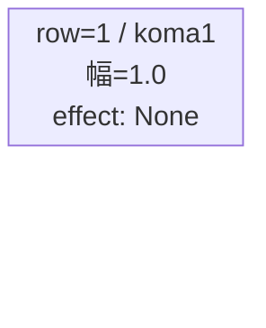
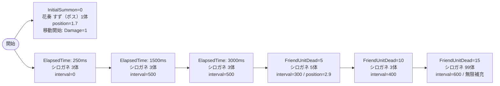

# vd_aya_boss_00001 インゲームデータ詳細解説

> 参照リポジトリ: `projects/glow-masterdata`
> リリースキー: 202604010

## インゲーム要件テキスト

開幕、ボス「花奏 すず」（`c_aya_00101_vd_Boss_Green`）が砦付近（position=1.7）に待機し、1ダメージを受けた瞬間に進軍を開始する。同時に雑魚「シロガネ」（`e_aya_00001_vd_Normal_Green`）がElapsedTime=250msで3体召喚されフィールドを埋める。その後シロガネはElapsedTime=1500ms・3000msで追加召喚（各3体）されテンポよく押し寄せる。プレイヤーが5体撃破した時点でシロガネ5体が一気に砦付近から押し寄せ（position=2.9）、10体撃破でボスと同属性の強化シロガネが3体追加される。15体撃破後はシロガネの無限補充（summon_count=99, interval=600ms）が開始し、拠点への継続的プレッシャーをかける。

コマは1行構成（bossブロック固定）。パターン1（1コマ・幅1.0）で画面全幅を使い、アセットキー `aya_00002`、背景オフセット `-1.0` を設定する。

UR対抗キャラは未選定（vd-character-list.md 記載なし）。シロガネがボスの護衛として複数フェーズで連続出現するデザインにより、ボスへの到達を妨げる堅牢な防衛ラインを形成している。

---

## レベルデザイン

### 敵キャラ設計

#### 敵キャラ選定（MstEnemyCharacter）

| mst_enemy_character_id | 日本語名 | 役割 | 備考 |
|------------------------|---------|------|------|
| `chara_aya_00101` | 花奏 すず | ボス | c_aya_00101_vd_Boss_Green を使用 |
| `enemy_aya_00001` | シロガネ | 雑魚 | e_aya_00001_vd_Normal_Green を使用 |

#### 敵キャラステータス（MstEnemyStageParameter）

> vd_all/data/MstEnemyStageParameter.csv から選出した既存レコードを使用

| MstEnemyStageParameter ID | 日本語名 | kind | role | color | base_hp | base_atk | base_spd | well_dist | knockback | combo | drop_bp |
|--------------------------|---------|------|------|-------|---------|----------|----------|-----------|-----------|-------|---------|
| `e_aya_00001_vd_Normal_Green` | シロガネ | Normal | Attack | Green | 5000 | 10 | 50 | 0.35 | 3 | 0 | 250 |
| `c_aya_00101_vd_Boss_Green` | 花奏 すず | Boss | Defense | Green | 10000 | 100 | 35 | 0.3 | 1 | 5 | 300 |

---

### コマ設計

※ columns は1つのみ。Bossブロックは1行固定。koma1 スパン合計=4（列全幅）。

| row | height | 選択パターン | コマ数 | 各幅 | 幅合計 |
|-----|--------|------------|-------|------|--------|
| 1 | 1.0 | パターン1 | 1 | 1.0 | 1.0 |

---

### 敵キャラシーケンス設計

> **c_キャラ同時出現ルール（プランナー確認済み）**: c_キャラ（`c_` プレフィックス）が複数体登場する場合、
> 初回のみ `ElapsedTime`、2体目以降は `FriendUnitDead`（前の c_キャラの sequence_element_id を
> condition_value に指定）でチェーンすること。また c_キャラの `summon_count` は必ず `1` とすること。`e_glo_*` は対象外。

#### どのフェーズで、どの敵を、いつ、どこに、どのくらい出現させるか

| elem | 出現タイミング | 敵 | 数 | 累計出現数 / 召喚位置 |
|------|-------------|---|---|-----------------|
| 1 | InitialSummon=0 | 花奏 すず（ボス） | 1 | 1 / position=1.7 |
| 2 | ElapsedTime=250ms | シロガネ | 3 | 4 / ランダム |
| 3 | ElapsedTime=1500ms | シロガネ | 3 | 7 / ランダム |
| 4 | ElapsedTime=3000ms | シロガネ | 3 | 10 / ランダム |
| 5 | FriendUnitDead=5 | シロガネ | 5 | 15 / position=2.9 |
| 6 | FriendUnitDead=10 | シロガネ | 3 | 18 / ランダム |
| 7 | FriendUnitDead=15 | シロガネ | 99（無限） | ∞ / ランダム |

#### 敵キャラの固有ステータス調整（hp_coef / atk_coef）

| フェーズ | 敵 | base_hp | hp_coef | 実HP | base_atk | atk_coef | 実ATK |
|---------|---|---------|---------|------|----------|----------|-------|
| 全フェーズ（ボス） | 花奏 すず | 10000 | 1.0 | 10000 | 100 | 1.0 | 100 |
| 序盤（elem2〜4） | シロガネ | 5000 | 1.0 | 5000 | 10 | 1.0 | 10 |
| 中盤（elem5） | シロガネ | 5000 | 1.0 | 5000 | 10 | 1.0 | 10 |
| 終盤（elem6〜7） | シロガネ | 5000 | 1.0 | 5000 | 10 | 1.0 | 10 |

> 注意: `MstInGame.normal_enemy_hp_coef` および `MstInGame.boss_enemy_hp_coef` の全体倍率と乗算される。VD標準は各 1.0。

#### フェーズ切り替えはあるか

なし（VDではSwitchSequenceGroup使用禁止）

---

## 演出

### アセット

#### 背景

| 設定箇所 | アセットキー | 備考 |
|---------|------------|------|
| MstInGame.loop_background_asset_key | （空文字） | VDブロックはデフォルト背景を使用 |

#### BGM

| 設定 | 値 | 備考 |
|-----|---|------|
| bgm_asset_key | `SSE_SBG_003_004` | bossブロック固定値 |
| boss_bgm_asset_key | （空文字） | VDではボスBGM切り替えなし |

---

### 敵キャラオーラ

| オーラ種別 | 使用箇所 |
|----------|---------|
| `Boss` | elem=1（花奏 すず：InitialSummon） |
| `Default` | elem=2〜7（シロガネ：全シーケンス） |

---

### 敵キャラ召喚アニメーション

- `InitialSummon`（elem=1）: ボス「花奏 すず」が position=1.7（砦付近）に即配置。`summon_animation_type=None`。Damage=1 を受けるまで静止し、進軍を開始する。
- `ElapsedTime`（elem=2〜4）: シロガネがランダム位置から通常召喚（`summon_animation_type=None`）。250ms・1500ms・3000ms の3段階で合計9体。
- `FriendUnitDead`（elem=5〜7）: 5体・10体・15体撃破時にシロガネが追加召喚。elem=5 は position=2.9 で砦付近からの押し込み演出。elem=7 は summon_count=99 で事実上無限補充となりゲーム終了まで継続的な圧力を維持する。

---

## MstInGame 設定サマリ

| カラム | 値 | 備考 |
|-------|---|------|
| id | `vd_aya_boss_00001` | ブロックID |
| release_key | `202604010` | リリースキー |
| content_type | `Dungeon` | VD固定 |
| stage_type | `vd_boss` | bossブロック固定 |
| mst_page_id | `vd_aya_boss_00001` | 同一ID |
| mst_enemy_outpost_id | `vd_aya_boss_00001` | 同一ID |
| boss_mst_enemy_stage_parameter_id | `c_aya_00101_vd_Boss_Green` | ボスの二重設定（MstAutoPlayerSequence InitialSummon でも設定） |
| mst_auto_player_sequence_id | `vd_aya_boss_00001` | 同一ID |
| mst_auto_player_sequence_set_id | `vd_aya_boss_00001` | sequence_set_id と一致 |
| bgm_asset_key | `SSE_SBG_003_004` | bossブロック固定 |
| boss_bgm_asset_key | （空文字） | 切り替えなし |
| loop_background_asset_key | （空文字） | デフォルト背景 |
| normal_enemy_hp_coef | `1.0` | 標準 |
| normal_enemy_attack_coef | `1.0` | 標準 |
| normal_enemy_speed_coef | `1` | 標準 |
| boss_enemy_hp_coef | `1.0` | 標準 |
| boss_enemy_attack_coef | `1.0` | 標準 |
| boss_enemy_speed_coef | `1` | 標準 |

## MstEnemyOutpost 設定サマリ

| カラム | 値 | 備考 |
|-------|---|------|
| id | `vd_aya_boss_00001` | 同一ID |
| hp | `1000` | bossブロック固定値 |
| is_damage_invalidation | （空文字） | 通常ダメージ有効 |
| artwork_asset_key | `aya_0001` | VDブロック仮値（アセット担当者要確認） |
| release_key | `202604010` | |

## MstPage 設定サマリ

| カラム | 値 |
|-------|---|
| id | `vd_aya_boss_00001` |
| release_key | `202604010` |

## MstKomaLine 設定サマリ

| カラム | 値 | 備考 |
|-------|---|------|
| id | `vd_aya_boss_00001_1` | ページID + 行番号 |
| mst_page_id | `vd_aya_boss_00001` | |
| row | `1` | bossブロックは1行固定 |
| height | `1.0` | 1行で全高を使用 |
| koma_line_layout_asset_key | `1` | パターン1（1コマフル幅） |
| koma1_asset_key | `aya_00002` | series-koma-assets.csv より |
| koma1_width | `1.0` | |
| koma1_back_ground_offset | `-1.0` | koma-background-offset.md より（aya_00002 推奨値） |
| koma1_effect_type | `None` | エフェクトなし |
| koma1_effect_parameter1 | `0` | |
| koma1_effect_parameter2 | `0` | |
| koma1_effect_target_side | `All` | |
| koma1_effect_target_colors | `All` | |
| koma1_effect_target_roles | `All` | |
| koma2_effect_type | `None` | koma2〜4 未使用でも設定必要 |
| koma3_effect_type | `None` | |
| koma4_effect_type | `None` | |
| release_key | `202604010` | |

## MstAutoPlayerSequence 設定サマリ

| id | sequence_set_id | seq_elem_id | condition_type | condition_value | action_type | action_value | summon_count | summon_interval | summon_position | move_start | move_start_value | aura | hp_coef | atk_coef | spd_coef |
|----|----------------|------------|----------------|----------------|-------------|-------------|-------------|----------------|-----------------|------------|-----------------|------|---------|----------|---------|
| vd_aya_boss_00001_1 | vd_aya_boss_00001 | 1 | InitialSummon | 0 | SummonEnemy | c_aya_00101_vd_Boss_Green | 1 | 0 | 1.7 | Damage | 1 | Boss | 1.0 | 1.0 | 1.0 |
| vd_aya_boss_00001_2 | vd_aya_boss_00001 | 2 | ElapsedTime | 250 | SummonEnemy | e_aya_00001_vd_Normal_Green | 3 | 0 | （空） | None | （空） | Default | 1.0 | 1.0 | 1.0 |
| vd_aya_boss_00001_3 | vd_aya_boss_00001 | 3 | ElapsedTime | 1500 | SummonEnemy | e_aya_00001_vd_Normal_Green | 3 | 500 | （空） | None | （空） | Default | 1.0 | 1.0 | 1.0 |
| vd_aya_boss_00001_4 | vd_aya_boss_00001 | 4 | ElapsedTime | 3000 | SummonEnemy | e_aya_00001_vd_Normal_Green | 3 | 500 | （空） | None | （空） | Default | 1.0 | 1.0 | 1.0 |
| vd_aya_boss_00001_5 | vd_aya_boss_00001 | 5 | FriendUnitDead | 5 | SummonEnemy | e_aya_00001_vd_Normal_Green | 5 | 300 | 2.9 | None | （空） | Default | 1.0 | 1.0 | 1.0 |
| vd_aya_boss_00001_6 | vd_aya_boss_00001 | 6 | FriendUnitDead | 10 | SummonEnemy | e_aya_00001_vd_Normal_Green | 3 | 400 | （空） | None | （空） | Default | 1.0 | 1.0 | 1.0 |
| vd_aya_boss_00001_7 | vd_aya_boss_00001 | 7 | FriendUnitDead | 15 | SummonEnemy | e_aya_00001_vd_Normal_Green | 99 | 600 | （空） | None | （空） | Default | 1.0 | 1.0 | 1.0 |

> 全シーケンスに共通の設定値:
> - `summon_animation_type`: `None`
> - `move_stop_condition_type`: `None`
> - `move_restart_condition_type`: `None`
> - `death_type`: `Normal`
> - `defeated_score`: `0`
> - `deactivation_condition_type`: `None`
> - `is_summon_unit_outpost_damage_invalidation`: `0`（拠点ダメージ有効）
> - `sequence_group_id`: （空）
