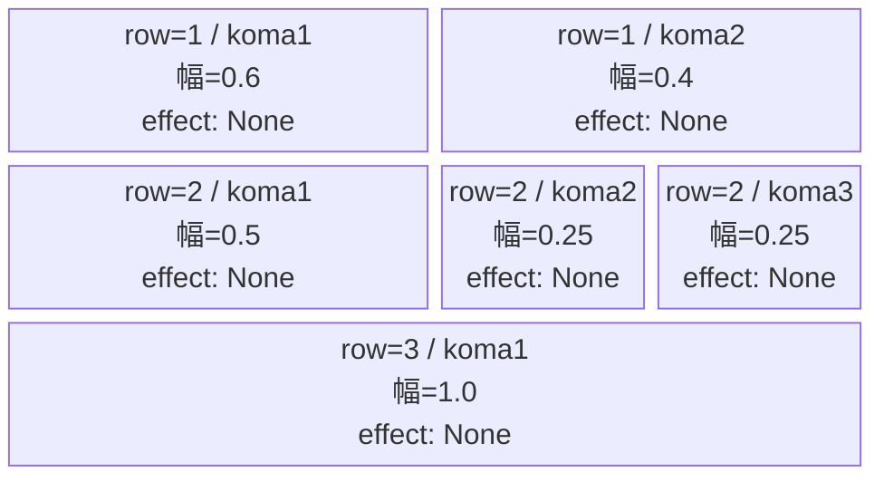
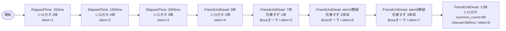

# vd_aya_normal_00001 インゲームデータ詳細解説

> 参照リポジトリ: `projects/glow-masterdata`
> リリースキー: 202604010

## インゲーム要件テキスト

あやかしトライアングル（aya）のノーマルブロック。雑魚はシロガネ（`e_aya_00001_vd_Normal_Green`）を主力とし、序盤はElapsedTimeで定期召喚、中盤以降はFriendUnitDeadトリガーで段階的に増援を送り込む設計。7体倒されるとc_キャラ（花奏 すず `c_aya_00101_vd_Boss_Green`）がボスオーラ付きで初登場し、その後も2回の追加登場チェーンで緊張感を維持する。12体倒された段階でシロガネのsummon_count=99の無限補充に移行し、終盤プレッシャーを高める。合計雑魚体数は15体以上を確保している。

コマは3行構成。row=1が2コマ（幅0.6/0.4）、row=2が3コマ（幅0.5/0.25/0.25）、row=3が1コマ（幅1.0）のバリエーションを持つ。コマアセットキーは `aya_00002`（back_ground_offset=-1.0）を使用。

UR対抗キャラは未選定（vd-character-listに記載なし）のため、c_キャラを複数チェーンで登場させる演出でゲームプレイの面白みを演出している。

---

## レベルデザイン

### 敵キャラ設計

#### 敵キャラ選定（MstEnemyCharacter）

| mst_enemy_character_id | 日本語名 | 役割 | 備考 |
|------------------------|---------|------|------|
| `enemy_aya_00001` | シロガネ | 雑魚 | vd_all CSVより `e_aya_00001_vd_Normal_Green` |
| `chara_aya_00101` | 花奏 すず | c_キャラ（ボス役） | vd_all CSVより `c_aya_00101_vd_Boss_Green`。FriendUnitDeadチェーンで複数登場 |

#### 敵キャラステータス（MstEnemyStageParameter）

> vd_all/data/MstEnemyStageParameter.csv より既存データを参照（新規追加なし）

| MstEnemyStageParameter ID | 日本語名 | kind | role | color | base_hp | base_atk | base_spd | well_dist | knockback | combo | drop_bp |
|--------------------------|---------|------|------|-------|---------|----------|----------|-----------|-----------|-------|---------|
| `e_aya_00001_vd_Normal_Green` | シロガネ | Normal | Attack | Green | 5000 | 10 | 50 | 0.35 | 3 | 0 | 250 |
| `c_aya_00101_vd_Boss_Green` | 花奏 すず | Boss | Defense | Green | 10000 | 100 | 35 | 0.3 | 1 | 5 | 300 |

---

### コマ設計

※ columns は1つのみ。各行のスパン合計 = 4。

| row | height | 選択パターン | コマ数 | 各幅 | 幅合計 |
|-----|--------|------------|-------|------|--------|
| 1 | 0.33 | パターン6（2等分左広い） | 2 | 0.6, 0.4 | 1.0 |
| 2 | 0.33 | パターン8（左広い・右2等分） | 3 | 0.5, 0.25, 0.25 | 1.0 |
| 3 | 0.34 | パターン1（1コマフル幅） | 1 | 1.0 | 1.0 |

---

### 敵キャラシーケンス設計

> **c_キャラ同時出現ルール（プランナー確認済み）**: c_キャラ（`c_` プレフィックス）が複数体登場する場合、
> 初回のみ `ElapsedTime`、2体目以降は `FriendUnitDead`（前の c_キャラの sequence_element_id を
> condition_value に指定）でチェーンすること。また c_キャラの `summon_count` は必ず `1` とすること。`e_glo_*` は対象外。

#### どのフェーズで、どの敵を、いつ、どこに、どのくらい出現させるか

| elem | 出現タイミング | 敵 | 数 | 累計出現数/召喚位置 |
|------|-------------|---|---|-----------------|
| 1 | ElapsedTime=250ms | シロガネ | 3 | 3体 / ランダム |
| 2 | ElapsedTime=1500ms | シロガネ | 4 | 7体 / ランダム |
| 3 | ElapsedTime=3000ms | シロガネ | 3 | 10体 / ランダム |
| 4 | FriendUnitDead=5 | シロガネ | 3 | 13体 / ランダム |
| 5 | ElapsedTime=5000ms | 花奏 すず | 1 | 14体（c_キャラ1体目） |
| 6 | FriendUnitDead=elem5撃破(条件値=5) | 花奏 すず | 1 | 15体（c_キャラ2体目） |
| 7 | FriendUnitDead=elem6撃破(条件値=6) | 花奏 すず | 1 | 16体（c_キャラ3体目） |
| 8 | FriendUnitDead=12 | シロガネ | 99 | 無限補充（interval=600ms） |

> ※ c_キャラの条件値は「elem5が撃破された時」= FriendUnitDeadの累計倒した数での設定。elem=5の登場時点で累計7体（雑魚10体+alpha）倒されているため、elem5を倒すと累計14体→elem6はFriendUnitDead=14、elem6倒すと15体→elem7はFriendUnitDead=15。

**c_キャラ登場タイミングの整合性:**
- elem=5: ElapsedTime=5000ms（1体目 c_aya。雑魚が10体以上出た後）
- elem=6: FriendUnitDead=14（elem5 c_ayaが倒された後に2体目登場）
- elem=7: FriendUnitDead=15（elem6 c_ayaが倒された後に3体目登場）

#### 敵キャラの固有ステータス調整（hp_coef / atk_coef）

| 波/フェーズ | 敵 | base_hp | hp_coef | 実HP | base_atk | atk_coef | 実ATK |
|-----------|---|---------|---------|------|----------|----------|-------|
| elem1〜4（雑魚序盤） | シロガネ | 5000 | 1.0 | 5000 | 10 | 1.0 | 10 |
| elem8（無限補充） | シロガネ | 5000 | 1.0 | 5000 | 10 | 1.0 | 10 |
| elem5〜7（c_キャラ） | 花奏 すず | 10000 | 1.0 | 10000 | 100 | 1.0 | 100 |

#### フェーズ切り替えはあるか

なし（VDではSwitchSequenceGroup使用禁止）

---

## 演出

### アセット

#### 背景

| 設定箇所 | アセットキー | 備考 |
|---------|------------|------|
| MstInGame.loop_background_asset_key | （空） | VD normalは背景省略 |

#### BGM

| 設定 | 値 | 備考 |
|-----|---|------|
| bgm_asset_key | `SSE_SBG_003_010` | VD normalブロック共通BGM |
| boss_bgm_asset_key | （空） | normalブロックはボスBGM切り替えなし |

---

### 敵キャラオーラ

| オーラ種別 | 使用箇所 |
|----------|---------|
| Default | シロガネ（雑魚）全般 |
| Boss | 花奏 すず（c_aya_00101、elem=5〜7）の全登場 |

---

### 敵キャラ召喚アニメーション

シロガネ（雑魚）はsummon_animation_type=None（通常召喚）。花奏 すず（c_キャラ）もsummon_animation_type=None。ボス位置（elem=5の初回登場）はsummon_position指定なし（ランダム配置）。elem=8の無限補充はsummon_interval=600msで1体ずつ定期召喚。
