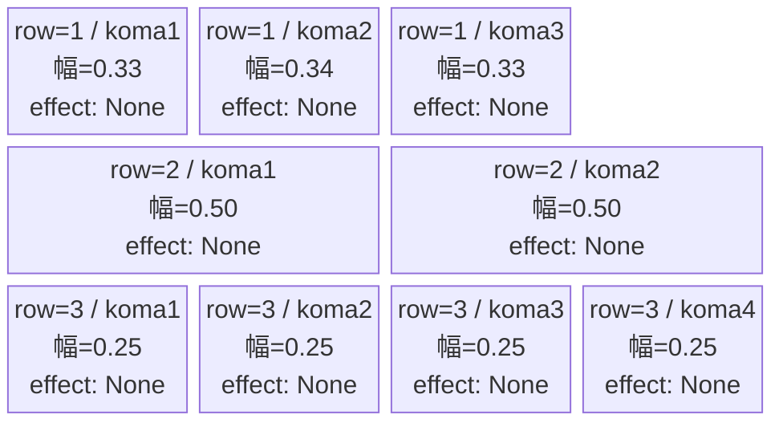
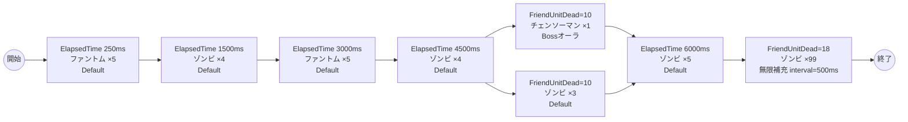

# vd_chi_normal_00001 インゲームデータ詳細解説

> 参照リポジトリ: `projects/glow-masterdata`
> リリースキー: 202604010

## インゲーム要件テキスト

ファントム（Colorless/Attack・HP5,000・ATK100・SPD34）が開幕250msと3,000msに各5体ずつ、ゾンビ（Blue/Defense・HP5,000・ATK320・SPD35）が1,500ms・4,500msに各4体ずつ出現する序中盤構成（合計18体）。10体撃破を機に悪魔が恐れる悪魔 チェンソーマン（c_chi_00002・Boss/Technical/Blue・HP400,000）がBossオーラで1体登場し、同タイミングでゾンビ3体が追加される。さらに6,000msに追加ゾンビ5体が出現し、18体撃破後はゾンビ（Blue）が interval=500ms の無限補充（summon_count=99）へ移行する。合計確定出現数27体＋無限補充。ゾンビ・チェンソーマンともにBlue属性であるため、Blue対策コマが有効になる設計。

コマは3行固定（各行独立抽選）。row1=3等分3コマ（0.33, 0.34, 0.33）・row2=2等分2コマ（0.50, 0.50）・row3=4等分4コマ（0.25×4）。幅パターンを行ごとに変化させることで、コマ組みの自由度を高めている。コマアセット: glo_00016（back_ground_offset: 0.0）。

UR対抗キャラ「悪魔が恐れる悪魔 チェンソーマン」（chara_chi_00002）対抗。Blue/Defenseのゾンビが主軸となり、Blue属性対策コマを活用したプレイが有効になる設計。FriendUnitDead=10 でチェンソーマンが突如Bossオーラで登場する中盤以降の緊張感が演出の核。

---

## レベルデザイン

### 敵キャラ設計

#### 敵キャラ選定（MstEnemyCharacter）

| mst_enemy_character_id | 日本語名 | 役割 | 備考 |
|------------------------|---------|------|------|
| enemy_chi_00101 | ゾンビ | 雑魚 | Blue属性・Defenseロール。チェンソーマン作品の登場敵 |
| enemy_glo_00001 | ファントム | 雑魚（共通） | Colorless属性・Attackロール |
| chara_chi_00002 | 悪魔が恐れる悪魔 チェンソーマン | c_キャラ（ボス級） | Blue属性・TechnicalロールのUR対抗キャラ。FriendUnitDead=10 で登場 |

#### 敵キャラステータス（MstEnemyStageParameter）

> 全エントリ既存参照: `vd_all/data/MstEnemyStageParameter.csv`（release_key: 202604010）

| MstEnemyStageParameter ID | 日本語名 | character_unit_kind | role_type | color | hp | attack_power | move_speed | well_distance | damage_knock_back_count | attack_combo_cycle | drop_battle_point |
|--------------------------|---------|---------------------|-----------|-------|----|-------------|-----------|---------------|------------------------|-------------------|------------------|
| e_chi_00101_vd_Normal_Blue | ゾンビ | Normal | Defense | Blue | 5,000 | 320 | 35 | 0.11 | 1 | 1 | 50 |
| e_glo_00001_vd_Normal_Colorless | ファントム | Normal | Attack | Colorless | 5,000 | 100 | 34 | 0.22 | 3 | 1 | 150 |
| c_chi_00002_vd_Boss_Blue | 悪魔が恐れる悪魔 チェンソーマン | Boss | Technical | Blue | 400,000 | 450 | 50 | 0.15 | 2 | 5 | 50 |

---

### コマ設計

各行独立ランダム抽選（12パターンから）の結果（`koma1_asset_key`: `glo_00016`、`koma1_back_ground_offset`: `0.0`）:

| row | height | 選択パターン | コマ数 | 各幅 | 幅合計 | koma1_asset_key | koma1_back_ground_offset |
|-----|--------|------------|-------|------|--------|----------------|-------------------------|
| 1 | 0.33 | パターン7「3等分」 | 3コマ | 0.33, 0.34, 0.33 | 1.0 | glo_00016 | 0.0 |
| 2 | 0.33 | パターン6「2等分」 | 2コマ | 0.50, 0.50 | 1.0 | glo_00016 | 0.0 |
| 3 | 0.34 | パターン12「4等分」 | 4コマ | 0.25, 0.25, 0.25, 0.25 | 1.0 | glo_00016 | 0.0 |

---

### 敵キャラシーケンス設計

> **c_キャラ同時出現ルール（プランナー確認済み）**: c_キャラ（`c_` プレフィックス）が複数体登場する場合、
> 初回のみ `ElapsedTime`、2体目以降は `FriendUnitDead`（前の c_キャラの sequence_element_id を
> condition_value に指定）でチェーンすること。また c_キャラの `summon_count` は必ず `1` とすること。`e_glo_*` は対象外。

#### どのフェーズで、どの敵を、いつ、どこに、どのくらい出現させるか

| elem | 出現タイミング | 敵 | 数 | 累計出現数 |
|------|-------------|---|---|---------|
| 1 | ElapsedTime 250ms | ファントム (e_glo_00001_vd_Normal_Colorless) | 5 | 5 |
| 2 | ElapsedTime 1500ms | ゾンビ (e_chi_00101_vd_Normal_Blue) | 4 | 9 |
| 3 | ElapsedTime 3000ms | ファントム (e_glo_00001_vd_Normal_Colorless) | 5 | 14 |
| 4 | ElapsedTime 4500ms | ゾンビ (e_chi_00101_vd_Normal_Blue) | 4 | 18 |
| 5 | FriendUnitDead=10 | 悪魔が恐れる悪魔 チェンソーマン (c_chi_00002_vd_Boss_Blue) | 1 | 19 |
| 6 | FriendUnitDead=10 | ゾンビ (e_chi_00101_vd_Normal_Blue) | 3 | 22 |
| 7 | ElapsedTime 6000ms | ゾンビ (e_chi_00101_vd_Normal_Blue) | 5 | 27 |
| 8 | FriendUnitDead=18 | ゾンビ (e_chi_00101_vd_Normal_Blue) | 99（無限補充） | 27＋無限 |

合計（確定分）: **27体**（要件「最低15体以上」を満たす）

> **c_キャラ召喚ガードレール確認**: c_キャラは `c_chi_00002_vd_Boss_Blue` の1体のみ（elem5）。`summon_count=1` で FriendUnitDead=10 のトリガーで1体召喚。2体目以降の c_キャラ召喚はないため、チェーン制約は適用対象外。

#### 敵キャラの固有ステータス調整（hp_coef / atk_coef）

MstAutoPlayerSequenceの `enemy_hp_coef` / `enemy_attack_coef` はすべてデフォルト値（1.0）を使用します。

| 波 | 敵 | hp | hp_coef | 実HP | attack_power | atk_coef | 実ATK |
|---|---|-----|---------|------|-------------|----------|-------|
| 1 | ファントム | 5,000 | 1.0 | 5,000 | 100 | 1.0 | 100 |
| 2 | ゾンビ | 5,000 | 1.0 | 5,000 | 320 | 1.0 | 320 |
| 3 | ファントム | 5,000 | 1.0 | 5,000 | 100 | 1.0 | 100 |
| 4 | ゾンビ | 5,000 | 1.0 | 5,000 | 320 | 1.0 | 320 |
| 5 | チェンソーマン | 400,000 | 1.0 | 400,000 | 450 | 1.0 | 450 |
| 6 | ゾンビ | 5,000 | 1.0 | 5,000 | 320 | 1.0 | 320 |
| 7 | ゾンビ | 5,000 | 1.0 | 5,000 | 320 | 1.0 | 320 |
| 8 | ゾンビ（無限補充） | 5,000 | 1.0 | 5,000 | 320 | 1.0 | 320 |

#### フェーズ切り替えはあるか

なし（VDではSwitchSequenceGroup使用禁止）

---

## 演出

### アセット

#### 背景

| 設定箇所 | アセットキー | 備考 |
|---------|------------|------|
| loop_background_asset_key | （空） | VDの背景切り替えはゲームロジック側で管理 |
| フロア0以上 | koma_background_vd_00001 | クライアント側でフロア係数に応じて切り替え |
| フロア20以上 | koma_background_vd_00003 | 同上 |
| フロア40以上 | koma_background_vd_00005 | 同上 |

#### BGM

| 設定 | 値 | 備考 |
|-----|---|------|
| bgm_asset_key | SSE_SBG_003_010 | ノーマルブロック用BGM |
| boss_bgm_asset_key | （空） | ノーマルブロックはボスBGMなし |

---

### 敵キャラオーラ

| オーラ種別 | 使用箇所 |
|----------|---------|
| Default | ゾンビ・ファントム（全雑魚行） |
| Boss | チェンソーマン（elem5、FriendUnitDead=10 で登場） |

---

### 敵キャラ召喚アニメーション

序盤〜中盤はElapsedTimeトリガーによるSummonEnemy召喚（summon_animation_type=None）。FriendUnitDead=10 のタイミングで悪魔が恐れる悪魔 チェンソーマンがBossオーラつきで1体登場し、同タイミングでゾンビ3体が同時追加されるプレッシャー演出。FriendUnitDead=18 以降はゾンビ（Blue）が interval=500ms で継続的に召喚される終盤無限補充フェーズに移行する。

---

## 生成テーブルまとめ

| テーブル | 状態 | 備考 |
|---------|------|------|
| MstEnemyStageParameter | 既存参照 | `vd_all/data/MstEnemyStageParameter.csv` のエントリを使用（新規生成なし） |
| MstEnemyOutpost | 新規生成 | HP=100固定、is_damage_invalidation=空、id=vd_chi_normal_00001 |
| MstPage | 新規生成 | id=vd_chi_normal_00001 |
| MstKomaLine | 新規生成 | 3行固定（row=1〜3）、パターン7/6/12 |
| MstAutoPlayerSequence | 新規生成 | 8要素（確定27体＋無限補充、sequence_set_id=vd_chi_normal_00001） |
| MstInGame | 新規生成 | content_type=Dungeon、stage_type=vd_normal、ボスなし（boss_mst_enemy_stage_parameter_id=空文字）、release_key=202604010 |

---

## ID一覧

| テーブル | カラム | 値 |
|---------|--------|-----|
| MstInGame | id | vd_chi_normal_00001 |
| MstAutoPlayerSequence | sequence_set_id | vd_chi_normal_00001 |
| MstPage | id | vd_chi_normal_00001 |
| MstEnemyOutpost | id | vd_chi_normal_00001 |
| MstKomaLine | id（row1） | vd_chi_normal_00001_1 |
| MstKomaLine | id（row2） | vd_chi_normal_00001_2 |
| MstKomaLine | id（row3） | vd_chi_normal_00001_3 |
| MstAutoPlayerSequence | id（elem1） | vd_chi_normal_00001_1 |
| MstAutoPlayerSequence | id（elem2） | vd_chi_normal_00001_2 |
| MstAutoPlayerSequence | id（elem3） | vd_chi_normal_00001_3 |
| MstAutoPlayerSequence | id（elem4） | vd_chi_normal_00001_4 |
| MstAutoPlayerSequence | id（elem5） | vd_chi_normal_00001_5 |
| MstAutoPlayerSequence | id（elem6） | vd_chi_normal_00001_6 |
| MstAutoPlayerSequence | id（elem7） | vd_chi_normal_00001_7 |
| MstAutoPlayerSequence | id（elem8） | vd_chi_normal_00001_8 |
