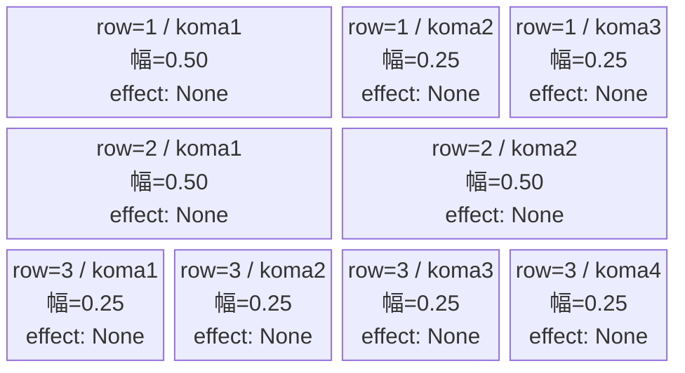
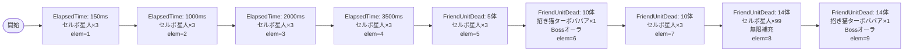

# vd_dan_normal_00001 インゲームデータ詳細解説

> 参照リポジトリ: `projects/glow-masterdata`
> リリースキー: 202604010

## インゲーム要件テキスト

セルポ星人（`e_dan_00001_vd_Normal_Red`）が開幕から中盤にかけて時間差で押し寄せ、一定数撃破すると招き猫 ターボババア（`c_dan_00301_vd_Boss_Red`）がBossオーラつきで登場する設計。セルポ星人は倒すほど追加補充が続き、最終的にはセルポ星人とターボババアが同時に無限補充される終盤ラッシュへと移行する。UR対抗キャラ「ターボババアの霊力 オカルン」（`chara_dan_00002`）を持つプレイヤーへの対抗として、Redカラーの敵が揃いオカルンのカラー相性ボーナスを意識した配置となっている。

コマは3行構成で、各行独立したパターンでランダム抽選。行1はパターン8（3コマ：左広め0.50/0.25/0.25）、行2はパターン6（2コマ：均等0.50/0.50）、行3はパターン12（4コマ：4等分0.25/0.25/0.25/0.25）とした。コマアセットキーは `dan_00007`（背景オフセット 0.6）を使用。

---

## レベルデザイン

### 敵キャラ設計

#### 敵キャラ選定（MstEnemyCharacter）

| mst_enemy_character_id | 日本語名 | 役割 | 備考 |
|------------------------|---------|------|------|
| `enemy_dan_00001` | セルポ星人 | 雑魚 | `vd_all` CSVに `e_dan_00001_vd_Normal_Red` として定義済み |
| `chara_dan_00301` | 招き猫 ターボババア | 強化ボス（c_キャラ） | `vd_all` CSVに `c_dan_00301_vd_Boss_Red` として定義済み |

#### 敵キャラステータス（MstEnemyStageParameter）

> 既存参照（`vd_all/data/MstEnemyStageParameter.csv`より）

| MstEnemyStageParameter ID | 日本語名 | kind | role | color | base_hp | base_atk | base_spd | well_dist | knockback | combo | drop_bp |
|--------------------------|---------|------|------|-------|---------|----------|----------|-----------|-----------|-------|---------|
| `e_dan_00001_vd_Normal_Red` | セルポ星人 | Normal | Defense | Red | 10000 | 50 | 34 | 0.24 | 0 | 1 | 100 |
| `c_dan_00301_vd_Boss_Red` | 招き猫 ターボババア | Boss | Attack | Red | 50000 | 300 | 30 | 0.25 | 3 | 4 | 200 |

---

### コマ設計

※ columns は1つのみ（4）。各行のスパン合計 = 4。

| row | height | 選択パターン | コマ数 | 各幅 | 幅合計 |
|-----|--------|------------|-------|------|--------|
| 1 | 0.33 | パターン8 | 3 | 0.50, 0.25, 0.25 | 1.0 |
| 2 | 0.33 | パターン6 | 2 | 0.50, 0.50 | 1.0 |
| 3 | 0.34 | パターン12 | 4 | 0.25, 0.25, 0.25, 0.25 | 1.0 |

---

### 敵キャラシーケンス設計

> **c_キャラ同時出現ルール（プランナー確認済み）**: c_キャラ（`c_` プレフィックス）が複数体登場する場合、
> 初回のみ `ElapsedTime`、2体目以降は `FriendUnitDead`（前の c_キャラの sequence_element_id を
> condition_value に指定）でチェーンすること。また c_キャラの `summon_count` は必ず `1` とすること。`e_glo_*` は対象外。

#### どのフェーズで、どの敵を、いつ、どこに、どのくらい出現させるか

| elem | 出現タイミング | 敵 | 数 | 累計出現数/召喚位置 |
|------|-------------|---|---|-----------------|
| 1 | ElapsedTime=150 | セルポ星人 | 3（interval=300） | 累計3体 |
| 2 | ElapsedTime=1000 | セルポ星人 | 3（interval=300） | 累計6体 |
| 3 | ElapsedTime=2000 | セルポ星人 | 3（interval=300） | 累計9体 |
| 4 | ElapsedTime=3500 | セルポ星人 | 3（interval=300） | 累計12体 |
| 5 | FriendUnitDead=5 | セルポ星人 | 3（interval=300） | +3体追加 |
| 6 | FriendUnitDead=10 | 招き猫 ターボババア | 1（summon_count=1） | position=1.7 / Bossオーラ |
| 7 | FriendUnitDead=10 | セルポ星人 | 3（interval=300） | 同タイミング elem=6と並列 |
| 8 | FriendUnitDead=14 | セルポ星人 | 99（interval=750） | 無限補充スタート |
| 9 | FriendUnitDead=14 | 招き猫 ターボババア | 1（summon_count=1） | Bossオーラ / FriendUnitDead=14で elem=8と並列 |

**設計のポイント**:
- `ElapsedTime` の4波で開幕〜中盤を形成。セルポ星人が interval=300ms で3体ずつ次々と登場する
- `FriendUnitDead=5` で中盤補充。倒すほど続く「波」の演出
- `FriendUnitDead=10` でターボババアがBossオーラつきで砦付近（position=1.7）に登場、同タイミングでセルポ星人も3体追加
- `FriendUnitDead=14` で終盤無限補充（セルポ星人 summon_count=99、interval=750ms）とターボババア再出現が同時に発動
- 合計確定出現数（elem1〜7）: セルポ星人3+3+3+3+3+3=18体 + ターボババア×1体 = 19体（15体以上の制約クリア）

#### 敵キャラの固有ステータス調整（hp_coef / atk_coef）

| 波/フェーズ | 敵 | base_hp | hp_coef | 実HP | base_atk | atk_coef | 実ATK |
|-----------|---|---------|---------|------|----------|----------|-------|
| 全フェーズ（elem1〜7） | セルポ星人 | 10000 | 1.0 | 10000 | 50 | 1.0 | 50 |
| FriendUnitDead=10（elem6） | 招き猫 ターボババア | 50000 | 1.0 | 50000 | 300 | 1.0 | 300 |
| 無限補充（elem8） | セルポ星人 | 10000 | 1.0 | 10000 | 50 | 1.0 | 50 |
| FriendUnitDead=14（elem9） | 招き猫 ターボババア | 50000 | 1.0 | 50000 | 300 | 1.0 | 300 |

MstInGame の `normal_enemy_hp_coef = 1.0`、`normal_enemy_attack_coef = 1.0`。

#### フェーズ切り替えはあるか

なし（VDではSwitchSequenceGroup使用禁止）

---

## 演出

### アセット

#### 背景

| 設定箇所 | アセットキー | 備考 |
|---------|------------|------|
| MstInGame.loop_background_asset_key | （空） | VD normalは背景省略 |

#### BGM

| 設定 | 値 | 備考 |
|-----|---|------|
| bgm_asset_key | `SSE_SBG_003_010` | normalブロック固定値 |
| boss_bgm_asset_key | （空） | normalブロックではボスBGM切り替えなし |

---

### 敵キャラオーラ

| オーラ種別 | 使用箇所 |
|----------|---------|
| Default | セルポ星人（全elem） |
| Boss | 招き猫 ターボババア（elem=6, 9） |

---

### 敵キャラ召喚アニメーション

`summon_animation_type` は全行 `None`（VD固定値）。

招き猫 ターボババア（elem=6）は `position=1.7` に配置し、`move_start_condition_type=None`（召喚と同時に移動開始）。FriendUnitDead=10体撃破後にBossオーラで出現し、プレイヤーに緊張感を与える。FriendUnitDead=14体到達後（elem=9）は再度ターボババアが補充登場し、セルポ星人の無限補充と同時に最終圧力をかける。

---

## テーブルデータサマリ

### MstInGame

| カラム | 値 |
|-------|---|
| id | `vd_dan_normal_00001` |
| release_key | `202604010` |
| content_type | `Dungeon` |
| stage_type | `vd_normal` |
| mst_page_id | `vd_dan_normal_00001` |
| mst_enemy_outpost_id | `vd_dan_normal_00001` |
| boss_mst_enemy_stage_parameter_id | （空） |
| mst_auto_player_sequence_id | `vd_dan_normal_00001` |
| mst_auto_player_sequence_set_id | `vd_dan_normal_00001` |
| bgm_asset_key | `SSE_SBG_003_010` |
| boss_bgm_asset_key | （空） |
| loop_background_asset_key | （空） |
| normal_enemy_hp_coef | `1.0` |
| normal_enemy_attack_coef | `1.0` |
| normal_enemy_speed_coef | `1.0` |
| boss_enemy_hp_coef | `1.0` |
| boss_enemy_attack_coef | `1.0` |
| boss_enemy_speed_coef | `1.0` |

### MstPage

| カラム | 値 |
|-------|---|
| id | `vd_dan_normal_00001` |
| release_key | `202604010` |

### MstEnemyOutpost

| カラム | 値 |
|-------|---|
| id | `vd_dan_normal_00001` |
| hp | `100` |
| is_damage_invalidation | （空） |
| outpost_asset_key | （空） |
| artwork_asset_key | （要確認） |
| release_key | `202604010` |

### MstKomaLine（3行）

| id | mst_page_id | row | height | koma_line_layout_asset_key | koma1_asset_key | koma1_width | koma1_back_ground_offset | koma1_effect_type | koma1_effect_parameter1 | koma1_effect_parameter2 | koma1_effect_target_side | koma1_effect_target_colors | koma1_effect_target_roles |
|----|------------|-----|--------|--------------------------|----------------|-------------|------------------------|-------------------|------------------------|------------------------|------------------------|--------------------------|--------------------------|
| `vd_dan_normal_00001_1` | `vd_dan_normal_00001` | 1 | 0.33 | 8 | `dan_00007` | 0.50 | 0.6 | None | 0 | 0 | All | All | All |
| `vd_dan_normal_00001_2` | `vd_dan_normal_00001` | 2 | 0.33 | 6 | `dan_00007` | 0.50 | 0.6 | None | 0 | 0 | All | All | All |
| `vd_dan_normal_00001_3` | `vd_dan_normal_00001` | 3 | 0.34 | 12 | `dan_00007` | 0.25 | 0.6 | None | 0 | 0 | All | All | All |

行2: koma2_asset_key=`dan_00007`, koma2_width=0.50, koma2_effect_type=None
行1: koma2_asset_key=`dan_00007`, koma2_width=0.25, koma2_effect_type=None / koma3_asset_key=`dan_00007`, koma3_width=0.25, koma3_effect_type=None
行3: koma2〜4_asset_key=`dan_00007`, 各width=0.25, 各effect_type=None

### MstAutoPlayerSequence（9行）

| id | sequence_set_id | sequence_element_id | condition_type | condition_value | action_type | action_value | summon_count | summon_interval | summon_position | aura_type | death_type | enemy_hp_coef | enemy_attack_coef | enemy_speed_coef | defeated_score | summon_animation_type | move_start_condition_type | move_stop_condition_type | move_restart_condition_type |
|----|----------------|--------------------|----|----|----|----|----|----|----|----|----|----|----|----|----|----|----|----|----|
| `vd_dan_normal_00001_1` | `vd_dan_normal_00001` | 1 | ElapsedTime | 150 | SummonEnemy | `e_dan_00001_vd_Normal_Red` | 3 | 300 | | Default | Normal | 1.0 | 1.0 | 1.0 | 0 | None | None | None | None |
| `vd_dan_normal_00001_2` | `vd_dan_normal_00001` | 2 | ElapsedTime | 1000 | SummonEnemy | `e_dan_00001_vd_Normal_Red` | 3 | 300 | | Default | Normal | 1.0 | 1.0 | 1.0 | 0 | None | None | None | None |
| `vd_dan_normal_00001_3` | `vd_dan_normal_00001` | 3 | ElapsedTime | 2000 | SummonEnemy | `e_dan_00001_vd_Normal_Red` | 3 | 300 | | Default | Normal | 1.0 | 1.0 | 1.0 | 0 | None | None | None | None |
| `vd_dan_normal_00001_4` | `vd_dan_normal_00001` | 4 | ElapsedTime | 3500 | SummonEnemy | `e_dan_00001_vd_Normal_Red` | 3 | 300 | | Default | Normal | 1.0 | 1.0 | 1.0 | 0 | None | None | None | None |
| `vd_dan_normal_00001_5` | `vd_dan_normal_00001` | 5 | FriendUnitDead | 5 | SummonEnemy | `e_dan_00001_vd_Normal_Red` | 3 | 300 | | Default | Normal | 1.0 | 1.0 | 1.0 | 0 | None | None | None | None |
| `vd_dan_normal_00001_6` | `vd_dan_normal_00001` | 6 | FriendUnitDead | 10 | SummonEnemy | `c_dan_00301_vd_Boss_Red` | 1 | 0 | 1.7 | Boss | Normal | 1.0 | 1.0 | 1.0 | 0 | None | None | None | None |
| `vd_dan_normal_00001_7` | `vd_dan_normal_00001` | 7 | FriendUnitDead | 10 | SummonEnemy | `e_dan_00001_vd_Normal_Red` | 3 | 300 | | Default | Normal | 1.0 | 1.0 | 1.0 | 0 | None | None | None | None |
| `vd_dan_normal_00001_8` | `vd_dan_normal_00001` | 8 | FriendUnitDead | 14 | SummonEnemy | `e_dan_00001_vd_Normal_Red` | 99 | 750 | | Default | Normal | 1.0 | 1.0 | 1.0 | 0 | None | None | None | None |
| `vd_dan_normal_00001_9` | `vd_dan_normal_00001` | 9 | FriendUnitDead | 14 | SummonEnemy | `c_dan_00301_vd_Boss_Red` | 1 | 0 | | Boss | Normal | 1.0 | 1.0 | 1.0 | 0 | None | None | None | None |
