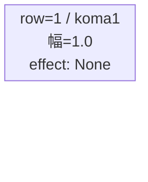
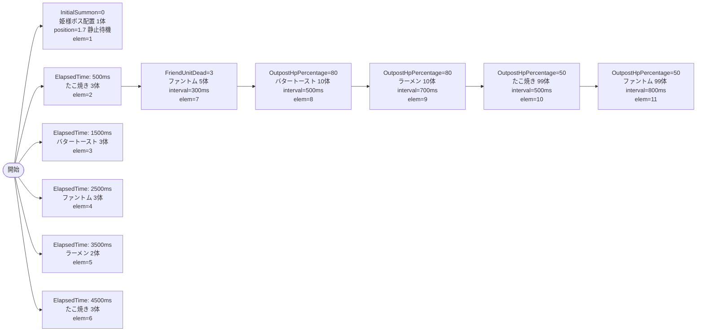

# vd_gom_boss_00001 インゲームデータ詳細解説

> 参照リポジトリ: `projects/glow-masterdata`
> リリースキー: 202604010

## インゲーム要件テキスト

ボスキャラとして「囚われの王女 姫様」（`c_gom_00001_vd_Boss_Yellow`、Yellow/Defense）が開始直後に砦付近に配置され、ダメージを受けるまで静止する。雑魚として「たこ焼き」（`e_gom_00501_vd_Normal_Yellow`）・「バタートースト」（`e_gom_00402_vd_Normal_Yellow`）・「ラーメン」（`e_gom_00701_vd_Normal_Yellow`）・「ファントム」（`e_glo_00001_vd_Normal_Colorless`）の4種が登場。ElapsedTimeで序盤に食べ物系キャラが定期的に押し寄せ、FriendUnitDead=3体で姫様専用対抗ファントムが出現、OutpostHpPercentage=80で拠点ダメージが入ると食べ物系が大量ラッシュ、OutpostHpPercentage=50で強化食べ物系99体の無限補充が始まる。UR対抗キャラ「囚われの王女 姫様」（`chara_gom_00001`）に対応し、Defense ロールを持つボスキャラがプレッシャーをかける設計。

コマは1行構成（bossブロック固定）で、パターン1（1コマ全幅）を使用。アセットキーは `gom_00003`。

---

## レベルデザイン

### 敵キャラ設計

#### 敵キャラ選定（MstEnemyCharacter）

| mst_enemy_character_id | 日本語名 | 役割 | 備考 |
|------------------------|---------|------|------|
| `chara_gom_00001` | 囚われの王女 姫様 | ボス | UR対抗。Defense/Yellow。`c_gom_00001_vd_Boss_Yellow` を使用 |
| `enemy_gom_00501` | たこ焼き | 雑魚 | Defense/Yellow。`e_gom_00501_vd_Normal_Yellow` を使用 |
| `enemy_gom_00402` | バタートースト | 雑魚 | Attack/Yellow。`e_gom_00402_vd_Normal_Yellow` を使用 |
| `enemy_gom_00701` | ラーメン | 雑魚 | Attack/Yellow。`e_gom_00701_vd_Normal_Yellow` を使用 |
| `enemy_glo_00001` | ファントム | 雑魚 | Attack/Colorless。`e_glo_00001_vd_Normal_Colorless` を使用 |

#### 敵キャラステータス（MstEnemyStageParameter）

> VD専用CSVから既存参照（`vd_all/data/MstEnemyStageParameter.csv`）

| MstEnemyStageParameter ID | 日本語名 | kind | role | color | base_hp | base_atk | base_spd | well_dist | knockback | combo | drop_bp |
|--------------------------|---------|------|------|-------|---------|----------|----------|-----------|-----------|-------|---------|
| `c_gom_00001_vd_Boss_Yellow` | 囚われの王女 姫様 | Boss | Defense | Yellow | 10000 | 50 | 25 | 0.16 | 1 | 6 | 500 |
| `e_gom_00501_vd_Normal_Yellow` | たこ焼き | Normal | Defense | Yellow | 1000 | 50 | 34 | 0.14 | 0 | 1 | 200 |
| `e_gom_00402_vd_Normal_Yellow` | バタートースト | Normal | Attack | Yellow | 1000 | 50 | 34 | 0.11 | 0 | 1 | 100 |
| `e_gom_00701_vd_Normal_Yellow` | ラーメン | Normal | Attack | Yellow | 10000 | 50 | 34 | 0.11 | 0 | 1 | 100 |
| `e_glo_00001_vd_Normal_Colorless` | ファントム | Normal | Attack | Colorless | 5000 | 100 | 34 | 0.22 | 3 | 1 | 150 |

---

### コマ設計

| row | height | 選択パターン | コマ数 | 各幅 | 幅合計 |
|-----|--------|------------|-------|------|--------|
| 1 | 1.0 | パターン1 | 1 | 1.0 | 1.0 |

※ bossブロックはコマライン1行固定。

---

### 敵キャラシーケンス設計

> **c_キャラ同時出現ルール（プランナー確認済み）**: c_キャラ（`c_` プレフィックス）が複数体登場する場合、
> 初回のみ `ElapsedTime`、2体目以降は `FriendUnitDead`（前の c_キャラの sequence_element_id を
> condition_value に指定）でチェーンすること。また c_キャラの `summon_count` は必ず `1` とすること。`e_glo_*` は対象外。

#### どのフェーズで、どの敵を、いつ、どこに、どのくらい出現させるか

| elem | 出現タイミング | 敵 | 数 | 召喚位置 |
|------|-------------|---|---|-----------------|
| 1 | InitialSummon=0 | 囚われの王女 姫様（ボス） | 1 | position=1.7（砦付近、Damage受けるまで静止） |
| 2 | ElapsedTime=500ms | たこ焼き | 3 | デフォルト |
| 3 | ElapsedTime=1500ms | バタートースト | 3 | デフォルト |
| 4 | ElapsedTime=2500ms | ファントム | 3 | デフォルト |
| 5 | ElapsedTime=3500ms | ラーメン | 2 | デフォルト |
| 6 | ElapsedTime=4500ms | たこ焼き | 3 | デフォルト |
| 7 | FriendUnitDead=3 | ファントム | 5（interval=300ms） | デフォルト |
| 8 | OutpostHpPercentage=80 | バタートースト | 10（interval=500ms） | デフォルト |
| 9 | OutpostHpPercentage=80 | ラーメン | 10（interval=700ms） | デフォルト |
| 10 | OutpostHpPercentage=50 | たこ焼き | 99（interval=500ms） | デフォルト |
| 11 | OutpostHpPercentage=50 | ファントム | 99（interval=800ms） | デフォルト |

#### 敵キャラの固有ステータス調整（hp_coef / atk_coef）

| 波/フェーズ | 敵 | base_hp | hp_coef | 実HP | base_atk | atk_coef | 実ATK |
|-----------|---|---------|---------|------|----------|----------|-------|
| ボス（elem1） | 囚われの王女 姫様 | 10000 | 1.0 | 10000 | 50 | 1.0 | 50 |
| 序盤（elem2〜6） | たこ焼き | 1000 | 1.0 | 1000 | 50 | 1.0 | 50 |
| 序盤（elem3） | バタートースト | 1000 | 1.0 | 1000 | 50 | 1.0 | 50 |
| 序盤（elem4） | ファントム | 5000 | 1.0 | 5000 | 100 | 1.0 | 100 |
| 序盤（elem5） | ラーメン | 10000 | 1.0 | 10000 | 50 | 1.0 | 50 |
| 中盤（elem7） | ファントム | 5000 | 1.0 | 5000 | 100 | 1.0 | 100 |
| 拠点ダメージ時（elem8〜9） | バタートースト/ラーメン | 1000/10000 | 1.0 | 1000/10000 | 50 | 1.0 | 50 |
| 終盤無限（elem10〜11） | たこ焼き/ファントム | 1000/5000 | 1.0 | 1000/5000 | 50/100 | 1.0 | 50/100 |

#### フェーズ切り替えはあるか

なし（VDではSwitchSequenceGroup使用禁止）

---

## 演出

### アセット

#### 背景

| 設定箇所 | アセットキー | 備考 |
|---------|------------|------|
| MstInGame.loop_background_asset_key | （空） | VDブロックは空文字でデフォルト背景を適用 |

#### BGM

| 設定 | 値 | 備考 |
|-----|---|------|
| bgm_asset_key | `SSE_SBG_003_004` | bossブロック固定BGM |
| boss_bgm_asset_key | （空） | 追加のボスBGM切り替えなし |

---

### 敵キャラオーラ

| オーラ種別 | 使用箇所 |
|----------|---------|
| `Boss` | elem=1（囚われの王女 姫様、ボスオーラ） |
| `Default` | elem=2〜11（全雑魚） |

---

### 敵キャラ召喚アニメーション

- elem=1（姫様ボス）: `InitialSummon=0` で `summon_position=1.7` に配置。`move_start_condition_type=Damage`、`move_start_condition_value=1` により、1ダメージを受けるまで砦付近で静止する。
- elem=2〜11（雑魚・ファントム）: `summon_animation_type=None`、デフォルト位置に順次召喚。

---

## MstInGame 設計

| カラム | 値 |
|-------|---|
| id | `vd_gom_boss_00001` |
| release_key | `202604010` |
| content_type | `Dungeon` |
| stage_type | `vd_boss` |
| bgm_asset_key | `SSE_SBG_003_004` |
| boss_bgm_asset_key | （空） |
| loop_background_asset_key | （空） |
| mst_page_id | `vd_gom_boss_00001` |
| mst_enemy_outpost_id | `vd_gom_boss_00001` |
| mst_defense_target_id | NULL |
| boss_mst_enemy_stage_parameter_id | `c_gom_00001_vd_Boss_Yellow` |
| boss_count | NULL |
| mst_auto_player_sequence_id | `vd_gom_boss_00001` |
| mst_auto_player_sequence_set_id | `vd_gom_boss_00001` |
| normal_enemy_hp_coef | `1.0` |
| normal_enemy_attack_coef | `1.0` |
| normal_enemy_speed_coef | `1` |
| boss_enemy_hp_coef | `1.0` |
| boss_enemy_attack_coef | `1.0` |
| boss_enemy_speed_coef | `1` |

---

## MstEnemyOutpost 設計

| カラム | 値 |
|-------|---|
| id | `vd_gom_boss_00001` |
| hp | `1000`（bossブロック固定） |
| is_damage_invalidation | （空） |
| outpost_asset_key | （空） |
| artwork_asset_key | （空。アセット担当者に確認推奨） |
| release_key | `202604010` |

---

## MstPage 設計

| カラム | 値 |
|-------|---|
| id | `vd_gom_boss_00001` |
| release_key | `202604010` |

---

## MstKomaLine 設計（1行固定）

| カラム | 値 |
|-------|---|
| id | `vd_gom_boss_00001_1` |
| mst_page_id | `vd_gom_boss_00001` |
| row | `1` |
| height | `1.0` |
| koma_line_layout_asset_key | `1` |
| koma1_asset_key | `gom_00003` |
| koma1_width | `1.0` |
| koma1_back_ground_offset | `0.6` |
| koma1_effect_type | `None` |
| koma1_effect_parameter1 | `0` |
| koma1_effect_parameter2 | `0` |
| koma1_effect_target_side | `All` |
| koma1_effect_target_colors | `All` |
| koma1_effect_target_roles | `All` |
| koma2_effect_type | `None` |
| koma3_effect_type | `None` |
| koma4_effect_type | `None` |
| release_key | `202604010` |

---

## MstAutoPlayerSequence 設計

sequence_set_id = `vd_gom_boss_00001`（MstInGame.id と一致）

| id | sequence_element_id | condition_type | condition_value | action_type | action_value | summon_count | summon_interval | summon_position | move_start_condition_type | move_start_condition_value | aura_type | death_type | enemy_hp_coef | enemy_attack_coef | enemy_speed_coef | summon_animation_type | defeated_score | deactivation_condition_type |
|----|---------------------|---------------|----------------|------------|-------------|-------------|----------------|----------------|--------------------------|---------------------------|-----------|-----------|--------------|------------------|-----------------|----------------------|---------------|---------------------------|
| vd_gom_boss_00001_1 | 1 | InitialSummon | 0 | SummonEnemy | c_gom_00001_vd_Boss_Yellow | 1 | 0 | 1.7 | Damage | 1 | Boss | Normal | 1.0 | 1.0 | 1.0 | None | 0 | None |
| vd_gom_boss_00001_2 | 2 | ElapsedTime | 50 | SummonEnemy | e_gom_00501_vd_Normal_Yellow | 3 | 0 | | None | | Default | Normal | 1.0 | 1.0 | 1.0 | None | 0 | None |
| vd_gom_boss_00001_3 | 3 | ElapsedTime | 150 | SummonEnemy | e_gom_00402_vd_Normal_Yellow | 3 | 0 | | None | | Default | Normal | 1.0 | 1.0 | 1.0 | None | 0 | None |
| vd_gom_boss_00001_4 | 4 | ElapsedTime | 250 | SummonEnemy | e_glo_00001_vd_Normal_Colorless | 3 | 0 | | None | | Default | Normal | 1.0 | 1.0 | 1.0 | None | 0 | None |
| vd_gom_boss_00001_5 | 5 | ElapsedTime | 350 | SummonEnemy | e_gom_00701_vd_Normal_Yellow | 2 | 0 | | None | | Default | Normal | 1.0 | 1.0 | 1.0 | None | 0 | None |
| vd_gom_boss_00001_6 | 6 | ElapsedTime | 450 | SummonEnemy | e_gom_00501_vd_Normal_Yellow | 3 | 0 | | None | | Default | Normal | 1.0 | 1.0 | 1.0 | None | 0 | None |
| vd_gom_boss_00001_7 | 7 | FriendUnitDead | 3 | SummonEnemy | e_glo_00001_vd_Normal_Colorless | 5 | 300 | | None | | Default | Normal | 1.0 | 1.0 | 1.0 | None | 0 | None |
| vd_gom_boss_00001_8 | 8 | OutpostHpPercentage | 80 | SummonEnemy | e_gom_00402_vd_Normal_Yellow | 10 | 500 | | None | | Default | Normal | 1.0 | 1.0 | 1.0 | None | 0 | None |
| vd_gom_boss_00001_9 | 9 | OutpostHpPercentage | 80 | SummonEnemy | e_gom_00701_vd_Normal_Yellow | 10 | 700 | | None | | Default | Normal | 1.0 | 1.0 | 1.0 | None | 0 | None |
| vd_gom_boss_00001_10 | 10 | OutpostHpPercentage | 50 | SummonEnemy | e_gom_00501_vd_Normal_Yellow | 99 | 500 | | None | | Default | Normal | 1.0 | 1.0 | 1.0 | None | 0 | None |
| vd_gom_boss_00001_11 | 11 | OutpostHpPercentage | 50 | SummonEnemy | e_glo_00001_vd_Normal_Colorless | 99 | 800 | | None | | Default | Normal | 1.0 | 1.0 | 1.0 | None | 0 | None |
