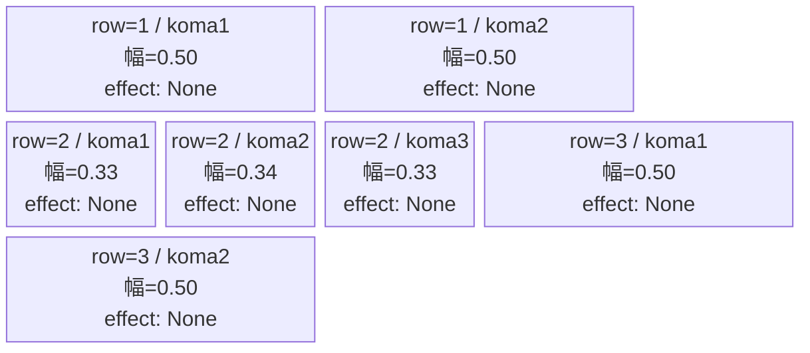

# vd_gom_normal_00001 インゲームデータ詳細解説

> 参照リポジトリ: `projects/glow-masterdata`
> リリースキー: 202604010

## インゲーム要件テキスト

たこ焼き（e_gom_00501）・バタートースト（e_gom_00402）・ラーメン（e_gom_00701）の3種の食べ物キャラが交互に押し寄せる。序盤はたこ焼きとバタートーストの2種が ElapsedTime で出現し、6体撃破後にラーメンが増援として加わる。15体撃破時点で UR対抗キャラ「囚われの王女 姫様」（c_gom_00001）がボスオーラを纏って降臨し、以降は拠点ダメージが入ったタイミングでたこ焼き・バタートースト・ラーメンが無限補充に切り替わる。

コマは3行構成。コマアセットキーは `gom_00003`、back_ground_offset は `0.6`。行ごとに異なるコマ数パターンを採用し、エフェクトはすべて `None`。

UR対抗キャラ「囚われの王女 姫様」（`chara_gom_00001`）に対抗できるキャラが有利に働くよう、ボスには Defense/Yellow の高HP設計を採用している。

---

## レベルデザイン

### 敵キャラ設計

#### 敵キャラ選定（MstEnemyCharacter）

| mst_enemy_character_id | 日本語名 | 役割 | 備考 |
|------------------------|---------|------|------|
| `enemy_gom_00501` | たこ焼き | 雑魚 | Defense/Yellow |
| `enemy_gom_00402` | バタートースト | 雑魚 | Attack/Yellow |
| `enemy_gom_00701` | ラーメン | 雑魚（強化版） | Attack/Yellow・HP高め |
| `chara_gom_00001` | 囚われの王女 姫様 | ボス | UR対抗キャラ・Defense/Yellow |

#### 敵キャラステータス（MstEnemyStageParameter）

> vd_all/data/MstEnemyStageParameter.csv から既存データを参照

| MstEnemyStageParameter ID | 日本語名 | kind | role | color | base_hp | base_atk | base_spd | well_dist | knockback | combo | drop_bp |
|--------------------------|---------|------|------|-------|---------|----------|----------|-----------|-----------|-------|---------|
| `e_gom_00501_vd_Normal_Yellow` | たこ焼き | Normal | Defense | Yellow | 1000 | 50 | 34 | 0.14 | 0 | 1 | 200 |
| `e_gom_00402_vd_Normal_Yellow` | バタートースト | Normal | Attack | Yellow | 1000 | 50 | 34 | 0.11 | 0 | 1 | 100 |
| `e_gom_00701_vd_Normal_Yellow` | ラーメン | Normal | Attack | Yellow | 10000 | 50 | 34 | 0.11 | 0 | 1 | 100 |
| `c_gom_00001_vd_Boss_Yellow` | 囚われの王女 姫様 | Boss | Defense | Yellow | 10000 | 50 | 25 | 0.16 | 1 | 6 | 500 |

---

### コマ設計

※ columns は1つのみ。各行のスパン合計 = 4 になること。

| row | height | 選択パターン | コマ数 | 各幅 | 幅合計 |
|-----|--------|------------|-------|------|--------|
| 1 | 0.33 | パターン6（2等分） | 2 | 0.50, 0.50 | 1.0 |
| 2 | 0.33 | パターン7（3等分） | 3 | 0.33, 0.34, 0.33 | 1.0 |
| 3 | 0.34 | パターン6（2等分） | 2 | 0.50, 0.50 | 1.0 |

---

### 敵キャラシーケンス設計

> **c_キャラ同時出現ルール（プランナー確認済み）**: c_キャラ（`c_` プレフィックス）が複数体登場する場合、
> 初回のみ `ElapsedTime`、2体目以降は `FriendUnitDead`（前の c_キャラの sequence_element_id を
> condition_value に指定）でチェーンすること。また c_キャラの `summon_count` は必ず `1` とすること。`e_glo_*` は対象外。

#### どのフェーズで、どの敵を、いつ、どこに、どのくらい出現させるか

```mermaid
flowchart LR
  Start([開始]) --> E1[ElapsedTime: 250ms\nたこ焼き 3体\nelem=1]
  E1 --> E2[ElapsedTime: 1500ms\nバタートースト 3体\nelem=2]
  E2 --> E3[ElapsedTime: 3000ms\nたこ焼き 4体\nelem=3]
  E3 --> E4[ElapsedTime: 4500ms\nバタートースト 3体\nelem=4]
  E4 --> E5[FriendUnitDead: 6体\nラーメン 3体\nelem=5]
  E5 --> E6[FriendUnitDead: 10体\nたこ焼き 4体\nelem=6]
  E6 --> E7[FriendUnitDead: 15体\n囚われの王女 姫様 1体 Bossオーラ\nelem=7]
  E7 --> E8[OutpostDamage: 1\nたこ焼き summon_count=99\nelem=8]
  E8 --> E9[OutpostDamage: 1\nバタートースト summon_count=99\nelem=9]
  E9 --> E10[OutpostDamage: 1\nラーメン summon_count=99\nelem=10]
```

| elem | 出現タイミング | 敵 | 数 | 備考 |
|------|-------------|---|---|------|
| 1 | ElapsedTime=250 | たこ焼き（e_gom_00501_vd_Normal_Yellow） | 3 | interval=300 |
| 2 | ElapsedTime=1500 | バタートースト（e_gom_00402_vd_Normal_Yellow） | 3 | interval=50 |
| 3 | ElapsedTime=3000 | たこ焼き（e_gom_00501_vd_Normal_Yellow） | 4 | interval=300 |
| 4 | ElapsedTime=4500 | バタートースト（e_gom_00402_vd_Normal_Yellow） | 3 | interval=50 |
| 5 | FriendUnitDead=6 | ラーメン（e_gom_00701_vd_Normal_Yellow） | 3 | interval=500 |
| 6 | FriendUnitDead=10 | たこ焼き（e_gom_00501_vd_Normal_Yellow） | 4 | interval=300 |
| 7 | FriendUnitDead=15 | 囚われの王女 姫様（c_gom_00001_vd_Boss_Yellow） | 1 | aura=Boss, summon_count必ず1 |
| 8 | OutpostDamage=1 | たこ焼き（e_gom_00501_vd_Normal_Yellow） | 99 | interval=500、終盤無限補充 |
| 9 | OutpostDamage=1 | バタートースト（e_gom_00402_vd_Normal_Yellow） | 99 | interval=750 |
| 10 | OutpostDamage=1 | ラーメン（e_gom_00701_vd_Normal_Yellow） | 99 | interval=1200 |

**累計出現数（無限補充前）**: elem1〜7 の合計 = 3+3+4+3+3+4+1 = **21体**（ノーマルブロック最低15体以上を満たす）

#### 敵キャラの固有ステータス調整（hp_coef / atk_coef）

| フェーズ | 敵 | base_hp | hp_coef | 実HP | base_atk | atk_coef | 実ATK |
|---------|---|---------|---------|------|----------|----------|-------|
| 序盤（elem1-4） | たこ焼き | 1000 | 1.0 | 1000 | 50 | 1.0 | 50 |
| 序盤（elem1-4） | バタートースト | 1000 | 1.0 | 1000 | 50 | 1.0 | 50 |
| 中盤（elem5） | ラーメン | 10000 | 1.0 | 10000 | 50 | 1.0 | 50 |
| 中盤（elem6） | たこ焼き | 1000 | 1.0 | 1000 | 50 | 1.0 | 50 |
| ボス（elem7） | 囚われの王女 姫様 | 10000 | 1.0 | 10000 | 50 | 1.0 | 50 |
| 終盤無限（elem8-10） | 各雑魚 | - | 1.0 | - | - | 1.0 | - |

#### フェーズ切り替えはあるか

なし（VDではSwitchSequenceGroup使用禁止）

---

## 演出

### アセット

#### 背景

| 設定箇所 | アセットキー | 備考 |
|---------|------------|------|
| loop_background_asset_key | （空） | VDノーマルブロックはデフォルト背景 |
| koma1_asset_key（全行共通） | `gom_00003` | series-koma-assets.csvより |
| koma1_back_ground_offset（全行共通） | `0.6` | koma-background-offset.mdより |

#### BGM

| 設定 | 値 | 備考 |
|-----|---|------|
| bgm_asset_key | `SSE_SBG_003_010` | VD normalブロック固定値 |
| boss_bgm_asset_key | （空） | normalブロックにはボスBGM切り替えなし |

---

### 敵キャラオーラ

| オーラ種別 | 使用箇所 |
|----------|---------|
| Default | elem1〜6（雑魚全員）、elem8〜10（無限補充） |
| Boss | elem7（囚われの王女 姫様） |

---

### 敵キャラ召喚アニメーション

- elem1〜6、8〜10: `summon_animation_type=None`（通常召喚）
- elem7（ボス登場）: `summon_animation_type=None`、FriendUnitDead=15体で登場する演出

**ボスの二重設定**:
- `MstInGame.boss_mst_enemy_stage_parameter_id` = `c_gom_00001_vd_Boss_Yellow`（ボスとして登録）
- `MstAutoPlayerSequence` の elem7 = `InitialSummon` ではなく `FriendUnitDead=15` で召喚（normalブロックのため開幕ではなく中盤登場）

---

## CSVテーブル設計サマリ

### MstInGame

| カラム | 値 |
|-------|---|
| id | `vd_gom_normal_00001` |
| release_key | `202604010` |
| content_type | `Dungeon` |
| stage_type | `vd_normal` |
| mst_page_id | `vd_gom_normal_00001` |
| mst_enemy_outpost_id | `vd_gom_normal_00001` |
| boss_mst_enemy_stage_parameter_id | `c_gom_00001_vd_Boss_Yellow` |
| mst_auto_player_sequence_set_id | `vd_gom_normal_00001` |
| bgm_asset_key | `SSE_SBG_003_010` |
| boss_bgm_asset_key | （空） |
| loop_background_asset_key | （空） |
| normal_enemy_hp_coef | `1.0` |
| normal_enemy_attack_coef | `1.0` |
| normal_enemy_speed_coef | `1.0` |
| boss_enemy_hp_coef | `1.0` |
| boss_enemy_attack_coef | `1.0` |
| boss_enemy_speed_coef | `1.0` |

### MstPage

| カラム | 値 |
|-------|---|
| id | `vd_gom_normal_00001` |
| release_key | `202604010` |

### MstEnemyOutpost

| カラム | 値 |
|-------|---|
| id | `vd_gom_normal_00001` |
| hp | `100`（VD normalブロック固定） |
| release_key | `202604010` |

### MstKomaLine（3行）

| id | mst_page_id | row | height | layout | koma1_asset_key | koma1_width | koma1_bg_offset | koma1_effect |
|----|------------|-----|--------|--------|----------------|-------------|----------------|-------------|
| `vd_gom_normal_00001_1` | `vd_gom_normal_00001` | 1 | 0.33 | 6 | `gom_00003` | 0.50 | 0.6 | None |
| `vd_gom_normal_00001_2` | `vd_gom_normal_00001` | 2 | 0.33 | 7 | `gom_00003` | 0.33 | 0.6 | None |
| `vd_gom_normal_00001_3` | `vd_gom_normal_00001` | 3 | 0.34 | 6 | `gom_00003` | 0.50 | 0.6 | None |

row=1: koma2あり（koma2_asset_key=`gom_00003`, koma2_width=0.50）
row=2: koma2あり（koma2_asset_key=`gom_00003`, koma2_width=0.34）、koma3あり（koma3_asset_key=`gom_00003`, koma3_width=0.33）
row=3: koma2あり（koma2_asset_key=`gom_00003`, koma2_width=0.50）

### MstAutoPlayerSequence（10行）

| id | sequence_set_id | elem_id | condition_type | condition_value | action_value | count | interval | aura | hp_coef | atk_coef | spd_coef |
|----|----------------|---------|---------------|----------------|-------------|-------|----------|------|---------|---------|---------|
| `vd_gom_normal_00001_1` | `vd_gom_normal_00001` | 1 | ElapsedTime | 250 | `e_gom_00501_vd_Normal_Yellow` | 3 | 300 | Default | 1.0 | 1.0 | 1.0 |
| `vd_gom_normal_00001_2` | `vd_gom_normal_00001` | 2 | ElapsedTime | 1500 | `e_gom_00402_vd_Normal_Yellow` | 3 | 50 | Default | 1.0 | 1.0 | 1.0 |
| `vd_gom_normal_00001_3` | `vd_gom_normal_00001` | 3 | ElapsedTime | 3000 | `e_gom_00501_vd_Normal_Yellow` | 4 | 300 | Default | 1.0 | 1.0 | 1.0 |
| `vd_gom_normal_00001_4` | `vd_gom_normal_00001` | 4 | ElapsedTime | 4500 | `e_gom_00402_vd_Normal_Yellow` | 3 | 50 | Default | 1.0 | 1.0 | 1.0 |
| `vd_gom_normal_00001_5` | `vd_gom_normal_00001` | 5 | FriendUnitDead | 6 | `e_gom_00701_vd_Normal_Yellow` | 3 | 500 | Default | 1.0 | 1.0 | 1.0 |
| `vd_gom_normal_00001_6` | `vd_gom_normal_00001` | 6 | FriendUnitDead | 10 | `e_gom_00501_vd_Normal_Yellow` | 4 | 300 | Default | 1.0 | 1.0 | 1.0 |
| `vd_gom_normal_00001_7` | `vd_gom_normal_00001` | 7 | FriendUnitDead | 15 | `c_gom_00001_vd_Boss_Yellow` | 1 | 0 | Boss | 1.0 | 1.0 | 1.0 |
| `vd_gom_normal_00001_8` | `vd_gom_normal_00001` | 8 | OutpostDamage | 1 | `e_gom_00501_vd_Normal_Yellow` | 99 | 500 | Default | 1.0 | 1.0 | 1.0 |
| `vd_gom_normal_00001_9` | `vd_gom_normal_00001` | 9 | OutpostDamage | 1 | `e_gom_00402_vd_Normal_Yellow` | 99 | 750 | Default | 1.0 | 1.0 | 1.0 |
| `vd_gom_normal_00001_10` | `vd_gom_normal_00001` | 10 | OutpostDamage | 1 | `e_gom_00701_vd_Normal_Yellow` | 99 | 1200 | Default | 1.0 | 1.0 | 1.0 |
