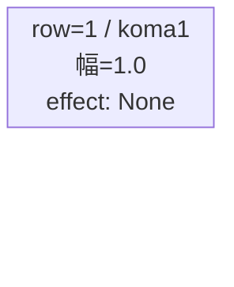
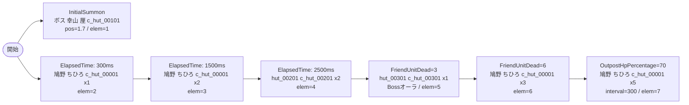

# vd_hut_boss_00001 インゲームデータ詳細解説

> 参照リポジトリ: `projects/glow-masterdata`
> リリースキー: 202604010

## インゲーム要件テキスト

ボスステージ。開幕 InitialSummon でボス「幸山 厘」（c_hut_00101_vd_Boss_Yellow、HP 10,000）が position=1.7 の後方に配置され、プレイヤーを迎え撃つ。雑魚は「ひたむきギタリスト 鳩野 ちひろ」（c_hut_00001、HP 10,000）が ElapsedTime=300ms で先行登場し、その後も ElapsedTime で「c_hut_00201」（HP 10,000）が中盤に出現して波を形成する。FriendUnitDead=3 で「c_hut_00301」（HP 10,000）がボスオーラつきで追加され、さらに FriendUnitDead=6 で「c_hut_00001」が追撃する。拠点 HP が 70% 以下になると「c_hut_00001」が大量降臨し、拠点防衛プレッシャーを一気に高める設計。UR対抗キャラ「ひたむきギタリスト 鳩野 ちひろ」（chara_hut_00001）の特性を逆手に取り、同キャラを雑魚として波状に送り込むことで、プレイヤーが自分のキャラの強さを実感できる設計とした。

コマは 1 行・1 コマのフルワイド構成（koma_asset_key: glo_00014）。bossブロックのためコマ 1 行固定。

UR対抗「ひたむきギタリスト 鳩野 ちひろ」の Technical 特性に対抗するギミックとして、ボスは高コンボ・高攻撃速度の Support ロール設定とし、雑魚を絶えず補充して盾役にしながらボスが後方から圧力をかける拠点防衛型ボスステージ。

---

## レベルデザイン

### 敵キャラ設計

#### 敵キャラ選定（MstEnemyCharacter）

| mst_enemy_character_id | 日本語名 | 役割 | 備考 |
|------------------------|---------|------|------|
| chara_hut_00101 | 幸山 厘 | ボス | InitialSummonで開幕即配置。UR対抗ボス |
| chara_hut_00001 | ひたむきギタリスト 鳩野 ちひろ | 雑魚 | 序盤・FriendUnitDead・拠点ダメージ時に多数登場。UR対抗キャラを雑魚として使用 |
| chara_hut_00201 | （hut_00201） | 雑魚 | 中盤ElapsedTimeで登場 |
| chara_hut_00301 | （hut_00301） | 雑魚（準ボス） | FriendUnitDead=3でボスオーラつきで参戦 |

#### 敵キャラステータス（MstEnemyStageParameter）

> 全て `vd_all/data/MstEnemyStageParameter.csv` 参照（リリースキー 202604010）

| MstEnemyStageParameter ID | 日本語名 | kind | role | color | base_hp | base_atk | base_spd | well_dist | knockback | combo | drop_bp |
|--------------------------|---------|------|------|-------|---------|----------|----------|-----------|-----------|-------|---------|
| c_hut_00101_vd_Boss_Yellow | 幸山 厘 | Boss | Support | Yellow | 10,000 | 100 | 35 | 0.42 | 2 | 6 | 200 |
| c_hut_00001_vd_Normal_Yellow | ひたむきギタリスト 鳩野 ちひろ | Normal | Defense | Yellow | 10,000 | 100 | 35 | 0.21 | 1 | 5 | 200 |
| c_hut_00201_vd_Normal_Yellow | （hut_00201） | Normal | Technical | Yellow | 10,000 | 100 | 35 | 0.5 | 2 | 5 | 200 |
| c_hut_00301_vd_Normal_Yellow | （hut_00301） | Normal | Technical | Yellow | 10,000 | 100 | 35 | 0.5 | 2 | 6 | 200 |

---

### コマ設計

※ bossブロックのためMstKomaLineは1行固定。columns は 4（スパン合計 4）。

| row | height | 選択パターン | コマ数 | 各幅 | 幅合計 |
|-----|--------|------------|-------|------|--------|
| 1 | 1.0 | パターン1 | 1 | 1.0 | 1.0 |

---

### 敵キャラシーケンス設計

> **c_キャラ同時出現ルール（プランナー確認済み）**: c_キャラ（`c_` プレフィックス）が複数体登場する場合、
> 初回のみ `ElapsedTime`、2体目以降は `FriendUnitDead`（前の c_キャラの sequence_element_id を
> condition_value に指定）でチェーンすること。また c_キャラの `summon_count` は必ず `1` とすること。`e_glo_*` は対象外。

#### どのフェーズで、どの敵を、いつ、どこに、どのくらい出現させるか

| elem | 出現タイミング | 敵 | 数 | 累計出現数/召喚位置 |
|------|-------------|---|---|-----------------|
| 1 | InitialSummon=0 | 幸山 厘 (c_hut_00101_vd_Boss_Yellow) | 1 | 1体 / pos=1.7 |
| 2 | ElapsedTime=300ms | ひたむきギタリスト 鳩野 ちひろ (c_hut_00001_vd_Normal_Yellow) | 1 | 2体 / pos=なし |
| 3 | ElapsedTime=1500ms | ひたむきギタリスト 鳩野 ちひろ (c_hut_00001_vd_Normal_Yellow) | 2 | 4体 / pos=なし |
| 4 | ElapsedTime=2500ms | （hut_00201）(c_hut_00201_vd_Normal_Yellow) | 2 | 6体 / pos=なし |
| 5 | FriendUnitDead=3 | （hut_00301）(c_hut_00301_vd_Normal_Yellow) | 1 | 7体 / pos=なし |
| 6 | FriendUnitDead=6 | ひたむきギタリスト 鳩野 ちひろ (c_hut_00001_vd_Normal_Yellow) | 3 | 10体 / pos=なし |
| 7 | OutpostHpPercentage=70 | ひたむきギタリスト 鳩野 ちひろ (c_hut_00001_vd_Normal_Yellow) | 5 | 15体 / pos=なし |

#### 敵キャラの固有ステータス調整（hp_coef / atk_coef）

| 波/フェーズ | 敵 | base_hp | hp_coef | 実HP | base_atk | atk_coef | 実ATK |
|-----------|---|---------|---------|------|----------|----------|-------|
| 開幕 | 幸山 厘 | 10,000 | 1.0 | 10,000 | 100 | 1.0 | 100 |
| 序盤〜中盤 | ひたむきギタリスト 鳩野 ちひろ | 10,000 | 1.0 | 10,000 | 100 | 1.0 | 100 |
| 中盤 | （hut_00201） | 10,000 | 1.0 | 10,000 | 100 | 1.0 | 100 |
| 中盤〜終盤 | （hut_00301） | 10,000 | 1.0 | 10,000 | 100 | 1.0 | 100 |

#### フェーズ切り替えはあるか

なし（VDではSwitchSequenceGroup使用禁止）

---

## 演出

### アセット

#### 背景

| 設定箇所 | アセットキー | 備考 |
|---------|------------|------|
| MstPage.background_asset_key | （アセット担当者確認推奨） | ふつうの軽音部作品背景 |
| MstEnemyOutpost.artwork_asset_key | （アセット担当者確認推奨） | VD用アウトポストアート |

#### BGM

| 設定 | 値 | 備考 |
|-----|---|------|
| bgm_asset_key | SSE_SBG_003_004 | bossブロック固定値 |

---

### 敵キャラオーラ

| オーラ種別 | 使用箇所 |
|----------|---------|
| Boss | c_hut_00101（ボス 幸山 厘）および c_hut_00301（FriendUnitDead=3で登場する準ボス） |
| Default | c_hut_00001、c_hut_00201（雑魚） |

---

### 敵キャラ召喚アニメーション

- **elem=1 (InitialSummon)**: ボス「幸山 厘」が開幕から position=1.7 に召喚。`summon_animation_type=None`。
- **elem=2〜4 (ElapsedTime)**: 雑魚が順次登場。いずれも `summon_animation_type=None`。
- **elem=5 (FriendUnitDead=3)**: 「hut_00301」がボスオーラつきで参戦。`summon_animation_type=None`。
- **elem=6 (FriendUnitDead=6)**: 「鳩野 ちひろ」が3体追撃。`summon_animation_type=None`。
- **elem=7 (OutpostHpPercentage=70)**: 拠点が70%以下になると「鳩野 ちひろ」が5体一気に押し寄せ、拠点防衛プレッシャーを演出。`summon_animation_type=None`。

---

## テーブル設定値まとめ

### MstInGame

| カラム | 値 |
|-------|---|
| id | vd_hut_boss_00001 |
| release_key | 202604010 |
| content_type | Dungeon |
| stage_type | vd_boss |
| mst_page_id | vd_hut_boss_00001 |
| mst_enemy_outpost_id | vd_hut_boss_00001 |
| boss_mst_enemy_stage_parameter_id | c_hut_00101_vd_Boss_Yellow |
| mst_auto_player_sequence_set_id | vd_hut_boss_00001 |
| bgm_asset_key | SSE_SBG_003_004 |
| normal_enemy_hp_coef | 1.0 |
| normal_enemy_attack_coef | 1.0 |
| normal_enemy_speed_coef | 1.0 |
| boss_enemy_hp_coef | 1.0 |
| boss_enemy_attack_coef | 1.0 |
| boss_enemy_speed_coef | 1.0 |

### MstEnemyOutpost

| カラム | 値 |
|-------|---|
| id | vd_hut_boss_00001 |
| release_key | 202604010 |
| hp | 1000 |

### MstPage

| カラム | 値 |
|-------|---|
| id | vd_hut_boss_00001 |
| release_key | 202604010 |

### MstKomaLine（1行固定）

| カラム | 値 |
|-------|---|
| id | vd_hut_boss_00001_1 |
| release_key | 202604010 |
| mst_page_id | vd_hut_boss_00001 |
| row | 1 |
| height | 1.0 |
| koma_line_layout_asset_key | 1 |
| koma1_asset_key | glo_00014 |
| koma1_width | 1.0 |
| koma1_back_ground_offset | -1.0 |
| koma1_effect_type | None |
| koma1_effect_parameter1 | 0 |
| koma1_effect_parameter2 | 0 |
| koma1_effect_target_side | All |
| koma1_effect_target_colors | All |
| koma1_effect_target_roles | All |
| koma2_effect_type | None |
| koma3_effect_type | None |
| koma4_effect_type | None |

### MstAutoPlayerSequence（sequence_set_id = vd_hut_boss_00001）

| id | sequence_set_id | sequence_element_id | condition_type | condition_value | action_type | action_value | summon_count | summon_interval | summon_position | aura_type | summon_animation_type | death_type | defeated_score | enemy_hp_coef | enemy_attack_coef | enemy_speed_coef | move_start_condition_type | move_stop_condition_type | move_restart_condition_type | deactivation_condition_type |
|---|---|---|---|---|---|---|---|---|---|---|---|---|---|---|---|---|---|---|---|---|
| vd_hut_boss_00001_1 | vd_hut_boss_00001 | 1 | InitialSummon | 0 | SummonEnemy | c_hut_00101_vd_Boss_Yellow | 1 | 0 | 1.7 | Boss | None | Normal | 0 | 1.0 | 1.0 | 1.0 | None | None | None | None |
| vd_hut_boss_00001_2 | vd_hut_boss_00001 | 2 | ElapsedTime | 300 | SummonEnemy | c_hut_00001_vd_Normal_Yellow | 1 | 0 | | Default | None | Normal | 0 | 1.0 | 1.0 | 1.0 | None | None | None | None |
| vd_hut_boss_00001_3 | vd_hut_boss_00001 | 3 | ElapsedTime | 1500 | SummonEnemy | c_hut_00001_vd_Normal_Yellow | 2 | 200 | | Default | None | Normal | 0 | 1.0 | 1.0 | 1.0 | None | None | None | None |
| vd_hut_boss_00001_4 | vd_hut_boss_00001 | 4 | ElapsedTime | 2500 | SummonEnemy | c_hut_00201_vd_Normal_Yellow | 2 | 300 | | Default | None | Normal | 0 | 1.0 | 1.0 | 1.0 | None | None | None | None |
| vd_hut_boss_00001_5 | vd_hut_boss_00001 | 5 | FriendUnitDead | 3 | SummonEnemy | c_hut_00301_vd_Normal_Yellow | 1 | 0 | | Boss | None | Normal | 0 | 1.0 | 1.0 | 1.0 | None | None | None | None |
| vd_hut_boss_00001_6 | vd_hut_boss_00001 | 6 | FriendUnitDead | 6 | SummonEnemy | c_hut_00001_vd_Normal_Yellow | 3 | 200 | | Default | None | Normal | 0 | 1.0 | 1.0 | 1.0 | None | None | None | None |
| vd_hut_boss_00001_7 | vd_hut_boss_00001 | 7 | OutpostHpPercentage | 70 | SummonEnemy | c_hut_00001_vd_Normal_Yellow | 5 | 300 | | Default | None | Normal | 0 | 1.0 | 1.0 | 1.0 | None | None | None | None |
