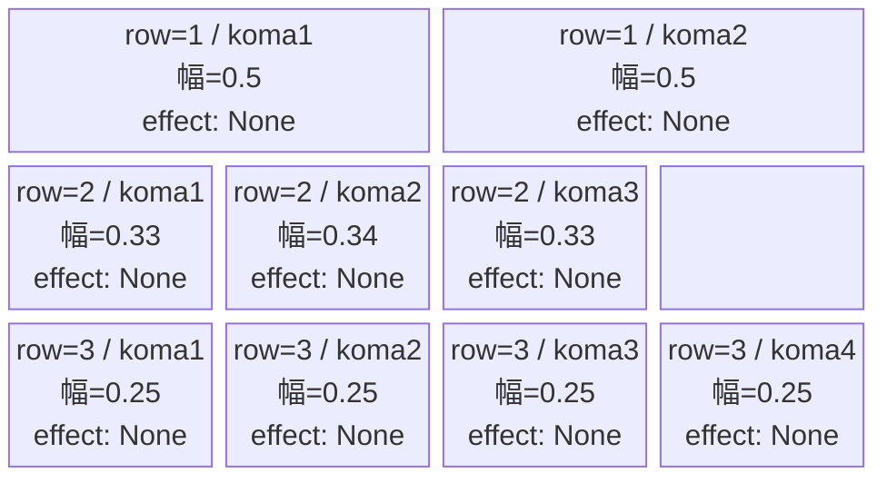
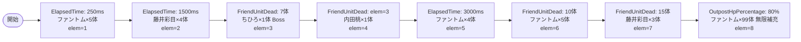

# vd_hut_normal_00001 インゲームデータ詳細解説

> 参照リポジトリ: `projects/glow-masterdata`
> リリースキー: 202604010

## インゲーム要件テキスト

開幕から e_glo_00001（ファントム/Colorless）が 5 体ラッシュし、1500ms で c_hut_00201（藤井 彩目/Yellow）が 4 体追加される。7 体撃破で c_hut_00001（ひたむきギタリスト 鳩野 ちひろ/Yellow・Boss オーラ）が 1 体登場し、UR 対抗キャラとして UR「ひたむきギタリスト 鳩野 ちひろ」の対抗を意識した FriendUnitDead チェーンで c_hut_00301（内田 桃/Yellow）が続く。その後 FriendUnitDead=15 体で c_hut_00201 を 3 体まとめて追加し、終盤は 拠点ダメージ OutpostHpPercentage=80 で e_glo_00001 の 99 体無限補充に切り替わる。合計雑魚体数は最低 20 体以上となる設計。

コマは 3 行構成。row=1 はアセットキー `glo_00014` で 2 コマ（各幅 0.5）、row=2 は同アセットキーで 3 コマ（幅 0.33/0.34/0.33）、row=3 は同アセットキーで 4 コマ均等（各幅 0.25）。back_ground_offset はいずれも -1.0。コマエフェクトはすべて None。

UR 対抗キャラ「ひたむきギタリスト 鳩野 ちひろ」（chara_hut_00001）への対抗として、c_hut_00001 を FriendUnitDead で 1 体確実に召喚することで「倒すほど本気のちひろが来る」緊張感を演出する。

---

## レベルデザイン

### 敵キャラ設計

#### 敵キャラ選定（MstEnemyCharacter）

| mst_enemy_character_id | 日本語名 | 役割 | 備考 |
|------------------------|---------|------|------|
| chara_hut_00001 | ひたむきギタリスト 鳩野 ちひろ | 強化雑魚（BossオーラつきNormal） | UR対抗キャラ。FriendUnitDeadで登場 |
| chara_hut_00201 | 藤井 彩目 | 雑魚 | Normal/Technical/Yellow |
| chara_hut_00301 | 内田 桃 | 雑魚 | Normal/Technical/Yellow |
| enemy_glo_00001 | ファントム | 雑魚（基本・終盤無限補充） | VD汎用ファントム |

#### 敵キャラステータス（MstEnemyStageParameter）

> VD専用の既存パラメータを `vd_all/data/MstEnemyStageParameter.csv` から参照

| MstEnemyStageParameter ID | 日本語名 | kind | role | color | base_hp | base_atk | base_spd | well_dist | knockback | combo | drop_bp |
|--------------------------|---------|------|------|-------|---------|----------|----------|-----------|-----------|-------|---------|
| c_hut_00001_vd_Normal_Yellow | ひたむきギタリスト 鳩野 ちひろ | Normal | Defense | Yellow | 10000 | 100 | 0.21 | 35 | 1 | 5 | 200 |
| c_hut_00101_vd_Boss_Yellow | 幸山 厘 | Boss | Support | Yellow | 10000 | 100 | 0.42 | 35 | 2 | 6 | 200 |
| c_hut_00201_vd_Normal_Yellow | 藤井 彩目 | Normal | Technical | Yellow | 10000 | 100 | 0.5 | 35 | 2 | 5 | 200 |
| c_hut_00301_vd_Normal_Yellow | 内田 桃 | Normal | Technical | Yellow | 10000 | 100 | 0.5 | 35 | 2 | 6 | 200 |
| e_glo_00001_vd_Normal_Colorless | ファントム | Normal | Attack | Colorless | 5000 | 100 | 0.22 | 34 | 3 | 1 | 150 |

---

### コマ設計

※ columns は 4 のみ。row=2 はスパン合計を合わせるためダミースペースを使用。

| row | height | 選択パターン | コマ数 | 各幅 | 幅合計 |
|-----|--------|------------|-------|------|--------|
| 1 | 0.33 | パターン6 | 2 | 0.5, 0.5 | 1.0 |
| 2 | 0.33 | パターン7 | 3 | 0.33, 0.34, 0.33 | 1.0 |
| 3 | 0.34 | パターン12 | 4 | 0.25, 0.25, 0.25, 0.25 | 1.0 |

> コマアセットキー: `glo_00014`（hut シリーズ対応、`series-koma-assets.csv` より）
> koma1_back_ground_offset: `-1.0`（koma-background-offset.md より）

---

### 敵キャラシーケンス設計

> **c_キャラ同時出現ルール（プランナー確認済み）**: c_キャラ（`c_` プレフィックス）が複数体登場する場合、
> 初回のみ `ElapsedTime`、2体目以降は `FriendUnitDead`（前の c_キャラの sequence_element_id を
> condition_value に指定）でチェーンすること。また c_キャラの `summon_count` は必ず `1` とすること。`e_glo_*` は対象外。

#### どのフェーズで、どの敵を、いつ、どこに、どのくらい出現させるか

| elem | 出現タイミング | 敵 | 数 | 累計出現数/召喚位置 |
|------|-------------|---|---|-----------------|
| 1 | ElapsedTime=250 | ファントム (e_glo_00001_vd_Normal_Colorless) | 5 | 累計5体 / ランダム |
| 2 | ElapsedTime=1500 | 藤井 彩目 (c_hut_00201_vd_Normal_Yellow) | 4 | 累計9体 / ランダム |
| 3 | FriendUnitDead=7 | ひたむきギタリスト 鳩野 ちひろ (c_hut_00001_vd_Normal_Yellow) | 1 | 累計10体 / ランダム |
| 4 | FriendUnitDead=elem3 (c_キャラチェーン) | 内田 桃 (c_hut_00301_vd_Normal_Yellow) | 1 | 累計11体 / ランダム |
| 5 | ElapsedTime=3000 | ファントム (e_glo_00001_vd_Normal_Colorless) | 4 | 累計15体 / ランダム |
| 6 | FriendUnitDead=10 | ファントム (e_glo_00001_vd_Normal_Colorless) | 5 | 累計20体 / ランダム |
| 7 | FriendUnitDead=15 | 藤井 彩目 (c_hut_00201_vd_Normal_Yellow) | 3 | 累計23体 / ランダム |
| 8 | OutpostHpPercentage=80 | ファントム (e_glo_00001_vd_Normal_Colorless) | 99 | 無限補充 / ランダム |

> **c_キャラチェーン説明（elem=4）**: elem=3 が c_hut_00001 の召喚エントリ。elem=4 は condition_type=FriendUnitDead、condition_value=elem3 の sequence_element_id を参照してチェーンする。具体的には MstAutoPlayerSequence の condition_value に elem=3 の sequence_element_id 値を設定する。

#### 敵キャラの固有ステータス調整（hp_coef / atk_coef）

| 波/フェーズ | 敵 | base_hp | hp_coef | 実HP | base_atk | atk_coef | 実ATK |
|-----------|---|---------|---------|------|----------|----------|-------|
| 序盤 elem1 | ファントム | 5000 | 1.0 | 5000 | 100 | 1.0 | 100 |
| 序盤 elem2 | 藤井 彩目 | 10000 | 1.0 | 10000 | 100 | 1.0 | 100 |
| 中盤 elem3 | ちひろ (Boss) | 10000 | 1.0 | 10000 | 100 | 1.0 | 100 |
| 中盤 elem4 | 内田 桃 | 10000 | 1.0 | 10000 | 100 | 1.0 | 100 |
| 中盤 elem5 | ファントム | 5000 | 1.0 | 5000 | 100 | 1.0 | 100 |
| 後半 elem6 | ファントム | 5000 | 1.0 | 5000 | 100 | 1.0 | 100 |
| 後半 elem7 | 藤井 彩目 | 10000 | 1.0 | 10000 | 100 | 1.0 | 100 |
| 終盤 elem8 | ファントム (無限) | 5000 | 1.0 | 5000 | 100 | 1.0 | 100 |

#### フェーズ切り替えはあるか

なし（VDではSwitchSequenceGroup使用禁止）

---

## 演出

### アセット

#### 背景

| 設定箇所 | アセットキー | 備考 |
|---------|------------|------|
| loop_background_asset_key | （空文字） | VD normal はデフォルト背景適用 |

#### BGM

| 設定 | 値 | 備考 |
|-----|---|------|
| bgm_asset_key | SSE_SBG_003_010 | VD normalブロック固定BGM |
| boss_bgm_asset_key | （空文字） | boss_mst_enemy_stage_parameter_id なし |

---

### 敵キャラオーラ

| オーラ種別 | 使用箇所 |
|----------|---------|
| Default | elem=1,2,4,5,6,7,8（全雑魚・通常c_キャラ） |
| Boss | elem=3（ひたむきギタリスト 鳩野 ちひろ） |

---

### 敵キャラ召喚アニメーション

全エレメントで `summon_animation_type=None`（VD標準）。InitialSummonは使用しない。
ElapsedTime=250ms の開幕ファントム 5 体から始まり、時間トリガーと FriendUnitDead の複合構成で段階的に作品キャラ（c_hut 系）が登場する演出。elem=3 の c_hut_00001 はBossオーラで登場し「ひたむきなちひろが本気モードで来た」という緊張感を演出する。終盤は拠点80%削れたタイミングでファントムの無限補充が始まり、プレイヤーへの強いプレッシャーを与える。

---

## MstInGame 設定値

| カラム | 値 |
|-------|---|
| id | vd_hut_normal_00001 |
| release_key | 202604010 |
| content_type | Dungeon |
| stage_type | vd_normal |
| bgm_asset_key | SSE_SBG_003_010 |
| boss_bgm_asset_key | （空文字） |
| loop_background_asset_key | （空文字） |
| mst_page_id | vd_hut_normal_00001 |
| mst_enemy_outpost_id | vd_hut_normal_00001 |
| boss_mst_enemy_stage_parameter_id | （空文字） |
| mst_auto_player_sequence_id | vd_hut_normal_00001 |
| mst_auto_player_sequence_set_id | vd_hut_normal_00001 |
| normal_enemy_hp_coef | 1.0 |
| normal_enemy_attack_coef | 1.0 |
| normal_enemy_speed_coef | 1.0 |
| boss_enemy_hp_coef | 1.0 |
| boss_enemy_attack_coef | 1.0 |
| boss_enemy_speed_coef | 1.0 |

## MstEnemyOutpost 設定値

| カラム | 値 |
|-------|---|
| id | vd_hut_normal_00001 |
| release_key | 202604010 |
| hp | 100（VD normal固定） |
| artwork_asset_key | （アセット担当者確認推奨） |

## MstPage 設定値

| カラム | 値 |
|-------|---|
| id | vd_hut_normal_00001 |
| release_key | 202604010 |

## MstKomaLine 設定値サマリ

| id | mst_page_id | row | height | layout | komaアセット | back_ground_offset |
|----|------------|-----|--------|--------|------------|-------------------|
| vd_hut_normal_00001_1 | vd_hut_normal_00001 | 1 | 0.33 | 6 | glo_00014 | -1.0 |
| vd_hut_normal_00001_2 | vd_hut_normal_00001 | 2 | 0.33 | 7 | glo_00014 | -1.0 |
| vd_hut_normal_00001_3 | vd_hut_normal_00001 | 3 | 0.34 | 12 | glo_00014 | -1.0 |

## MstAutoPlayerSequence 設定値サマリ

| id | sequence_set_id | elem | condition_type | condition_value | action_value | count | interval | aura | death_type |
|----|----------------|------|---------------|----------------|-------------|-------|----------|------|------------|
| vd_hut_normal_00001_1 | vd_hut_normal_00001 | 1 | ElapsedTime | 250 | e_glo_00001_vd_Normal_Colorless | 5 | 0 | Default | Normal |
| vd_hut_normal_00001_2 | vd_hut_normal_00001 | 2 | ElapsedTime | 1500 | c_hut_00201_vd_Normal_Yellow | 4 | 0 | Default | Normal |
| vd_hut_normal_00001_3 | vd_hut_normal_00001 | 3 | FriendUnitDead | 7 | c_hut_00001_vd_Normal_Yellow | 1 | 0 | Boss | Normal |
| vd_hut_normal_00001_4 | vd_hut_normal_00001 | 4 | FriendUnitDead | 3 | c_hut_00301_vd_Normal_Yellow | 1 | 0 | Default | Normal |
| vd_hut_normal_00001_5 | vd_hut_normal_00001 | 5 | ElapsedTime | 3000 | e_glo_00001_vd_Normal_Colorless | 4 | 0 | Default | Normal |
| vd_hut_normal_00001_6 | vd_hut_normal_00001 | 6 | FriendUnitDead | 10 | e_glo_00001_vd_Normal_Colorless | 5 | 0 | Default | Normal |
| vd_hut_normal_00001_7 | vd_hut_normal_00001 | 7 | FriendUnitDead | 15 | c_hut_00201_vd_Normal_Yellow | 3 | 500 | Default | Normal |
| vd_hut_normal_00001_8 | vd_hut_normal_00001 | 8 | OutpostHpPercentage | 80 | e_glo_00001_vd_Normal_Colorless | 99 | 750 | Default | Normal |

> **elem=4 の c_キャラチェーン注意**: condition_value=3 は「elem=3 の sequence_element_id」を指す FriendUnitDead チェーン。c_hut_00001（elem=3）が倒された後に c_hut_00301（elem=4）が召喚される設計。
