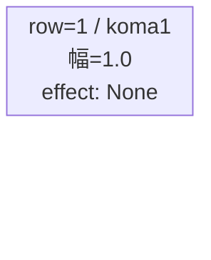

# vd_jig_boss_00001 インゲームデータ詳細解説

> 参照リポジトリ: `projects/glow-masterdata`
> リリースキー: 202604010

## インゲーム要件テキスト

地獄楽（jig）のボスブロック。UR対抗キャラ「がらんの画眉丸」（`chara_jig_00001`）に対抗するボスステージ。`c_jig_00601_vd_Boss_Green`（民谷 巌鉄斎）がボスとして砦付近に初期配置される。序盤はElapsedTimeで門神（`e_jig_00001_vd_Normal_Green`）と極楽蝶（`e_jig_00401_vd_Normal_Green`）が入り混じって出現し、拠点へのプレッシャーをかける。拠点HPが70%以下になると強化された極楽蝶が追加召喚される。さらに10体撃破でボスが活性化し、最終盤はFriendUnitDeadで無限補充に切り替わる設計。

コマは1行構成（bossブロック固定）。コマアセットキー `jig_00002`、`koma1_back_ground_offset = -1.0`（jig系標準）。

対抗キャラ「がらんの画眉丸」はGreen属性を得意とするため、敵はGreen単色で統一し、画眉丸のスキル効果（Green属性優遇）が最大限に活用できる設計とした。

---

## レベルデザイン

### 敵キャラ設計

#### 敵キャラ選定（MstEnemyCharacter）
| mst_enemy_character_id | 日本語名 | 役割 | 備考 |
|------------------------|---------|------|------|
| `enemy_jig_00001` | 門神 | 雑魚 | Defense型、Green属性 |
| `enemy_jig_00401` | 極楽蝶 | 雑魚 | Attack型、Green属性 |
| `chara_jig_00601` | 民谷 巌鉄斎 | ボス | Defense型、Green属性。InitialSummonで開幕砦付近に配置 |

#### 敵キャラステータス（MstEnemyStageParameter）
> vd_all/data/MstEnemyStageParameter.csv より参照（release_key=202604010）

| MstEnemyStageParameter ID | 日本語名 | kind | role | color | base_hp | base_atk | base_spd | well_dist | knockback | combo | drop_bp |
|--------------------------|---------|------|------|-------|---------|----------|----------|-----------|-----------|-------|---------|
| `e_jig_00001_vd_Normal_Green` | 門神 | Normal | Defense | Green | 3500 | 50 | 31 | 0.21 | 2 | 1 | 150 |
| `e_jig_00401_vd_Normal_Green` | 極楽蝶 | Normal | Attack | Green | 3000 | 100 | 32 | 0.24 | 4 | 1 | 100 |
| `c_jig_00601_vd_Boss_Green` | 民谷 巌鉄斎 | Boss | Defense | Green | 10000 | 100 | 35 | 0.22 | 1 | 7 | 500 |

---

### コマ設計

※ bossブロックはMstKomaLine 1行固定。

| row | height | 選択パターン | コマ数 | 各幅 | 幅合計 |
|-----|--------|------------|-------|------|--------|
| 1 | 1.0 | パターン1 | 1 | 1.0 | 1.0 |

---

### 敵キャラシーケンス設計

> **c_キャラ同時出現ルール（プランナー確認済み）**: c_キャラ（`c_` プレフィックス）が複数体登場する場合、
> 初回のみ `ElapsedTime`、2体目以降は `FriendUnitDead`（前の c_キャラの sequence_element_id を
> condition_value に指定）でチェーンすること。また c_キャラの `summon_count` は必ず `1` とすること。`e_glo_*` は対象外。

#### どのフェーズで、どの敵を、いつ、どこに、どのくらい出現させるか

```mermaid
flowchart LR
  Start([開始]) --> E1[InitialSummon: 0\n民谷 巌鉄斎 ボス配置\nposition=1.7 Damage待機\nelem=1]
  E1 --> E2[ElapsedTime: 150ms\n門神 3体\nelem=2]
  E2 --> E3[ElapsedTime: 1000ms\n極楽蝶 3体\nelem=3]
  E3 --> E4[ElapsedTime: 2500ms\n門神 4体\nelem=4]
  E4 --> E5[ElapsedTime: 4000ms\n極楽蝶 4体\nelem=5]
  E5 --> E6[OutpostHpPercentage: 70\n極楽蝶 5体 強化\nelem=6]
  E6 --> E7[FriendUnitDead: 10\n門神 5体\nelem=7]
  E7 --> E8[FriendUnitDead: 10\n極楽蝶 5体 位置指定\nelem=8]
  E8 --> E9[FriendUnitDead: 20\n門神 summon=99 無限補充\nelem=9]
  E9 --> E10[FriendUnitDead: 20\n極楽蝶 summon=99 無限補充\nelem=10]
```

| elem | 出現タイミング | 敵 | 数 | 累計出現数/召喚位置 |
|------|-------------|---|---|-----------------|
| 1 | InitialSummon=0 | 民谷 巌鉄斎（c_jig_00601_vd_Boss_Green） | 1 | 1体 / position=1.7（砦付近）、Damage待機 |
| 2 | ElapsedTime=150 | 門神（e_jig_00001_vd_Normal_Green） | 3 | 3体 / デフォルト |
| 3 | ElapsedTime=1000 | 極楽蝶（e_jig_00401_vd_Normal_Green） | 3 | 6体 / デフォルト |
| 4 | ElapsedTime=2500 | 門神（e_jig_00001_vd_Normal_Green） | 4 | 10体 / デフォルト |
| 5 | ElapsedTime=4000 | 極楽蝶（e_jig_00401_vd_Normal_Green） | 4 | 14体 / デフォルト |
| 6 | OutpostHpPercentage=70 | 極楽蝶（e_jig_00401_vd_Normal_Green） | 5 | +5体 / position=1.3 |
| 7 | FriendUnitDead=10 | 門神（e_jig_00001_vd_Normal_Green） | 5 | +5体 / デフォルト |
| 8 | FriendUnitDead=10 | 極楽蝶（e_jig_00401_vd_Normal_Green） | 5 | +5体 / position=2.8 |
| 9 | FriendUnitDead=20 | 門神（e_jig_00001_vd_Normal_Green） | 99 | 無限 / interval=750ms |
| 10 | FriendUnitDead=20 | 極楽蝶（e_jig_00401_vd_Normal_Green） | 99 | 無限 / interval=1200ms |

#### 敵キャラの固有ステータス調整（hp_coef / atk_coef）
| 波/フェーズ | 敵 | base_hp | hp_coef | 実HP | base_atk | atk_coef | 実ATK |
|-----------|---|---------|---------|------|----------|----------|-------|
| 序盤（elem2〜5） | 門神 | 3500 | 1.0 | 3500 | 50 | 1.0 | 50 |
| 序盤（elem2〜5） | 極楽蝶 | 3000 | 1.0 | 3000 | 100 | 1.0 | 100 |
| 拠点削れ後（elem6） | 極楽蝶（強化） | 3000 | 2.0 | 6000 | 100 | 1.5 | 150 |
| 10体撃破後（elem7〜8） | 門神 | 3500 | 2.0 | 7000 | 100 | 1.5 | 150 |
| 10体撃破後（elem7〜8） | 極楽蝶 | 3000 | 2.0 | 6000 | 100 | 1.5 | 150 |
| 無限補充（elem9〜10） | 門神 | 3500 | 3.0 | 10500 | 50 | 2.0 | 100 |
| 無限補充（elem9〜10） | 極楽蝶 | 3000 | 3.0 | 9000 | 100 | 2.0 | 200 |
| ボス（elem1） | 民谷 巌鉄斎 | 10000 | 5.0 | 50000 | 100 | 3.0 | 300 |

#### フェーズ切り替えはあるか
なし（VDではSwitchSequenceGroup使用禁止）

---

## 演出

### アセット

#### 背景
| 設定箇所 | アセットキー | 備考 |
|---------|------------|------|
| MstInGame.loop_background_asset_key | 空文字 | VDボスブロックはデフォルト背景 |

#### BGM
| 設定 | 値 | 備考 |
|-----|---|------|
| bgm_asset_key | `SSE_SBG_003_004` | bossブロック固定BGM |
| boss_bgm_asset_key | 空文字 | ボスBGM切り替えなし |

---

### 敵キャラオーラ
| オーラ種別 | 使用箇所 |
|----------|---------|
| Boss | 民谷 巌鉄斎（elem=1 InitialSummon）に設定。ボスとして砦付近に待機する演出を強調 |
| Default | 雑魚敵（門神・極楽蝶）は全てDefault |

---

### 敵キャラ召喚アニメーション

- elem=1（民谷 巌鉄斎）: `InitialSummon` で砦付近（position=1.7）に開幕即配置。`move_start_condition_type=Damage, move_start_condition_value=1` でダメージを受けるまで静止する演出。
- elem=2〜10（雑魚敵）: `summon_animation_type=None`（通常召喚）。

---

## テーブル設定まとめ

### MstInGame

| カラム | 値 |
|-------|---|
| id | `vd_jig_boss_00001` |
| release_key | `202604010` |
| mst_auto_player_sequence_id | `vd_jig_boss_00001` |
| mst_auto_player_sequence_set_id | `vd_jig_boss_00001` |
| bgm_asset_key | `SSE_SBG_003_004` |
| boss_bgm_asset_key | 空文字 |
| loop_background_asset_key | 空文字 |
| player_outpost_asset_key | 空文字 |
| mst_page_id | `vd_jig_boss_00001` |
| mst_enemy_outpost_id | `vd_jig_boss_00001` |
| mst_defense_target_id | NULL |
| boss_mst_enemy_stage_parameter_id | `c_jig_00601_vd_Boss_Green` |
| boss_count | NULL |
| content_type | `Dungeon` |
| stage_type | `vd_boss` |
| normal_enemy_hp_coef | `1.0` |
| normal_enemy_attack_coef | `1.0` |
| normal_enemy_speed_coef | `1` |
| boss_enemy_hp_coef | `1.0` |
| boss_enemy_attack_coef | `1.0` |
| boss_enemy_speed_coef | `1` |

### MstPage

| カラム | 値 |
|-------|---|
| id | `vd_jig_boss_00001` |
| release_key | `202604010` |

### MstEnemyOutpost

| カラム | 値 |
|-------|---|
| id | `vd_jig_boss_00001` |
| hp | `1000`（bossブロック固定） |
| is_damage_invalidation | 空文字 |
| outpost_asset_key | 空文字 |
| artwork_asset_key | 空文字（アセット担当者確認推奨） |
| release_key | `202604010` |

### MstKomaLine（1行固定）

| カラム | 値 |
|-------|---|
| id | `vd_jig_boss_00001_1` |
| mst_page_id | `vd_jig_boss_00001` |
| row | `1` |
| height | `1.0` |
| koma_line_layout_asset_key | `1` |
| release_key | `202604010` |
| koma1_asset_key | `jig_00002` |
| koma1_width | `1.0` |
| koma1_back_ground_offset | `-1.0` |
| koma1_effect_type | `None` |
| koma1_effect_parameter1 | `0` |
| koma1_effect_parameter2 | `0` |
| koma1_effect_target_side | `All` |
| koma1_effect_target_colors | `All` |
| koma1_effect_target_roles | `All` |
| koma2_effect_type | `None` |
| koma3_effect_type | `None` |
| koma4_effect_type | `None` |

### MstAutoPlayerSequence（10行）

| id | sequence_set_id | sequence_element_id | condition_type | condition_value | action_type | action_value | summon_count | summon_interval | summon_position | move_start_condition_type | move_start_condition_value | aura_type | death_type | enemy_hp_coef | enemy_attack_coef | enemy_speed_coef | defeated_score | summon_animation_type | deactivation_condition_type |
|----|----------------|---------------------|---------------|----------------|-------------|-------------|-------------|----------------|----------------|--------------------------|--------------------------|-----------|-----------|--------------|------------------|-----------------|---------------|----------------------|---------------------------|
| vd_jig_boss_00001_1 | vd_jig_boss_00001 | 1 | InitialSummon | 0 | SummonEnemy | c_jig_00601_vd_Boss_Green | 1 | 0 | 1.7 | Damage | 1 | Boss | Normal | 5.0 | 3.0 | 1.0 | 0 | None | None |
| vd_jig_boss_00001_2 | vd_jig_boss_00001 | 2 | ElapsedTime | 150 | SummonEnemy | e_jig_00001_vd_Normal_Green | 3 | 0 |  | None |  | Default | Normal | 1.0 | 1.0 | 1.0 | 0 | None | None |
| vd_jig_boss_00001_3 | vd_jig_boss_00001 | 3 | ElapsedTime | 1000 | SummonEnemy | e_jig_00401_vd_Normal_Green | 3 | 0 |  | None |  | Default | Normal | 1.0 | 1.0 | 1.0 | 0 | None | None |
| vd_jig_boss_00001_4 | vd_jig_boss_00001 | 4 | ElapsedTime | 2500 | SummonEnemy | e_jig_00001_vd_Normal_Green | 4 | 0 |  | None |  | Default | Normal | 1.0 | 1.0 | 1.0 | 0 | None | None |
| vd_jig_boss_00001_5 | vd_jig_boss_00001 | 5 | ElapsedTime | 4000 | SummonEnemy | e_jig_00401_vd_Normal_Green | 4 | 0 |  | None |  | Default | Normal | 1.0 | 1.0 | 1.0 | 0 | None | None |
| vd_jig_boss_00001_6 | vd_jig_boss_00001 | 6 | OutpostHpPercentage | 70 | SummonEnemy | e_jig_00401_vd_Normal_Green | 5 | 100 | 1.3 | None |  | Default | Normal | 2.0 | 1.5 | 1.0 | 0 | None | None |
| vd_jig_boss_00001_7 | vd_jig_boss_00001 | 7 | FriendUnitDead | 10 | SummonEnemy | e_jig_00001_vd_Normal_Green | 5 | 200 |  | None |  | Default | Normal | 2.0 | 1.5 | 1.0 | 0 | None | None |
| vd_jig_boss_00001_8 | vd_jig_boss_00001 | 8 | FriendUnitDead | 10 | SummonEnemy | e_jig_00401_vd_Normal_Green | 5 | 200 | 2.8 | None |  | Default | Normal | 2.0 | 1.5 | 1.0 | 0 | None | None |
| vd_jig_boss_00001_9 | vd_jig_boss_00001 | 9 | FriendUnitDead | 20 | SummonEnemy | e_jig_00001_vd_Normal_Green | 99 | 750 |  | None |  | Default | Normal | 3.0 | 2.0 | 1.0 | 0 | None | None |
| vd_jig_boss_00001_10 | vd_jig_boss_00001 | 10 | FriendUnitDead | 20 | SummonEnemy | e_jig_00401_vd_Normal_Green | 99 | 1200 |  | None |  | Default | Normal | 3.0 | 2.0 | 1.0 | 0 | None | None |

---

## 注意事項

- **ボスの二重設定**: `MstInGame.boss_mst_enemy_stage_parameter_id = c_jig_00601_vd_Boss_Green` に設定するとともに、`MstAutoPlayerSequence` の elem=1（InitialSummon）でも同じIDを召喚している。
- `artwork_asset_key`（MstEnemyOutpost）はVD用アセットキーが存在する場合は設定推奨。アセット担当者に確認すること。
- 全敵キャラはGreen属性統一。UR対抗「がらんの画眉丸」（Green属性が得意）との相性を最大限に活かす設計。
