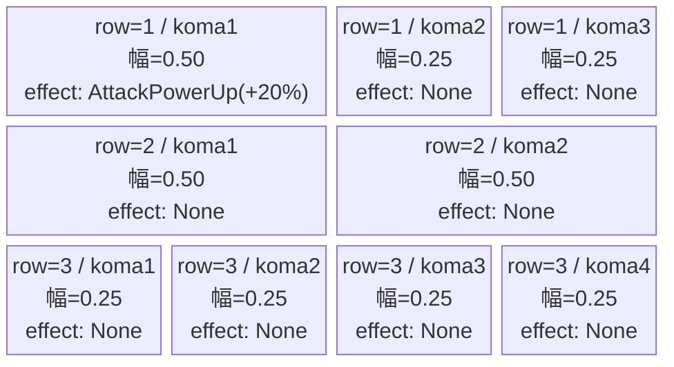

# vd_jig_normal_00001 インゲームデータ詳細解説

> 参照リポジトリ: `projects/glow-masterdata`
> リリースキー: 202604010

## インゲーム要件テキスト

門神（`e_jig_00001_vd_Normal_Green`）と極楽蝶（`e_jig_00401_vd_Normal_Green`）を主軸に、ファントム（`e_glo_00001_vd_Normal_Colorless`）を交えた合計22体以上の雑魚が登場する。序盤は門神とファントムが時間差で押し寄せ、中盤はFriendUnitDeadトリガーで極楽蝶が強化波として出現する。終盤は2本の99無限補充でフィールドを圧迫し続ける設計。UR対抗キャラ「がらんの画眉丸（`chara_jig_00001`）」に対応したDefense属性の敵が多く、門神はDefense, Green属性でロイドのURコマ効果への対抗を意識している。

コマは3行構成で、アセットキー `jig_00002`（back_ground_offset: -1.0）を全行に使用。行1はランダム1〜4コマの抽選対象（今回はパターン8: 3コマ、幅0.5/0.25/0.25）、行2はパターン6（2コマ均等）、行3はパターン12（4コマ均等）を設定する。コマエフェクトはrow1のkoma1にAttackPowerUp（+20%）を設定し、画眉丸対抗の攻撃力バフコマとして機能させる。

---

## レベルデザイン

### 敵キャラ設計

#### 敵キャラ選定（MstEnemyCharacter）

| mst_enemy_character_id | 日本語名 | 役割 | 備考 |
|------------------------|---------|------|------|
| enemy_jig_00001 | 門神 | 雑魚 | Defense/Green。画眉丸のUR対抗ギミックと連動 |
| enemy_jig_00401 | 極楽蝶 | 雑魚 | Attack/Green。knockback=4と高いため、押し返し演出あり |
| enemy_glo_00001 | ファントム（VD汎用） | 雑魚 | Colorless。序盤の土台として使用 |

#### 敵キャラステータス（MstEnemyStageParameter）

> vd_all/data/MstEnemyStageParameter.csv より参照（既存エントリ）

| MstEnemyStageParameter ID | 日本語名 | kind | role | color | base_hp | base_atk | base_spd | well_dist | knockback | combo | drop_bp |
|--------------------------|---------|------|------|-------|---------|----------|----------|-----------|-----------|-------|---------|
| e_jig_00001_vd_Normal_Green | 門神 | Normal | Defense | Green | 3500 | 50 | 31 | 0.21 | 2 | 1 | 150 |
| e_jig_00401_vd_Normal_Green | 極楽蝶 | Normal | Attack | Green | 3000 | 100 | 32 | 0.24 | 4 | 1 | 100 |
| e_glo_00001_vd_Normal_Colorless | ファントム（VD） | Normal | Attack | Colorless | 5000 | 100 | 34 | 0.22 | 3 | 1 | 150 |

---

### コマ設計

※ columns は1つのみ。各行のスパン合計 = 4。

| row | height | 選択パターン | コマ数 | 各幅 | 幅合計 |
|-----|--------|------------|-------|------|--------|
| 1 | 0.33 | パターン8 | 3 | 0.50, 0.25, 0.25 | 1.0 |
| 2 | 0.33 | パターン6 | 2 | 0.50, 0.50 | 1.0 |
| 3 | 0.34 | パターン12 | 4 | 0.25, 0.25, 0.25, 0.25 | 1.0 |

---

### 敵キャラシーケンス設計

> **c_キャラ同時出現ルール（プランナー確認済み）**: c_キャラ（`c_` プレフィックス）が複数体登場する場合、
> 初回のみ `ElapsedTime`、2体目以降は `FriendUnitDead`（前の c_キャラの sequence_element_id を
> condition_value に指定）でチェーンすること。また c_キャラの `summon_count` は必ず `1` とすること。`e_glo_*` は対象外。

#### どのフェーズで、どの敵を、いつ、どこに、どのくらい出現させるか

```mermaid
flowchart LR
  Start([開始]) --> E1[ElapsedTime: 250ms\n門神 3体 / interval=0\nelem=1]
  E1 --> E2[ElapsedTime: 1000ms\nファントム 4体 / interval=50\nelem=2]
  E2 --> E3[ElapsedTime: 2000ms\n門神 4体 / interval=0\nelem=3]
  E3 --> E4[ElapsedTime: 3000ms\n極楽蝶 3体 / interval=200\nelem=4]
  E4 --> E5[ElapsedTime: 4000ms\n門神 4体 / interval=0\nelem=5]
  E5 --> FD6[FriendUnitDead: 5体\n極楽蝶 3体 / interval=100\nelem=6]
  FD6 --> FD7[FriendUnitDead: 10体\nファントム 2体 / interval=0\nposition=1.3\nelem=7]
  FD7 --> FD8[FriendUnitDead: 15体\n門神 summon_count=99 / interval=500\nelem=8]
  FD8 --> FD9[FriendUnitDead: 15体\n極楽蝶 summon_count=99 / interval=750\nelem=9]
```

| elem | 出現タイミング | 敵 | 数 | 累計出現数/召喚位置 |
|------|-------------|---|---|-----------------|
| 1 | ElapsedTime=250ms | 門神 (e_jig_00001_vd_Normal_Green) | 3 | 累計3 |
| 2 | ElapsedTime=1000ms | ファントム (e_glo_00001_vd_Normal_Colorless) | 4 | 累計7 |
| 3 | ElapsedTime=2000ms | 門神 (e_jig_00001_vd_Normal_Green) | 4 | 累計11 |
| 4 | ElapsedTime=3000ms | 極楽蝶 (e_jig_00401_vd_Normal_Green) | 3 | 累計14 |
| 5 | ElapsedTime=4000ms | 門神 (e_jig_00001_vd_Normal_Green) | 4 | 累計18 |
| 6 | FriendUnitDead=5 | 極楽蝶 (e_jig_00401_vd_Normal_Green) | 3 | 累計21 |
| 7 | FriendUnitDead=10 | ファントム (e_glo_00001_vd_Normal_Colorless) | 2 | 累計23 / position=1.3 |
| 8 | FriendUnitDead=15 | 門神 (e_jig_00001_vd_Normal_Green) | 99 | 終盤無限補充 / interval=500 |
| 9 | FriendUnitDead=15 | 極楽蝶 (e_jig_00401_vd_Normal_Green) | 99 | 終盤無限補充 / interval=750 |

#### 敵キャラの固有ステータス調整（hp_coef / atk_coef）

| 波/フェーズ | 敵 | base_hp | hp_coef | 実HP | base_atk | atk_coef | 実ATK |
|-----------|---|---------|---------|------|----------|----------|-------|
| 序盤(elem1〜2) | 門神 | 3500 | 1.0 | 3500 | 50 | 1.0 | 50 |
| 序盤(elem1〜2) | ファントム | 5000 | 1.0 | 5000 | 100 | 1.0 | 100 |
| 中盤(elem3〜5) | 門神 | 3500 | 1.0 | 3500 | 50 | 1.0 | 50 |
| 中盤(elem4) | 極楽蝶 | 3000 | 1.0 | 3000 | 100 | 1.0 | 100 |
| 終盤(elem6〜9) | 極楽蝶 | 3000 | 1.0 | 3000 | 100 | 1.0 | 100 |
| 終盤(elem7) | ファントム | 5000 | 1.0 | 5000 | 100 | 1.0 | 100 |
| 無限補充(elem8〜9) | 門神/極楽蝶 | — | 1.0 | — | — | 1.0 | — |

> ※ 全coef=1.0（VD固定値）

#### フェーズ切り替えはあるか

なし（VDではSwitchSequenceGroup使用禁止）

---

## 演出

### アセット

#### 背景

| 設定箇所 | アセットキー | 備考 |
|---------|------------|------|
| loop_background_asset_key | jig_00002 | MstInGame.loop_background_asset_key に設定 |

#### BGM

| 設定 | 値 | 備考 |
|-----|---|------|
| bgm_asset_key | SSE_SBG_003_010 | normalブロック固定BGM |
| boss_bgm_asset_key | （空文字） | normalブロックはボスなし |

---

### 敵キャラオーラ

| オーラ種別 | 使用箇所 |
|----------|---------|
| Default | 全敵キャラ（elem1〜9 全て Default） |

---

### 敵キャラ召喚アニメーション

全要素 `summon_animation_type=None`。VDノーマルブロック標準設定。elem7のファントム（FriendUnitDead=10）は position=1.3 に召喚し、中盤の拠点付近への圧力演出として機能させる。

---

## MstInGame 設定サマリ

| カラム | 値 |
|-------|---|
| id | vd_jig_normal_00001 |
| release_key | 202604010 |
| content_type | Dungeon |
| stage_type | vd_normal |
| bgm_asset_key | SSE_SBG_003_010 |
| boss_bgm_asset_key | （空文字） |
| loop_background_asset_key | jig_00002 |
| mst_page_id | vd_jig_normal_00001 |
| mst_enemy_outpost_id | vd_jig_normal_00001 |
| boss_mst_enemy_stage_parameter_id | （空文字） |
| mst_auto_player_sequence_id | vd_jig_normal_00001 |
| mst_auto_player_sequence_set_id | vd_jig_normal_00001 |
| normal_enemy_hp_coef | 1.0 |
| normal_enemy_attack_coef | 1.0 |
| normal_enemy_speed_coef | 1.0 |
| boss_enemy_hp_coef | 1.0 |
| boss_enemy_attack_coef | 1.0 |
| boss_enemy_speed_coef | 1.0 |

## MstEnemyOutpost 設定サマリ

| カラム | 値 |
|-------|---|
| id | vd_jig_normal_00001 |
| hp | 100 |
| release_key | 202604010 |

## MstPage 設定サマリ

| カラム | 値 |
|-------|---|
| id | vd_jig_normal_00001 |
| release_key | 202604010 |

## MstKomaLine 設定サマリ

| id | mst_page_id | row | height | layout | koma1_asset_key | koma1_width | koma1_bg_offset | koma1_effect_type | koma1_effect_p1 |
|----|------------|-----|--------|--------|-----------------|-------------|-----------------|-------------------|-----------------|
| vd_jig_normal_00001_1 | vd_jig_normal_00001 | 1 | 0.33 | 8 | jig_00002 | 0.50 | -1.0 | AttackPowerUp | 20 |
| vd_jig_normal_00001_2 | vd_jig_normal_00001 | 2 | 0.33 | 6 | jig_00002 | 0.50 | -1.0 | None | 0 |
| vd_jig_normal_00001_3 | vd_jig_normal_00001 | 3 | 0.34 | 12 | jig_00002 | 0.25 | -1.0 | None | 0 |

> row=1: koma2（jig_00002, 幅0.25, offset=-1.0, effect=None）, koma3（jig_00002, 幅0.25, offset=-1.0, effect=None）
> row=2: koma2（jig_00002, 幅0.50, offset=-1.0, effect=None）
> row=3: koma2（jig_00002, 幅0.25, offset=-1.0, effect=None）, koma3（jig_00002, 幅0.25, offset=-1.0, effect=None）, koma4（jig_00002, 幅0.25, offset=-1.0, effect=None）

## MstAutoPlayerSequence 設定サマリ

| id | sequence_set_id | sequence_element_id | condition_type | condition_value | action_value | summon_count | summon_interval | summon_position | aura_type | death_type | enemy_hp_coef | enemy_attack_coef | enemy_speed_coef | defeated_score | summon_animation_type |
|----|-----------------|---------------------|----------------|-----------------|--------------|--------------|-----------------|-----------------|-----------|-----------|---------------|-------------------|------------------|----------------|-----------------------|
| vd_jig_normal_00001_1 | vd_jig_normal_00001 | 1 | ElapsedTime | 250 | e_jig_00001_vd_Normal_Green | 3 | 0 | | Default | Normal | 1.0 | 1.0 | 1.0 | 0 | None |
| vd_jig_normal_00001_2 | vd_jig_normal_00001 | 2 | ElapsedTime | 1000 | e_glo_00001_vd_Normal_Colorless | 4 | 50 | | Default | Normal | 1.0 | 1.0 | 1.0 | 0 | None |
| vd_jig_normal_00001_3 | vd_jig_normal_00001 | 3 | ElapsedTime | 2000 | e_jig_00001_vd_Normal_Green | 4 | 0 | | Default | Normal | 1.0 | 1.0 | 1.0 | 0 | None |
| vd_jig_normal_00001_4 | vd_jig_normal_00001 | 4 | ElapsedTime | 3000 | e_jig_00401_vd_Normal_Green | 3 | 200 | | Default | Normal | 1.0 | 1.0 | 1.0 | 0 | None |
| vd_jig_normal_00001_5 | vd_jig_normal_00001 | 5 | ElapsedTime | 4000 | e_jig_00001_vd_Normal_Green | 4 | 0 | | Default | Normal | 1.0 | 1.0 | 1.0 | 0 | None |
| vd_jig_normal_00001_6 | vd_jig_normal_00001 | 6 | FriendUnitDead | 5 | e_jig_00401_vd_Normal_Green | 3 | 100 | | Default | Normal | 1.0 | 1.0 | 1.0 | 0 | None |
| vd_jig_normal_00001_7 | vd_jig_normal_00001 | 7 | FriendUnitDead | 10 | e_glo_00001_vd_Normal_Colorless | 2 | 0 | 1.3 | Default | Normal | 1.0 | 1.0 | 1.0 | 0 | None |
| vd_jig_normal_00001_8 | vd_jig_normal_00001 | 8 | FriendUnitDead | 15 | e_jig_00001_vd_Normal_Green | 99 | 500 | | Default | Normal | 1.0 | 1.0 | 1.0 | 0 | None |
| vd_jig_normal_00001_9 | vd_jig_normal_00001 | 9 | FriendUnitDead | 15 | e_jig_00401_vd_Normal_Green | 99 | 750 | | Default | Normal | 1.0 | 1.0 | 1.0 | 0 | None |
