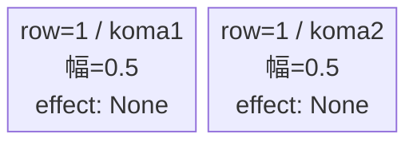
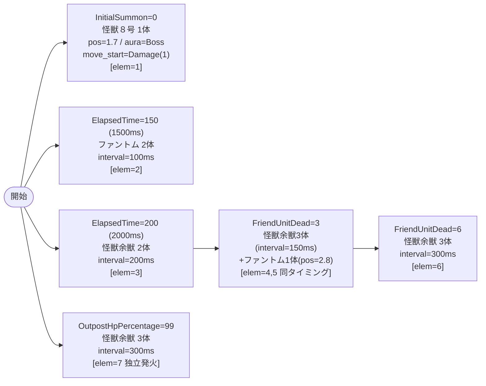

# vd_kai_boss_00001 インゲームデータ詳細解説

> 参照リポジトリ: `projects/glow-masterdata`
> リリースキー: 202604010

## インゲーム要件テキスト

UR対抗キャラ「隠された英雄の姿 怪獣８号」（`c_kai_00002_vd_Boss_Yellow`）がボスとして砦付近（position=1.7）に開幕即配置し、初ダメージを受けるまで待機状態を保つ。1500ms後にファントム2体が前衛を形成し、2000ms後に怪獣余獣2体が追加。累計3体撃破後は怪獣余獣3体と後方ファントム1体（pos=2.8）が同時展開する。さらに6体撃破後は怪獣余獣3体が追加。拠点に初ダメージが入ると独立したトリガーで怪獣余獣3体が援護を展開する。ボスを主役にした適度な雑魚量で、ボス撃破に集中できる設計。

コマは1行・2等分（パターン6、幅0.5/0.5）のシンプル構成。コマアセットキーは `kai_00001`、`koma1_back_ground_offset = -1.0`。ボス本体が「隠された英雄の姿 怪獣８号」（chara_kai_00002）のVD敵バージョンであるため、同URキャラのコマ効果・スキルが戦闘上の対抗手段となる。

---

## レベルデザイン

### 敵キャラ設計

#### 敵キャラ選定（MstEnemyCharacter）

| mst_enemy_character_id | 日本語名 | 役割 | 備考 |
|------------------------|---------|------|------|
| chara_kai_00002 | 隠された英雄の姿 怪獣８号 | ボス | VD UR対抗キャラ本体 |
| enemy_kai_00101 | 怪獣 余獣 | 雑魚 | |
| enemy_glo_00001 | ファントム | 雑魚 | グロー汎用 |

#### 敵キャラステータス（MstEnemyStageParameter）

> 全て `vd_all/data/MstEnemyStageParameter.csv` 参照（既存データ）。新規追加なし。

| MstEnemyStageParameter ID | 日本語名 | kind | role | color | base_hp | base_atk | base_spd | well_dist | knockback | combo | drop_bp |
|--------------------------|---------|------|------|-------|---------|----------|----------|-----------|-----------|-------|---------|
| c_kai_00002_vd_Boss_Yellow | 隠された英雄の姿 怪獣８号 | Boss | Support | Yellow | 700,000 | 1,700 | 45 | 0.20 | 1 | 5 | 10 |
| e_kai_00101_vd_Normal_Yellow | 怪獣 余獣 | Normal | Defense | Yellow | 25,000 | 350 | 45 | 0.11 | 1 | 1 | 10 |
| e_glo_00001_vd_Normal_Colorless | ファントム | Normal | Attack | Colorless | 5,000 | 100 | 34 | 0.22 | 3 | 1 | 150 |

---

### コマ設計

※ bossブロックは MstKomaLine が1行固定。

| row | height | 選択パターン | コマ数 | 各幅 | 幅合計 |
|-----|--------|------------|-------|------|--------|
| 1 | 1.0 | パターン6 | 2 | 0.5, 0.5 | 1.0 |

---

### 敵キャラシーケンス設計

> **c_キャラ同時出現ルール（プランナー確認済み）**: c_キャラ（`c_` プレフィックス）が複数体登場する場合、
> 初回のみ `ElapsedTime`、2体目以降は `FriendUnitDead`（前の c_キャラの sequence_element_id を
> condition_value に指定）でチェーンすること。また c_キャラの `summon_count` は必ず `1` とすること。`e_glo_*` は対象外。
>
> 本ブロックでは c_キャラ（怪獣８号）は elem=1 の1体のみのため、チェーン制約の適用なし。

> **ボスの二重設定（必須）**: `MstInGame.boss_mst_enemy_stage_parameter_id = c_kai_00002_vd_Boss_Yellow` に加え、
> `MstAutoPlayerSequence` の InitialSummon（elem=1）でも同じIDを設定すること。

#### どのフェーズで、どの敵を、いつ、どこに、どのくらい出現させるか

| elem | 出現タイミング | 敵 | 数 | 累計出現数 / 召喚位置 |
|------|-------------|---|---|-----------------|
| 1 | InitialSummon=0 | 怪獣８号（ボス） | 1 | 1体 / pos=1.7 |
| 2 | ElapsedTime=150 (1500ms) | ファントム | 2 | 3体 / デフォルト |
| 3 | ElapsedTime=200 (2000ms) | 怪獣余獣 | 2 | 5体 / デフォルト |
| 4 | FriendUnitDead=3 | 怪獣余獣 | 3 | 8体 / デフォルト |
| 5 | FriendUnitDead=3（elem=4と同タイミング） | ファントム | 1 | 9体 / pos=2.8 |
| 6 | FriendUnitDead=6 | 怪獣余獣 | 3 | 12体 / デフォルト |
| 7 | OutpostHpPercentage=99（独立トリガー） | 怪獣余獣 | 3 | 15体 / デフォルト |

#### 敵キャラの固有ステータス調整（hp_coef / atk_coef）

| 波/フェーズ | 敵 | base_hp | hp_coef | 実HP | base_atk | atk_coef | 実ATK |
|-----------|---|---------|---------|------|----------|----------|-------|
| ボス（elem=1） | 怪獣８号 | 700,000 | 1.0 | 700,000 | 1,700 | 1.0 | 1,700 |
| 全雑魚（elem=3,4,6,7） | 怪獣余獣 | 25,000 | 1.0 | 25,000 | 350 | 1.0 | 350 |
| 全雑魚（elem=2,5） | ファントム | 5,000 | 1.0 | 5,000 | 100 | 1.0 | 100 |

> 雑魚合計14体（ボス除く）。bossブロックはボス撃破を主目的とした軽量な雑魚構成。

#### フェーズ切り替えはあるか

なし（VDでは SwitchSequenceGroup 使用禁止）

---

## 演出

### アセット

#### 背景

| 設定箇所 | アセットキー | 備考 |
|---------|------------|------|
| MstInGame.loop_background_asset_key | kai_00001 | 怪獣8号シリーズ背景 |

#### BGM

| 設定 | 値 | 備考 |
|-----|---|------|
| bgm_asset_key | SSE_SBG_003_004 | bossブロック固定BGM |
| boss_bgm_asset_key | （空欄） | BGM切り替えなし |

---

### 敵キャラオーラ

| オーラ種別 | 使用箇所 |
|----------|---------|
| Boss | elem=1（怪獣８号ボス） |
| Default | elem=2〜7（ファントム・怪獣余獣すべて） |

---

### 敵キャラ召喚アニメーション

- elem=1（InitialSummon）: 怪獣８号が砦付近（pos=1.7）に初期配置。`move_start_condition_type=Damage`、`move_start_condition_value=1`（初ダメージを受けてから前進開始）。
- elem=2〜7（SummonEnemy）: 全て `summon_animation_type=None`（通常召喚）。

---

## テーブル設定値サマリ

### MstInGame

| カラム | 値 |
|-------|---|
| id | vd_kai_boss_00001 |
| release_key | 202604010 |
| content_type | Dungeon |
| stage_type | vd_boss |
| mst_page_id | vd_kai_boss_00001 |
| mst_enemy_outpost_id | vd_kai_boss_00001 |
| boss_mst_enemy_stage_parameter_id | c_kai_00002_vd_Boss_Yellow |
| mst_auto_player_sequence_id | vd_kai_boss_00001 |
| mst_auto_player_sequence_set_id | vd_kai_boss_00001 |
| bgm_asset_key | SSE_SBG_003_004 |
| boss_bgm_asset_key | （空欄） |
| loop_background_asset_key | kai_00001 |
| normal_enemy_hp_coef | 1.0 |
| normal_enemy_attack_coef | 1.0 |
| normal_enemy_speed_coef | 1.0 |
| boss_enemy_hp_coef | 1.0 |
| boss_enemy_attack_coef | 1.0 |
| boss_enemy_speed_coef | 1.0 |

### MstEnemyOutpost

| カラム | 値 |
|-------|---|
| id | vd_kai_boss_00001 |
| hp | 1000（bossブロック固定） |

### MstKomaLine

| row | height | koma_line_layout_asset_key | koma1_asset_key | koma1_back_ground_offset | koma1_effect_type | koma1_effect_parameter1 | koma1_effect_parameter2 | koma1_effect_target_colors | koma1_effect_target_roles | koma2_effect_type | koma3_effect_type | koma4_effect_type |
|-----|--------|--------------------------|-----------------|--------------------------|-------------------|------------------------|------------------------|--------------------------|--------------------------|-------------------|-------------------|-------------------|
| 1 | 1.0 | 6 | kai_00001 | -1.0 | None | 0 | 0 | All | All | None | None | None |
