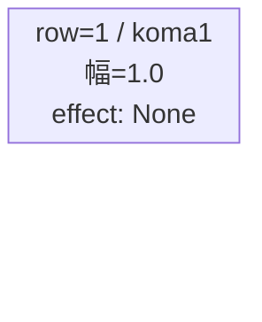
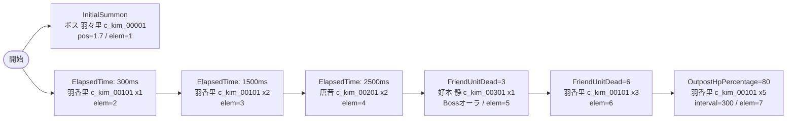

# vd_kim_boss_00001 インゲームデータ詳細解説

> 参照リポジトリ: `projects/glow-masterdata`
> リリースキー: 202604010

## インゲーム要件テキスト

ボスステージ。開幕からボス「溢れる母性 花園 羽々里」（c_kim_00001_vd_Boss_Red、HP 50,000）がInitialSummonで中央後方に出現し、プレイヤーを迎え撃つ。雑魚キャラは「花園 羽香里」（c_kim_00101、HP 10,000）が序盤、「院田 唐音」（c_kim_00201、HP 10,000）が中盤ElapsedTimeで登場し戦力を補充する。FriendUnitDead=3 で「好本 静」（c_kim_00301、HP 50,000）がボスオーラつきで1体参戦し、さらに FriendUnitDead=6 でc_kim_00101が再登場・追撃してくる。拠点HP80%以下になると c_kim_00101 が大量降臨し、拠点防衛プレッシャーを与える設計。UR対抗キャラ「溢れる母性 花園 羽々里」（chara_kim_00001）の防御・回復系スキルを意識したギミックとして、ボスは高HP・低速の Defense ロール設定とした。

コマは1行・1コマのフルワイド構成（koma_asset_key: glo_00011）。bossブロックのためコマ1行固定。

UR対抗「溢れる母性 花園 羽々里」の防御特性を逆手に取り、雑魚の波状攻撃で拠点への継続ダメージを演出する拠点防衛型ボスステージ。

---

## レベルデザイン

### 敵キャラ設計

#### 敵キャラ選定（MstEnemyCharacter）

| mst_enemy_character_id | 日本語名 | 役割 | 備考 |
|------------------------|---------|------|------|
| chara_kim_00001 | 溢れる母性 花園 羽々里 | ボス | UR対抗キャラ。InitialSummonで開幕即配置 |
| chara_kim_00101 | 花園 羽香里 | 雑魚 | 序盤 & 拠点ダメージ時に多数登場 |
| chara_kim_00201 | 院田 唐音 | 雑魚 | 中盤ElapsedTimeで登場 |
| chara_kim_00301 | 好本 静 | 雑魚（準ボス） | FriendUnitDeadトリガーでボスオーラつきで登場 |

#### 敵キャラステータス（MstEnemyStageParameter）

> 全て `vd_all/data/MstEnemyStageParameter.csv` 参照（リリースキー 202604010）

| MstEnemyStageParameter ID | 日本語名 | kind | role | color | base_hp | base_atk | base_spd | well_dist | knockback | combo | drop_bp |
|--------------------------|---------|------|------|-------|---------|----------|----------|-----------|-----------|-------|---------|
| c_kim_00001_vd_Boss_Red | 溢れる母性 花園 羽々里 | Boss | Defense | Red | 50,000 | 100 | 40 | 0.18 | 2 | 5 | 300 |
| c_kim_00101_vd_Normal_Red | 花園 羽香里 | Normal | Attack | Red | 10,000 | 100 | 35 | 0.21 | 1 | 6 | 300 |
| c_kim_00201_vd_Normal_Red | 院田 唐音 | Normal | Technical | Red | 10,000 | 100 | 34 | 0.26 | 2 | 6 | 300 |
| c_kim_00301_vd_Normal_Red | 好本 静 | Normal | Support | Red | 50,000 | 300 | 40 | 0.18 | 2 | 5 | 300 |

---

### コマ設計

※ bossブロックのためMstKomaLineは1行固定。columns は 4（スパン合計 4）。

| row | height | 選択パターン | コマ数 | 各幅 | 幅合計 |
|-----|--------|------------|-------|------|--------|
| 1 | 1.0 | パターン1 | 1 | 1.0 | 1.0 |

---

### 敵キャラシーケンス設計

> **c_キャラ同時出現ルール（プランナー確認済み）**: c_キャラ（`c_` プレフィックス）が複数体登場する場合、
> 初回のみ `ElapsedTime`、2体目以降は `FriendUnitDead`（前の c_キャラの sequence_element_id を
> condition_value に指定）でチェーンすること。また c_キャラの `summon_count` は必ず `1` とすること。`e_glo_*` は対象外。

#### どのフェーズで、どの敵を、いつ、どこに、どのくらい出現させるか

| elem | 出現タイミング | 敵 | 数 | 累計出現数/召喚位置 |
|------|-------------|---|---|-----------------|
| 1 | InitialSummon=0 | 溢れる母性 花園 羽々里 (c_kim_00001_vd_Boss_Red) | 1 | 1体 / pos=1.7 |
| 2 | ElapsedTime=300ms | 花園 羽香里 (c_kim_00101_vd_Normal_Red) | 1 | 2体 / pos=なし |
| 3 | ElapsedTime=1500ms | 花園 羽香里 (c_kim_00101_vd_Normal_Red) | 2 | 4体 / pos=なし |
| 4 | ElapsedTime=2500ms | 院田 唐音 (c_kim_00201_vd_Normal_Red) | 2 | 6体 / pos=なし |
| 5 | FriendUnitDead=3 | 好本 静 (c_kim_00301_vd_Normal_Red) | 1 | 7体 / pos=なし |
| 6 | FriendUnitDead=6 | 花園 羽香里 (c_kim_00101_vd_Normal_Red) | 3 | 10体 / pos=なし |
| 7 | OutpostHpPercentage=80 | 花園 羽香里 (c_kim_00101_vd_Normal_Red) | 5 | 15体 / pos=なし |

#### 敵キャラの固有ステータス調整（hp_coef / atk_coef）

| 波/フェーズ | 敵 | base_hp | hp_coef | 実HP | base_atk | atk_coef | 実ATK |
|-----------|---|---------|---------|------|----------|----------|-------|
| 開幕 | 溢れる母性 花園 羽々里 | 50,000 | 1.0 | 50,000 | 100 | 1.0 | 100 |
| 序盤〜中盤 | 花園 羽香里 | 10,000 | 1.0 | 10,000 | 100 | 1.0 | 100 |
| 中盤 | 院田 唐音 | 10,000 | 1.0 | 10,000 | 100 | 1.0 | 100 |
| 中盤〜終盤 | 好本 静 | 50,000 | 1.0 | 50,000 | 300 | 1.0 | 300 |

#### フェーズ切り替えはあるか

なし（VDではSwitchSequenceGroup使用禁止）

---

## 演出

### アセット

#### 背景

| 設定箇所 | アセットキー | 備考 |
|---------|------------|------|
| MstPage.background_asset_key | （アセット担当者確認推奨） | 100カノ作品背景 |
| MstEnemyOutpost.artwork_asset_key | （アセット担当者確認推奨） | VD用アウトポストアート |

#### BGM

| 設定 | 値 | 備考 |
|-----|---|------|
| bgm_asset_key | SSE_SBG_003_004 | bossブロック固定値 |

---

### 敵キャラオーラ

| オーラ種別 | 使用箇所 |
|----------|---------|
| Boss | c_kim_00001（ボス）および c_kim_00301（FriendUnitDead=3で登場する好本 静） |
| Default | c_kim_00101、c_kim_00201（雑魚） |

---

### 敵キャラ召喚アニメーション

- **elem=1 (InitialSummon)**: ボス「溢れる母性 花園 羽々里」が開幕から position=1.7 に召喚。`summon_animation_type=None`。
- **elem=2〜4 (ElapsedTime)**: 雑魚が順次登場。いずれも `summon_animation_type=None`。
- **elem=5 (FriendUnitDead=3)**: 「好本 静」がボスオーラつきで登場。`summon_animation_type=None`。
- **elem=6 (FriendUnitDead=6)**: 「花園 羽香里」が3体追撃。`summon_animation_type=None`。
- **elem=7 (OutpostHpPercentage=80)**: 拠点が80%以下になると「花園 羽香里」が5体一気に押し寄せ、拠点防衛プレッシャーを演出。`summon_animation_type=None`。

---

## テーブル設定値まとめ

### MstInGame

| カラム | 値 |
|-------|---|
| id | vd_kim_boss_00001 |
| release_key | 202604010 |
| content_type | Dungeon |
| stage_type | vd_boss |
| mst_page_id | vd_kim_boss_00001 |
| mst_enemy_outpost_id | vd_kim_boss_00001 |
| boss_mst_enemy_stage_parameter_id | c_kim_00001_vd_Boss_Red |
| mst_auto_player_sequence_set_id | vd_kim_boss_00001 |
| bgm_asset_key | SSE_SBG_003_004 |

### MstEnemyOutpost

| カラム | 値 |
|-------|---|
| id | vd_kim_boss_00001 |
| release_key | 202604010 |
| hp | 1000 |

### MstPage

| カラム | 値 |
|-------|---|
| id | vd_kim_boss_00001 |
| release_key | 202604010 |

### MstKomaLine（1行固定）

| カラム | 値 |
|-------|---|
| id | vd_kim_boss_00001 |
| release_key | 202604010 |
| mst_page_id | vd_kim_boss_00001 |
| row | 1 |
| height | 1.0 |
| koma_line_layout_asset_key | 1 |
| koma1_asset_key | glo_00011 |
| koma1_back_ground_offset | -1.0 |
| koma1_effect_type | None |
| koma1_effect_parameter1 | 0 |
| koma1_effect_parameter2 | 0 |
| koma1_effect_target_colors | All |
| koma1_effect_target_roles | All |
| koma2_effect_type | None |
| koma3_effect_type | None |
| koma4_effect_type | None |

### MstAutoPlayerSequence（sequence_set_id = vd_kim_boss_00001）

| sequence_element_id | sequence_set_id | condition_type | condition_value | action_type | action_value | summon_count | summon_interval | summon_position | aura_type | summon_animation_type | death_type | defeated_score | move_start_condition_type | move_stop_condition_type | move_restart_condition_type | deactivation_condition_type |
|---|---|---|---|---|---|---|---|---|---|---|---|---|---|---|---|---|
| vd_kim_boss_00001_1 | vd_kim_boss_00001 | InitialSummon | 0 | SummonEnemy | c_kim_00001_vd_Boss_Red | 1 | 0 | 1.7 | Boss | None | Normal | 0 | None | None | None | None |
| vd_kim_boss_00001_2 | vd_kim_boss_00001 | ElapsedTime | 300 | SummonEnemy | c_kim_00101_vd_Normal_Red | 1 | 0 | | Default | None | Normal | 0 | None | None | None | None |
| vd_kim_boss_00001_3 | vd_kim_boss_00001 | ElapsedTime | 1500 | SummonEnemy | c_kim_00101_vd_Normal_Red | 2 | 200 | | Default | None | Normal | 0 | None | None | None | None |
| vd_kim_boss_00001_4 | vd_kim_boss_00001 | ElapsedTime | 2500 | SummonEnemy | c_kim_00201_vd_Normal_Red | 2 | 300 | | Default | None | Normal | 0 | None | None | None | None |
| vd_kim_boss_00001_5 | vd_kim_boss_00001 | FriendUnitDead | 3 | SummonEnemy | c_kim_00301_vd_Normal_Red | 1 | 0 | | Boss | None | Normal | 0 | None | None | None | None |
| vd_kim_boss_00001_6 | vd_kim_boss_00001 | FriendUnitDead | 6 | SummonEnemy | c_kim_00101_vd_Normal_Red | 3 | 200 | | Default | None | Normal | 0 | None | None | None | None |
| vd_kim_boss_00001_7 | vd_kim_boss_00001 | OutpostHpPercentage | 80 | SummonEnemy | c_kim_00101_vd_Normal_Red | 5 | 300 | | Default | None | Normal | 0 | None | None | None | None |
