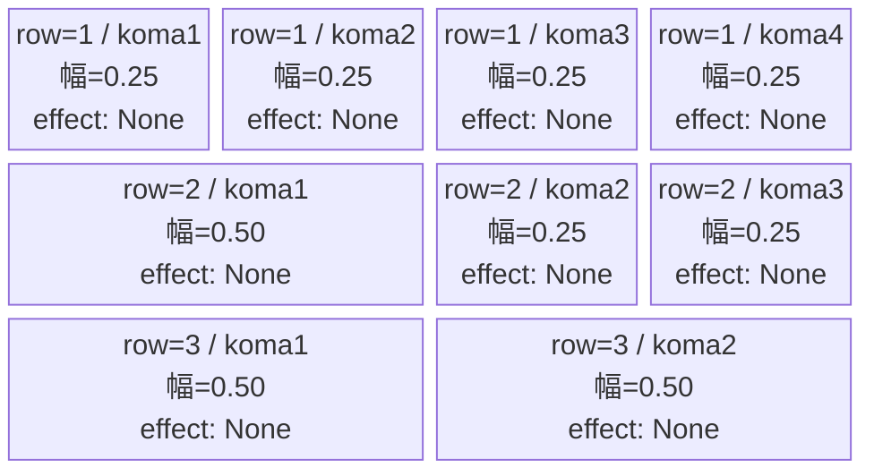

# vd_kim_normal_00001 インゲームデータ詳細解説

> 参照リポジトリ: `projects/glow-masterdata`
> リリースキー: 202604010

## インゲーム要件テキスト

ファントム（Colorless/Attack・HP5,000）が開幕250msと中盤に合計11体、c_kim_00101（院田 唐音・Red/Attack・HP10,000）が4体、c_kim_00201（好本 静・Red/Technical・HP10,000）が4体、c_kim_00301（花園 羽香里・Red/Support・HP50,000）が2体の計21体構成。開幕はファントムで足場を作りながら院田 唐音・好本 静が時間差で次々と登場し、FriendUnitDeadトリガー連鎖で花園 羽香里が高HPの圧力をかけてくる設計。Red属性対策のコマを揃えることが攻略の鍵となる。

コマは3行固定（各行独立抽選）。row1=4等分4コマ（0.25×4）・row2=左広い3コマ（0.50, 0.25, 0.25）・row3=2等分2コマ（0.50, 0.50）。コマアセット: glo_00011（back_ground_offset: -1.0）。

UR対抗キャラ「溢れる母性 花園 羽々里」（chara_kim_00001）対抗。Red属性の c_kim キャラが主軸となり、Red属性対策コマを活かしたプレイが有効になる設計。

---

## レベルデザイン

### 敵キャラ設計

#### 敵キャラ選定（MstEnemyCharacter）

| mst_enemy_character_id | 日本語名 | 役割 | 備考 |
|------------------------|---------|------|------|
| chara_kim_00101 | 院田 唐音 | 雑魚 | Red属性・Attackロール。100カノ作品のヒロインキャラ |
| chara_kim_00201 | 好本 静 | 雑魚 | Red属性・Technicalロール。100カノ作品のヒロインキャラ |
| chara_kim_00301 | 花園 羽香里 | 強化雑魚 | Red属性・Supportロール。HP50,000の高耐久ヒロインキャラ |
| enemy_glo_00001 | ファントム | 雑魚（共通） | Colorless属性・Attackロール |

#### 敵キャラステータス（MstEnemyStageParameter）

> 全エントリ既存参照: `vd_all/data/MstEnemyStageParameter.csv`（release_key: 202604010）

| MstEnemyStageParameter ID | 日本語名 | character_unit_kind | role_type | color | hp | attack_power | move_speed | well_distance | damage_knock_back_count | attack_combo_cycle | drop_battle_point |
|--------------------------|---------|---------------------|-----------|-------|----|-------------|-----------|---------------|------------------------|-------------------|------------------|
| c_kim_00101_vd_Normal_Red | 院田 唐音 | Normal | Attack | Red | 10,000 | 100 | 35 | 0.21 | 1 | 6 | 300 |
| c_kim_00201_vd_Normal_Red | 好本 静 | Normal | Technical | Red | 10,000 | 100 | 34 | 0.26 | 2 | 6 | 300 |
| c_kim_00301_vd_Normal_Red | 花園 羽香里 | Normal | Support | Red | 50,000 | 300 | 40 | 0.18 | 2 | 5 | 300 |
| e_glo_00001_vd_Normal_Colorless | ファントム | Normal | Attack | Colorless | 5,000 | 100 | 34 | 0.22 | 3 | 1 | 150 |

---

### コマ設計

各行独立ランダム抽選（12パターンから）の結果（`koma1_asset_key`: `glo_00011`、`koma1_back_ground_offset`: `-1.0`）:

※ columns は1つのみ。各行のスパン合計 = 4 になること。

| row | height | 選択パターン | コマ数 | 各幅 | 幅合計 | koma1_asset_key | koma1_back_ground_offset |
|-----|--------|------------|-------|------|--------|----------------|-------------------------|
| 1 | 0.33 | パターン12「4等分」 | 4コマ | 0.25, 0.25, 0.25, 0.25 | 1.0 | glo_00011 | -1.0 |
| 2 | 0.33 | パターン8「左広い」 | 3コマ | 0.50, 0.25, 0.25 | 1.0 | glo_00011 | -1.0 |
| 3 | 0.34 | パターン6「2等分」 | 2コマ | 0.50, 0.50 | 1.0 | glo_00011 | -1.0 |

---

### 敵キャラシーケンス設計

> **c_キャラ同時出現ルール（プランナー確認済み）**: c_キャラ（`c_` プレフィックス）が複数体登場する場合、
> 初回のみ `ElapsedTime`、2体目以降は `FriendUnitDead`（前の c_キャラの sequence_element_id を
> condition_value に指定）でチェーンすること。また c_キャラの `summon_count` は必ず `1` とすること。`e_glo_*` は対象外。

#### どのフェーズで、どの敵を、いつ、どこに、どのくらい出現させるか

```mermaid
flowchart LR
  Start([開始]) --> E1["ElapsedTime 250ms\nファントム ×4\nDefault"]
  E1 --> E2["ElapsedTime 500ms\n院田 唐音 ×1\nDefault"]
  E2 --> E3["ElapsedTime 800ms\n好本 静 ×1\nDefault"]
  E3 --> E4["ElapsedTime 1500ms\nファントム ×4\nDefault"]
  E4 --> E5["ElapsedTime 2000ms\n院田 唐音 ×1\nDefault"]
  E5 --> E6["ElapsedTime 2500ms\n好本 静 ×1\nDefault"]
  E6 --> FUD4["FriendUnitDead=4\nファントム ×4\nDefault"]
  FUD4 --> FUD6["FriendUnitDead=6\n花園 羽香里 ×1\nBoss"]
  FUD6 --> FUD8a["FriendUnitDead=8\n院田 唐音 ×1\nDefault"]
  FUD8a --> FUD8b["FriendUnitDead=8\nファントム ×3\nDefault"]
  FUD8b --> FUD10["FriendUnitDead=10\n好本 静 ×1\nDefault"]
  FUD10 --> FUD12a["FriendUnitDead=12\n院田 唐音 ×1\nDefault"]
  FUD12a --> FUD12b["FriendUnitDead=12\nファントム ×4\nDefault"]
  FUD12b --> FUD14["FriendUnitDead=14\n花園 羽香里 ×1\nBoss"]
  FUD14 --> FUD15["FriendUnitDead=15\n好本 静 ×1\nDefault"]
  FUD15 --> End([終了])
```

| elem | 出現タイミング | 敵 | 数 | 累計出現数 |
|------|-------------|---|---|---------|
| 1 | ElapsedTime 250ms | ファントム (e_glo_00001_vd_Normal_Colorless) | 4 | 4 |
| 2 | ElapsedTime 500ms | 院田 唐音 (c_kim_00101_vd_Normal_Red) | 1 | 5 |
| 3 | ElapsedTime 800ms | 好本 静 (c_kim_00201_vd_Normal_Red) | 1 | 6 |
| 4 | ElapsedTime 1500ms | ファントム (e_glo_00001_vd_Normal_Colorless) | 4 | 10 |
| 5 | ElapsedTime 2000ms | 院田 唐音 (c_kim_00101_vd_Normal_Red) | 1 | 11 |
| 6 | ElapsedTime 2500ms | 好本 静 (c_kim_00201_vd_Normal_Red) | 1 | 12 |
| 7 | FriendUnitDead=4 | ファントム (e_glo_00001_vd_Normal_Colorless) | 4 | 16 |
| 8 | FriendUnitDead=6 | 花園 羽香里 (c_kim_00301_vd_Normal_Red) | 1 | 17 |
| 9 | FriendUnitDead=8 | 院田 唐音 (c_kim_00101_vd_Normal_Red) | 1 | 18 |
| 10 | FriendUnitDead=8 | ファントム (e_glo_00001_vd_Normal_Colorless) | 3 | 21 |
| 11 | FriendUnitDead=10 | 好本 静 (c_kim_00201_vd_Normal_Red) | 1 | 22 |
| 12 | FriendUnitDead=12 | 院田 唐音 (c_kim_00101_vd_Normal_Red) | 1 | 23 |
| 13 | FriendUnitDead=12 | ファントム (e_glo_00001_vd_Normal_Colorless) | 4 | 27 |
| 14 | FriendUnitDead=14 | 花園 羽香里 (c_kim_00301_vd_Normal_Red) | 1 | 28 |
| 15 | FriendUnitDead=15 | 好本 静 (c_kim_00201_vd_Normal_Red) | 1 | 29 |

合計: **29体**（要件「最低15体以上」を満たす）

> **c_キャラ召喚ガードレール確認**:
> - c_kim_00101（院田 唐音）: elem 2, 5, 9, 12 各1体ずつ。各エントリの summon_count=1。
> - c_kim_00201（好本 静）: elem 3, 6, 11, 15 各1体ずつ。各エントリの summon_count=1。
> - c_kim_00301（花園 羽香里）: elem 8, 14 各1体ずつ。FriendUnitDead=6, 14 の別タイミング。各エントリの summon_count=1。
> - 同一タイミングで複数の c_キャラが出現するケースなし。
> - ファントム（e_glo_00001）は `e_glo_*` のため c_キャラ制約対象外。

#### 敵キャラの固有ステータス調整（hp_coef / atk_coef）

MstAutoPlayerSequenceの `enemy_hp_coef` / `enemy_attack_coef` はすべてデフォルト値（1.0）を使用します。

| 波 | 敵 | base_hp | hp_coef | 実HP | base_atk | atk_coef | 実ATK |
|---|---|---------|---------|------|----------|----------|-------|
| 1, 4, 7, 10, 13 | ファントム | 5,000 | 1.0 | 5,000 | 100 | 1.0 | 100 |
| 2, 5, 9, 12 | 院田 唐音 | 10,000 | 1.0 | 10,000 | 100 | 1.0 | 100 |
| 3, 6, 11, 15 | 好本 静 | 10,000 | 1.0 | 10,000 | 100 | 1.0 | 100 |
| 8, 14 | 花園 羽香里 | 50,000 | 1.0 | 50,000 | 300 | 1.0 | 300 |

#### フェーズ切り替えはあるか

なし（VDではSwitchSequenceGroup使用禁止）

---

## 演出

### アセット

#### 背景

| 設定箇所 | アセットキー | 備考 |
|---------|------------|------|
| loop_background_asset_key | （空） | VDの背景切り替えはゲームロジック側で管理 |
| フロア0以上 | koma_background_vd_00001 | クライアント側でフロア係数に応じて切り替え |
| フロア20以上 | koma_background_vd_00003 | 同上 |
| フロア40以上 | koma_background_vd_00005 | 同上 |

#### BGM

| 設定 | 値 | 備考 |
|-----|---|------|
| bgm_asset_key | SSE_SBG_003_010 | ノーマルブロック用BGM |
| boss_bgm_asset_key | （空） | ノーマルブロックはボスBGMなし |

---

### 敵キャラオーラ

| オーラ種別 | 使用箇所 |
|----------|---------|
| Default | ファントム・院田 唐音・好本 静（通常雑魚） |
| Boss | 花園 羽香里（elem 8, 14）：高HP強化版の登場演出 |

---

### 敵キャラ召喚アニメーション

ElapsedTimeトリガーによる時間差召喚とFriendUnitDeadトリガーによる段階強化で構成。InitialSummonは使用しない（normalブロックはボスなし）。

ファントムは各波で複数体まとめて召喚（summon_interval=0）。c_kim_00101・c_kim_00201・c_kim_00301 はすべて summon_count=1 で1体ずつ丁寧に召喚。花園 羽香里（c_kim_00301）登場時は Bossオーラ付きで「高HPの強敵が来た」演出を演出する。

---

## 生成テーブルまとめ

| テーブル | 状態 | 備考 |
|---------|------|------|
| MstEnemyStageParameter | 既存参照 | `vd_all/data/MstEnemyStageParameter.csv` のエントリを使用（新規生成なし） |
| MstEnemyOutpost | 新規生成 | HP=100固定、is_damage_invalidation=空、id=vd_kim_normal_00001 |
| MstPage | 新規生成 | id=vd_kim_normal_00001 |
| MstKomaLine | 新規生成 | 3行固定（row=1〜3）、パターン12/8/6 |
| MstAutoPlayerSequence | 新規生成 | 15要素（合計29体、sequence_set_id=vd_kim_normal_00001） |
| MstInGame | 新規生成 | content_type=Dungeon、stage_type=vd_normal、ボスなし、release_key=202604010 |

---

## ID一覧

| テーブル | カラム | 値 |
|---------|--------|-----|
| MstInGame | id | vd_kim_normal_00001 |
| MstAutoPlayerSequence | sequence_set_id | vd_kim_normal_00001 |
| MstPage | id | vd_kim_normal_00001 |
| MstEnemyOutpost | id | vd_kim_normal_00001 |
| MstKomaLine | id（row1） | vd_kim_normal_00001_1 |
| MstKomaLine | id（row2） | vd_kim_normal_00001_2 |
| MstKomaLine | id（row3） | vd_kim_normal_00001_3 |
| MstAutoPlayerSequence | id（elem1） | vd_kim_normal_00001_1 |
| MstAutoPlayerSequence | id（elem2） | vd_kim_normal_00001_2 |
| MstAutoPlayerSequence | id（elem3） | vd_kim_normal_00001_3 |
| MstAutoPlayerSequence | id（elem4） | vd_kim_normal_00001_4 |
| MstAutoPlayerSequence | id（elem5） | vd_kim_normal_00001_5 |
| MstAutoPlayerSequence | id（elem6） | vd_kim_normal_00001_6 |
| MstAutoPlayerSequence | id（elem7） | vd_kim_normal_00001_7 |
| MstAutoPlayerSequence | id（elem8） | vd_kim_normal_00001_8 |
| MstAutoPlayerSequence | id（elem9） | vd_kim_normal_00001_9 |
| MstAutoPlayerSequence | id（elem10） | vd_kim_normal_00001_10 |
| MstAutoPlayerSequence | id（elem11） | vd_kim_normal_00001_11 |
| MstAutoPlayerSequence | id（elem12） | vd_kim_normal_00001_12 |
| MstAutoPlayerSequence | id（elem13） | vd_kim_normal_00001_13 |
| MstAutoPlayerSequence | id（elem14） | vd_kim_normal_00001_14 |
| MstAutoPlayerSequence | id（elem15） | vd_kim_normal_00001_15 |
