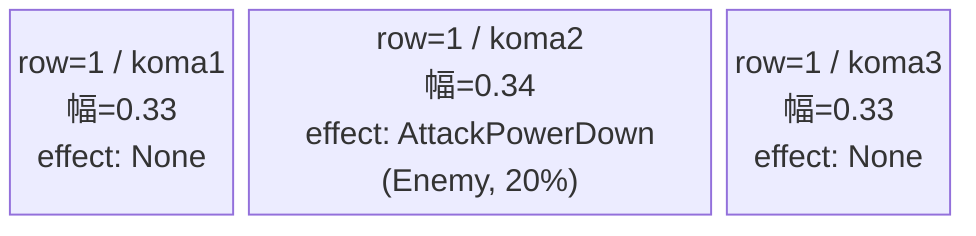
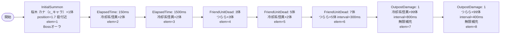

# vd_mag_boss_00001 インゲームデータ詳細解説

> 参照リポジトリ: `projects/glow-masterdata`
> リリースキー: 202604010

## インゲーム要件テキスト

UR対抗キャラ「絶対効率の体現者 土刃 メイ（chara_mag_00201）」を意識したボスブロック設計。開幕から「新人魔法少女 桜木 カナ（c_mag_00001_vd_Boss_Green）」がボスオーラ付きで砦付近に配置され、プレイヤーに即座にプレッシャーをかける。同時に冷却系怪異（e_mag_00001_vd_Normal_Green）が時間差で押し寄せ、序盤から手数が必要な構成にしている。フレンドユニットが一定数倒されるとつらら（e_mag_00101_vd_Normal_Green）が追加召喚され、ボスとの同時対処を強いる。さらに拠点への初ダメージを契機に両雑魚の大量補充が無限に続く設計。

コマは1行構成（bossブロック固定）。パターン7（3等分）を採用して3コマで横幅を均等分割する。コマアセットキーは `mag_00004`（back_ground_offset: 0.6）を使用。

「絶対効率の体現者 土刃 メイ」の攻撃力強化系コマ効果に対し、Greenカラーの強敵が多数出現することで、メイのコマ効果を活かしたプレイが求められる設計。ボスの二重設定として MstInGame.boss_mst_enemy_stage_parameter_id に `c_mag_00001_vd_Boss_Green` を設定し、InitialSummon でもボスを配置する。

---

## レベルデザイン

### 敵キャラ設計

#### 敵キャラ選定（MstEnemyCharacter）

| mst_enemy_character_id | 日本語名 | 役割 | 備考 |
|------------------------|---------|------|------|
| chara_mag_00001 | 新人魔法少女 桜木 カナ | ボス（c_キャラ） | 開幕からInitialSummonで配置。MstInGame.boss_mst_enemy_stage_parameter_idにも設定 |
| enemy_mag_00001 | 冷却系怪異 | 雑魚 | 高HP・攻撃力高め。ElapsedTimeで序盤から登場 |
| enemy_mag_00101 | つらら | 雑魚 | 低HP・高速移動。FriendUnitDead契機で追加召喚 |

#### 敵キャラステータス（MstEnemyStageParameter）

> 既存VDキュレーションCSV（vd_all/data/MstEnemyStageParameter.csv）より参照

| MstEnemyStageParameter ID | 日本語名 | kind | role | color | base_hp | base_atk | base_spd | well_dist | knockback | combo | drop_bp |
|--------------------------|---------|------|------|-------|---------|----------|----------|-----------|-----------|-------|---------|
| c_mag_00001_vd_Boss_Green | 新人魔法少女 桜木 カナ | Boss | Attack | Green | 320,000 | 1,200 | 45 | 0.40 | 2 | 5 | 10 |
| e_mag_00001_vd_Normal_Green | 冷却系怪異 | Normal | Attack | Green | 1,000,000 | 2,500 | 35 | 0.30 | 1 | 1 | 10 |
| e_mag_00101_vd_Normal_Green | つらら | Normal | Attack | Green | 20,000 | 400 | 100 | 0.11 | 1 | 1 | 10 |

---

### コマ設計

※ columns は1つのみ。各行のスパン合計 = 4になること。
※ row=1は3コマで幅合計1.0（0.33+0.34+0.33）。bossブロックは1行固定。

| row | height | 選択パターン | コマ数 | 各幅 | 幅合計 |
|-----|--------|------------|-------|------|--------|
| 1 | 1.0 | パターン7（3等分） | 3 | 0.33, 0.34, 0.33 | 1.0 |

**コマエフェクト設計**:
- row=1 / koma2: `AttackPowerDown` 20%（Enemy対象）― UR対抗キャラ「土刃 メイ」の攻撃力強化コマ効果への対抗ギミック。中央コマに配置することで通過を避けられない設計。

---

### 敵キャラシーケンス設計

> **c_キャラ同時出現ルール（プランナー確認済み）**: c_キャラ（`c_` プレフィックス）が複数体登場する場合、
> 初回のみ `ElapsedTime`、2体目以降は `FriendUnitDead`（前の c_キャラの sequence_element_id を
> condition_value に指定）でチェーンすること。また c_キャラの `summon_count` は必ず `1` とすること。`e_glo_*` は対象外。

#### どのフェーズで、どの敵を、いつ、どこに、どのくらい出現させるか

| elem | 出現タイミング | 敵 | 数 | 累計出現数/備考 |
|------|-------------|---|---|-----------------|
| 1 | InitialSummon | 新人魔法少女 桜木 カナ (c_mag_00001_vd_Boss_Green) | 1 | 累計1体（Bossオーラ・summon_position=1.7） |
| 2 | ElapsedTime=150 | 冷却系怪異 (e_mag_00001_vd_Normal_Green) | 2 | 累計3体 |
| 3 | ElapsedTime=1500 | 冷却系怪異 (e_mag_00001_vd_Normal_Green) | 2 | 累計5体 |
| 4 | FriendUnitDead=3 | つらら (e_mag_00101_vd_Normal_Green) | 3 | 累計8体 |
| 5 | FriendUnitDead=5 | 冷却系怪異 (e_mag_00001_vd_Normal_Green) | 2 | 累計10体 |
| 6 | FriendUnitDead=7 | つらら (e_mag_00101_vd_Normal_Green) | 5 | 累計15体（interval=300ms） |
| 7 | OutpostDamage=1 | 冷却系怪異 (e_mag_00001_vd_Normal_Green) | 99 | 無限補充（interval=800ms） |
| 8 | OutpostDamage=1 | つらら (e_mag_00101_vd_Normal_Green) | 99 | 無限補充（interval=400ms） |

**設計のポイント**:
- elem1（InitialSummon）でボスを砦付近 position=1.7 に配置 → ボスの二重設定（MstInGame.boss_mst_enemy_stage_parameter_idにも設定）
- OutpostDamage=1 で拠点への初ダメージを契機に2色無限補充が一斉スタート（interval=800ms/400ms でずらして密度に変化）
- bossブロックには雑魚15体以上の制約なし。ボス1体 + 雑魚14体（有限）+ 無限補充構成で設計

#### 敵キャラの固有ステータス調整（hp_coef / atk_coef）

| 波/フェーズ | 敵 | base_hp | hp_coef | 実HP | base_atk | atk_coef | 実ATK |
|-----------|---|---------|---------|------|----------|----------|-------|
| 開幕（elem1） | 桜木 カナ | 320,000 | 1.0 | 320,000 | 1,200 | 1.0 | 1,200 |
| 序盤（elem2-3） | 冷却系怪異 | 1,000,000 | 1.0 | 1,000,000 | 2,500 | 1.0 | 2,500 |
| 中盤（elem4） | つらら | 20,000 | 1.0 | 20,000 | 400 | 1.0 | 400 |
| 中盤（elem5） | 冷却系怪異 | 1,000,000 | 1.0 | 1,000,000 | 2,500 | 1.0 | 2,500 |
| 中盤（elem6） | つらら | 20,000 | 1.0 | 20,000 | 400 | 1.0 | 400 |
| 終盤（elem7） | 冷却系怪異 | 1,000,000 | 1.0 | 1,000,000 | 2,500 | 1.0 | 2,500 |
| 終盤（elem8） | つらら | 20,000 | 1.0 | 20,000 | 400 | 1.0 | 400 |

#### フェーズ切り替えはあるか

なし（VDではSwitchSequenceGroup使用禁止）

---

## 演出

### アセット

#### 背景

| 設定箇所 | アセットキー | 備考 |
|---------|------------|------|
| MstInGame.loop_background_asset_key | mag_00004 | magシリーズ背景（仮）。アセット担当者確認推奨 |

#### BGM

| 設定 | 値 | 備考 |
|-----|---|------|
| bgm_asset_key | SSE_SBG_003_004 | VD bossブロック固定BGM |
| boss_bgm_asset_key | （空） | bossブロックではboss_bgm_asset_keyは空文字 |

---

### 敵キャラオーラ

| オーラ種別 | 使用箇所 |
|----------|---------|
| Boss | elem1（桜木 カナ / c_mag_00001_vd_Boss_Green） |
| Default | elem2〜8（冷却系怪異・つらら全般） |

---

### 敵キャラ召喚アニメーション

全エレメントで `summon_animation_type=None`（VD標準）。

elem1（c_mag_00001_vd_Boss_Green）は `InitialSummon` でゲーム開始直後に砦付近（summon_position=1.7）に配置し、move_start_condition_type=Damage / move_start_condition_value=1 を設定することで「1ダメージ受けるまで静止しているボス」を表現する。MstInGame.boss_mst_enemy_stage_parameter_id には `c_mag_00001_vd_Boss_Green` を設定し、ボスの二重設定を行う。

---

## テーブル設計サマリ

### MstInGame

| カラム | 値 |
|-------|---|
| id | vd_mag_boss_00001 |
| release_key | 202604010 |
| mst_auto_player_sequence_id | vd_mag_boss_00001 |
| mst_auto_player_sequence_set_id | vd_mag_boss_00001 |
| bgm_asset_key | SSE_SBG_003_004 |
| boss_bgm_asset_key | （空） |
| loop_background_asset_key | mag_00004 |
| player_outpost_asset_key | （空） |
| mst_page_id | vd_mag_boss_00001 |
| mst_enemy_outpost_id | vd_mag_boss_00001 |
| mst_defense_target_id | NULL |
| boss_mst_enemy_stage_parameter_id | c_mag_00001_vd_Boss_Green |
| normal_enemy_hp_coef | 1.0 |
| normal_enemy_attack_coef | 1.0 |
| normal_enemy_speed_coef | 1.0 |
| boss_enemy_hp_coef | 1.0 |
| boss_enemy_attack_coef | 1.0 |
| boss_enemy_speed_coef | 1.0 |
| content_type | Dungeon |
| stage_type | vd_boss |

### MstPage

| カラム | 値 |
|-------|---|
| id | vd_mag_boss_00001 |
| release_key | 202604010 |

### MstEnemyOutpost

| カラム | 値 |
|-------|---|
| id | vd_mag_boss_00001 |
| hp | 1000 |
| is_damage_invalidation | （空） |
| outpost_asset_key | （空） |
| artwork_asset_key | mag_0001（要アセット担当者確認） |
| release_key | 202604010 |

### MstKomaLine

| id | mst_page_id | row | height | layout_key | koma1_asset_key | koma1_width | koma1_bg_offset | koma1_effect_type | koma2_asset_key | koma2_width | koma2_effect_type | koma3_asset_key | koma3_width | koma3_effect_type |
|---|---|---|---|---|---|---|---|---|---|---|---|---|---|---|
| vd_mag_boss_00001_1 | vd_mag_boss_00001 | 1 | 1.0 | 7 | mag_00004 | 0.33 | 0.6 | None | mag_00004 | 0.34 | AttackPowerDown | mag_00004 | 0.33 | None |

**KomaLineエフェクト補足**:
- row=1 koma1: `None`, parameter1=0, parameter2=0, target_side=All, target_colors=All, target_roles=All
- row=1 koma2: `AttackPowerDown`, parameter1=20, parameter2=0, target_side=Enemy, target_colors=All, target_roles=All
- row=1 koma3: `None`, parameter1=0, parameter2=0, target_side=All, target_colors=All, target_roles=All

### MstAutoPlayerSequence（elem一覧）

| id | sequence_set_id | sequence_element_id | condition_type | condition_value | action_type | action_value | summon_count | summon_interval | summon_position | aura_type | death_type | hp_coef | atk_coef | spd_coef | defeated_score | summon_animation_type | move_start_condition_type | move_start_condition_value |
|---|---|---|---|---|---|---|---|---|---|---|---|---|---|---|---|---|---|---|
| vd_mag_boss_00001_1 | vd_mag_boss_00001 | 1 | InitialSummon | 0 | SummonEnemy | c_mag_00001_vd_Boss_Green | 1 | 0 | 1.7 | Boss | Normal | 1.0 | 1.0 | 1.0 | 0 | None | Damage | 1 |
| vd_mag_boss_00001_2 | vd_mag_boss_00001 | 2 | ElapsedTime | 150 | SummonEnemy | e_mag_00001_vd_Normal_Green | 2 | 0 | （空） | Default | Normal | 1.0 | 1.0 | 1.0 | 0 | None | None | （空） |
| vd_mag_boss_00001_3 | vd_mag_boss_00001 | 3 | ElapsedTime | 1500 | SummonEnemy | e_mag_00001_vd_Normal_Green | 2 | 0 | （空） | Default | Normal | 1.0 | 1.0 | 1.0 | 0 | None | None | （空） |
| vd_mag_boss_00001_4 | vd_mag_boss_00001 | 4 | FriendUnitDead | 3 | SummonEnemy | e_mag_00101_vd_Normal_Green | 3 | 0 | （空） | Default | Normal | 1.0 | 1.0 | 1.0 | 0 | None | None | （空） |
| vd_mag_boss_00001_5 | vd_mag_boss_00001 | 5 | FriendUnitDead | 5 | SummonEnemy | e_mag_00001_vd_Normal_Green | 2 | 0 | （空） | Default | Normal | 1.0 | 1.0 | 1.0 | 0 | None | None | （空） |
| vd_mag_boss_00001_6 | vd_mag_boss_00001 | 6 | FriendUnitDead | 7 | SummonEnemy | e_mag_00101_vd_Normal_Green | 5 | 300 | （空） | Default | Normal | 1.0 | 1.0 | 1.0 | 0 | None | None | （空） |
| vd_mag_boss_00001_7 | vd_mag_boss_00001 | 7 | OutpostDamage | 1 | SummonEnemy | e_mag_00001_vd_Normal_Green | 99 | 800 | （空） | Default | Normal | 1.0 | 1.0 | 1.0 | 0 | None | None | （空） |
| vd_mag_boss_00001_8 | vd_mag_boss_00001 | 8 | OutpostDamage | 1 | SummonEnemy | e_mag_00101_vd_Normal_Green | 99 | 400 | （空） | Default | Normal | 1.0 | 1.0 | 1.0 | 0 | None | None | （空） |
