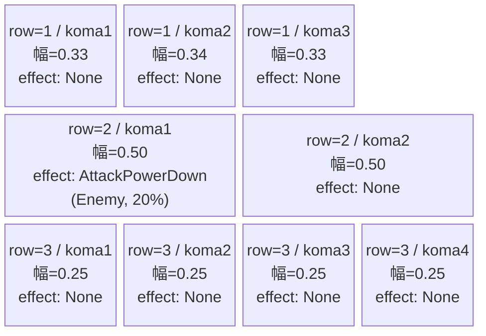

# vd_mag_normal_00001 インゲームデータ詳細解説

> 参照リポジトリ: `projects/glow-masterdata`
> リリースキー: 202604010

## インゲーム要件テキスト

UR対抗キャラ「絶対効率の体現者 土刃 メイ（chara_mag_00201）」を意識した設計。怪獣（e_mag_00001_vd_Normal_Green）とつらら（e_mag_00101_vd_Normal_Green）の2種の雑魚が序盤から中盤にかけて交互に押し寄せ、フレンドユニットが一定数倒されるとボスクラスの「新人魔法少女 桜木 カナ（c_mag_00001_vd_Boss_Green）」が登場してプレッシャーを高める。さらに倒し続けると終盤に両雑魚の大量補充が始まる無限ループ設計。最低20体以上の雑魚が登場する物量構成。

コマは3行構成。row=1はパターン7（3等分）、row=2はパターン6（2等分）、row=3はパターン12（4等分）と異なるパターンを組み合わせてフィールドに変化をもたせる。コマアセットキーは `mag_00004`（back_ground_offset: 0.6）を使用。

「絶対効率の体現者 土刃 メイ」の攻撃力強化系コマ効果に対し、複数コマにまたがるGreenカラー敵が多数出現することで、メイのコマ効果を活かして高効率に倒していく遊びが成立する構造。

---

## レベルデザイン

### 敵キャラ設計

#### 敵キャラ選定（MstEnemyCharacter）

| mst_enemy_character_id | 日本語名 | 役割 | 備考 |
|------------------------|---------|------|------|
| enemy_mag_00001 | 冷却系怪異 | 雑魚 | 高HP・攻撃力高め。序中盤の主力 |
| enemy_mag_00101 | つらら | 雑魚 | 低HP・高速移動。数を活かした速攻型 |
| chara_mag_00001 | 新人魔法少女 桜木 カナ | ボス（c_キャラ） | FriendUnitDead=8体で登場 |

#### 敵キャラステータス（MstEnemyStageParameter）

> 既存VDキュレーションCSV（vd_all/data/MstEnemyStageParameter.csv）より参照

| MstEnemyStageParameter ID | 日本語名 | kind | role | color | base_hp | base_atk | base_spd | well_dist | knockback | combo | drop_bp |
|--------------------------|---------|------|------|-------|---------|----------|----------|-----------|-----------|-------|---------|
| e_mag_00001_vd_Normal_Green | 冷却系怪異 | Normal | Attack | Green | 1,000,000 | 2,500 | 35 | 0.30 | 1 | 1 | 10 |
| e_mag_00101_vd_Normal_Green | つらら | Normal | Attack | Green | 20,000 | 400 | 100 | 0.11 | 1 | 1 | 10 |
| c_mag_00001_vd_Boss_Green | 新人魔法少女 桜木 カナ | Boss | Attack | Green | 320,000 | 1,200 | 45 | 0.40 | 2 | 5 | 10 |

---

### コマ設計

※ columns は1つのみ。各行のスパン合計 = 4になること。
※ row=1は3コマで幅合計1.0（0.33+0.34+0.33）、row=2は2コマで幅合計1.0（0.50+0.50）、row=3は4コマで幅合計1.0（0.25×4）。

| row | height | 選択パターン | コマ数 | 各幅 | 幅合計 |
|-----|--------|------------|-------|------|--------|
| 1 | 0.33 | パターン7（3等分） | 3 | 0.33, 0.34, 0.33 | 1.0 |
| 2 | 0.33 | パターン6（2等分） | 2 | 0.50, 0.50 | 1.0 |
| 3 | 0.34 | パターン12（4等分） | 4 | 0.25, 0.25, 0.25, 0.25 | 1.0 |

**コマエフェクト設計**:
- row=2 / koma1: `AttackPowerDown` 20%（Enemy対象）― UR対抗キャラ「土刃 メイ」の攻撃力強化コマ効果に対する対抗ギミック（敵の攻撃力を下げることでメイの強化を引き立てる構成）

---

### 敵キャラシーケンス設計

> **c_キャラ同時出現ルール（プランナー確認済み）**: c_キャラ（`c_` プレフィックス）が複数体登場する場合、
> 初回のみ `ElapsedTime`、2体目以降は `FriendUnitDead`（前の c_キャラの sequence_element_id を
> condition_value に指定）でチェーンすること。また c_キャラの `summon_count` は必ず `1` とすること。`e_glo_*` は対象外。

#### どのフェーズで、どの敵を、いつ、どこに、どのくらい出現させるか

```mermaid
flowchart LR
  Start([開始]) --> E1[ElapsedTime: 150ms\nつらら×3体\nelem=1]
  E1 --> E2[ElapsedTime: 1000ms\n冷却系怪異×2体\nelem=2]
  E2 --> E3[ElapsedTime: 2000ms\nつらら×3体\nelem=3]
  E3 --> E4[ElapsedTime: 3000ms\n冷却系怪異×2体\nelem=4]
  E4 --> E5[FriendUnitDead: 5体\nつらら×5体\nelem=5]
  E5 --> E6[FriendUnitDead: 8体\n桜木カナ（c_キャラ）×1体\nelem=6\nBossオーラ]
  E6 --> E7[FriendUnitDead: 9体\n冷却系怪異×3体\nelem=7]
  E7 --> E8[FriendUnitDead: 12体\nつらら×10体 interval=500ms\nelem=8]
  E8 --> E9[FriendUnitDead: 15体\n冷却系怪異×99体 interval=800ms\n無限補充\nelem=9]
  E9 --> E10[FriendUnitDead: 15体\nつらら×99体 interval=600ms\n無限補充\nelem=10]
```

| elem | 出現タイミング | 敵 | 数 | 累計出現数/備考 |
|------|-------------|---|---|-----------------|
| 1 | ElapsedTime=150 | つらら (e_mag_00101_vd_Normal_Green) | 3 | 累計3体 |
| 2 | ElapsedTime=1000 | 冷却系怪異 (e_mag_00001_vd_Normal_Green) | 2 | 累計5体 |
| 3 | ElapsedTime=2000 | つらら (e_mag_00101_vd_Normal_Green) | 3 | 累計8体 |
| 4 | ElapsedTime=3000 | 冷却系怪異 (e_mag_00001_vd_Normal_Green) | 2 | 累計10体 |
| 5 | FriendUnitDead=5 | つらら (e_mag_00101_vd_Normal_Green) | 5 | 累計15体 |
| 6 | FriendUnitDead=8 | 新人魔法少女 桜木 カナ (c_mag_00001_vd_Boss_Green) | 1 | 累計16体（Bossオーラ・summon_position=1.7） |
| 7 | FriendUnitDead=9 | 冷却系怪異 (e_mag_00001_vd_Normal_Green) | 3 | 累計19体 |
| 8 | FriendUnitDead=12 | つらら (e_mag_00101_vd_Normal_Green) | 10 | 累計29体（interval=500ms） |
| 9 | FriendUnitDead=15 | 冷却系怪異 (e_mag_00001_vd_Normal_Green) | 99 | 無限補充（interval=800ms） |
| 10 | FriendUnitDead=15 | つらら (e_mag_00101_vd_Normal_Green) | 99 | 無限補充（interval=600ms） |

**雑魚合計**: elem1〜8で雑魚29体 + elem9/10の無限補充（99×2本）。最低29体以上出現（15体以上の要件を満たす）。

#### 敵キャラの固有ステータス調整（hp_coef / atk_coef）

| 波/フェーズ | 敵 | base_hp | hp_coef | 実HP | base_atk | atk_coef | 実ATK |
|-----------|---|---------|---------|------|----------|----------|-------|
| 序盤（elem1-4） | つらら | 20,000 | 1.0 | 20,000 | 400 | 1.0 | 400 |
| 序盤（elem1-4） | 冷却系怪異 | 1,000,000 | 1.0 | 1,000,000 | 2,500 | 1.0 | 2,500 |
| 中盤（elem5-8） | つらら | 20,000 | 1.0 | 20,000 | 400 | 1.0 | 400 |
| 中盤（elem6） | 桜木 カナ | 320,000 | 1.0 | 320,000 | 1,200 | 1.0 | 1,200 |
| 中盤（elem7-8） | 冷却系怪異 | 1,000,000 | 1.0 | 1,000,000 | 2,500 | 1.0 | 2,500 |
| 終盤（elem9-10） | 冷却系怪異 | 1,000,000 | 1.0 | 1,000,000 | 2,500 | 1.0 | 2,500 |
| 終盤（elem9-10） | つらら | 20,000 | 1.0 | 20,000 | 400 | 1.0 | 400 |

#### フェーズ切り替えはあるか

なし（VDではSwitchSequenceGroup使用禁止）

---

## 演出

### アセット

#### 背景

| 設定箇所 | アセットキー | 備考 |
|---------|------------|------|
| MstInGame.loop_background_asset_key | mag_00004 | magシリーズ背景（仮）。アセット担当者確認推奨 |

#### BGM

| 設定 | 値 | 備考 |
|-----|---|------|
| bgm_asset_key | SSE_SBG_003_010 | VD normalブロック固定BGM |
| boss_bgm_asset_key | （空） | normalブロックはボスBGMなし |

---

### 敵キャラオーラ

| オーラ種別 | 使用箇所 |
|----------|---------|
| Default | elem1〜5, 7〜10（雑魚キャラ全般） |
| Boss | elem6（桜木 カナ / c_mag_00001_vd_Boss_Green） |

---

### 敵キャラ召喚アニメーション

全エレメントで `summon_animation_type=None`（VD標準）。

elem6（c_mag_00001_vd_Boss_Green）は `InitialSummon` ではなく `FriendUnitDead=8` トリガーで召喚し、`summon_position=1.7`（砦付近）に配置することでボスとしての存在感を演出する。また MstInGame.boss_mst_enemy_stage_parameter_id には `c_mag_00001_vd_Boss_Green` を設定し、ボスの二重設定を行う。

---

## テーブル設計サマリ

### MstInGame

| カラム | 値 |
|-------|---|
| id | vd_mag_normal_00001 |
| release_key | 202604010 |
| mst_auto_player_sequence_id | vd_mag_normal_00001 |
| mst_auto_player_sequence_set_id | vd_mag_normal_00001 |
| bgm_asset_key | SSE_SBG_003_010 |
| boss_bgm_asset_key | （空） |
| loop_background_asset_key | mag_00004 |
| player_outpost_asset_key | （空） |
| mst_page_id | vd_mag_normal_00001 |
| mst_enemy_outpost_id | vd_mag_normal_00001 |
| mst_defense_target_id | NULL |
| boss_mst_enemy_stage_parameter_id | c_mag_00001_vd_Boss_Green |
| normal_enemy_hp_coef | 1.0 |
| normal_enemy_attack_coef | 1.0 |
| normal_enemy_speed_coef | 1.0 |
| boss_enemy_hp_coef | 1.0 |
| boss_enemy_attack_coef | 1.0 |
| boss_enemy_speed_coef | 1.0 |
| content_type | Dungeon |
| stage_type | vd_normal |

### MstPage

| カラム | 値 |
|-------|---|
| id | vd_mag_normal_00001 |
| release_key | 202604010 |

### MstEnemyOutpost

| カラム | 値 |
|-------|---|
| id | vd_mag_normal_00001 |
| hp | 100 |
| is_damage_invalidation | （空） |
| outpost_asset_key | （空） |
| artwork_asset_key | mag_0001（要アセット担当者確認） |
| release_key | 202604010 |

### MstKomaLine

| id | mst_page_id | row | height | layout_key | koma1_asset_key | koma1_width | koma1_bg_offset | koma1_effect_type | koma2_asset_key | koma2_width | koma2_effect_type | koma3_asset_key | koma3_width | koma3_effect_type | koma4_asset_key | koma4_width | koma4_effect_type |
|---|---|---|---|---|---|---|---|---|---|---|---|---|---|---|---|---|---|
| vd_mag_normal_00001_1 | vd_mag_normal_00001 | 1 | 0.33 | 7 | mag_00004 | 0.33 | 0.6 | None | mag_00004 | 0.34 | None | mag_00004 | 0.33 | None | （空） | （空） | None |
| vd_mag_normal_00001_2 | vd_mag_normal_00001 | 2 | 0.33 | 6 | mag_00004 | 0.50 | 0.6 | AttackPowerDown | mag_00004 | 0.50 | None | （空） | （空） | None | （空） | （空） | None |
| vd_mag_normal_00001_3 | vd_mag_normal_00001 | 3 | 0.34 | 12 | mag_00004 | 0.25 | 0.6 | None | mag_00004 | 0.25 | None | mag_00004 | 0.25 | None | mag_00004 | 0.25 | None |

**KomaLineエフェクト補足**:
- row=2 koma1: `AttackPowerDown`, parameter1=20, parameter2=0, target_side=Enemy, target_colors=All, target_roles=All
- その他全コマ: `None`, parameter1=0, parameter2=0, target_side=All, target_colors=All, target_roles=All

### MstAutoPlayerSequence（elem一覧）

| id | sequence_set_id | sequence_element_id | condition_type | condition_value | action_type | action_value | summon_count | summon_interval | summon_position | aura_type | death_type | hp_coef | atk_coef | spd_coef | defeated_score | summon_animation_type |
|---|---|---|---|---|---|---|---|---|---|---|---|---|---|---|---|---|
| vd_mag_normal_00001_1 | vd_mag_normal_00001 | 1 | ElapsedTime | 150 | SummonEnemy | e_mag_00101_vd_Normal_Green | 3 | 0 | （空） | Default | Normal | 1.0 | 1.0 | 1.0 | 0 | None |
| vd_mag_normal_00001_2 | vd_mag_normal_00001 | 2 | ElapsedTime | 1000 | SummonEnemy | e_mag_00001_vd_Normal_Green | 2 | 0 | （空） | Default | Normal | 1.0 | 1.0 | 1.0 | 0 | None |
| vd_mag_normal_00001_3 | vd_mag_normal_00001 | 3 | ElapsedTime | 2000 | SummonEnemy | e_mag_00101_vd_Normal_Green | 3 | 0 | （空） | Default | Normal | 1.0 | 1.0 | 1.0 | 0 | None |
| vd_mag_normal_00001_4 | vd_mag_normal_00001 | 4 | ElapsedTime | 3000 | SummonEnemy | e_mag_00001_vd_Normal_Green | 2 | 0 | （空） | Default | Normal | 1.0 | 1.0 | 1.0 | 0 | None |
| vd_mag_normal_00001_5 | vd_mag_normal_00001 | 5 | FriendUnitDead | 5 | SummonEnemy | e_mag_00101_vd_Normal_Green | 5 | 0 | （空） | Default | Normal | 1.0 | 1.0 | 1.0 | 0 | None |
| vd_mag_normal_00001_6 | vd_mag_normal_00001 | 6 | FriendUnitDead | 8 | SummonEnemy | c_mag_00001_vd_Boss_Green | 1 | 0 | 1.7 | Boss | Normal | 1.0 | 1.0 | 1.0 | 0 | None |
| vd_mag_normal_00001_7 | vd_mag_normal_00001 | 7 | FriendUnitDead | 9 | SummonEnemy | e_mag_00001_vd_Normal_Green | 3 | 0 | （空） | Default | Normal | 1.0 | 1.0 | 1.0 | 0 | None |
| vd_mag_normal_00001_8 | vd_mag_normal_00001 | 8 | FriendUnitDead | 12 | SummonEnemy | e_mag_00101_vd_Normal_Green | 10 | 500 | （空） | Default | Normal | 1.0 | 1.0 | 1.0 | 0 | None |
| vd_mag_normal_00001_9 | vd_mag_normal_00001 | 9 | FriendUnitDead | 15 | SummonEnemy | e_mag_00001_vd_Normal_Green | 99 | 800 | （空） | Default | Normal | 1.0 | 1.0 | 1.0 | 0 | None |
| vd_mag_normal_00001_10 | vd_mag_normal_00001 | 10 | FriendUnitDead | 15 | SummonEnemy | e_mag_00101_vd_Normal_Green | 99 | 600 | （空） | Default | Normal | 1.0 | 1.0 | 1.0 | 0 | None |
