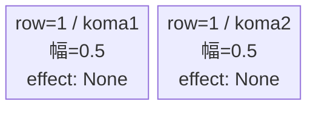
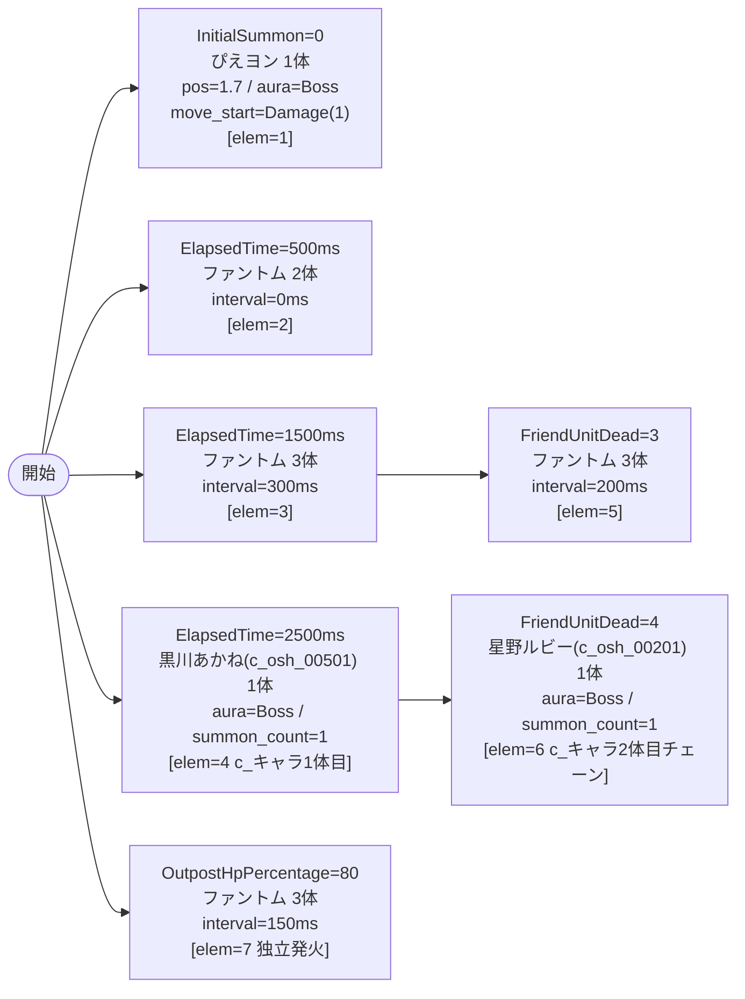

# vd_osh_boss_00001 インゲームデータ詳細解説

> 参照リポジトリ: `projects/glow-masterdata`
> リリースキー: 202604010

## インゲーム要件テキスト

ボス「ぴえヨン」（`c_osh_00601_vd_Boss_Green`、HP=10,000、ATK=300、Green/Attack）が開幕から砦付近（position=1.7）にBossオーラで待機し、初ダメージを受けてから前進する。500ms 後にファントム2体が前衛を形成し、1,500ms 後にさらに3体が追加される。2,500ms 経過で黒川あかね（`c_osh_00501`、Technical）が援護に1体登場し、これが c_キャラ1体目となる。3体撃破後はファントム3体が追加投入され、5体倒した段階で星野ルビー（`c_osh_00201`、Attack）がFriendUnitDeadチェーンで登場する。拠点HPが80%を切ると終盤の追加ファントム3体が独立トリガーで投入される。

コマは1行・2等分（パターン6、幅0.5/0.5）のシンプル構成。コマアセットキーは `osh_00001`（back_ground_offset = -1.0）。UR対抗キャラ「B小町不動のセンター アイ（`chara_osh_00001`）」のGreen属性スキルでぴえヨンを撃破しながら、B小町メンバーのTechnical/Attack雑魚を素早く処理する対抗設計。

---

## レベルデザイン

### 敵キャラ設計

#### 敵キャラ選定（MstEnemyCharacter）

| mst_enemy_character_id | 日本語名 | 役割 | 備考 |
|------------------------|---------|------|------|
| chara_osh_00601 | ぴえヨン | ボス | MstInGame.boss_mst_enemy_stage_parameter_id + InitialSummon で二重設定 |
| enemy_glo_00001 | ファントム | 雑魚 | VD汎用雑魚 |
| chara_osh_00501 | 黒川 あかね（推定） | 雑魚（c_キャラ1体目） | ElapsedTime で初回登場 |
| chara_osh_00201 | 星野 ルビー（推定） | 雑魚（c_キャラ2体目） | FriendUnitDead チェーン |

#### 敵キャラステータス（MstEnemyStageParameter）

> 全て `vd_all/data/MstEnemyStageParameter.csv` の既存データを参照。新規追加なし。

| MstEnemyStageParameter ID | 日本語名 | kind | role | color | base_hp | base_atk | base_spd | well_dist | knockback | combo | drop_bp |
|--------------------------|---------|------|------|-------|---------|----------|----------|-----------|-----------|-------|---------|
| c_osh_00601_vd_Boss_Green | ぴえヨン | Boss | Attack | Green | 10,000 | 300 | 45 | 0.22 | 2 | 2 | 500 |
| e_glo_00001_vd_Normal_Colorless | ファントム | Normal | Attack | Colorless | 5,000 | 100 | 34 | 0.22 | 3 | 1 | 150 |
| c_osh_00501_vd_Normal_Green | 黒川 あかね | Normal | Technical | Green | 10,000 | 300 | 30 | 0.26 | 3 | 4 | 500 |
| c_osh_00201_vd_Normal_Green | 星野 ルビー | Normal | Attack | Green | 50,000 | 300 | 30 | 0.22 | 3 | 5 | 500 |

---

### コマ設計

※ bossブロックは MstKomaLine が1行固定。

| row | height | 選択パターン | コマ数 | 各幅 | 幅合計 |
|-----|--------|------------|-------|------|--------|
| 1 | 1.0 | パターン6 | 2 | 0.5, 0.5 | 1.0 |

---

### 敵キャラシーケンス設計

> **c_キャラ同時出現ルール（プランナー確認済み）**: c_キャラ（`c_` プレフィックス）が複数体登場する場合、
> 初回のみ `ElapsedTime`、2体目以降は `FriendUnitDead`（前の c_キャラの sequence_element_id を
> condition_value に指定）でチェーンすること。また c_キャラの `summon_count` は必ず `1` とすること。`e_glo_*` は対象外。

> **ボスの二重設定（必須）**: `MstInGame.boss_mst_enemy_stage_parameter_id = c_osh_00601_vd_Boss_Green` に加え、
> `MstAutoPlayerSequence` の InitialSummon（elem=1）でも同じIDを設定すること。

#### どのフェーズで、どの敵を、いつ、どこに、どのくらい出現させるか

| elem | 出現タイミング | 敵 | 数 | 位置 / 備考 |
|------|-------------|---|---|------------|
| 1 | InitialSummon=0 | ぴえヨン（c_osh_00601_vd_Boss_Green） | 1 | pos=1.7、aura=Boss、move_start=Damage(1) |
| 2 | ElapsedTime=500ms | ファントム（e_glo_00001_vd_Normal_Colorless） | 2 | interval=0 |
| 3 | ElapsedTime=1500ms | ファントム（e_glo_00001_vd_Normal_Colorless） | 3 | interval=300 |
| 4 | ElapsedTime=2500ms | 黒川あかね（c_osh_00501_vd_Normal_Green） | 1 | summon_count=1、aura=Boss、c_キャラ1体目 |
| 5 | FriendUnitDead=3 | ファントム（e_glo_00001_vd_Normal_Colorless） | 3 | interval=200 |
| 6 | FriendUnitDead=4（elem=4チェーン） | 星野ルビー（c_osh_00201_vd_Normal_Green） | 1 | summon_count=1、aura=Boss、c_キャラ2体目 |
| 7 | OutpostHpPercentage=80（独立トリガー） | ファントム（e_glo_00001_vd_Normal_Colorless） | 3 | interval=150、終盤強化 |

> 雑魚合計: ファントム(2+3+3+3=11体) + c_キャラ(2体) = **13体**（bossブロック・体数制約なし）

#### 敵キャラの固有ステータス調整（hp_coef / atk_coef）

| 波/フェーズ | 敵 | base_hp | hp_coef | 実HP | base_atk | atk_coef | 実ATK |
|-----------|---|---------|---------|------|----------|----------|-------|
| ボス（elem=1） | ぴえヨン | 10,000 | 1.0 | 10,000 | 300 | 1.0 | 300 |
| 全雑魚（elem=2,3,5,7） | ファントム | 5,000 | 1.0 | 5,000 | 100 | 1.0 | 100 |
| 中盤（elem=4） | 黒川あかね | 10,000 | 1.0 | 10,000 | 300 | 1.0 | 300 |
| 後半（elem=6） | 星野ルビー | 50,000 | 1.0 | 50,000 | 300 | 1.0 | 300 |

#### フェーズ切り替えはあるか

なし（VDでは SwitchSequenceGroup 使用禁止）

---

## 演出

### アセット

#### 背景

| 設定箇所 | アセットキー | 備考 |
|---------|------------|------|
| MstInGame.loop_background_asset_key | osh_00001 | 推しの子シリーズ背景（要アセット担当者確認） |

#### BGM

| 設定 | 値 | 備考 |
|-----|---|------|
| bgm_asset_key | SSE_SBG_003_004 | bossブロック固定BGM |
| boss_bgm_asset_key | （空欄） | BGM切り替えなし |

---

### 敵キャラオーラ

| オーラ種別 | 使用箇所 |
|----------|---------|
| Boss | elem=1（ぴえヨン）、elem=4（黒川あかね）、elem=6（星野ルビー） |
| Default | elem=2,3,5,7（ファントム全エントリ） |

---

### 敵キャラ召喚アニメーション

- elem=1（InitialSummon）: ぴえヨンが砦付近（pos=1.7）に初期配置。`move_start_condition_type=Damage`、`move_start_condition_value=1`（初ダメージを受けてから前進開始）。
- elem=2〜7（SummonEnemy）: 全て `summon_animation_type=None`（通常召喚）。
- elem=4（ElapsedTime=2500ms）: 黒川あかねが Bossオーラ付きで単独登場。
- elem=6（FriendUnitDead=4）: elem=4 の黒川あかねが倒された段階で星野ルビーがチェーン召喚。

---

## テーブル設定値サマリ

### MstInGame

| カラム | 値 |
|-------|---|
| id | vd_osh_boss_00001 |
| release_key | 202604010 |
| content_type | Dungeon |
| stage_type | vd_boss |
| mst_page_id | vd_osh_boss_00001 |
| mst_enemy_outpost_id | vd_osh_boss_00001 |
| boss_mst_enemy_stage_parameter_id | c_osh_00601_vd_Boss_Green |
| mst_auto_player_sequence_id | vd_osh_boss_00001 |
| mst_auto_player_sequence_set_id | vd_osh_boss_00001 |
| bgm_asset_key | SSE_SBG_003_004 |
| boss_bgm_asset_key | （空欄） |
| loop_background_asset_key | osh_00001 |
| normal_enemy_hp_coef | 1.0 |
| normal_enemy_attack_coef | 1.0 |
| normal_enemy_speed_coef | 1.0 |
| boss_enemy_hp_coef | 1.0 |
| boss_enemy_attack_coef | 1.0 |
| boss_enemy_speed_coef | 1.0 |

### MstEnemyOutpost

| カラム | 値 |
|-------|---|
| id | vd_osh_boss_00001 |
| hp | 1000（bossブロック固定） |

### MstKomaLine

| id | row | height | koma_line_layout_asset_key | koma1_asset_key | koma1_back_ground_offset | koma1_effect_type | koma1_effect_parameter1 | koma1_effect_parameter2 | koma1_effect_target_colors | koma1_effect_target_roles | koma2_effect_type | koma3_effect_type | koma4_effect_type |
|----|-----|--------|--------------------------|-----------------|--------------------------|-------------------|------------------------|------------------------|--------------------------|--------------------------|-------------------|-------------------|-------------------|
| vd_osh_boss_00001_1 | 1 | 1.0 | 6 | osh_00001 | -1.0 | None | 0 | 0 | All | All | None | None | None |
