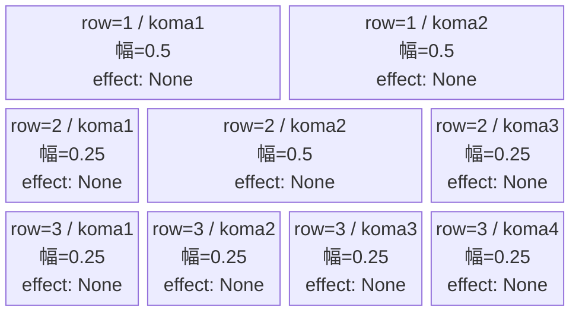
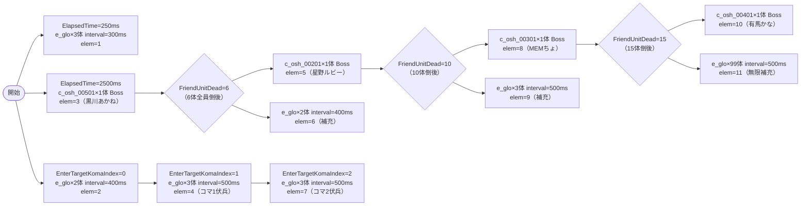

# vd_osh_normal_00001 インゲームデータ詳細解説

> 参照リポジトリ: `projects/glow-masterdata`
> リリースキー: 202604010

## インゲーム要件テキスト

開幕 ElapsedTime=250ms でファントムが3体出現し、コマ0・コマ1・コマ2 到達ごとにファントムが伏兵として2〜3体追加される。ElapsedTime=2500ms で黒川あかね（`c_osh_00501`・HP低め）が最初のc_キャラとして登場し、以降は6体・10体・15体倒すたびに星野ルビー→MEMちょ→有馬かなが1体ずつ Bossオーラ付きで順番に登場する。16体全員倒した後はファントムが無限補充に切り替わってステージが継続する。

ElapsedTime / EnterTargetKomaIndex / FriendUnitDead の3種のトリガーを組み合わせることで、時間・コマ進行・倒した数の3軸からプレッシャーを与える構成。コマを進めるほど伏兵が増え、倒すほど強いキャラが次々と登場するスパイラル構造。

コマは3行構成。row1 はパターン6（2コマ均等 0.5/0.5）、row2 はパターン9（3コマ 中央広め 0.25/0.5/0.25）、row3 はパターン12（4コマ均等 0.25×4）で、コマ数が行ごとに増える段階的なレイアウト。コマアセットキーは `osh_00001`（back_ground_offset = -1.0）。

UR対抗キャラ「B小町不動のセンター アイ（`chara_osh_00001`）」のGreen属性コマ効果・オーラを最大限に活かして、コマ伏兵を素早く処理しながらB小町メンバーを撃破する立ち回りを要求する設計。

---

## レベルデザイン

### 敵キャラ設計

#### 敵キャラ選定（MstEnemyCharacter）

| mst_enemy_character_id | 日本語名（推定） | 役割 | 備考 |
|------------------------|----------------|------|------|
| enemy_glo_00001 | ファントム | 主力雑魚（16体+無限補充） | コマ伏兵＋終盤無限補充の要員 |
| chara_osh_00501 | 黒川 あかね（推定） | c_キャラ1体目 | HP低め・序盤の起点 |
| chara_osh_00201 | 星野 ルビー（推定） | c_キャラ2体目 | Attack型 / HP 50,000 |
| chara_osh_00301 | MEMちょ（推定） | c_キャラ3体目 | Support型 / HP 50,000 |
| chara_osh_00401 | 有馬 かな（推定） | c_キャラ4体目 | Technical型 / HP 50,000 |

> ⚠️ キャラ名は推定。`chara_osh_00501/00201/00301/00401` の正確な日本語名は MstEnemyCharacter.csv で確認してください。

#### 敵キャラステータス（MstEnemyStageParameter）

> 全て `vd_all/data/MstEnemyStageParameter.csv` の既存データを参照

| MstEnemyStageParameter ID | 日本語名（推定） | kind | role | color | base_hp | base_atk | base_spd | well_dist | knockback | combo | drop_bp |
|--------------------------|----------------|------|------|-------|---------|----------|----------|-----------|-----------|-------|---------|
| e_glo_00001_vd_Normal_Colorless | ファントム | Normal | Attack | Colorless | 5,000 | 100 | 34 | 0.22 | 3 | 1 | 150 |
| c_osh_00501_vd_Normal_Green | 黒川 あかね | Normal | Technical | Green | 10,000 | 300 | 30 | 0.26 | 3 | 4 | 500 |
| c_osh_00201_vd_Normal_Green | 星野 ルビー | Normal | Attack | Green | 50,000 | 300 | 30 | 0.22 | 3 | 5 | 500 |
| c_osh_00301_vd_Normal_Green | MEMちょ | Normal | Support | Green | 50,000 | 300 | 30 | 0.27 | 3 | 4 | 500 |
| c_osh_00401_vd_Normal_Green | 有馬 かな | Normal | Technical | Green | 50,000 | 300 | 32 | 0.24 | 3 | 4 | 500 |

---

### コマ設計

※ columns は1つのみ。各行のスパン合計 = 4。

| row | height | 選択パターン | コマ数 | 各幅 | 幅合計 |
|-----|--------|------------|-------|------|--------|
| 1 | 0.33 | パターン6 | 2 | 0.5, 0.5 | 1.0 |
| 2 | 0.33 | パターン9 | 3 | 0.25, 0.5, 0.25 | 1.0 |
| 3 | 0.34 | パターン12 | 4 | 0.25, 0.25, 0.25, 0.25 | 1.0 |

---

### 敵キャラシーケンス設計

> **c_キャラ同時出現ルール（プランナー確認済み）**: c_キャラ（`c_` プレフィックス）が複数体登場する場合、
> 初回のみ `ElapsedTime`、2体目以降は `FriendUnitDead`（前の c_キャラの撃破に相当する累計体数を
> condition_value に指定）でチェーンすること。また c_キャラの `summon_count` は必ず `1` とすること。`e_glo_*` は対象外。

#### トリガー設計の意図

| トリガー | 使い方 |
|---------|-------|
| `ElapsedTime` | 開幕ファントムウェーブ（250ms）＋最初のc_キャラ登場（2500ms） |
| `EnterTargetKomaIndex` | コマ0/1/2 到達ごとにファントムが伏兵出現（コマ進行連動） |
| `FriendUnitDead` | 倒した数の節目でc_キャラ登場＋ファントム補充（強さスパイラル） |

#### チェーン設計の意図

- **elem3** (ElapsedTime=2500ms): 黒川あかね（c_osh_00501）が最初のc_キャラとして登場
- **elem5** (FriendUnitDead=6): elem1(3)+elem2(2)+elem3(1)=6体全員倒れた後に星野ルビー登場
- **elem8** (FriendUnitDead=10): 6体目+elem4(3体)+elem5(1体)が倒れた後にMEMちょ登場
- **elem10** (FriendUnitDead=15): さらにelem6(2体)+elem7(3体)+elem8(1体)が倒れた後に有馬かな登場
- **elem11** (FriendUnitDead=15): 有馬かなと同タイミングでファントム99体の無限補充開始

#### どのフェーズで、どの敵を、いつ、どこに、どのくらい出現させるか

| elem | condition_type | condition_value | 敵（ID） | summon_count | interval | aura | 備考 |
|------|---------------|----------------|---------|-------------|---------|------|------|
| 1 | ElapsedTime | 250 | e_glo_00001_vd_Normal_Colorless | 3 | 300ms | Default | 開幕ウェーブ |
| 2 | EnterTargetKomaIndex | 0 | e_glo_00001_vd_Normal_Colorless | 2 | 400ms | Default | コマ0伏兵 |
| 3 | ElapsedTime | 2500 | c_osh_00501_vd_Normal_Green | 1 | 0 | Boss | 黒川あかね（1体目c_） |
| 4 | EnterTargetKomaIndex | 1 | e_glo_00001_vd_Normal_Colorless | 3 | 500ms | Default | コマ1伏兵 |
| 5 | FriendUnitDead | 6 | c_osh_00201_vd_Normal_Green | 1 | 0 | Boss | 星野ルビー（2体目c_）elem1+2+3全滅後 |
| 6 | FriendUnitDead | 6 | e_glo_00001_vd_Normal_Colorless | 2 | 400ms | Default | 補充（elem5と同タイミング） |
| 7 | EnterTargetKomaIndex | 2 | e_glo_00001_vd_Normal_Colorless | 3 | 500ms | Default | コマ2伏兵 |
| 8 | FriendUnitDead | 10 | c_osh_00301_vd_Normal_Green | 1 | 0 | Boss | MEMちょ（3体目c_） |
| 9 | FriendUnitDead | 10 | e_glo_00001_vd_Normal_Colorless | 3 | 500ms | Default | 補充（elem8と同タイミング） |
| 10 | FriendUnitDead | 15 | c_osh_00401_vd_Normal_Green | 1 | 0 | Boss | 有馬かな（4体目c_） |
| 11 | FriendUnitDead | 15 | e_glo_00001_vd_Normal_Colorless | 99 | 500ms | Default | 終盤無限補充（elem10と同タイミング） |

> 合計召喚数（有限）: e_glo(3+2+3+2+3+3=16体) + c_(4体) = **20体** ✅ 15体以上達成 (+ 99体無限補充)

#### 敵キャラの固有ステータス調整（hp_coef / atk_coef）

| 波/フェーズ | 敵 | base_hp | hp_coef | 実HP | base_atk | atk_coef | 実ATK |
|-----------|---|---------|---------|------|----------|----------|-------|
| 序盤（elem1〜4） | e_glo_00001（ファントム） | 5,000 | 1.0 | 5,000 | 100 | 1.0 | 100 |
| 中盤（elem3） | c_osh_00501（黒川あかね） | 10,000 | 1.0 | 10,000 | 300 | 1.0 | 300 |
| 中盤（elem5） | c_osh_00201（星野ルビー） | 50,000 | 1.0 | 50,000 | 300 | 1.0 | 300 |
| 後半（elem8） | c_osh_00301（MEMちょ） | 50,000 | 1.0 | 50,000 | 300 | 1.0 | 300 |
| 終盤（elem10） | c_osh_00401（有馬かな） | 50,000 | 1.0 | 50,000 | 300 | 1.0 | 300 |
| 終盤補充（elem11） | e_glo_00001（ファントム） | 5,000 | 1.0 | 5,000 | 100 | 1.0 | 100 |

#### フェーズ切り替えはあるか

なし（VDではSwitchSequenceGroup使用禁止）

---

## 演出

### アセット

#### 背景

| 設定箇所 | アセットキー | 備考 |
|---------|------------|------|
| MstInGame.background_asset_key | （要確認） | osh作品の背景アセット。アセット担当者に確認 |

#### BGM

| 設定 | 値 | 備考 |
|-----|---|------|
| bgm_asset_key | `SSE_SBG_003_010` | normalブロック固定値 |

---

### 敵キャラオーラ

| オーラ種別 | 使用箇所 |
|----------|---------|
| Boss | c_osh_00501/00201/00301/00401（全c_キャラ） |
| Default | e_glo_00001（全ファントム） |

---

### 敵キャラ召喚アニメーション

ElapsedTime=250ms で開幕ファントム3体が出現し、コマ進行に連動して伏兵ファントムが2〜3体ずつ湧く。c_キャラは ElapsedTime=2500ms の黒川あかねを起点に、FriendUnitDead チェーンで星野ルビー→MEMちょ→有馬かなが Bossオーラ付きで1体ずつ登場する。全エントリの `summon_animation_type = None`（VD標準）。

---

## テーブル設計概要

| テーブル | ID |
|---------|---|
| MstInGame | `vd_osh_normal_00001` |
| MstPage | `vd_osh_normal_00001` |
| MstEnemyOutpost | `vd_osh_normal_00001` |
| MstKomaLine | `vd_osh_normal_00001_1`〜`vd_osh_normal_00001_3` |
| MstAutoPlayerSequence（sequence_set_id） | `vd_osh_normal_00001` |

### MstInGame 設計値

| カラム | 値 |
|-------|---|
| id | `vd_osh_normal_00001` |
| content_type | `Dungeon` |
| stage_type | `vd_normal` |
| boss_mst_enemy_stage_parameter_id | （空欄） |
| mst_page_id | `vd_osh_normal_00001` |
| mst_enemy_outpost_id | `vd_osh_normal_00001` |
| mst_auto_player_sequence_set_id | `vd_osh_normal_00001` |
| bgm_asset_key | `SSE_SBG_003_010` |

### MstEnemyOutpost 設計値

| カラム | 値 |
|-------|---|
| id | `vd_osh_normal_00001` |
| hp | **100**（normalブロック固定） |

### MstKomaLine 設計値

| id | row | height | koma_line_layout_asset_key | koma1_asset_key | koma1_back_ground_offset |
|----|-----|--------|--------------------------|-----------------|--------------------------|
| vd_osh_normal_00001_1 | 1 | 0.33 | 6 | osh_00001 | -1.0 |
| vd_osh_normal_00001_2 | 2 | 0.33 | 9 | osh_00001 | -1.0 |
| vd_osh_normal_00001_3 | 3 | 0.34 | 12 | osh_00001 | -1.0 |
