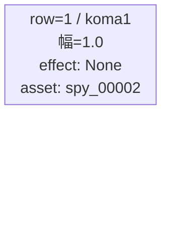
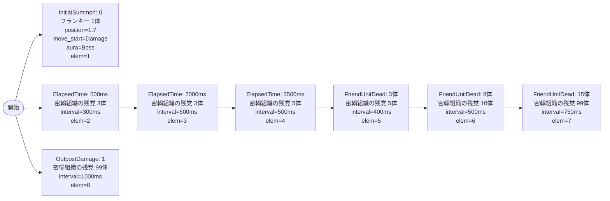

# vd_spy_boss_00001 インゲームデータ詳細解説

> 参照リポジトリ: `projects/glow-masterdata`
> リリースキー: 202604010

## インゲーム要件テキスト

ボスにフランキー・フランクリン（`c_spy_00401_vd_Boss_Blue`）を起用し、バトル開始直後に砦付近へ配置する。ダメージを受けるまで静止し、プレイヤーにプレッシャーを与える演出。雑魚は密輸組織の残党（`e_spy_00001_vd_Normal_Blue`）のみで構成し、ElapsedTime で序盤から定期的に押し寄せ、ボスに一定数の撃破ダメージが蓄積した時点（FriendUnitDead）で追加ラッシュを発生させる。終盤は summon_count=99 の無限補充で圧力を維持する。

コマは1行構成（bossブロック固定）。アセットキーは `spy_00002`、back_ground_offset は `0.6`。

UR対抗キャラは `<黄昏> ロイド`（`chara_spy_00101`）。ロイドが得意とするアクション封じに対して、ボスのフランキーは防衛型でHPが高く長期戦を強いる設計。密輸組織の残党がロイドのアクションを乱す援護役として機能する。

---

## レベルデザイン

### 敵キャラ設計

#### 敵キャラ選定（MstEnemyCharacter）

| mst_enemy_character_id | 日本語名 | 役割 | 備考 |
|------------------------|---------|------|------|
| `chara_spy_00401` | フランキー・フランクリン | ボス | vd_all CSVより `c_spy_00401_vd_Boss_Blue` |
| `enemy_spy_00001` | 密輸組織の残党 | 雑魚 | vd_all CSVより `e_spy_00001_vd_Normal_Blue` |

#### 敵キャラステータス（MstEnemyStageParameter）

> vd_all/data/MstEnemyStageParameter.csv から選出（既存参照）

| MstEnemyStageParameter ID | 日本語名 | kind | role | color | base_hp | base_atk | base_spd | well_dist | knockback | combo | drop_bp |
|--------------------------|---------|------|------|-------|---------|----------|----------|-----------|-----------|-------|---------|
| `c_spy_00401_vd_Boss_Blue` | フランキー・フランクリン | Boss | Defense | Blue | 10000 | 50 | 31 | 0.2 | — | 7 | 500 |
| `e_spy_00001_vd_Normal_Blue` | 密輸組織の残党 | Normal | Attack | Blue | 10000 | 50 | 34 | 0.4 | 2 | 1 | 300 |

---

### コマ設計

| row | height | 選択パターン | コマ数 | 各幅 | 幅合計 |
|-----|--------|------------|-------|------|--------|
| 1 | 1.0 | パターン1 | 1 | 1.0 | 1.0 |

---

### 敵キャラシーケンス設計

> **c_キャラ同時出現ルール（プランナー確認済み）**: c_キャラ（`c_` プレフィックス）が複数体登場する場合、
> 初回のみ `ElapsedTime`、2体目以降は `FriendUnitDead`（前の c_キャラの sequence_element_id を
> condition_value に指定）でチェーンすること。また c_キャラの `summon_count` は必ず `1` とすること。`e_glo_*` は対象外。

#### どのフェーズで、どの敵を、いつ、どこに、どのくらい出現させるか

| elem | 出現タイミング | 敵 | 数 | 累計出現数/召喚位置 |
|------|-------------|---|---|-----------------|
| 1 | InitialSummon=0 | フランキー・フランクリン（Boss） | 1 | 1体 / position=1.7（砦付近） |
| 2 | ElapsedTime=500ms | 密輸組織の残党（Normal） | 3 | 4体 / デフォルト |
| 3 | ElapsedTime=2000ms | 密輸組織の残党（Normal） | 3 | 7体 / デフォルト |
| 4 | ElapsedTime=3500ms | 密輸組織の残党（Normal） | 5 | 12体 / デフォルト |
| 5 | FriendUnitDead=3 | 密輸組織の残党（Normal） | 5 | 17体 / デフォルト |
| 6 | FriendUnitDead=8 | 密輸組織の残党（Normal） | 10 | 27体 / デフォルト |
| 7 | FriendUnitDead=15 | 密輸組織の残党（Normal） | 99 | ∞ / デフォルト |
| 8 | OutpostDamage=1 | 密輸組織の残党（Normal） | 99 | ∞ / デフォルト |

#### 敵キャラの固有ステータス調整（hp_coef / atk_coef）

| 波/フェーズ | 敵 | base_hp | hp_coef | 実HP | base_atk | atk_coef | 実ATK |
|-----------|---|---------|---------|------|----------|----------|-------|
| 開幕（elem1） | フランキー | 10000 | 1.0 | 10000 | 50 | 1.0 | 50 |
| 序盤（elem2〜4） | 密輸組織の残党 | 10000 | 1.0 | 10000 | 50 | 1.0 | 50 |
| 中盤（elem5） | 密輸組織の残党 | 10000 | 1.0 | 10000 | 50 | 1.0 | 50 |
| 後半（elem6） | 密輸組織の残党 | 10000 | 1.5 | 15000 | 50 | 1.2 | 60 |
| 終盤（elem7〜8） | 密輸組織の残党 | 10000 | 2.0 | 20000 | 50 | 1.5 | 75 |

#### フェーズ切り替えはあるか

なし（VDではSwitchSequenceGroup使用禁止）

---

## 演出

### アセット

#### 背景

| 設定箇所 | アセットキー | 備考 |
|---------|------------|------|
| loop_background_asset_key | （空） | VD bossブロックはデフォルト背景 |

#### BGM

| 設定 | 値 | 備考 |
|-----|---|------|
| bgm_asset_key | `SSE_SBG_003_004` | bossブロック固定BGM |
| boss_bgm_asset_key | （空） | VD bossブロックはボスBGM切り替えなし |

---

### 敵キャラオーラ

| オーラ種別 | 使用箇所 |
|----------|---------|
| `Boss` | elem=1 フランキー・フランクリン（InitialSummon） |
| `Default` | elem=2〜8 密輸組織の残党 |

---

### 敵キャラ召喚アニメーション

- elem=1（InitialSummon）: フランキー・フランクリンを `summon_animation_type=None` で position=1.7（砦付近）に配置。`move_start_condition_type=Damage`、`move_start_condition_value=1` により、1ダメージ受けるまで静止して演出効果を高める。
- elem=2〜8（SummonEnemy）: 密輸組織の残党は全て `summon_animation_type=None` でデフォルト位置から登場。

---

## テーブル設定まとめ

### MstInGame

| カラム | 値 |
|--------|---|
| id | `vd_spy_boss_00001` |
| release_key | `202604010` |
| content_type | `Dungeon` |
| stage_type | `vd_boss` |
| bgm_asset_key | `SSE_SBG_003_004` |
| boss_bgm_asset_key | （空） |
| loop_background_asset_key | （空） |
| mst_page_id | `vd_spy_boss_00001` |
| mst_enemy_outpost_id | `vd_spy_boss_00001` |
| mst_defense_target_id | NULL |
| boss_mst_enemy_stage_parameter_id | `c_spy_00401_vd_Boss_Blue` |
| mst_auto_player_sequence_id | `vd_spy_boss_00001` |
| mst_auto_player_sequence_set_id | `vd_spy_boss_00001` |
| normal_enemy_hp_coef | `1.0` |
| normal_enemy_attack_coef | `1.0` |
| normal_enemy_speed_coef | `1` |
| boss_enemy_hp_coef | `1.0` |
| boss_enemy_attack_coef | `1.0` |
| boss_enemy_speed_coef | `1` |

### MstPage

| カラム | 値 |
|--------|---|
| id | `vd_spy_boss_00001` |
| release_key | `202604010` |

### MstEnemyOutpost

| カラム | 値 |
|--------|---|
| id | `vd_spy_boss_00001` |
| hp | `1000`（boss固定） |
| is_damage_invalidation | （空） |
| outpost_asset_key | （空） |
| artwork_asset_key | （要確認） |
| release_key | `202604010` |

### MstKomaLine（1行固定: boss）

| カラム | row=1 |
|--------|-------|
| id | `vd_spy_boss_00001_1` |
| mst_page_id | `vd_spy_boss_00001` |
| row | `1` |
| height | `1.0` |
| koma_line_layout_asset_key | `1` |
| koma1_asset_key | `spy_00002` |
| koma1_width | `1.0` |
| koma1_back_ground_offset | `0.6` |
| koma1_effect_type | `None` |
| koma1_effect_parameter1 | `0` |
| koma1_effect_parameter2 | `0` |
| koma1_effect_target_side | `All` |
| koma1_effect_target_colors | `All` |
| koma1_effect_target_roles | `All` |
| koma2_effect_type | `None` |
| koma3_effect_type | `None` |
| koma4_effect_type | `None` |
| release_key | `202604010` |

### MstAutoPlayerSequence

| elem | id | sequence_set_id | sequence_element_id | condition_type | condition_value | action_type | action_value | summon_count | summon_interval | summon_position | summon_animation_type | move_start_condition_type | move_start_condition_value | aura_type | death_type | enemy_hp_coef | enemy_attack_coef | enemy_speed_coef | defeated_score | deactivation_condition_type |
|------|---|---|---|---|---|---|---|---|---|---|---|---|---|---|---|---|---|---|---|---|
| 1 | `vd_spy_boss_00001_1` | `vd_spy_boss_00001` | `1` | `InitialSummon` | `0` | `SummonEnemy` | `c_spy_00401_vd_Boss_Blue` | `1` | `0` | `1.7` | `None` | `Damage` | `1` | `Boss` | `Normal` | `1.0` | `1.0` | `1` | `0` | `None` |
| 2 | `vd_spy_boss_00001_2` | `vd_spy_boss_00001` | `2` | `ElapsedTime` | `500` | `SummonEnemy` | `e_spy_00001_vd_Normal_Blue` | `3` | `300` | （空） | `None` | `None` | （空） | `Default` | `Normal` | `1.0` | `1.0` | `1` | `0` | `None` |
| 3 | `vd_spy_boss_00001_3` | `vd_spy_boss_00001` | `3` | `ElapsedTime` | `2000` | `SummonEnemy` | `e_spy_00001_vd_Normal_Blue` | `3` | `500` | （空） | `None` | `None` | （空） | `Default` | `Normal` | `1.0` | `1.0` | `1` | `0` | `None` |
| 4 | `vd_spy_boss_00001_4` | `vd_spy_boss_00001` | `4` | `ElapsedTime` | `3500` | `SummonEnemy` | `e_spy_00001_vd_Normal_Blue` | `5` | `500` | （空） | `None` | `None` | （空） | `Default` | `Normal` | `1.0` | `1.0` | `1` | `0` | `None` |
| 5 | `vd_spy_boss_00001_5` | `vd_spy_boss_00001` | `5` | `FriendUnitDead` | `3` | `SummonEnemy` | `e_spy_00001_vd_Normal_Blue` | `5` | `400` | （空） | `None` | `None` | （空） | `Default` | `Normal` | `1.0` | `1.0` | `1` | `0` | `None` |
| 6 | `vd_spy_boss_00001_6` | `vd_spy_boss_00001` | `6` | `FriendUnitDead` | `8` | `SummonEnemy` | `e_spy_00001_vd_Normal_Blue` | `10` | `500` | （空） | `None` | `None` | （空） | `Default` | `Normal` | `1.5` | `1.2` | `1` | `0` | `None` |
| 7 | `vd_spy_boss_00001_7` | `vd_spy_boss_00001` | `7` | `FriendUnitDead` | `15` | `SummonEnemy` | `e_spy_00001_vd_Normal_Blue` | `99` | `750` | （空） | `None` | `None` | （空） | `Default` | `Normal` | `2.0` | `1.5` | `1` | `0` | `None` |
| 8 | `vd_spy_boss_00001_8` | `vd_spy_boss_00001` | `8` | `OutpostDamage` | `1` | `SummonEnemy` | `e_spy_00001_vd_Normal_Blue` | `99` | `1000` | （空） | `None` | `None` | （空） | `Default` | `Normal` | `2.0` | `1.5` | `1` | `0` | `None` |
