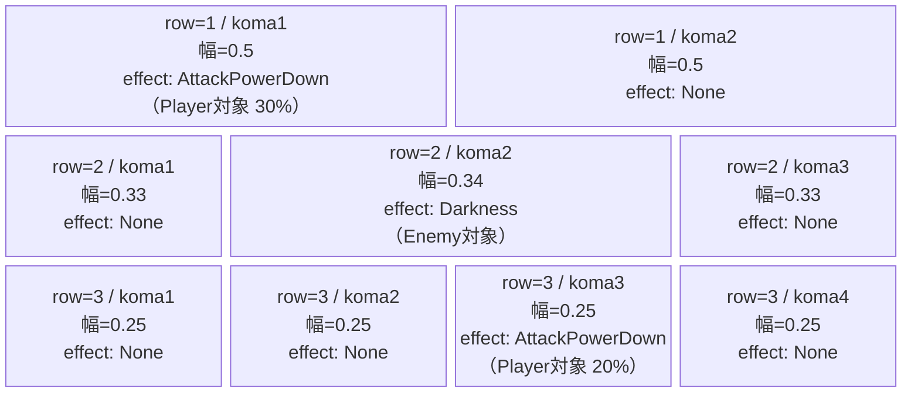

# vd_spy_normal_00001 インゲームデータ詳細解説

> 参照リポジトリ: `projects/glow-masterdata`
> リリースキー: 202604010

## インゲーム要件テキスト

密輸組織の残党（`e_spy_00001_vd_Normal_Blue`）が主力雑魚として序盤から継続的に押し寄せる。開幕は `ElapsedTime` で密輸組織の残党3体を即配置し、倒すたびに補充が来る `FriendUnitDead` 連鎖構造を採用している。中盤（5体撃破）にはグロー汎用ファントム（`e_glo_00001_vd_Normal_Colorless`）が混入し始め、終盤（12体撃破）では密輸組織の残党のボスバージョンが登場してプレッシャーを高める。20体撃破を超えると雑魚の無限補充（summon_count=99）に移行する。合計雑魚体数は最低15体以上を確保。

UR対抗キャラは `<黄昏> ロイド`（`chara_spy_00101`）。同キャラの青属性コマ効果（`AttackPowerDown`）を持つコマを配置し、ロイドの攻撃力を封じるギミックがある設計。ロイドで押すと攻撃が弱まる中、次々と現れる密輸組織残党をいかに効率よく撃破するかがポイント。

コマはノーマルブロック固定の3行構成。各行はランダム独立抽選（1〜4コマ）。コマアセットキーは `spy_00002`、`koma1_back_ground_offset` は `0.6`。

---

## レベルデザイン

### 敵キャラ設計

#### 敵キャラ選定（MstEnemyCharacter）

| mst_enemy_character_id | 日本語名 | 役割 | 備考 |
|------------------------|---------|------|------|
| `enemy_spy_00001` | 密輸組織の残党 | 雑魚 | SPY×FAMILY メイン雑魚 |
| `enemy_glo_00001` | グロー汎用ファントム | 雑魚 | 全作品共通ファントム |

#### 敵キャラステータス（MstEnemyStageParameter）

> vd_all/data/MstEnemyStageParameter.csv から既存IDを参照

| MstEnemyStageParameter ID | 日本語名 | kind | role | color | base_hp | base_atk | base_spd | well_dist | knockback | combo | drop_bp |
|--------------------------|---------|------|------|-------|---------|----------|----------|-----------|-----------|-------|---------|
| `e_spy_00001_vd_Normal_Blue` | 密輸組織の残党 | Normal | Attack | Blue | 10000 | 50 | 34 | 0.4 | 2 | 1 | 300 |
| `e_glo_00001_vd_Normal_Colorless` | グロー汎用ファントム | Normal | Attack | Colorless | 5000 | 100 | 34 | 0.22 | 3 | 1 | 150 |

---

### コマ設計

※ columns は1つのみ。各行のスパン合計 = 4 になること。

| row | height | 選択パターン | コマ数 | 各幅 | 幅合計 |
|-----|--------|------------|-------|------|--------|
| 1 | 0.33 | パターン6（2等分） | 2 | 0.5, 0.5 | 1.0 |
| 2 | 0.33 | パターン9（中央広い） | 3 | 0.33, 0.34, 0.33 | 1.0 |
| 3 | 0.34 | パターン12（4等分） | 4 | 0.25, 0.25, 0.25, 0.25 | 1.0 |

**コマアセットキー**: `spy_00002`
**koma1_back_ground_offset**: `0.6`

**コマエフェクト設計のポイント（UR対抗: ロイド対策）**:
- row=1 / koma1: `AttackPowerDown`（Player対象、30%ダウン）→ ロイドの攻撃力を封じる
- row=2 / koma2: `Darkness`（Enemy対象）→ 中央行の視界妨害で雑魚管理を難しくする
- row=3 / koma3: `AttackPowerDown`（Player対象、20%ダウン）→ 終盤行にも攻撃抑制コマを配置

---

### 敵キャラシーケンス設計

> **c_キャラ同時出現ルール（プランナー確認済み）**: c_キャラ（`c_` プレフィックス）が複数体登場する場合、
> 初回のみ `ElapsedTime`、2体目以降は `FriendUnitDead`（前の c_キャラの sequence_element_id を
> condition_value に指定）でチェーンすること。また c_キャラの `summon_count` は必ず `1` とすること。`e_glo_*` は対象外。

#### どのフェーズで、どの敵を、いつ、どこに、どのくらい出現させるか

```mermaid
flowchart LR
  Start([開始]) --> E1["ElapsedTime: 250ms\n密輸組織の残党 3体\ninterval=300\nelem=1"]
  E1 --> E2["ElapsedTime: 2000ms\n密輸組織の残党 3体\ninterval=300\nelem=2"]
  E2 --> E3["FriendUnitDead: 3体\nグロー汎用ファントム 2体\ninterval=200\nelem=3"]
  E3 --> E4["FriendUnitDead: 5体\n密輸組織の残党 3体\ninterval=300\nelem=4"]
  E4 --> E5["FriendUnitDead: 5体\nグロー汎用ファントム 2体\ninterval=200\nelem=5"]
  E5 --> E6["FriendUnitDead: 8体\n密輸組織の残党 4体\ninterval=250\nelem=6"]
  E6 --> E7["FriendUnitDead: 12体\n密輸組織の残党（ボスver） 1体\nposition=1.7\nelem=7"]
  E7 --> E8["FriendUnitDead: 15体\nグロー汎用ファントム 3体\ninterval=300\nelem=8"]
  E8 --> E9["FriendUnitDead: 20体\n密輸組織の残党 99体\ninterval=500\nelem=9（終盤無限補充）"]
  E9 --> E10["OutpostDamage: 1\n密輸組織の残党 99体\ninterval=750\nelem=10（バックアップ補充）"]
```

| elem | 出現タイミング | 敵 | 数 | 累計出現数/召喚位置 |
|------|-------------|---|---|-----------------|
| 1 | ElapsedTime=250 | 密輸組織の残党 | 3 | 累計3体 |
| 2 | ElapsedTime=2000 | 密輸組織の残党 | 3 | 累計6体 |
| 3 | FriendUnitDead=3 | グロー汎用ファントム | 2 | 累計8体 |
| 4 | FriendUnitDead=5 | 密輸組織の残党 | 3 | 累計11体 |
| 5 | FriendUnitDead=5 | グロー汎用ファントム | 2 | 累計13体 |
| 6 | FriendUnitDead=8 | 密輸組織の残党 | 4 | 累計17体 |
| 7 | FriendUnitDead=12 | 密輸組織の残党（Boss） | 1 | 累計18体 / position=1.7 |
| 8 | FriendUnitDead=15 | グロー汎用ファントム | 3 | 累計21体 |
| 9 | FriendUnitDead=20 | 密輸組織の残党 | 99 | 無限補充 |
| 10 | OutpostDamage=1 | 密輸組織の残党 | 99 | バックアップ無限補充 |

> ※ elem=7（FriendUnitDead=12）の密輸組織の残党ボスバージョンは既存IDを使用。`e_spy_00001_vd_Normal_Blue` の character_unit_kind=Normal, aura_type=Default として呼び出し、MstAutoPlayerSequence 側で `enemy_hp_coef=5.0` を設定して疑似ボス化する。

#### 敵キャラの固有ステータス調整（hp_coef / atk_coef）

| 波/フェーズ | 敵 | base_hp | hp_coef | 実HP | base_atk | atk_coef | 実ATK |
|-----------|---|---------|---------|------|----------|----------|-------|
| 序盤（elem1〜2） | 密輸組織の残党 | 10000 | 1.0 | 10000 | 50 | 1.0 | 50 |
| 中盤補充（elem3, 5） | グロー汎用ファントム | 5000 | 1.0 | 5000 | 100 | 1.0 | 100 |
| 中盤（elem4, 6） | 密輸組織の残党 | 10000 | 1.5 | 15000 | 50 | 1.5 | 75 |
| 強化ボス相当（elem7） | 密輸組織の残党 | 10000 | 5.0 | 50000 | 50 | 3.0 | 150 |
| 終盤補充（elem8） | グロー汎用ファントム | 5000 | 1.5 | 7500 | 100 | 1.0 | 100 |
| 無限補充（elem9〜10） | 密輸組織の残党 | 10000 | 2.0 | 20000 | 50 | 2.0 | 100 |

#### フェーズ切り替えはあるか

なし（VDでは SwitchSequenceGroup 使用禁止）

---

## 演出

### アセット

#### 背景

| 設定箇所 | アセットキー | 備考 |
|---------|------------|------|
| MstInGame.loop_background_asset_key | （空） | VDノーマルはデフォルト背景 |

#### BGM

| 設定 | 値 | 備考 |
|-----|---|------|
| bgm_asset_key | `SSE_SBG_003_010` | VDノーマル固定BGM |
| boss_bgm_asset_key | （空） | ノーマルブロックはボスBGMなし |

---

### 敵キャラオーラ

| オーラ種別 | 使用箇所 |
|----------|---------|
| Default | 全雑魚敵（密輸組織の残党、グロー汎用ファントム） |
| Default | elem=7 の強化密輸組織残党（疑似ボス） |

---

### 敵キャラ召喚アニメーション

全シーケンスで `summon_animation_type=None`（通常召喚）。VDノーマルブロックは演出シンプル設計のため `Fall` 系アニメーションは使用しない。elem=1 の開幕3体は interval=300ms で連続召喚し、敵が散らばって出現する演出を演出。

---

## テーブルデータサマリ

### MstInGame

| カラム | 値 |
|-------|---|
| id | `vd_spy_normal_00001` |
| release_key | `202604010` |
| content_type | `Dungeon` |
| stage_type | `vd_normal` |
| bgm_asset_key | `SSE_SBG_003_010` |
| boss_bgm_asset_key | （空） |
| loop_background_asset_key | （空） |
| mst_page_id | `vd_spy_normal_00001` |
| mst_enemy_outpost_id | `vd_spy_normal_00001` |
| boss_mst_enemy_stage_parameter_id | （空） |
| mst_auto_player_sequence_id | `vd_spy_normal_00001` |
| mst_auto_player_sequence_set_id | `vd_spy_normal_00001` |
| normal_enemy_hp_coef | `1.0` |
| normal_enemy_attack_coef | `1.0` |
| normal_enemy_speed_coef | `1.0` |
| boss_enemy_hp_coef | `1.0` |
| boss_enemy_attack_coef | `1.0` |
| boss_enemy_speed_coef | `1.0` |

### MstPage

| カラム | 値 |
|-------|---|
| id | `vd_spy_normal_00001` |
| release_key | `202604010` |

### MstEnemyOutpost

| カラム | 値 |
|-------|---|
| id | `vd_spy_normal_00001` |
| hp | `100` |
| is_damage_invalidation | （空） |
| outpost_asset_key | （空） |
| artwork_asset_key | （空。要アセット担当確認） |
| release_key | `202604010` |

### MstKomaLine

| id | mst_page_id | row | height | koma_line_layout_asset_key | koma1_asset_key | koma1_width | koma1_back_ground_offset | koma1_effect_type | koma1_effect_parameter1 | koma1_effect_parameter2 | koma1_effect_target_side | koma1_effect_target_colors | koma1_effect_target_roles | koma2_asset_key | koma2_width | koma2_effect_type |
|----|-------------|-----|--------|--------------------------|-----------------|-------------|--------------------------|------------------|------------------------|------------------------|--------------------------|--------------------------|--------------------------|-----------------|-------------|------------------|
| `vd_spy_normal_00001_1` | `vd_spy_normal_00001` | 1 | 0.33 | 6 | `spy_00002` | 0.5 | 0.6 | `AttackPowerDown` | 30 | 0 | Player | All | All | `spy_00002` | 0.5 | `None` |
| `vd_spy_normal_00001_2` | `vd_spy_normal_00001` | 2 | 0.33 | 9 | `spy_00002` | 0.33 | 0.6 | `None` | 0 | 0 | All | All | All | `spy_00002` | 0.34 | `Darkness` |
| `vd_spy_normal_00001_3` | `vd_spy_normal_00001` | 3 | 0.34 | 12 | `spy_00002` | 0.25 | 0.6 | `None` | 0 | 0 | All | All | All | `spy_00002` | 0.25 | `None` |

> ※ row=2のkoma2は `Darkness`（Enemy対象）、row=3のkoma3は `AttackPowerDown`（Player対象 20%）。koma4は row=3 のみ存在（幅0.25）。

### MstAutoPlayerSequence

| id | sequence_set_id | sequence_element_id | condition_type | condition_value | action_type | action_value | summon_count | summon_interval | summon_position | aura_type | death_type | enemy_hp_coef | enemy_attack_coef | enemy_speed_coef | summon_animation_type | defeated_score | deactivation_condition_type |
|----|-----------------|---------------------|---------------|----------------|-------------|-------------|-------------|----------------|----------------|-----------|-----------|--------------|------------------|-----------------|----------------------|---------------|---------------------------|
| `vd_spy_normal_00001_1` | `vd_spy_normal_00001` | 1 | ElapsedTime | 250 | SummonEnemy | `e_spy_00001_vd_Normal_Blue` | 3 | 300 | | Default | Normal | 1.0 | 1.0 | 1.0 | None | 0 | None |
| `vd_spy_normal_00001_2` | `vd_spy_normal_00001` | 2 | ElapsedTime | 2000 | SummonEnemy | `e_spy_00001_vd_Normal_Blue` | 3 | 300 | | Default | Normal | 1.0 | 1.0 | 1.0 | None | 0 | None |
| `vd_spy_normal_00001_3` | `vd_spy_normal_00001` | 3 | FriendUnitDead | 3 | SummonEnemy | `e_glo_00001_vd_Normal_Colorless` | 2 | 200 | | Default | Normal | 1.0 | 1.0 | 1.0 | None | 0 | None |
| `vd_spy_normal_00001_4` | `vd_spy_normal_00001` | 4 | FriendUnitDead | 5 | SummonEnemy | `e_spy_00001_vd_Normal_Blue` | 3 | 300 | | Default | Normal | 1.5 | 1.5 | 1.0 | None | 0 | None |
| `vd_spy_normal_00001_5` | `vd_spy_normal_00001` | 5 | FriendUnitDead | 5 | SummonEnemy | `e_glo_00001_vd_Normal_Colorless` | 2 | 200 | | Default | Normal | 1.0 | 1.0 | 1.0 | None | 0 | None |
| `vd_spy_normal_00001_6` | `vd_spy_normal_00001` | 6 | FriendUnitDead | 8 | SummonEnemy | `e_spy_00001_vd_Normal_Blue` | 4 | 250 | | Default | Normal | 1.5 | 1.5 | 1.0 | None | 0 | None |
| `vd_spy_normal_00001_7` | `vd_spy_normal_00001` | 7 | FriendUnitDead | 12 | SummonEnemy | `e_spy_00001_vd_Normal_Blue` | 1 | 0 | 1.7 | Default | Normal | 5.0 | 3.0 | 1.0 | None | 0 | None |
| `vd_spy_normal_00001_8` | `vd_spy_normal_00001` | 8 | FriendUnitDead | 15 | SummonEnemy | `e_glo_00001_vd_Normal_Colorless` | 3 | 300 | | Default | Normal | 1.5 | 1.0 | 1.0 | None | 0 | None |
| `vd_spy_normal_00001_9` | `vd_spy_normal_00001` | 9 | FriendUnitDead | 20 | SummonEnemy | `e_spy_00001_vd_Normal_Blue` | 99 | 500 | | Default | Normal | 2.0 | 2.0 | 1.0 | None | 0 | None |
| `vd_spy_normal_00001_10` | `vd_spy_normal_00001` | 10 | OutpostDamage | 1 | SummonEnemy | `e_spy_00001_vd_Normal_Blue` | 99 | 750 | | Default | Normal | 2.0 | 2.0 | 1.0 | None | 0 | None |
