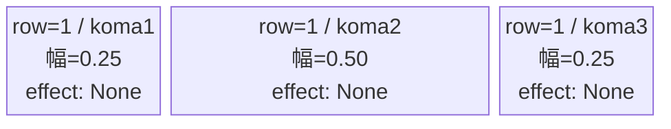
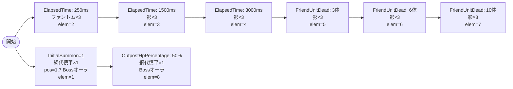

# vd_sum_boss_00001 インゲームデータ詳細解説

> 参照リポジトリ: `projects/glow-masterdata`
> リリースキー: 202604010

## インゲーム要件テキスト

ボス「網代 慎平」（`c_sum_00001_vd_Boss_Red`：Red/Technical・HP245,000）が開幕 `InitialSummon` で砦付近（position=1.7）に即座に配置され、プレイヤーを出迎える設計。雑魚は影（`e_sum_00001_vd_Normal_Red`：Red/Defense・HP350,000）とファントム（`e_glo_00001_vd_Normal_Colorless`：Colorless/Attack・HP5,000）で構成される。ElapsedTime 250ms でファントム3体が先行登場し、1,500ms から影が段階的に押し寄せる。ファントムや影を倒すほど `FriendUnitDead` トリガーで追加の影が登場し、拠点HP50%以下になると `OutpostHpPercentage=50` で網代 慎平が再度覚醒登場するプレッシャー設計。ボスは `MstInGame.boss_mst_enemy_stage_parameter_id` と `InitialSummon` の両方で設定する。

コマは1行固定（Bossブロック固定）。row1=パターン9（中央広い3コマ：0.25/0.50/0.25）。コマアセット: `sum_00001`（back_ground_offset: 0.6）。

UR対抗キャラ「影のウシオ 小舟 潮」（`chara_sum_00101`）への対抗として、Red属性の影と網代 慎平が主軸となり、Red属性対策コマを活かした攻略を求める設計。開幕ボス即配置 + 拠点防衛プレッシャーにより、UR潮の強力な攻撃・変身ギミックを機能させる前に決断を迫る難度設計となっている。

---

## レベルデザイン

### 敵キャラ設計

#### 敵キャラ選定（MstEnemyCharacter）

| mst_enemy_character_id | 日本語名 | 役割 | 備考 |
|------------------------|---------|------|------|
| `chara_sum_00001` | 網代 慎平 | ボス（c_キャラ） | `vd_all` CSVに `c_sum_00001_vd_Boss_Red` として定義済み。Red/Technical。開幕ボス＋拠点HP連動再登場 |
| `enemy_sum_00001` | 影 | 雑魚 | `vd_all` CSVに `e_sum_00001_vd_Normal_Red` として定義済み。Red/Defense |
| `enemy_glo_00001` | ファントム | 雑魚（共通） | `vd_all` CSVに `e_glo_00001_vd_Normal_Colorless` として定義済み。Colorless/Attack・序盤テンポ役 |

#### 敵キャラステータス（MstEnemyStageParameter）

> 既存参照（`vd_all/data/MstEnemyStageParameter.csv`より）

| MstEnemyStageParameter ID | 日本語名 | kind | role | color | base_hp | base_atk | base_spd | well_dist | knockback | combo | drop_bp |
|--------------------------|---------|------|------|-------|---------|----------|----------|-----------|-----------|-------|---------|
| `c_sum_00001_vd_Boss_Red` | 網代 慎平 | Boss | Technical | Red | 245000 | 500 | 45 | 0.11 | 2 | 5 | 10 |
| `e_sum_00001_vd_Normal_Red` | 影 | Normal | Defense | Red | 350000 | 600 | 40 | 0.2 | 1 | 1 | 10 |
| `e_glo_00001_vd_Normal_Colorless` | ファントム | Normal | Attack | Colorless | 5000 | 100 | 34 | 0.22 | 3 | 1 | 150 |

---

### コマ設計

※ columns は1つのみ（4）。各行のスパン合計 = 4。

| row | height | 選択パターン | コマ数 | 各幅 | 幅合計 |
|-----|--------|------------|-------|------|--------|
| 1 | 1.0 | パターン9「中央広い」 | 3 | 0.25, 0.50, 0.25 | 1.0 |

---

### 敵キャラシーケンス設計

> **c_キャラ同時出現ルール（プランナー確認済み）**: c_キャラ（`c_` プレフィックス）が複数体登場する場合、
> 初回のみ `ElapsedTime` または `InitialSummon`、2体目以降は `FriendUnitDead` または `OutpostHpPercentage`（前の c_キャラの sequence_element_id を
> condition_value に指定）でチェーンすること。また c_キャラの `summon_count` は必ず `1` とすること。`e_glo_*` は対象外。

#### どのフェーズで、どの敵を、いつ、どこに、どのくらい出現させるか

| elem | 出現タイミング | 敵 | 数 | 召喚位置/備考 |
|------|-------------|---|---|--------------|
| 1 | InitialSummon=1 | 網代 慎平 (c_sum_00001_vd_Boss_Red) | 1（summon_count=1） | position=1.7 / Bossオーラ / MstInGame.boss_mst_enemy_stage_parameter_idも設定 |
| 2 | ElapsedTime=250 | ファントム (e_glo_00001_vd_Normal_Colorless) | 3（interval=0） | Default |
| 3 | ElapsedTime=1500 | 影 (e_sum_00001_vd_Normal_Red) | 3（interval=500） | Default |
| 4 | ElapsedTime=3000 | 影 (e_sum_00001_vd_Normal_Red) | 3（interval=500） | Default |
| 5 | FriendUnitDead=3 | 影 (e_sum_00001_vd_Normal_Red) | 3（interval=500） | Default |
| 6 | FriendUnitDead=6 | 影 (e_sum_00001_vd_Normal_Red) | 3（interval=500） | Default |
| 7 | FriendUnitDead=10 | 影 (e_sum_00001_vd_Normal_Red) | 3（interval=500） | Default |
| 8 | OutpostHpPercentage=50 | 網代 慎平 (c_sum_00001_vd_Boss_Red) | 1（summon_count=1） | Bossオーラ / 拠点HP50%以下で覚醒再登場 |

**設計のポイント**:
- ボスの二重設定: `MstInGame.boss_mst_enemy_stage_parameter_id = c_sum_00001_vd_Boss_Red` + `InitialSummon（elem=1）` の両方に設定し、ボス演出を確実に発動させる
- `InitialSummon=1` で網代 慎平を開幕から砦付近（position=1.7）に配置。プレイヤーは開幕からボスを意識した戦略が必要
- `ElapsedTime` 250ms・1500ms・3000ms で段階的に雑魚を追加し、ボスと雑魚の同時対処プレッシャーを演出
- `FriendUnitDead=3/6/10` で雑魚を倒すほど影が補充される「倒しても来る」演出
- `OutpostHpPercentage=50` で拠点が削られると網代 慎平が再登場。防衛ラインを守りながらボスを相手にする「拠点防衛プレッシャー型」
- c_キャラ（網代 慎平）はelem=1とelem=8の2エントリ。elem=1は `InitialSummon`、elem=8は `OutpostHpPercentage` で独立トリガーのため同時出現なし。各summon_count=1

#### 敵キャラの固有ステータス調整（hp_coef / atk_coef）

| 波/フェーズ | 敵 | base_hp | hp_coef | 実HP | base_atk | atk_coef | 実ATK |
|-----------|---|---------|---------|------|----------|----------|-------|
| 開幕ボス（elem1） | 網代 慎平 | 245,000 | 1.0 | 245,000 | 500 | 1.0 | 500 |
| 開幕（elem2） | ファントム | 5,000 | 1.0 | 5,000 | 100 | 1.0 | 100 |
| 中盤 ElapsedTime（elem3〜4） | 影 | 350,000 | 1.0 | 350,000 | 600 | 1.0 | 600 |
| FriendUnitDead=3（elem5） | 影 | 350,000 | 1.0 | 350,000 | 600 | 1.0 | 600 |
| FriendUnitDead=6（elem6） | 影 | 350,000 | 1.0 | 350,000 | 600 | 1.0 | 600 |
| FriendUnitDead=10（elem7） | 影 | 350,000 | 1.0 | 350,000 | 600 | 1.0 | 600 |
| OutpostHpPercentage=50（elem8） | 網代 慎平 | 245,000 | 1.0 | 245,000 | 500 | 1.0 | 500 |

MstInGame の `boss_enemy_hp_coef = 1.0`、`boss_enemy_attack_coef = 1.0`、`normal_enemy_hp_coef = 1.0`、`normal_enemy_attack_coef = 1.0`。

#### フェーズ切り替えはあるか

なし（VDではSwitchSequenceGroup使用禁止）

---

## 演出

### アセット

#### 背景

| 設定箇所 | アセットキー | 備考 |
|---------|------------|------|
| MstInGame.loop_background_asset_key | （空） | VD bossは背景省略 |

#### BGM

| 設定 | 値 | 備考 |
|-----|---|------|
| bgm_asset_key | `SSE_SBG_003_004` | bossブロック固定値 |
| boss_bgm_asset_key | （空） | VD bossブロックではボスBGM切り替えなし |

---

### 敵キャラオーラ

| オーラ種別 | 使用箇所 |
|----------|---------|
| Default | ファントム（elem=2）、影（elem=3〜7） |
| Boss | 網代 慎平（elem=1, 8） |

---

### 敵キャラ召喚アニメーション

`summon_animation_type` は全行 `None`（VD固定値）。

網代 慎平（elem=1）は `InitialSummon=1` で `position=1.7` に砦付近配置。`move_start_condition_type=None`（召喚と同時に移動開始）。開幕からボスが存在するプレッシャー演出を意図する。elem=8 の `OutpostHpPercentage=50` 登場では position 指定なし（ランダム配置）。

---

## テーブルデータサマリ

### MstInGame

| カラム | 値 |
|-------|---|
| id | `vd_sum_boss_00001` |
| release_key | `202604010` |
| content_type | `Dungeon` |
| stage_type | `vd_boss` |
| mst_page_id | `vd_sum_boss_00001` |
| mst_enemy_outpost_id | `vd_sum_boss_00001` |
| boss_mst_enemy_stage_parameter_id | `c_sum_00001_vd_Boss_Red` |
| mst_auto_player_sequence_id | `vd_sum_boss_00001` |
| mst_auto_player_sequence_set_id | `vd_sum_boss_00001` |
| bgm_asset_key | `SSE_SBG_003_004` |
| boss_bgm_asset_key | （空） |
| loop_background_asset_key | （空） |
| normal_enemy_hp_coef | `1.0` |
| normal_enemy_attack_coef | `1.0` |
| normal_enemy_speed_coef | `1.0` |
| boss_enemy_hp_coef | `1.0` |
| boss_enemy_attack_coef | `1.0` |
| boss_enemy_speed_coef | `1.0` |

### MstPage

| カラム | 値 |
|-------|---|
| id | `vd_sum_boss_00001` |
| release_key | `202604010` |

### MstEnemyOutpost

| カラム | 値 |
|-------|---|
| id | `vd_sum_boss_00001` |
| hp | `1000` |
| is_damage_invalidation | （空） |
| outpost_asset_key | （空） |
| artwork_asset_key | （要確認） |
| release_key | `202604010` |

### MstKomaLine（1行）

| id | mst_page_id | row | height | koma_line_layout_asset_key | koma1_asset_key | koma1_width | koma1_back_ground_offset | koma1_effect_type | koma1_effect_parameter1 | koma1_effect_parameter2 | koma1_effect_target_side | koma1_effect_target_colors | koma1_effect_target_roles |
|----|------------|-----|--------|--------------------------|----------------|-------------|------------------------|-------------------|------------------------|------------------------|------------------------|--------------------------|--------------------------|
| `vd_sum_boss_00001_1` | `vd_sum_boss_00001` | 1 | 1.0 | 9 | `sum_00001` | 0.25 | 0.6 | None | 0 | 0 | All | All | All |

行1: koma2_asset_key=`sum_00001`, koma2_width=0.50, koma2_effect_type=None / koma3_asset_key=`sum_00001`, koma3_width=0.25, koma3_effect_type=None

### MstAutoPlayerSequence（8行）

| id | sequence_set_id | sequence_element_id | condition_type | condition_value | action_type | action_value | summon_count | summon_interval | summon_position | aura_type | death_type | enemy_hp_coef | enemy_attack_coef | enemy_speed_coef | defeated_score | summon_animation_type | move_start_condition_type | move_stop_condition_type | move_restart_condition_type |
|----|----------------|--------------------|----|----|----|----|----|----|----|----|----|----|----|----|----|----|----|----|----|
| `vd_sum_boss_00001_1` | `vd_sum_boss_00001` | 1 | InitialSummon | 1 | SummonEnemy | `c_sum_00001_vd_Boss_Red` | 1 | 0 | 1.7 | Boss | Normal | 1.0 | 1.0 | 1.0 | 0 | None | None | None | None |
| `vd_sum_boss_00001_2` | `vd_sum_boss_00001` | 2 | ElapsedTime | 250 | SummonEnemy | `e_glo_00001_vd_Normal_Colorless` | 3 | 0 | | Default | Normal | 1.0 | 1.0 | 1.0 | 0 | None | None | None | None |
| `vd_sum_boss_00001_3` | `vd_sum_boss_00001` | 3 | ElapsedTime | 1500 | SummonEnemy | `e_sum_00001_vd_Normal_Red` | 3 | 500 | | Default | Normal | 1.0 | 1.0 | 1.0 | 0 | None | None | None | None |
| `vd_sum_boss_00001_4` | `vd_sum_boss_00001` | 4 | ElapsedTime | 3000 | SummonEnemy | `e_sum_00001_vd_Normal_Red` | 3 | 500 | | Default | Normal | 1.0 | 1.0 | 1.0 | 0 | None | None | None | None |
| `vd_sum_boss_00001_5` | `vd_sum_boss_00001` | 5 | FriendUnitDead | 3 | SummonEnemy | `e_sum_00001_vd_Normal_Red` | 3 | 500 | | Default | Normal | 1.0 | 1.0 | 1.0 | 0 | None | None | None | None |
| `vd_sum_boss_00001_6` | `vd_sum_boss_00001` | 6 | FriendUnitDead | 6 | SummonEnemy | `e_sum_00001_vd_Normal_Red` | 3 | 500 | | Default | Normal | 1.0 | 1.0 | 1.0 | 0 | None | None | None | None |
| `vd_sum_boss_00001_7` | `vd_sum_boss_00001` | 7 | FriendUnitDead | 10 | SummonEnemy | `e_sum_00001_vd_Normal_Red` | 3 | 500 | | Default | Normal | 1.0 | 1.0 | 1.0 | 0 | None | None | None | None |
| `vd_sum_boss_00001_8` | `vd_sum_boss_00001` | 8 | OutpostHpPercentage | 50 | SummonEnemy | `c_sum_00001_vd_Boss_Red` | 1 | 0 | | Boss | Normal | 1.0 | 1.0 | 1.0 | 0 | None | None | None | None |

---

## ID一覧

| テーブル | カラム | 値 |
|---------|--------|-----|
| MstInGame | id | vd_sum_boss_00001 |
| MstInGame | boss_mst_enemy_stage_parameter_id | c_sum_00001_vd_Boss_Red |
| MstAutoPlayerSequence | sequence_set_id | vd_sum_boss_00001 |
| MstPage | id | vd_sum_boss_00001 |
| MstEnemyOutpost | id | vd_sum_boss_00001 |
| MstKomaLine | id（row1） | vd_sum_boss_00001_1 |
| MstAutoPlayerSequence | id（elem1） | vd_sum_boss_00001_1 |
| MstAutoPlayerSequence | id（elem2） | vd_sum_boss_00001_2 |
| MstAutoPlayerSequence | id（elem3） | vd_sum_boss_00001_3 |
| MstAutoPlayerSequence | id（elem4） | vd_sum_boss_00001_4 |
| MstAutoPlayerSequence | id（elem5） | vd_sum_boss_00001_5 |
| MstAutoPlayerSequence | id（elem6） | vd_sum_boss_00001_6 |
| MstAutoPlayerSequence | id（elem7） | vd_sum_boss_00001_7 |
| MstAutoPlayerSequence | id（elem8） | vd_sum_boss_00001_8 |
