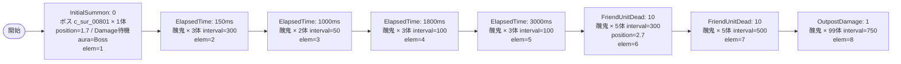

# vd_sur_boss_00001 インゲームデータ詳細解説

> 参照リポジトリ: `projects/glow-masterdata`
> リリースキー: 202604010

## インゲーム要件テキスト

ボス「無窮の鎖 和倉 優希」（c_sur_00801_vd_Boss_Red）が砦付近に配置された状態でステージが開幕する。雑魚の醜鬼（e_sur_00101_vd_Normal_Red）が序盤から中盤にかけて断続的に出現し、ボスを取り囲むような構成となる。ボスはダメージを受けるまで静止し、フレンドユニットが10体撃破された時点で追加の醜鬼が大量召喚されてプレッシャーが増す。終盤はアウトポストにダメージが入ると無限補充が始まる設計。UR対抗キャラ「万物を統べる総組長 山城 恋」（chara_sur_00901）に対しての対抗として、コマに攻撃力ダウンエフェクトを設置することで山城 恋の特性（高攻撃力）を活かしたプレイヤーへのプレッシャーを付与する。

コマは1行構成（bossブロック固定）で、パターン2（2コマ: 幅0.6+0.4）を採用。コマアセットキーは `sur_00001`、背景オフセットは `-1.0`。

---

## レベルデザイン

### 敵キャラ設計

#### 敵キャラ選定（MstEnemyCharacter）

| mst_enemy_character_id | 日本語名 | 役割 | 備考 |
|------------------------|---------|------|------|
| chara_sur_00801 | 無窮の鎖 和倉 優希 | ボス | c_プレフィックス。既存パラメータ使用 |
| enemy_sur_00101 | 醜鬼 | 雑魚 | e_プレフィックス。既存パラメータ使用 |

#### 敵キャラステータス（MstEnemyStageParameter）

> 既存参照: vd_all/data/MstEnemyStageParameter.csv より選出

| MstEnemyStageParameter ID | 日本語名 | kind | role | color | base_hp | base_atk | base_spd | well_dist | knockback | combo | drop_bp |
|--------------------------|---------|------|------|-------|---------|----------|----------|-----------|-----------|-------|---------|
| c_sur_00801_vd_Boss_Red | 無窮の鎖 和倉 優希 | Boss | Defense | Red | 50000 | 300 | 32 | 0.24 | 3 | 4 | 100 |
| e_sur_00101_vd_Normal_Red | 醜鬼 | Normal | Attack | Red | 400000 | 850 | 45 | 0.2 | 3 | 1 | 10 |

---

### コマ設計

```mermaid
block-beta
  columns 4
  A["row=1 / koma1\n幅=0.6\neffect: AttackPowerDown\n(30%Down / Enemy)"]:\
3 B["row=1 / koma2\n幅=0.4\neffect: None"]:2
```

> ※ columns 4 を使用。koma1: 幅0.6 → span:3（4×0.6≒2.4 → 近似3）、koma2: 幅0.4 → span:2（4×0.4=1.6 → 近似2）。合計5となるが、mermaid表示上の近似。実際の幅合計は1.0になるよう koma1=0.6, koma2=0.4 で設定する。

| row | height | 選択パターン | コマ数 | 各幅 | 幅合計 |
|-----|--------|------------|-------|------|--------|
| 1 | 1.0 | パターン2 | 2 | koma1:0.6, koma2:0.4 | 1.0 |

**コマエフェクト設計**:

| コマ | effect_type | parameter1 | parameter2 | target_side | target_colors | target_roles | 設計意図 |
|-----|------------|-----------|-----------|-------------|--------------|--------------|---------|
| koma1 | AttackPowerDown | 30 | 0 | Enemy | All | All | 山城 恋対抗: 攻撃力ダウンで醜鬼のラッシュを緩和、URキャラの高攻撃力を活かす場面を演出 |
| koma2 | None | 0 | 0 | All | All | All | エフェクトなし |

---

### 敵キャラシーケンス設計

> **c_キャラ同時出現ルール（プランナー確認済み）**: c_キャラ（`c_` プレフィックス）が複数体登場する場合、
> 初回のみ `ElapsedTime`、2体目以降は `FriendUnitDead`（前の c_キャラの sequence_element_id を
> condition_value に指定）でチェーンすること。また c_キャラの `summon_count` は必ず `1` とすること。`e_glo_*` は対象外。

**ボスの二重設定**:
- `MstInGame.boss_mst_enemy_stage_parameter_id` = `c_sur_00801_vd_Boss_Red` を設定
- `MstAutoPlayerSequence` の InitialSummon(0) でもボスを position=1.7 に召喚する（move_start_condition_type=Damage, move_start_condition_value=1）

#### どのフェーズで、どの敵を、いつ、どこに、どのくらい出現させるか



| elem | 出現タイミング | 敵 | 数 | 累計出現数 / 召喚位置 |
|------|-------------|---|---|-----------------|
| 1 | InitialSummon: 0 | 無窮の鎖 和倉 優希（ボス） | 1 | 1体 / position=1.7 |
| 2 | ElapsedTime: 150 | 醜鬼 | 3 | 4体 / ランダム |
| 3 | ElapsedTime: 1000 | 醜鬼 | 2 | 6体 / ランダム |
| 4 | ElapsedTime: 1800 | 醜鬼 | 3 | 9体 / ランダム |
| 5 | ElapsedTime: 3000 | 醜鬼 | 3 | 12体 / ランダム |
| 6 | FriendUnitDead: 10 | 醜鬼 | 5 | 17体 / position=2.7 |
| 7 | FriendUnitDead: 10 | 醜鬼 | 5 | 22体 / ランダム |
| 8 | OutpostDamage: 1 | 醜鬼 | 99（実質無限） | ∞ / ランダム |

#### 敵キャラの固有ステータス調整（hp_coef / atk_coef）

| 波/フェーズ | 敵 | base_hp | hp_coef | 実HP | base_atk | atk_coef | 実ATK |
|-----------|---|---------|---------|------|----------|----------|-------|
| ボス（全体） | 無窮の鎖 和倉 優希 | 50000 | 1.0 | 50000 | 300 | 1.0 | 300 |
| 序盤〜中盤（elem2〜5） | 醜鬼 | 400000 | 1.0 | 400000 | 850 | 1.0 | 850 |
| 後半ラッシュ（elem6〜7） | 醜鬼 | 400000 | 1.0 | 400000 | 850 | 1.0 | 850 |
| 無限補充（elem8） | 醜鬼 | 400000 | 1.0 | 400000 | 850 | 1.0 | 850 |

#### フェーズ切り替えはあるか

なし（VDではSwitchSequenceGroup使用禁止）

---

## 演出

### アセット

#### 背景

| 設定箇所 | アセットキー | 備考 |
|---------|------------|------|
| MstInGame.loop_background_asset_key | （空文字） | VDボスブロックは背景アセット省略 |

#### BGM

| 設定 | 値 | 備考 |
|-----|---|------|
| bgm_asset_key | SSE_SBG_003_004 | VD bossブロック固定BGM |
| boss_bgm_asset_key | （空文字） | 切り替えなし |

---

### 敵キャラオーラ

| オーラ種別 | 使用箇所 |
|----------|---------|
| Boss | ボス（c_sur_00801_vd_Boss_Red）の召喚時。elem=1 |
| Default | 雑魚（e_sur_00101_vd_Normal_Red）の召喚時。elem=2〜8 |

---

### 敵キャラ召喚アニメーション

- **elem=1（InitialSummon）**: `summon_animation_type=None`。ボスが砦付近に静止した状態でステージ開幕。`move_start_condition_type=Damage`, `move_start_condition_value=1` でダメージを受けるまで動かない。
- **elem=2〜8（雑魚）**: `summon_animation_type=None`。通常召喚アニメーション。
- **elem=8（OutpostDamage=1）**: アウトポストに初ダメージが入った瞬間から醜鬼が無限補充される終盤演出。

---

## MstAutoPlayerSequence 設計詳細

| id | sequence_set_id | sequence_element_id | condition_type | condition_value | action_type | action_value | summon_count | summon_interval | summon_position | aura_type | move_start_condition_type | move_start_condition_value | death_type | enemy_hp_coef | enemy_attack_coef | enemy_speed_coef | defeated_score | summon_animation_type |
|----|-----------------|---------------------|----------------|-----------------|-------------|--------------|-------------|-----------------|-----------------|-----------|--------------------------|---------------------------|------------|---------------|-------------------|------------------|----------------|----------------------|
| vd_sur_boss_00001_1 | vd_sur_boss_00001 | 1 | InitialSummon | 0 | SummonEnemy | c_sur_00801_vd_Boss_Red | 1 | 0 | 1.7 | Boss | Damage | 1 | Normal | 1.0 | 1.0 | 1.0 | 0 | None |
| vd_sur_boss_00001_2 | vd_sur_boss_00001 | 2 | ElapsedTime | 150 | SummonEnemy | e_sur_00101_vd_Normal_Red | 3 | 300 | （空） | Default | None | （空） | Normal | 1.0 | 1.0 | 1.0 | 0 | None |
| vd_sur_boss_00001_3 | vd_sur_boss_00001 | 3 | ElapsedTime | 1000 | SummonEnemy | e_sur_00101_vd_Normal_Red | 2 | 50 | （空） | Default | None | （空） | Normal | 1.0 | 1.0 | 1.0 | 0 | None |
| vd_sur_boss_00001_4 | vd_sur_boss_00001 | 4 | ElapsedTime | 1800 | SummonEnemy | e_sur_00101_vd_Normal_Red | 3 | 100 | （空） | Default | None | （空） | Normal | 1.0 | 1.0 | 1.0 | 0 | None |
| vd_sur_boss_00001_5 | vd_sur_boss_00001 | 5 | ElapsedTime | 3000 | SummonEnemy | e_sur_00101_vd_Normal_Red | 3 | 100 | （空） | Default | None | （空） | Normal | 1.0 | 1.0 | 1.0 | 0 | None |
| vd_sur_boss_00001_6 | vd_sur_boss_00001 | 6 | FriendUnitDead | 10 | SummonEnemy | e_sur_00101_vd_Normal_Red | 5 | 300 | 2.7 | Default | None | （空） | Normal | 1.0 | 1.0 | 1.0 | 0 | None |
| vd_sur_boss_00001_7 | vd_sur_boss_00001 | 7 | FriendUnitDead | 10 | SummonEnemy | e_sur_00101_vd_Normal_Red | 5 | 500 | （空） | Default | None | （空） | Normal | 1.0 | 1.0 | 1.0 | 0 | None |
| vd_sur_boss_00001_8 | vd_sur_boss_00001 | 8 | OutpostDamage | 1 | SummonEnemy | e_sur_00101_vd_Normal_Red | 99 | 750 | （空） | Default | None | （空） | Normal | 1.0 | 1.0 | 1.0 | 0 | None |

---

## MstInGame 設計詳細

| カラム | 値 |
|-------|---|
| id | vd_sur_boss_00001 |
| release_key | 202604010 |
| content_type | Dungeon |
| stage_type | vd_boss |
| mst_auto_player_sequence_id | vd_sur_boss_00001 |
| mst_auto_player_sequence_set_id | vd_sur_boss_00001 |
| bgm_asset_key | SSE_SBG_003_004 |
| boss_bgm_asset_key | （空文字） |
| loop_background_asset_key | （空文字） |
| player_outpost_asset_key | （空文字） |
| mst_page_id | vd_sur_boss_00001 |
| mst_enemy_outpost_id | vd_sur_boss_00001 |
| mst_defense_target_id | （NULL） |
| boss_mst_enemy_stage_parameter_id | c_sur_00801_vd_Boss_Red |
| boss_count | （NULL） |
| normal_enemy_hp_coef | 1.0 |
| normal_enemy_attack_coef | 1.0 |
| normal_enemy_speed_coef | 1.0 |
| boss_enemy_hp_coef | 1.0 |
| boss_enemy_attack_coef | 1.0 |
| boss_enemy_speed_coef | 1.0 |

---

## MstPage 設計詳細

| カラム | 値 |
|-------|---|
| id | vd_sur_boss_00001 |
| release_key | 202604010 |

---

## MstEnemyOutpost 設計詳細

| カラム | 値 |
|-------|---|
| id | vd_sur_boss_00001 |
| hp | 1000 |
| is_damage_invalidation | （空文字） |
| outpost_asset_key | （空文字） |
| artwork_asset_key | （要確認：アセット担当者に確認推奨） |
| release_key | 202604010 |

---

## MstKomaLine 設計詳細

| id | mst_page_id | row | height | koma_line_layout_asset_key | release_key |
|----|-------------|-----|--------|---------------------------|-------------|
| vd_sur_boss_00001_1 | vd_sur_boss_00001 | 1 | 1.0 | 2 | 202604010 |

### コマ詳細（row=1）

| カラム | koma1 | koma2 |
|-------|-------|-------|
| asset_key | sur_00001 | sur_00001 |
| width | 0.6 | 0.4 |
| back_ground_offset | -1.0 | （空／NULL） |
| effect_type | AttackPowerDown | None |
| effect_parameter1 | 30 | 0 |
| effect_parameter2 | 0 | 0 |
| effect_target_side | Enemy | All |
| effect_target_colors | All | All |
| effect_target_roles | All | All |
