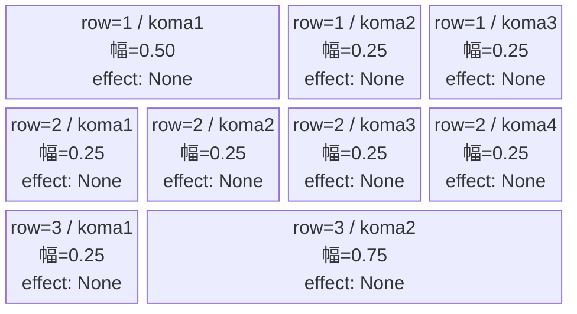

# vd_sur_normal_00001 インゲームデータ詳細解説

> 参照リポジトリ: `projects/glow-masterdata`
> リリースキー: 202604010

## インゲーム要件テキスト

醜鬼（Red/Attack・HP400,000・ATK850・SPD45）が開幕250msとその後の波状攻撃で計15体以上出現する構成。ファントム（Colorless/Attack・HP5,000・ATK100・SPD34）が序盤の足場を作り、醜鬼が FriendUnitDead トリガーに連動して色違い（Red/Colorless/Green）で段階的に追加召喚される設計。7体倒されると高威力Red醜鬼が無限補充（summon_count=99）に切り替わり、拠点を守り続けるプレッシャーが続く。合計通常召喚: 18体 + 無限補充（99×2本）。

コマは3行固定（各行独立抽選）。row1=左広い3コマ（0.50, 0.25, 0.25）・row2=4等分4コマ（0.25×4）・row3=右広い2コマ（0.25, 0.75）。コマアセット: sur_00001（back_ground_offset: -1.0）。

UR対抗キャラ「万物を統べる総組長 山城 恋」（chara_sur_00901）対抗。Red属性の醜鬼が主軸となるため、Red属性対策コマを活かしたプレイが有効になる設計。FriendUnitDead で段階的に強化される敵の波に対応するため、コマ選択と出撃タイミングの精度が求められる。

---

## レベルデザイン

### 敵キャラ設計

#### 敵キャラ選定（MstEnemyCharacter）

| mst_enemy_character_id | 日本語名 | 役割 | 備考 |
|------------------------|---------|------|------|
| enemy_sur_00101 | 醜鬼 | 雑魚 | Red属性・Attackロール。魔都精兵のスレイブ作品の登場敵 |
| enemy_glo_00001 | ファントム | 雑魚（共通） | Colorless属性・Attackロール |

#### 敵キャラステータス（MstEnemyStageParameter）

> 全エントリ既存参照: `vd_all/data/MstEnemyStageParameter.csv`（release_key: 202604010）

| MstEnemyStageParameter ID | 日本語名 | character_unit_kind | role_type | color | hp | attack_power | move_speed | well_distance | damage_knock_back_count | attack_combo_cycle | drop_battle_point |
|--------------------------|---------|---------------------|-----------|-------|----|-------------|-----------|---------------|------------------------|-------------------|------------------|
| e_sur_00101_vd_Normal_Red | 醜鬼 | Normal | Attack | Red | 400,000 | 850 | 45 | 0.2 | 3 | 1 | 10 |
| e_glo_00001_vd_Normal_Colorless | ファントム | Normal | Attack | Colorless | 5,000 | 100 | 34 | 0.22 | 3 | 1 | 150 |

---

### コマ設計

各行独立ランダム抽選（12パターンから）の結果（`koma1_asset_key`: `sur_00001`、`koma1_back_ground_offset`: `-1.0`）:

| row | height | 選択パターン | コマ数 | 各幅 | 幅合計 | koma1_asset_key | koma1_back_ground_offset |
|-----|--------|------------|-------|------|--------|----------------|-------------------------|
| 1 | 0.33 | パターン8「左広い・右2等分」 | 3コマ | 0.50, 0.25, 0.25 | 1.0 | sur_00001 | -1.0 |
| 2 | 0.33 | パターン12「4等分」 | 4コマ | 0.25, 0.25, 0.25, 0.25 | 1.0 | sur_00001 | -1.0 |
| 3 | 0.34 | パターン5「右がかなり広い」 | 2コマ | 0.25, 0.75 | 1.0 | sur_00001 | -1.0 |

---

### 敵キャラシーケンス設計

> **c_キャラ同時出現ルール（プランナー確認済み）**: c_キャラ（`c_` プレフィックス）が複数体登場する場合、
> 初回のみ `ElapsedTime`、2体目以降は `FriendUnitDead`（前の c_キャラの sequence_element_id を
> condition_value に指定）でチェーンすること。また c_キャラの `summon_count` は必ず `1` とすること。`e_glo_*` は対象外。

#### どのフェーズで、どの敵を、いつ、どこに、どのくらい出現させるか

```mermaid
flowchart LR
  Start((開始)) --> W1["ElapsedTime 250ms\nファントム ×3\nDefault"]
  W1 --> W2["ElapsedTime 1000ms\n醜鬼 Red ×2\nDefault"]
  W2 --> W3["ElapsedTime 1500ms\n醜鬼 Red ×3\nDefault"]
  W3 --> W4["FriendUnitDead 3体\n醜鬼 Red ×2 (pos:1.3)\nDefault"]
  W4 --> W5["ElapsedTime 2500ms\nファントム ×3\nDefault"]
  W5 --> W6["FriendUnitDead 5体\n醜鬼 Red ×3\nDefault"]
  W6 --> W7["ElapsedTime 3500ms\n醜鬼 Red ×2 (pos:1.3)\nDefault"]
  W7 --> W8["FriendUnitDead 7体\n醜鬼 Red summon=99\ninterval=750ms"]
  W8 --> W9["FriendUnitDead 7体\n醜鬼 Red summon=99\ninterval=1200ms"]
  W9 --> End((終了/無限補充))
```

| elem | 出現タイミング | 敵 | 数 | summon_interval | 召喚位置 | 累計出現数 |
|------|-------------|---|---|-----------------|---------|---------|
| 1 | ElapsedTime 250ms | ファントム (e_glo_00001_vd_Normal_Colorless) | 3 | 0 | - | 3 |
| 2 | ElapsedTime 1000ms | 醜鬼 (e_sur_00101_vd_Normal_Red) | 2 | 50 | - | 5 |
| 3 | ElapsedTime 1500ms | 醜鬼 (e_sur_00101_vd_Normal_Red) | 3 | 50 | - | 8 |
| 4 | FriendUnitDead 3 | 醜鬼 (e_sur_00101_vd_Normal_Red) | 2 | 100 | 1.3 | 10 |
| 5 | ElapsedTime 2500ms | ファントム (e_glo_00001_vd_Normal_Colorless) | 3 | 100 | - | 13 |
| 6 | FriendUnitDead 5 | 醜鬼 (e_sur_00101_vd_Normal_Red) | 3 | 100 | - | 16 |
| 7 | ElapsedTime 3500ms | 醜鬼 (e_sur_00101_vd_Normal_Red) | 2 | 50 | 1.3 | 18 |
| 8 | FriendUnitDead 7 | 醜鬼 (e_sur_00101_vd_Normal_Red) | **99** | 750 | - | 無限補充開始 |
| 9 | FriendUnitDead 7 | 醜鬼 (e_sur_00101_vd_Normal_Red) | **99** | 1200 | - | 無限補充×2本同時 |

通常召喚合計: **18体**（要件「最低15体以上」を満たす）
終盤: FriendUnitDead 7体達成後に summon_count=99 の2本無限補充が同時稼働

> **c_キャラ召喚ガードレール確認**: 登場する全キャラ（enemy_sur_00101・enemy_glo_00001）は `e_` プレフィックスの純粋な敵キャラクターです。c_キャラ召喚制約は適用されません。

#### 敵キャラの固有ステータス調整（hp_coef / atk_coef）

MstAutoPlayerSequenceの `enemy_hp_coef` / `enemy_attack_coef` はすべてデフォルト値（1.0）を使用します。

| 波 | 敵 | hp | hp_coef | 実HP | attack_power | atk_coef | 実ATK |
|---|---|-----|---------|------|-------------|----------|-------|
| 1（elem1） | ファントム | 5,000 | 1.0 | 5,000 | 100 | 1.0 | 100 |
| 2（elem2） | 醜鬼 | 400,000 | 1.0 | 400,000 | 850 | 1.0 | 850 |
| 3（elem3） | 醜鬼 | 400,000 | 1.0 | 400,000 | 850 | 1.0 | 850 |
| 4（elem4） | 醜鬼 | 400,000 | 1.0 | 400,000 | 850 | 1.0 | 850 |
| 5（elem5） | ファントム | 5,000 | 1.0 | 5,000 | 100 | 1.0 | 100 |
| 6（elem6） | 醜鬼 | 400,000 | 1.0 | 400,000 | 850 | 1.0 | 850 |
| 7（elem7） | 醜鬼 | 400,000 | 1.0 | 400,000 | 850 | 1.0 | 850 |
| 8-9（elem8-9） | 醜鬼（無限補充） | 400,000 | 1.0 | 400,000 | 850 | 1.0 | 850 |

#### フェーズ切り替えはあるか

なし（VDではSwitchSequenceGroup使用禁止）

---

## 演出

### アセット

#### 背景

| 設定箇所 | アセットキー | 備考 |
|---------|------------|------|
| loop_background_asset_key | （空） | VDの背景切り替えはゲームロジック側で管理 |
| フロア0以上 | koma_background_vd_00001 | クライアント側でフロア係数に応じて切り替え |
| フロア20以上 | koma_background_vd_00003 | 同上 |
| フロア40以上 | koma_background_vd_00005 | 同上 |

#### BGM

| 設定 | 値 | 備考 |
|-----|---|------|
| bgm_asset_key | SSE_SBG_003_010 | ノーマルブロック用BGM |
| boss_bgm_asset_key | （空） | ノーマルブロックはボスBGMなし |

---

### 敵キャラオーラ

| オーラ種別 | 使用箇所 |
|----------|---------|
| Default | 全敵キャラ（ノーマルブロックはボスなし、全行Default） |

---

### 敵キャラ召喚アニメーション

ElapsedTime と FriendUnitDead の組み合わせによる段階的な召喚構成。全キャラ `summon_animation_type=None`（デフォルト）。

- elem1/5: ファントムが序盤と中盤に3体ずつ登場し、テンポを作る
- elem2/3: 開幕1,000ms〜1,500msで醜鬼が計5体出現。攻撃力が高く（850）、素早く（SPD45）プレッシャーをかける
- elem4/6/7: FriendUnitDead 3体・5体で醜鬼が追加補充。倒すほど次の波が来る緊張感
- elem8/9: 7体撃破後に2本の無限補充（interval 750ms/1200ms のずれで密度に変化）が同時稼働。終盤のエンドレスな攻撃を演出

---

## 生成テーブルまとめ

| テーブル | 状態 | 備考 |
|---------|------|------|
| MstEnemyStageParameter | 既存参照 | `vd_all/data/MstEnemyStageParameter.csv` のエントリを使用（新規生成なし） |
| MstEnemyOutpost | 新規生成 | HP=100固定、is_damage_invalidation=空、id=vd_sur_normal_00001 |
| MstPage | 新規生成 | id=vd_sur_normal_00001 |
| MstKomaLine | 新規生成 | 3行固定（row=1〜3）、パターン8/12/5 |
| MstAutoPlayerSequence | 新規生成 | 9要素（通常18体+無限補充×2本、sequence_set_id=vd_sur_normal_00001） |
| MstInGame | 新規生成 | content_type=Dungeon、stage_type=vd_normal、ボスなし、release_key=202604010 |

---

## ID一覧

| テーブル | カラム | 値 |
|---------|--------|-----|
| MstInGame | id | vd_sur_normal_00001 |
| MstAutoPlayerSequence | sequence_set_id | vd_sur_normal_00001 |
| MstPage | id | vd_sur_normal_00001 |
| MstEnemyOutpost | id | vd_sur_normal_00001 |
| MstKomaLine | id（row1） | vd_sur_normal_00001_1 |
| MstKomaLine | id（row2） | vd_sur_normal_00001_2 |
| MstKomaLine | id（row3） | vd_sur_normal_00001_3 |
| MstAutoPlayerSequence | id（elem1） | vd_sur_normal_00001_1 |
| MstAutoPlayerSequence | id（elem2） | vd_sur_normal_00001_2 |
| MstAutoPlayerSequence | id（elem3） | vd_sur_normal_00001_3 |
| MstAutoPlayerSequence | id（elem4） | vd_sur_normal_00001_4 |
| MstAutoPlayerSequence | id（elem5） | vd_sur_normal_00001_5 |
| MstAutoPlayerSequence | id（elem6） | vd_sur_normal_00001_6 |
| MstAutoPlayerSequence | id（elem7） | vd_sur_normal_00001_7 |
| MstAutoPlayerSequence | id（elem8） | vd_sur_normal_00001_8 |
| MstAutoPlayerSequence | id（elem9） | vd_sur_normal_00001_9 |
