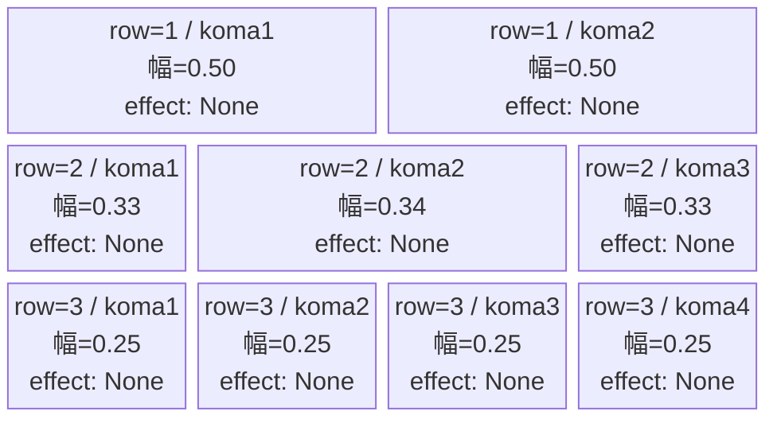
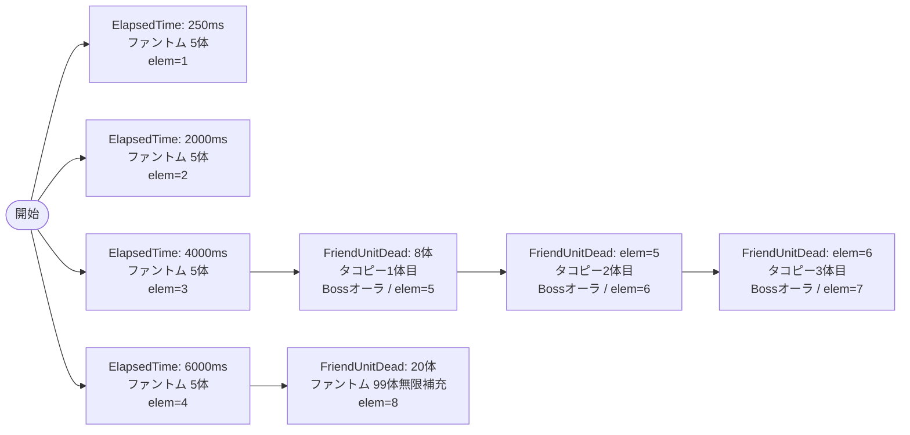

# vd_tak_normal_00001 インゲームデータ詳細解説

> 参照リポジトリ: `projects/glow-masterdata`
> リリースキー: 202604010

## インゲーム要件テキスト

開幕からファントム（e_glo_00001_vd_Normal_Colorless）が複数波で押し寄せ、序中盤は ElapsedTime で定期的に計15体以上を補充する。倒し進めると FriendUnitDead=8 を契機にタコピー（c_tak_00001_vd_Boss_Blue）が1体目として登場し、続けて FriendUnitDead チェーンで2体目・3体目が順次現れる。c_tak は Boss オーラ付きで summon_count=1 の精密召喚とし、フィールドに同時に2体以上出現しないよう制御する。最終的に FriendUnitDead=20 でファントムの summon_count=99 無限補充が始まり、拠点への圧力が増し続ける。コマは3行構成でアセットキーは `glo_00004`（tak 用）を使用し、各行のコマ数はランダム独立抽選（1〜4コマ）で構成する。UR対抗キャラ「ハッピー星からの使者 タコピー」に対抗するステージとして、タコピー自身が敵として何度も立ちはだかる演出を設計している。

---

## レベルデザイン

### 敵キャラ設計

#### 敵キャラ選定（MstEnemyCharacter）

| mst_enemy_character_id | 日本語名 | 役割 | 備考 |
|------------------------|---------|------|------|
| `enemy_glo_00001` | ファントム | 雑魚 | 共通ファントム（Colorless） |
| `chara_tak_00001` | ハッピー星からの使者 タコピー | c_キャラ（ボス扱い） | vd_all CSV より `c_tak_00001_vd_Boss_Blue` |

#### 敵キャラステータス（MstEnemyStageParameter）

> 既存参照: `vd_all/data/MstEnemyStageParameter.csv` より取得

| MstEnemyStageParameter ID | 日本語名 | kind | role | color | base_hp | base_atk | base_spd | well_dist | knockback | combo | drop_bp |
|--------------------------|---------|------|------|-------|---------|----------|----------|-----------|-----------|-------|---------|
| `e_glo_00001_vd_Normal_Colorless` | ファントム | Normal | Attack | Colorless | 5,000 | 100 | 34 | 0.22 | 3 | 1 | 150 |
| `c_tak_00001_vd_Boss_Blue` | ハッピー星からの使者 タコピー | Boss | Defense | Blue | 10,000 | 300 | 25 | 0.17 | 4 | 5 | 400 |

---

### コマ設計

※ columns は1つのみ。各行のスパン合計 = 4 になること。

| row | height | 選択パターン | コマ数 | 各幅 | 幅合計 |
|-----|--------|------------|-------|------|--------|
| 1 | 0.33 | パターン6（2等分） | 2 | 0.50, 0.50 | 1.0 |
| 2 | 0.33 | パターン7（3等分） | 3 | 0.33, 0.34, 0.33 | 1.0 |
| 3 | 0.34 | パターン12（4等分） | 4 | 0.25, 0.25, 0.25, 0.25 | 1.0 |

---

### 敵キャラシーケンス設計

> **c_キャラ同時出現ルール（プランナー確認済み）**: c_キャラ（`c_` プレフィックス）が複数体登場する場合、
> 初回のみ `ElapsedTime`、2体目以降は `FriendUnitDead`（前の c_キャラの sequence_element_id を
> condition_value に指定）でチェーンすること。また c_キャラの `summon_count` は必ず `1` とすること。`e_glo_*` は対象外。

#### どのフェーズで、どの敵を、いつ、どこに、どのくらい出現させるか

| elem | 出現タイミング | 敵 | 数 | 累計出現数/召喚位置 |
|------|-------------|---|---|-----------------|
| 1 | ElapsedTime=250ms | ファントム (e_glo_00001_vd_Normal_Colorless) | 5体 / interval=0 | 累計5体 |
| 2 | ElapsedTime=2000ms | ファントム (e_glo_00001_vd_Normal_Colorless) | 5体 / interval=0 | 累計10体 |
| 3 | ElapsedTime=4000ms | ファントム (e_glo_00001_vd_Normal_Colorless) | 5体 / interval=0 | 累計15体 |
| 4 | ElapsedTime=6000ms | ファントム (e_glo_00001_vd_Normal_Colorless) | 5体 / interval=0 | 累計20体 |
| 5 | FriendUnitDead=8 | タコピー (c_tak_00001_vd_Boss_Blue) | 1体 / summon_count=1 | 累計21体 / Bossオーラ |
| 6 | FriendUnitDead=5（elem=5撃破） | タコピー (c_tak_00001_vd_Boss_Blue) | 1体 / summon_count=1 | 累計22体 / Bossオーラ |
| 7 | FriendUnitDead=6（elem=6撃破） | タコピー (c_tak_00001_vd_Boss_Blue) | 1体 / summon_count=1 | 累計23体 / Bossオーラ |
| 8 | FriendUnitDead=20 | ファントム (e_glo_00001_vd_Normal_Colorless) | 99体 / interval=500 | 無限補充開始 |

> **c_キャラチェーン詳細**:
> - elem=5（1体目）: `condition_type=FriendUnitDead`, `condition_value=8`
> - elem=6（2体目）: `condition_type=FriendUnitDead`, `condition_value=5`（elem=5のsequence_element_idを指定）
> - elem=7（3体目）: `condition_type=FriendUnitDead`, `condition_value=6`（elem=6のsequence_element_idを指定）

#### 敵キャラの固有ステータス調整（hp_coef / atk_coef）

| 波/フェーズ | 敵 | base_hp | hp_coef | 実HP | base_atk | atk_coef | 実ATK |
|-----------|---|---------|---------|------|----------|----------|-------|
| 序盤〜中盤（elem 1〜4） | ファントム | 5,000 | 1.0 | 5,000 | 100 | 1.0 | 100 |
| c_tak登場（elem 5〜7） | タコピー | 10,000 | 1.0 | 10,000 | 300 | 1.0 | 300 |
| 終盤無限補充（elem 8） | ファントム | 5,000 | 1.0 | 5,000 | 100 | 1.0 | 100 |

#### フェーズ切り替えはあるか

なし（VDではSwitchSequenceGroup使用禁止）

---

## 演出

### アセット

#### 背景

| 設定箇所 | アセットキー | 備考 |
|---------|------------|------|
| MstInGame.loop_background_asset_key | （空文字） | VDノーマルはデフォルト背景適用 |

#### BGM

| 設定 | 値 | 備考 |
|-----|---|------|
| bgm_asset_key | `SSE_SBG_003_010` | VDノーマルブロック固定BGM |
| boss_bgm_asset_key | （空文字） | ノーマルブロックはボスBGMなし |

---

### 敵キャラオーラ

| オーラ種別 | 使用箇所 |
|----------|---------|
| Default | ファントム（elem 1〜4, 8） |
| Boss | タコピー elem 5〜7（c_tak_00001_vd_Boss_Blue） |

---

### 敵キャラ召喚アニメーション

- ファントム（elem 1〜4, 8）: `summon_animation_type=None`（通常召喚）
- タコピー（elem 5〜7）: `summon_animation_type=None`（通常召喚）。Bossオーラ付きで登場するため演出は十分。

---

## 付記

### MstInGame 設定概要

| カラム | 値 |
|-------|---|
| id | `vd_tak_normal_00001` |
| release_key | `202604010` |
| content_type | `Dungeon` |
| stage_type | `vd_normal` |
| mst_page_id | `vd_tak_normal_00001` |
| mst_enemy_outpost_id | `vd_tak_normal_00001` |
| boss_mst_enemy_stage_parameter_id | （空文字） |
| mst_auto_player_sequence_id | `vd_tak_normal_00001` |
| mst_auto_player_sequence_set_id | `vd_tak_normal_00001` |
| bgm_asset_key | `SSE_SBG_003_010` |
| boss_bgm_asset_key | （空文字） |
| loop_background_asset_key | （空文字） |
| normal_enemy_hp_coef | `1.0` |
| normal_enemy_attack_coef | `1.0` |
| normal_enemy_speed_coef | `1.0` |
| boss_enemy_hp_coef | `1.0` |
| boss_enemy_attack_coef | `1.0` |
| boss_enemy_speed_coef | `1.0` |

### MstEnemyOutpost 設定概要

| カラム | 値 |
|-------|---|
| id | `vd_tak_normal_00001` |
| hp | `100`（VDノーマル固定） |
| release_key | `202604010` |

### MstPage 設定概要

| カラム | 値 |
|-------|---|
| id | `vd_tak_normal_00001` |
| release_key | `202604010` |

### MstKomaLine 設定概要

| id | mst_page_id | row | height | koma_line_layout_asset_key | koma1_asset_key | koma1_back_ground_offset |
|----|------------|-----|--------|---------------------------|----------------|--------------------------|
| `vd_tak_normal_00001_1` | `vd_tak_normal_00001` | 1 | 0.33 | 6 | `glo_00004` | 0.0 |
| `vd_tak_normal_00001_2` | `vd_tak_normal_00001` | 2 | 0.33 | 7 | `glo_00004` | 0.0 |
| `vd_tak_normal_00001_3` | `vd_tak_normal_00001` | 3 | 0.34 | 12 | `glo_00004` | 0.0 |

> `koma1_back_ground_offset=0.0`: tak シリーズは実績データなし。アセット担当者確認推奨。中央表示（0.0）を仮置き。

### MstAutoPlayerSequence ID一覧

| id | sequence_set_id | sequence_element_id | condition_type | condition_value |
|----|----------------|---------------------|---------------|----------------|
| `vd_tak_normal_00001_1` | `vd_tak_normal_00001` | `1` | `ElapsedTime` | `250` |
| `vd_tak_normal_00001_2` | `vd_tak_normal_00001` | `2` | `ElapsedTime` | `2000` |
| `vd_tak_normal_00001_3` | `vd_tak_normal_00001` | `3` | `ElapsedTime` | `4000` |
| `vd_tak_normal_00001_4` | `vd_tak_normal_00001` | `4` | `ElapsedTime` | `6000` |
| `vd_tak_normal_00001_5` | `vd_tak_normal_00001` | `5` | `FriendUnitDead` | `8` |
| `vd_tak_normal_00001_6` | `vd_tak_normal_00001` | `6` | `FriendUnitDead` | `5` |
| `vd_tak_normal_00001_7` | `vd_tak_normal_00001` | `7` | `FriendUnitDead` | `6` |
| `vd_tak_normal_00001_8` | `vd_tak_normal_00001` | `8` | `FriendUnitDead` | `20` |
