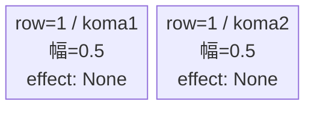
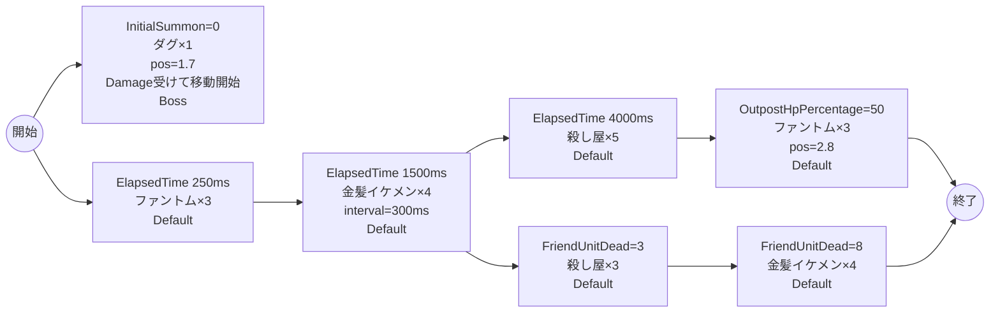

# vd_you_boss_00001 インゲームデータ詳細解説

> 参照リポジトリ: `projects/glow-masterdata`
> リリースキー: 202604010

## インゲーム要件テキスト

ボス「ダグ」（c_you_00201_vd_Boss_Green・Technical・HP10,000・ATK500・SPD32）が開幕から砦付近（position=1.7）に配置され、1ダメージを受けた瞬間に進軍を開始する。ファントム（Colorless/Attack・HP5,000・ATK100）が250msに3体、不良系金髪イケメン（Green/Attack・HP1,000・ATK100）が1,500msに4体続いて押し寄せる。3体撃破でイケメンじゃない殺し屋（Green/Attack・HP1,000・ATK100・well_distance=0.4）が3体追加、8体撃破で不良系金髪イケメン4体が再投入され、4,000msにはイケメンじゃない殺し屋5体の大波が来る。拠点HPが50%以下になるとファントム3体が砦付近（position=2.8）から追い打ちをかける。合計ウェーブ数は23体（ボス1体込み）。

コマは1行固定（bossブロック）。row1=2等分2コマ（0.5, 0.5）。コマアセット: you_00003（back_ground_offset: -1.0）。

UR対抗キャラ「元殺し屋の新人教諭 リタ」（chara_you_00001）対抗。Green属性のイケメン系敵が主軸のため、Green属性対策コマ確保が重要。ボス「ダグ」は開幕から砦付近に立ちはだかり、雑魚をかいくぐりながら倒さなければならないプレッシャー設計。拠点が削られると後詰ファントムが登場し、守りを崩しにかかる。

---

## レベルデザイン

### 敵キャラ設計

#### 敵キャラ選定（MstEnemyCharacter）

| mst_enemy_character_id | 日本語名 | 役割 | 備考 |
|------------------------|---------|------|------|
| chara_you_00201 | ダグ | ボス | Green属性・Technical・bossブロックのメインボス |
| enemy_you_00001 | 不良系金髪イケメン | 雑魚 | Green属性・Attack |
| enemy_you_00101 | イケメンじゃない殺し屋 | 雑魚 | Green属性・Attack・well_distance=0.4（広い索敵距離） |
| enemy_glo_00001 | ファントム | 雑魚（共通） | Colorless属性・Attack |

#### 敵キャラステータス（MstEnemyStageParameter）

> 全エントリ既存参照: `vd_all/data/MstEnemyStageParameter.csv`（release_key: 202604010）

| MstEnemyStageParameter ID | 日本語名 | character_unit_kind | role_type | color | hp | attack_power | move_speed | well_distance | damage_knock_back_count | attack_combo_cycle | drop_battle_point |
|--------------------------|---------|---------------------|-----------|-------|----|-------------|-----------|---------------|------------------------|-------------------|------------------|
| c_you_00201_vd_Boss_Green | ダグ | Boss | Technical | Green | 10,000 | 500 | 32 | 0.45 | 2 | 6 | 100 |
| e_you_00001_vd_Normal_Green | 不良系金髪イケメン | Normal | Attack | Green | 1,000 | 100 | 37 | 0.20 | 2 | 1 | 100 |
| e_you_00101_vd_Normal_Green | イケメンじゃない殺し屋 | Normal | Attack | Green | 1,000 | 100 | 30 | 0.40 | 2 | 1 | 100 |
| e_glo_00001_vd_Normal_Colorless | ファントム | Normal | Attack | Colorless | 5,000 | 100 | 34 | 0.22 | 3 | 1 | 150 |

---

### コマ設計

各行独立ランダム抽選（12パターンから）の結果（`koma1_asset_key`: `you_00003`、`koma1_back_ground_offset`: `-1.0`）:

| row | height | 選択パターン | コマ数 | 各幅 | 幅合計 | koma1_asset_key | koma1_back_ground_offset |
|-----|--------|------------|-------|------|--------|----------------|-------------------------|
| 1 | 1.0 | パターン6「2等分（完全均等）」 | 2コマ | 0.5, 0.5 | 1.0 | you_00003 | -1.0 |

---

### 敵キャラシーケンス設計

> **c_キャラ同時出現ルール（プランナー確認済み）**: c_キャラ（`c_` プレフィックス）が複数体登場する場合、
> 初回のみ `ElapsedTime`、2体目以降は `FriendUnitDead`（前の c_キャラの sequence_element_id を
> condition_value に指定）でチェーンすること。また c_キャラの `summon_count` は必ず `1` とすること。`e_glo_*` は対象外。

#### どのフェーズで、どの敵を、いつ、どこに、どのくらい出現させるか

| elem | 出現タイミング | 敵 | 数 | 累計出現数/召喚位置 |
|------|-------------|---|---|-----------------|
| 1 | InitialSummon=0 | ダグ (c_you_00201_vd_Boss_Green) | 1 | 1 / pos=1.7 / move_start=Damage |
| 2 | ElapsedTime 250ms | ファントム (e_glo_00001_vd_Normal_Colorless) | 3 | 4 |
| 3 | ElapsedTime 1500ms | 不良系金髪イケメン (e_you_00001_vd_Normal_Green) | 4 | 8（interval=300ms） |
| 4 | FriendUnitDead=3 | イケメンじゃない殺し屋 (e_you_00101_vd_Normal_Green) | 3 | 11 |
| 5 | FriendUnitDead=8 | 不良系金髪イケメン (e_you_00001_vd_Normal_Green) | 4 | 15 |
| 6 | ElapsedTime 4000ms | イケメンじゃない殺し屋 (e_you_00101_vd_Normal_Green) | 5 | 20 |
| 7 | OutpostHpPercentage=50 | ファントム (e_glo_00001_vd_Normal_Colorless) | 3 | 23（position=2.8） |

合計: **23体**（ボス1体 + 雑魚22体）

> **ボスの二重設定**: `MstInGame.boss_mst_enemy_stage_parameter_id = c_you_00201_vd_Boss_Green` を設定し、かつ `MstAutoPlayerSequence` の elem=1 で `InitialSummon` による召喚も設定すること（両方必須）。

> **c_キャラ召喚ガードレール確認**: ボス `c_you_00201_vd_Boss_Green` は1体のみ登場（InitialSummonで1体）。複数体チェーンの対象外。

#### 敵キャラの固有ステータス調整（hp_coef / atk_coef）

MstAutoPlayerSequenceの `enemy_hp_coef` / `enemy_attack_coef` はすべてデフォルト値（1.0）を使用します。

| 波/フェーズ | 敵 | base_hp | hp_coef | 実HP | base_atk | atk_coef | 実ATK |
|-----------|---|---------|---------|------|----------|----------|-------|
| elem1 ボス | ダグ | 10,000 | 1.0 | 10,000 | 500 | 1.0 | 500 |
| elem2 | ファントム | 5,000 | 1.0 | 5,000 | 100 | 1.0 | 100 |
| elem3 | 不良系金髪イケメン | 1,000 | 1.0 | 1,000 | 100 | 1.0 | 100 |
| elem4 | イケメンじゃない殺し屋 | 1,000 | 1.0 | 1,000 | 100 | 1.0 | 100 |
| elem5 | 不良系金髪イケメン | 1,000 | 1.0 | 1,000 | 100 | 1.0 | 100 |
| elem6 | イケメンじゃない殺し屋 | 1,000 | 1.0 | 1,000 | 100 | 1.0 | 100 |
| elem7 | ファントム | 5,000 | 1.0 | 5,000 | 100 | 1.0 | 100 |

#### フェーズ切り替えはあるか

なし（VDではSwitchSequenceGroup使用禁止）

---

## 演出

### アセット

#### 背景

| 設定箇所 | アセットキー | 備考 |
|---------|------------|------|
| loop_background_asset_key | （空） | VDの背景切り替えはゲームロジック側で管理 |
| フロア0以上 | koma_background_vd_00001 | クライアント側でフロア係数に応じて切り替え |
| フロア20以上 | koma_background_vd_00003 | 同上 |
| フロア40以上 | koma_background_vd_00005 | 同上 |

#### BGM

| 設定 | 値 | 備考 |
|-----|---|------|
| bgm_asset_key | SSE_SBG_003_004 | ボスブロック用BGM |
| boss_bgm_asset_key | （空） | VDボスブロックはボスBGM切り替えなし |

---

### 敵キャラオーラ

| オーラ種別 | 使用箇所 |
|----------|---------|
| Boss | elem1: ダグ（MstAutoPlayerSequence aura_type=Boss） |
| Default | elem2〜7: 雑魚全敵キャラ |

---

### 敵キャラ召喚アニメーション

ボス「ダグ」は `InitialSummon` で開幕から砦付近（position=1.7）に配置。`move_start_condition_type=Damage`・`move_start_condition_value=1` により、1ダメージを受けるまで静止する演出。召喚アニメーションは `None`。

雑魚キャラ（ファントム・不良系金髪イケメン・イケメンじゃない殺し屋）はすべて `SummonEnemy` アクションによる `ElapsedTime`・`FriendUnitDead`・`OutpostHpPercentage` トリガーで通常召喚。elem3の金髪イケメンはinterval=300msで1体ずつ順次登場する。

---

## 生成テーブルまとめ

| テーブル | 状態 | 備考 |
|---------|------|------|
| MstEnemyStageParameter | 既存参照 | `vd_all/data/MstEnemyStageParameter.csv` のエントリを使用（新規生成なし） |
| MstEnemyOutpost | 新規生成 | HP=1,000固定（bossブロック）、is_damage_invalidation=空、id=vd_you_boss_00001 |
| MstPage | 新規生成 | id=vd_you_boss_00001 |
| MstKomaLine | 新規生成 | 1行固定（row=1）、パターン6（2等分） |
| MstAutoPlayerSequence | 新規生成 | 7要素（合計23体、sequence_set_id=vd_you_boss_00001） |
| MstInGame | 新規生成 | content_type=Dungeon、stage_type=vd_boss、boss_mst_enemy_stage_parameter_id=c_you_00201_vd_Boss_Green、release_key=202604010 |

---

## ID一覧

| テーブル | カラム | 値 |
|---------|--------|-----|
| MstInGame | id | vd_you_boss_00001 |
| MstInGame | boss_mst_enemy_stage_parameter_id | c_you_00201_vd_Boss_Green |
| MstAutoPlayerSequence | sequence_set_id | vd_you_boss_00001 |
| MstPage | id | vd_you_boss_00001 |
| MstEnemyOutpost | id | vd_you_boss_00001 |
| MstKomaLine | id（row1） | vd_you_boss_00001_1 |
| MstAutoPlayerSequence | id（elem1） | vd_you_boss_00001_1 |
| MstAutoPlayerSequence | id（elem2） | vd_you_boss_00001_2 |
| MstAutoPlayerSequence | id（elem3） | vd_you_boss_00001_3 |
| MstAutoPlayerSequence | id（elem4） | vd_you_boss_00001_4 |
| MstAutoPlayerSequence | id（elem5） | vd_you_boss_00001_5 |
| MstAutoPlayerSequence | id（elem6） | vd_you_boss_00001_6 |
| MstAutoPlayerSequence | id（elem7） | vd_you_boss_00001_7 |
