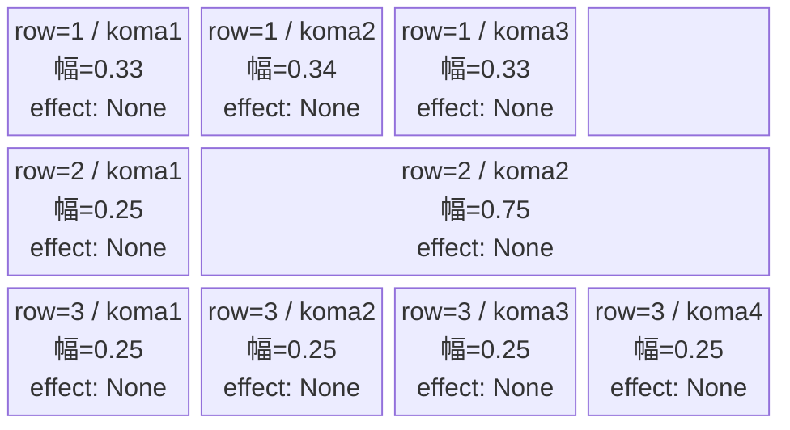
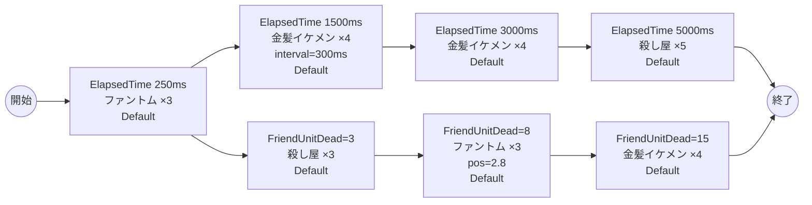

# vd_you_normal_00001 インゲームデータ詳細解説

> 参照リポジトリ: `projects/glow-masterdata`
> リリースキー: 202604010

## インゲーム要件テキスト

ファントム（Colorless/Attack・HP5,000・ATK100・SPD34）が開幕250msに3体、不良系金髪イケメン（Green/Attack・HP1,000・ATK100・SPD37）が1,500msと3,000msに各4体、イケメンじゃない殺し屋（Green/Attack・HP1,000・ATK100・SPD30）が3体倒したタイミングと5,000msに各3〜5体、さらに8体撃破で再度ファントム3体・15体撃破で金髪イケメン4体の追加補充が入る、合計26体のウェーブ構成。開幕はファントムでテンポを作りつつ、FriendUnitDeadトリガーにより倒せば倒すほど次の敵が続々と押し寄せる設計で、Green属性対策の重要性とプレッシャーを演出する。

コマは3行固定（各行独立抽選）。row1=3等分3コマ（0.33, 0.34, 0.33）・row2=右広い2コマ（0.25, 0.75）・row3=4等分4コマ（0.25×4）。コマ数の変化で行ごとの組み合わせ幅を広げる。コマアセット: you_00003（back_ground_offset: -1.0）。

UR対抗キャラ「元殺し屋の新人教諭 リタ」（chara_you_00001）対抗。Green属性のイケメン系敵が主軸となるため、Green属性対策コマの活用とFriendUnitDeadによる連鎖強化に対応した迅速な撃破が有効になる設計。

---

## レベルデザイン

### 敵キャラ設計

#### 敵キャラ選定（MstEnemyCharacter）

| mst_enemy_character_id | 日本語名 | 役割 | 備考 |
|------------------------|---------|------|------|
| enemy_you_00001 | 不良系金髪イケメン | 雑魚 | Green属性・Attackロール。幼稚園WARS作品の登場敵 |
| enemy_you_00101 | イケメンじゃない殺し屋 | 雑魚 | Green属性・Attackロール。索敵距離広め（0.4）で積極的に攻撃 |
| enemy_glo_00001 | ファントム | 雑魚（共通） | Colorless属性・Attackロール |

#### 敵キャラステータス（MstEnemyStageParameter）

> 全エントリ既存参照: `vd_all/data/MstEnemyStageParameter.csv`（release_key: 202604010）

| MstEnemyStageParameter ID | 日本語名 | character_unit_kind | role_type | color | hp | attack_power | move_speed | well_distance | damage_knock_back_count | attack_combo_cycle | drop_battle_point |
|--------------------------|---------|---------------------|-----------|-------|----|-------------|-----------|---------------|------------------------|-------------------|------------------|
| e_you_00001_vd_Normal_Green | 不良系金髪イケメン | Normal | Attack | Green | 1,000 | 100 | 37 | 0.20 | 2 | 1 | 100 |
| e_you_00101_vd_Normal_Green | イケメンじゃない殺し屋 | Normal | Attack | Green | 1,000 | 100 | 30 | 0.40 | 2 | 1 | 100 |
| e_glo_00001_vd_Normal_Colorless | ファントム | Normal | Attack | Colorless | 5,000 | 100 | 34 | 0.22 | 3 | 1 | 150 |

---

### コマ設計

各行独立ランダム抽選（12パターンから）の結果（`koma1_asset_key`: `you_00003`、`koma1_back_ground_offset`: `-1.0`）:

| row | height | 選択パターン | コマ数 | 各幅 | 幅合計 | koma1_asset_key | koma1_back_ground_offset |
|-----|--------|------------|-------|------|--------|----------------|-------------------------|
| 1 | 0.33 | パターン7「3等分」 | 3コマ | 0.33, 0.34, 0.33 | 1.0 | you_00003 | -1.0 |
| 2 | 0.33 | パターン5「右広い」 | 2コマ | 0.25, 0.75 | 1.0 | you_00003 | -1.0 |
| 3 | 0.34 | パターン12「4等分」 | 4コマ | 0.25, 0.25, 0.25, 0.25 | 1.0 | you_00003 | -1.0 |

---

### 敵キャラシーケンス設計

> **c_キャラ同時出現ルール（プランナー確認済み）**: c_キャラ（`c_` プレフィックス）が複数体登場する場合、
> 初回のみ `ElapsedTime`、2体目以降は `FriendUnitDead`（前の c_キャラの sequence_element_id を
> condition_value に指定）でチェーンすること。また c_キャラの `summon_count` は必ず `1` とすること。`e_glo_*` は対象外。

#### どのフェーズで、どの敵を、いつ、どこに、どのくらい出現させるか

| elem | 出現タイミング | 敵 | 数 | 累計出現数/召喚位置 |
|------|-------------|---|---|-----------------|
| 1 | ElapsedTime 250ms | ファントム (e_glo_00001_vd_Normal_Colorless) | 3 | 3 |
| 2 | ElapsedTime 1500ms | 不良系金髪イケメン (e_you_00001_vd_Normal_Green) | 4 | 7（interval=300ms） |
| 3 | FriendUnitDead=3 | イケメンじゃない殺し屋 (e_you_00101_vd_Normal_Green) | 3 | 10 |
| 4 | ElapsedTime 3000ms | 不良系金髪イケメン (e_you_00001_vd_Normal_Green) | 4 | 14 |
| 5 | FriendUnitDead=8 | ファントム (e_glo_00001_vd_Normal_Colorless) | 3 | 17（position=2.8） |
| 6 | ElapsedTime 5000ms | イケメンじゃない殺し屋 (e_you_00101_vd_Normal_Green) | 5 | 22 |
| 7 | FriendUnitDead=15 | 不良系金髪イケメン (e_you_00001_vd_Normal_Green) | 4 | 26 |

合計: **26体**（要件「最低15体以上」を満たす）

> **c_キャラ召喚ガードレール確認**: 登場する全キャラ（enemy_you_00001・enemy_you_00101・enemy_glo_00001）は `e_` プレフィックスの純粋な敵キャラクターです。c_キャラ召喚制約は適用されません。

#### 敵キャラの固有ステータス調整（hp_coef / atk_coef）

MstAutoPlayerSequenceの `enemy_hp_coef` / `enemy_attack_coef` はすべてデフォルト値（1.0）を使用します。

| 波 | 敵 | hp | hp_coef | 実HP | attack_power | atk_coef | 実ATK |
|---|---|-----|---------|------|-------------|----------|-------|
| 1 | ファントム | 5,000 | 1.0 | 5,000 | 100 | 1.0 | 100 |
| 2 | 不良系金髪イケメン | 1,000 | 1.0 | 1,000 | 100 | 1.0 | 100 |
| 3 | イケメンじゃない殺し屋 | 1,000 | 1.0 | 1,000 | 100 | 1.0 | 100 |
| 4 | 不良系金髪イケメン | 1,000 | 1.0 | 1,000 | 100 | 1.0 | 100 |
| 5 | ファントム | 5,000 | 1.0 | 5,000 | 100 | 1.0 | 100 |
| 6 | イケメンじゃない殺し屋 | 1,000 | 1.0 | 1,000 | 100 | 1.0 | 100 |
| 7 | 不良系金髪イケメン | 1,000 | 1.0 | 1,000 | 100 | 1.0 | 100 |

#### フェーズ切り替えはあるか

なし（VDではSwitchSequenceGroup使用禁止）

---

## 演出

### アセット

#### 背景

| 設定箇所 | アセットキー | 備考 |
|---------|------------|------|
| loop_background_asset_key | （空） | VDの背景切り替えはゲームロジック側で管理 |
| フロア0以上 | koma_background_vd_00001 | クライアント側でフロア係数に応じて切り替え |
| フロア20以上 | koma_background_vd_00003 | 同上 |
| フロア40以上 | koma_background_vd_00005 | 同上 |

#### BGM

| 設定 | 値 | 備考 |
|-----|---|------|
| bgm_asset_key | SSE_SBG_003_010 | ノーマルブロック用BGM |
| boss_bgm_asset_key | （空） | ノーマルブロックはボスBGMなし |

---

### 敵キャラオーラ

| オーラ種別 | 使用箇所 |
|----------|---------|
| Default | 全敵キャラ（ノーマルブロックはボスなし、全行Default） |

---

### 敵キャラ召喚アニメーション

全キャラ `SummonEnemy` アクションによる ElapsedTime・FriendUnitDead トリガーでの召喚。InitialSummonは使用しない（normalブロックはボスなし）。

不良系金髪イケメン・イケメンじゃない殺し屋・ファントムはいずれも `e_` プレフィックスの敵専用キャラクターです。召喚演出はデフォルトのSummonEnemy演出が適用されます。elem2の金髪イケメンはinterval=300msで1体ずつ順次登場し、圧迫感を演出します。

---

## 生成テーブルまとめ

| テーブル | 状態 | 備考 |
|---------|------|------|
| MstEnemyStageParameter | 既存参照 | `vd_all/data/MstEnemyStageParameter.csv` のエントリを使用（新規生成なし） |
| MstEnemyOutpost | 新規生成 | HP=100固定、is_damage_invalidation=空、id=vd_you_normal_00001 |
| MstPage | 新規生成 | id=vd_you_normal_00001 |
| MstKomaLine | 新規生成 | 3行固定（row=1〜3）、パターン7/5/12 |
| MstAutoPlayerSequence | 新規生成 | 7要素（合計26体、sequence_set_id=vd_you_normal_00001） |
| MstInGame | 新規生成 | content_type=Dungeon、stage_type=vd_normal、ボスなし、release_key=202604010 |

---

## ID一覧

| テーブル | カラム | 値 |
|---------|--------|-----|
| MstInGame | id | vd_you_normal_00001 |
| MstAutoPlayerSequence | sequence_set_id | vd_you_normal_00001 |
| MstPage | id | vd_you_normal_00001 |
| MstEnemyOutpost | id | vd_you_normal_00001 |
| MstKomaLine | id（row1） | vd_you_normal_00001_1 |
| MstKomaLine | id（row2） | vd_you_normal_00001_2 |
| MstKomaLine | id（row3） | vd_you_normal_00001_3 |
| MstAutoPlayerSequence | id（elem1） | vd_you_normal_00001_1 |
| MstAutoPlayerSequence | id（elem2） | vd_you_normal_00001_2 |
| MstAutoPlayerSequence | id（elem3） | vd_you_normal_00001_3 |
| MstAutoPlayerSequence | id（elem4） | vd_you_normal_00001_4 |
| MstAutoPlayerSequence | id（elem5） | vd_you_normal_00001_5 |
| MstAutoPlayerSequence | id（elem6） | vd_you_normal_00001_6 |
| MstAutoPlayerSequence | id（elem7） | vd_you_normal_00001_7 |
