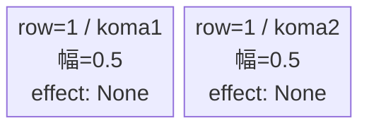
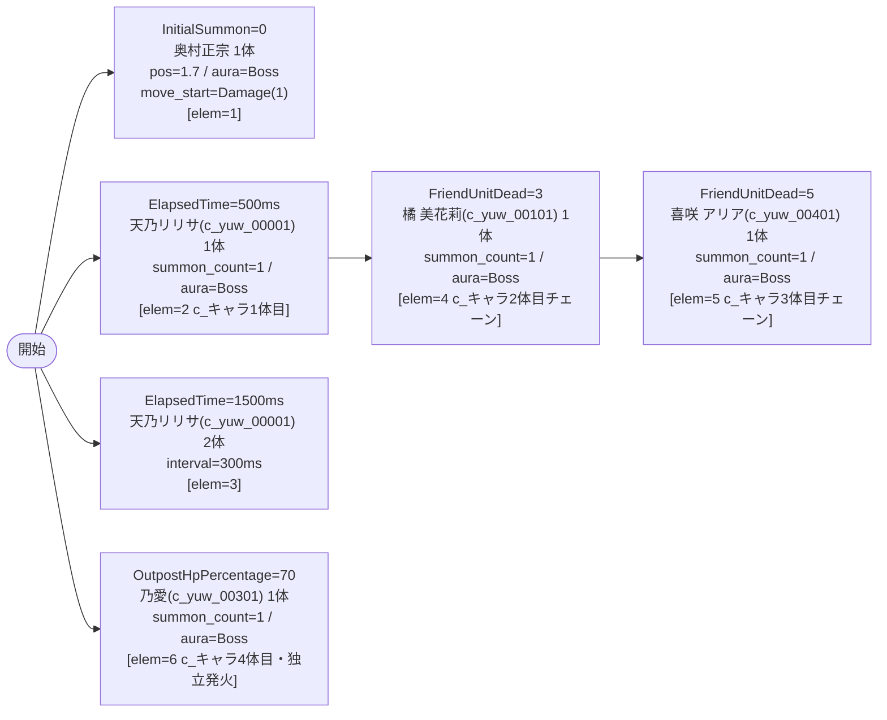

# vd_yuw_boss_00001 インゲームデータ詳細解説

> 参照リポジトリ: `projects/glow-masterdata`
> リリースキー: 202604010

## インゲーム要件テキスト

ボス「奥村 正宗」（`c_yuw_00601_vd_Boss_Blue`、HP=10,000、ATK=300、Blue/Defense）が開幕から砦付近（position=1.7）にBossオーラで待機し、初ダメージを受けてから前進する。500ms 後にリリエルに捧ぐ愛 天乃 リリサ（`c_yuw_00001_vd_Normal_Blue`、Attack）1体が前衛として登場し、これが c_キャラ1体目となる（ElapsedTimeで初回召喚）。1,500ms 後にさらに 天乃 リリサ 2体が追加される。3体倒した段階でコスプレに託す乙女心 橘 美花莉（`c_yuw_00101_vd_Normal_Blue`、Technical）がFriendUnitDeadチェーンで登場する（c_キャラ2体目）。5体倒れると拠点防衛プレッシャーとして伝えたいウチの想い 喜咲 アリア（`c_yuw_00401_vd_Normal_Blue`、Defense）が追加召喚（c_キャラ3体目）される。拠点HPが70%を切ると終盤強化として勇気を纏うコスプレ 乃愛（`c_yuw_00301_vd_Normal_Blue`、Technical）が独立トリガーで登場する（c_キャラ4体目）。

コマは1行・2等分（パターン6、幅0.5/0.5）のシンプル構成。コマアセットキーは `glo_00008`（back_ground_offset = -1.0）。UR対抗キャラ「リリエルに捧ぐ愛 天乃 リリサ（`chara_yuw_00001`）」のBlue属性スキルで奥村正宗を撃破しながら、Blue系コスプレキャラの多彩なrole（Attack/Technical/Defense）を素早く処理する対抗設計。

---

## レベルデザイン

### 敵キャラ設計

#### 敵キャラ選定（MstEnemyCharacter）

| mst_enemy_character_id | 日本語名 | 役割 | 備考 |
|------------------------|---------|------|------|
| chara_yuw_00601 | 奥村 正宗 | ボス | MstInGame.boss_mst_enemy_stage_parameter_id + InitialSummon で二重設定 |
| chara_yuw_00001 | リリエルに捧ぐ愛 天乃 リリサ | 雑魚（c_キャラ1体目） | ElapsedTime で初回登場、UR対抗キャラ |
| chara_yuw_00101 | コスプレに託す乙女心 橘 美花莉 | 雑魚（c_キャラ2体目） | FriendUnitDead チェーン |
| chara_yuw_00401 | 伝えたいウチの想い 喜咲 アリア | 雑魚（c_キャラ3体目） | FriendUnitDead チェーン |
| chara_yuw_00301 | 勇気を纏うコスプレ 乃愛 | 雑魚（c_キャラ4体目） | OutpostHpPercentage=70 独立トリガー |

#### 敵キャラステータス（MstEnemyStageParameter）

> 全て `vd_all/data/MstEnemyStageParameter.csv` の既存データを参照。新規追加なし。

| MstEnemyStageParameter ID | 日本語名 | kind | role | color | base_hp | base_atk | base_spd | well_dist | knockback | combo | drop_bp |
|--------------------------|---------|------|------|-------|---------|----------|----------|-----------|-----------|-------|---------|
| c_yuw_00601_vd_Boss_Blue | 奥村 正宗 | Boss | Defense | Blue | 10,000 | 300 | 25 | 0.19 | 3 | 4 | 1,000 |
| c_yuw_00001_vd_Normal_Blue | リリエルに捧ぐ愛 天乃 リリサ | Normal | Attack | Blue | 10,000 | 300 | 30 | 0.24 | 3 | 4 | 1,000 |
| c_yuw_00101_vd_Normal_Blue | コスプレに託す乙女心 橘 美花莉 | Normal | Technical | Blue | 50,000 | 300 | 29 | 0.25 | 2 | 5 | 100 |
| c_yuw_00401_vd_Normal_Blue | 伝えたいウチの想い 喜咲 アリア | Normal | Defense | Blue | 50,000 | 300 | 30 | 0.17 | 2 | 6 | 100 |
| c_yuw_00301_vd_Normal_Blue | 勇気を纏うコスプレ 乃愛 | Normal | Technical | Blue | 50,000 | 300 | 29 | 0.26 | 3 | 4 | 500 |

---

### コマ設計

※ bossブロックは MstKomaLine が1行固定。

| row | height | 選択パターン | コマ数 | 各幅 | 幅合計 |
|-----|--------|------------|-------|------|--------|
| 1 | 1.0 | パターン6 | 2 | 0.5, 0.5 | 1.0 |

---

### 敵キャラシーケンス設計

> **c_キャラ同時出現ルール（プランナー確認済み）**: c_キャラ（`c_` プレフィックス）が複数体登場する場合、
> 初回のみ `ElapsedTime`、2体目以降は `FriendUnitDead`（前の c_キャラの sequence_element_id を
> condition_value に指定）でチェーンすること。また c_キャラの `summon_count` は必ず `1` とすること。`e_glo_*` は対象外。

> **ボスの二重設定（必須）**: `MstInGame.boss_mst_enemy_stage_parameter_id = c_yuw_00601_vd_Boss_Blue` に加え、
> `MstAutoPlayerSequence` の InitialSummon（elem=1）でも同じIDを設定すること。

#### どのフェーズで、どの敵を、いつ、どこに、どのくらい出現させるか

| elem | 出現タイミング | 敵 | 数 | 位置 / 備考 |
|------|-------------|---|---|------------|
| 1 | InitialSummon=0 | 奥村 正宗（c_yuw_00601_vd_Boss_Blue） | 1 | pos=1.7、aura=Boss、move_start=Damage(1) |
| 2 | ElapsedTime=500ms | リリエルに捧ぐ愛 天乃 リリサ（c_yuw_00001_vd_Normal_Blue） | 1 | summon_count=1、aura=Boss、c_キャラ1体目 |
| 3 | ElapsedTime=1500ms | リリエルに捧ぐ愛 天乃 リリサ（c_yuw_00001_vd_Normal_Blue） | 2 | interval=300、aura=Default |
| 4 | FriendUnitDead=3（elem=2チェーン） | コスプレに託す乙女心 橘 美花莉（c_yuw_00101_vd_Normal_Blue） | 1 | summon_count=1、aura=Boss、c_キャラ2体目 |
| 5 | FriendUnitDead=5（elem=4チェーン） | 伝えたいウチの想い 喜咲 アリア（c_yuw_00401_vd_Normal_Blue） | 1 | summon_count=1、aura=Boss、c_キャラ3体目 |
| 6 | OutpostHpPercentage=70（独立トリガー） | 勇気を纏うコスプレ 乃愛（c_yuw_00301_vd_Normal_Blue） | 1 | summon_count=1、aura=Boss、c_キャラ4体目 |

> 合計出現数: ボス(1体) + 天乃リリサ(1+2=3体) + c_キャラチェーン(3体) + OutpostHpトリガー(1体) = **8体**（bossブロック・体数制約なし）

#### 敵キャラの固有ステータス調整（hp_coef / atk_coef）

| 波/フェーズ | 敵 | base_hp | hp_coef | 実HP | base_atk | atk_coef | 実ATK |
|-----------|---|---------|---------|------|----------|----------|-------|
| ボス（elem=1） | 奥村 正宗 | 10,000 | 1.0 | 10,000 | 300 | 1.0 | 300 |
| 前衛1体目（elem=2） | 天乃 リリサ | 10,000 | 1.0 | 10,000 | 300 | 1.0 | 300 |
| 前衛追加（elem=3） | 天乃 リリサ | 10,000 | 1.0 | 10,000 | 300 | 1.0 | 300 |
| 中盤（elem=4） | 橘 美花莉 | 50,000 | 1.0 | 50,000 | 300 | 1.0 | 300 |
| 後半（elem=5） | 喜咲 アリア | 50,000 | 1.0 | 50,000 | 300 | 1.0 | 300 |
| 拠点ピンチ（elem=6） | 乃愛 | 50,000 | 1.0 | 50,000 | 300 | 1.0 | 300 |

#### フェーズ切り替えはあるか

なし（VDでは SwitchSequenceGroup 使用禁止）

---

## 演出

### アセット

#### 背景

| 設定箇所 | アセットキー | 備考 |
|---------|------------|------|
| MstInGame.loop_background_asset_key | （空欄） | yuw系背景アセット未確認のため空欄（要アセット担当者確認） |

#### BGM

| 設定 | 値 | 備考 |
|-----|---|------|
| bgm_asset_key | SSE_SBG_003_004 | bossブロック固定BGM |
| boss_bgm_asset_key | （空欄） | BGM切り替えなし |

---

### 敵キャラオーラ

| オーラ種別 | 使用箇所 |
|----------|---------|
| Boss | elem=1（奥村 正宗）、elem=2（天乃 リリサ1体目）、elem=4（橘 美花莉）、elem=5（喜咲 アリア）、elem=6（乃愛） |
| Default | elem=3（天乃 リリサ追加2体） |

---

### 敵キャラ召喚アニメーション

- elem=1（InitialSummon）: 奥村 正宗が砦付近（pos=1.7）に初期配置。`move_start_condition_type=Damage`、`move_start_condition_value=1`（初ダメージを受けてから前進開始）。
- elem=2〜6（SummonEnemy）: 全て `summon_animation_type=None`（通常召喚）。
- elem=2（ElapsedTime=500ms）: 天乃 リリサが Bossオーラ付きで単独登場（c_キャラ1体目）。
- elem=3（ElapsedTime=1500ms）: 天乃 リリサが Default オーラ付きで2体追加登場。
- elem=4（FriendUnitDead=3）: elem=2 の天乃 リリサ含む3体が倒された段階で橘 美花莉がチェーン召喚（c_キャラ2体目）。
- elem=5（FriendUnitDead=5）: elem=4 の橘 美花莉が倒された段階で喜咲 アリアがチェーン召喚（c_キャラ3体目）。
- elem=6（OutpostHpPercentage=70）: 拠点HP70%以下で乃愛が独立発火（c_キャラ4体目）。

---

## テーブル設定値サマリ

### MstInGame

| カラム | 値 |
|-------|---|
| id | vd_yuw_boss_00001 |
| release_key | 202604010 |
| content_type | Dungeon |
| stage_type | vd_boss |
| mst_page_id | vd_yuw_boss_00001 |
| mst_enemy_outpost_id | vd_yuw_boss_00001 |
| boss_mst_enemy_stage_parameter_id | c_yuw_00601_vd_Boss_Blue |
| mst_auto_player_sequence_id | vd_yuw_boss_00001 |
| mst_auto_player_sequence_set_id | vd_yuw_boss_00001 |
| bgm_asset_key | SSE_SBG_003_004 |
| boss_bgm_asset_key | （空欄） |
| loop_background_asset_key | （空欄） |
| normal_enemy_hp_coef | 1.0 |
| normal_enemy_attack_coef | 1.0 |
| normal_enemy_speed_coef | 1.0 |
| boss_enemy_hp_coef | 1.0 |
| boss_enemy_attack_coef | 1.0 |
| boss_enemy_speed_coef | 1.0 |

### MstEnemyOutpost

| カラム | 値 |
|-------|---|
| id | vd_yuw_boss_00001 |
| hp | 1000（bossブロック固定） |

### MstKomaLine

| id | row | height | koma_line_layout_asset_key | koma1_asset_key | koma1_back_ground_offset | koma1_effect_type | koma1_effect_parameter1 | koma1_effect_parameter2 | koma1_effect_target_colors | koma1_effect_target_roles | koma2_effect_type | koma3_effect_type | koma4_effect_type |
|----|-----|--------|--------------------------|-----------------|--------------------------|-------------------|------------------------|------------------------|--------------------------|--------------------------|-------------------|-------------------|-------------------|
| vd_yuw_boss_00001_1 | 1 | 1.0 | 6 | glo_00008 | -1.0 | None | 0 | 0 | All | All | None | None | None |
