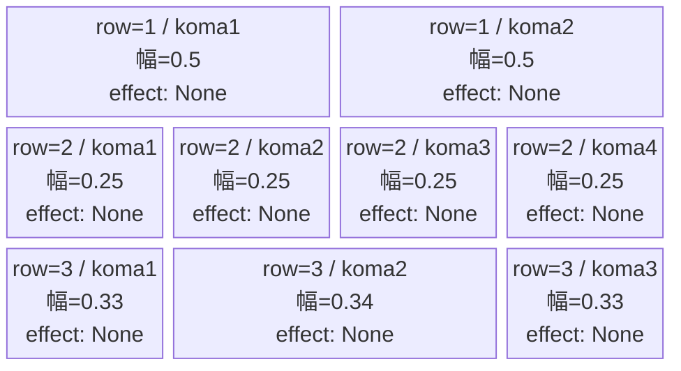

# vd_yuw_normal_00001 インゲームデータ詳細解説

> 参照リポジトリ: `projects/glow-masterdata`
> リリースキー: 202604010

## インゲーム要件テキスト

開幕は c_yuw_00001（リリサ）が250ms後に1体登場し、フィールドを先行制圧する。その後 c_yuw_00101、c_yuw_00301、c_yuw_00401 の3キャラが ElapsedTime で順次登場し、合計15体以上を確保する。UR対抗キャラ「リリエルに捧ぐ愛 天乃 リリサ（`chara_yuw_00001`）」の対抗として c_yuw_00001 が中心に配置され、FriendUnitDead トリガーで段階的に補充される。終盤は c_yuw_00401（Defense役）が大量追加されて防衛プレッシャーをかける設計。コマは3行構成で、各行のコマ数はランダム独立抽選（1〜4コマ）。コマアセットキーは `glo_00008`（yuwシリーズ共通）を使用。

---

## レベルデザイン

### 敵キャラ設計

#### 敵キャラ選定（MstEnemyCharacter）
| mst_enemy_character_id | 日本語名 | 役割 | 備考 |
|------------------------|---------|------|------|
| chara_yuw_00001 | リリエルに捧ぐ愛 天乃 リリサ | 雑魚（c_キャラ） | UR対抗キャラ。最初に登場 |
| chara_yuw_00101 | コスプレに託す乙女心 橘 美花莉 | 雑魚（c_キャラ） | 中盤追加 |
| chara_yuw_00301 | 勇気を纏うコスプレ 乃愛 | 雑魚（c_キャラ） | 中盤追加 |
| chara_yuw_00401 | 伝えたいウチの想い 喜咲 アリア | 雑魚（c_キャラ） | 後半大量追加 |

#### 敵キャラステータス（MstEnemyStageParameter）
> vd_all/data/MstEnemyStageParameter.csv より参照（release_key=202604010）

| MstEnemyStageParameter ID | 日本語名 | kind | role | color | base_hp | base_atk | base_spd | well_dist | knockback | combo | drop_bp |
|--------------------------|---------|------|------|-------|---------|----------|----------|-----------|-----------|-------|---------|
| c_yuw_00001_vd_Normal_Blue | リリエルに捧ぐ愛 天乃 リリサ | Normal | Attack | Blue | 10000 | 300 | 30 | 0.24 | 3 | 4 | 1000 |
| c_yuw_00101_vd_Normal_Blue | コスプレに託す乙女心 橘 美花莉 | Normal | Technical | Blue | 50000 | 300 | 29 | 0.25 | 2 | 5 | 100 |
| c_yuw_00301_vd_Normal_Blue | 勇気を纏うコスプレ 乃愛 | Normal | Technical | Blue | 50000 | 300 | 29 | 0.26 | 3 | 4 | 500 |
| c_yuw_00401_vd_Normal_Blue | 伝えたいウチの想い 喜咲 アリア | Normal | Defense | Blue | 50000 | 300 | 30 | 0.17 | 2 | 6 | 100 |

---

### コマ設計

※ columns は1つのみ。各行のスパン合計 = 4 になること。

| row | height | 選択パターン | コマ数 | 各幅 | 幅合計 |
|-----|--------|------------|-------|------|--------|
| 1 | 0.33 | パターン6 | 2 | 0.5, 0.5 | 1.0 |
| 2 | 0.33 | パターン12 | 4 | 0.25, 0.25, 0.25, 0.25 | 1.0 |
| 3 | 0.34 | パターン9 | 3 | 0.33, 0.34, 0.33 | 1.0 |

---

### 敵キャラシーケンス設計

> **c_キャラ同時出現ルール（プランナー確認済み）**: c_キャラ（`c_` プレフィックス）が複数体登場する場合、
> 初回のみ `ElapsedTime`、2体目以降は `FriendUnitDead`（前の c_キャラの sequence_element_id を
> condition_value に指定）でチェーンすること。また c_キャラの `summon_count` は必ず `1` とすること。`e_glo_*` は対象外。

#### どのフェーズで、どの敵を、いつ、どこに、どのくらい出現させるか

```mermaid
flowchart LR
  Start([開始]) --> E1["ElapsedTime: 250ms\nc_yuw_00001×1体\nelem=1 (リリサ登場)"]
  E1 --> E2["ElapsedTime: 1500ms\nc_yuw_00101×1体\nelem=2"]
  E2 --> E3["FriendUnitDead: elem=2\nc_yuw_00301×1体\nelem=3"]
  E3 --> E4["ElapsedTime: 3000ms\nc_yuw_00001×1体\nelem=4 (2体目リリサ)"]
  E4 --> E5["FriendUnitDead: elem=4\nc_yuw_00401×1体\nelem=5 (アリア)"]
  E5 --> E6["FriendUnitDead: 5体\nc_yuw_00001×1体\nelem=6"]
  E6 --> E7["FriendUnitDead: 8体\nc_yuw_00101×1体\nelem=7"]
  E7 --> E8["FriendUnitDead: 8体\nc_yuw_00301×1体\nelem=8"]
  E8 --> E9["FriendUnitDead: 8体\nc_yuw_00401×1体\nelem=9"]
  E9 --> E10["ElapsedTime: 5000ms\nc_yuw_00001×1体\nelem=10"]
  E10 --> E11["FriendUnitDead: elem=10\nc_yuw_00401×1体\nelem=11"]
  E11 --> E12["FriendUnitDead: 12体\nc_yuw_00001×1体\nelem=12"]
  E12 --> E13["FriendUnitDead: 12体\nc_yuw_00101×1体\nelem=13"]
  E13 --> E14["FriendUnitDead: 12体\nc_yuw_00301×1体\nelem=14"]
  E14 --> E15["FriendUnitDead: 12体\nc_yuw_00401×1体\nelem=15"]
  E15 --> E16["OutpostDamage: 1\nc_yuw_00401×99体\ninterval=750ms\nelem=16（無限補充）"]
```

| elem | 出現タイミング | 敵 | 数 | 累計出現数/召喚位置 |
|------|-------------|---|---|-----------------|
| 1 | ElapsedTime: 250 | c_yuw_00001 (リリサ) | 1 | 累計1体 |
| 2 | ElapsedTime: 1500 | c_yuw_00101 (美花莉) | 1 | 累計2体 |
| 3 | FriendUnitDead: elem=2 | c_yuw_00301 (乃愛) | 1 | 累計3体 |
| 4 | ElapsedTime: 3000 | c_yuw_00001 (リリサ) | 1 | 累計4体 |
| 5 | FriendUnitDead: elem=4 | c_yuw_00401 (アリア) | 1 | 累計5体 |
| 6 | FriendUnitDead: 5体撃破 | c_yuw_00001 (リリサ) | 1 | 累計6体 |
| 7 | FriendUnitDead: 8体撃破 | c_yuw_00101 (美花莉) | 1 | 累計7体 |
| 8 | FriendUnitDead: 8体撃破 | c_yuw_00301 (乃愛) | 1 | 累計8体 |
| 9 | FriendUnitDead: 8体撃破 | c_yuw_00401 (アリア) | 1 | 累計9体 |
| 10 | ElapsedTime: 5000 | c_yuw_00001 (リリサ) | 1 | 累計10体 |
| 11 | FriendUnitDead: elem=10 | c_yuw_00401 (アリア) | 1 | 累計11体 |
| 12 | FriendUnitDead: 12体撃破 | c_yuw_00001 (リリサ) | 1 | 累計12体 |
| 13 | FriendUnitDead: 12体撃破 | c_yuw_00101 (美花莉) | 1 | 累計13体 |
| 14 | FriendUnitDead: 12体撃破 | c_yuw_00301 (乃愛) | 1 | 累計14体 |
| 15 | FriendUnitDead: 12体撃破 | c_yuw_00401 (アリア) | 1 | 累計15体 |
| 16 | OutpostDamage: 1 | c_yuw_00401 (アリア) | 99（interval=750ms） | 終盤無限補充 |

**合計召喚数**: 15体 + 終盤無限補充（summon_count=99）

#### 敵キャラの固有ステータス調整（hp_coef / atk_coef）
| 波/フェーズ | 敵 | base_hp | hp_coef | 実HP | base_atk | atk_coef | 実ATK |
|-----------|---|---------|---------|------|----------|----------|-------|
| 全要素共通 | c_yuw_00001 | 10000 | 1.0 | 10000 | 300 | 1.0 | 300 |
| 全要素共通 | c_yuw_00101 | 50000 | 1.0 | 50000 | 300 | 1.0 | 300 |
| 全要素共通 | c_yuw_00301 | 50000 | 1.0 | 50000 | 300 | 1.0 | 300 |
| 全要素共通 | c_yuw_00401 | 50000 | 1.0 | 50000 | 300 | 1.0 | 300 |

#### フェーズ切り替えはあるか
なし（VDではSwitchSequenceGroup使用禁止）

---

## 演出

### アセット

#### 背景
| 設定箇所 | アセットキー | 備考 |
|---------|------------|------|
| MstInGame.loop_background_asset_key | （空） | VD normalは背景省略 |

#### BGM
| 設定 | 値 | 備考 |
|-----|---|------|
| bgm_asset_key | SSE_SBG_003_010 | VD normalブロック固定値 |

---

### 敵キャラオーラ
| オーラ種別 | 使用箇所 |
|----------|---------|
| Default | 全要素（雑魚キャラ全て） |

---

### 敵キャラ召喚アニメーション
全要素で `summon_animation_type = None`（VD標準）。開幕の c_yuw_00001（リリサ）が ElapsedTime=250ms で最初に登場し、UR対抗キャラとしてのインパクトを演出する。その後 FriendUnitDead チェーンで3キャラが順次登場し、終盤は OutpostDamage=1 による c_yuw_00401 の無限補充でプレッシャーを高める。

---

## テーブル間整合性メモ

| 項目 | 値 |
|------|---|
| MstInGame.id | vd_yuw_normal_00001 |
| MstInGame.content_type | Dungeon |
| MstInGame.stage_type | vd_normal |
| MstInGame.mst_page_id | vd_yuw_normal_00001 |
| MstInGame.mst_enemy_outpost_id | vd_yuw_normal_00001 |
| MstInGame.boss_mst_enemy_stage_parameter_id | （空） |
| MstInGame.mst_auto_player_sequence_set_id | vd_yuw_normal_00001 |
| MstEnemyOutpost.hp | 100（VD normal固定） |
| MstPage.id | vd_yuw_normal_00001 |
| MstKomaLine.mst_page_id | vd_yuw_normal_00001 |
| MstKomaLine.koma1_asset_key | glo_00008 |
| MstKomaLine.koma1_back_ground_offset | -1.0 |
| MstAutoPlayerSequence.sequence_set_id | vd_yuw_normal_00001 |
