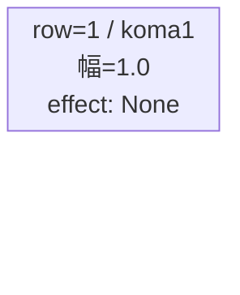

# vd_chi_boss_00001 インゲームデータ詳細解説

> 参照リポジトリ: `projects/glow-masterdata`
> リリースキー: 202604010

## インゲーム要件テキスト

ボス「悪魔が恐れる悪魔 チェンソーマン」（`c_chi_00002_vd_Boss_Blue`、HP 400,000）が開幕から砦付近に配置され、1ダメージを受けた瞬間に動き始める。雑魚にはゾンビ（`e_chi_00101_vd_Normal_Blue`、HP 5,000）を使用し、開始250ms後から定期的に召喚して序盤の圧力を演出する。10体倒されると強化版ゾンビ（Blue×3体）が追加出現し、さらに15体倒されると再び強化ゾンビ波が来る。20体倒されると拠点に危険が迫るタイミングでファントム（`e_glo_00001_vd_Normal_Colorless`）の無限補充が始まる設計。UR対抗キャラ「悪魔が恐れる悪魔 チェンソーマン」（`chara_chi_00002`）に対し、ボスオーラ付きで砦前に陣取るボスを各種ギミックを活用して突破する体験を狙う。コマは1行構成（bossブロック固定）でアセットキー `glo_00016` を使用する。

---

## レベルデザイン

### 敵キャラ設計

#### 敵キャラ選定（MstEnemyCharacter）
| mst_enemy_character_id | 日本語名 | 役割 | 備考 |
|------------------------|---------|------|------|
| `chara_chi_00002` | 悪魔が恐れる悪魔 チェンソーマン | ボス | UR対抗キャラ。bossブロックの主役 |
| `enemy_chi_00101` | ゾンビ | 雑魚 | チェンソーマン作品の定番雑魚 |
| `enemy_glo_00001` | ファントム | 雑魚 | 終盤補充用 |

#### 敵キャラステータス（MstEnemyStageParameter）
> vd_all/data/MstEnemyStageParameter.csv から選出（既存参照）

| MstEnemyStageParameter ID | 日本語名 | kind | role | color | base_hp | base_atk | base_spd | well_dist | knockback | combo | drop_bp |
|--------------------------|---------|------|------|-------|---------|----------|----------|-----------|-----------|-------|---------|
| `c_chi_00002_vd_Boss_Blue` | 悪魔が恐れる悪魔 チェンソーマン | Boss | Technical | Blue | 400,000 | 450 | 50 | 0.15 | 2 | 5 | 50 |
| `e_chi_00101_vd_Normal_Blue` | ゾンビ | Normal | Defense | Blue | 5,000 | 320 | 35 | 0.11 | 1 | 1 | 50 |
| `e_glo_00001_vd_Normal_Colorless` | ファントム | Normal | Attack | Colorless | 5,000 | 100 | 34 | 0.22 | 3 | 1 | 150 |

---

### コマ設計

※ bossブロックはコマライン1行固定。

| row | height | 選択パターン | コマ数 | 各幅 | 幅合計 |
|-----|--------|------------|-------|------|--------|
| 1 | 1.0 | パターン1 | 1 | 1.0 | 1.0 |

- `koma1_asset_key`: `glo_00016`（chi作品のVDコマアセット）
- `koma1_back_ground_offset`: `0.0`（chi実績データなし。中央表示を仮置き）
- `koma1_effect_type`: `None`
- `koma_line_layout_asset_key`: `1`

---

### 敵キャラシーケンス設計

> **c_キャラ同時出現ルール（プランナー確認済み）**: c_キャラ（`c_` プレフィックス）が複数体登場する場合、
> 初回のみ `ElapsedTime`、2体目以降は `FriendUnitDead`（前の c_キャラの sequence_element_id を
> condition_value に指定）でチェーンすること。また c_キャラの `summon_count` は必ず `1` とすること。`e_glo_*` は対象外。

#### どのフェーズで、どの敵を、いつ、どこに、どのくらい出現させるか

```mermaid
flowchart LR
  Start([開始]) --> E1["InitialSummon=0\nボス チェンソーマン召喚\nposition=1.7\nBossオーラ\nelem=1"]
  Start --> E2["ElapsedTime: 250ms\nゾンビ 3体\ninterval=0\nelem=2"]
  E2 --> E3["ElapsedTime: 1500ms\nゾンビ 3体\ninterval=0\nelem=3"]
  E3 --> E4["ElapsedTime: 3000ms\nゾンビ 4体\ninterval=0\nelem=4"]
  E4 --> E5["ElapsedTime: 5000ms\nゾンビ 3体\ninterval=0\nelem=5"]
  E2 --> E6["FriendUnitDead: elem=2\n(10体倒したら)\nゾンビ Blue 3体\ninterval=50\nelem=6"]
  E6 --> E7["FriendUnitDead: elem=6\n(さらに強化)\nゾンビ Blue 5体\ninterval=100\nelem=7"]
  E7 --> E8["FriendUnitDead: elem=7\nファントム 99体\ninterval=500\n無限補充\nelem=8"]
```

| elem | 出現タイミング | 敵 | 数 | 備考 |
|------|-------------|---|---|------|
| 1 | InitialSummon=0 | 悪魔が恐れる悪魔 チェンソーマン | 1 | position=1.7、Bossオーラ。ダメージ受けたら移動開始 |
| 2 | ElapsedTime=250 (2500ms) | ゾンビ | 3 | 序盤ラッシュ開始 |
| 3 | ElapsedTime=1500 (15000ms) | ゾンビ | 3 | 中盤継続 |
| 4 | ElapsedTime=3000 (30000ms) | ゾンビ | 4 | 後半強化 |
| 5 | ElapsedTime=5000 (50000ms) | ゾンビ | 3 | 終盤追加 |
| 6 | FriendUnitDead=2 | ゾンビ Blue | 3 | elem=2のゾンビが1体でも倒されたら強化追加 |
| 7 | FriendUnitDead=6 | ゾンビ Blue | 5 | さらに倒すと追加ラッシュ |
| 8 | FriendUnitDead=7 | ファントム | 99 | 無限補充開始（interval=500ms） |

#### 敵キャラの固有ステータス調整（hp_coef / atk_coef）

| 波/フェーズ | 敵 | base_hp | hp_coef | 実HP | base_atk | atk_coef | 実ATK |
|-----------|---|---------|---------|------|----------|----------|-------|
| ボス | チェンソーマン | 400,000 | 1.0 | 400,000 | 450 | 1.0 | 450 |
| 序盤〜後半 | ゾンビ | 5,000 | 1.0 | 5,000 | 320 | 1.0 | 320 |
| 終盤補充 | ファントム | 5,000 | 1.0 | 5,000 | 100 | 1.0 | 100 |

#### フェーズ切り替えはあるか
なし（VDではSwitchSequenceGroup使用禁止）

---

## 演出

### アセット

#### 背景
| 設定箇所 | アセットキー | 備考 |
|---------|------------|------|
| loop_background_asset_key | `""` (空文字) | chiのBossブロック。規定値なし（その他Boss=空文字） |

#### BGM
| 設定 | 値 | 備考 |
|-----|---|------|
| bgm_asset_key | `SSE_SBG_003_004` | bossブロック固定BGM |
| boss_bgm_asset_key | `""` (空文字) | BGM切り替えなし（VD共通） |

---

### 敵キャラオーラ
| オーラ種別 | 使用箇所 |
|----------|---------|
| Boss | elem=1 チェンソーマン（ボス演出） |
| Default | elem=2〜8 雑魚・ファントム |

---

### 敵キャラ召喚アニメーション
InitialSummonアクションでチェンソーマン（ボス）がposition=1.7（砦付近）に開幕即配置。summon_animation_type=Noneで通常召喚。ボスはダメージを受けるまで砦横で静止し（move_start_condition_type=Damage、move_start_condition_value=1）、プレイヤーが最初の攻撃を当てた瞬間に動き出す演出。SummonEnemyアクション（elem=2〜8）は全て通常召喚（summon_animation_type=None）。

---

## テーブル設計値まとめ

### MstInGame
| カラム | 値 |
|-------|---|
| id | `vd_chi_boss_00001` |
| release_key | `202604010` |
| mst_auto_player_sequence_id | `""` (空文字) |
| mst_auto_player_sequence_set_id | `vd_chi_boss_00001` |
| bgm_asset_key | `SSE_SBG_003_004` |
| boss_bgm_asset_key | `""` (空文字) |
| loop_background_asset_key | `""` (空文字) |
| player_outpost_asset_key | `""` (空文字) |
| mst_page_id | `vd_chi_boss_00001` |
| mst_enemy_outpost_id | `vd_chi_boss_00001` |
| mst_defense_target_id | `__NULL__` |
| boss_mst_enemy_stage_parameter_id | `c_chi_00002_vd_Boss_Blue` |
| boss_count | `__NULL__` |
| normal_enemy_hp_coef | `1.0` |
| normal_enemy_attack_coef | `1.0` |
| normal_enemy_speed_coef | `1.0` |
| boss_enemy_hp_coef | `1.0` |
| boss_enemy_attack_coef | `1.0` |
| boss_enemy_speed_coef | `1.0` |

> **注意**: ボスの二重設定として `boss_mst_enemy_stage_parameter_id = c_chi_00002_vd_Boss_Blue` と、MstAutoPlayerSequence の elem=1（InitialSummon）でも同一ボスを召喚する設計としている。

### MstPage
| カラム | 値 |
|-------|---|
| id | `vd_chi_boss_00001` |
| release_key | `202604010` |

### MstEnemyOutpost
| カラム | 値 |
|-------|---|
| id | `vd_chi_boss_00001` |
| hp | `100` (VD固定) |
| is_damage_invalidation | `""` (空文字) |
| outpost_asset_key | `""` (空文字) |
| artwork_asset_key | `""` (空文字・アセット担当者確認推奨) |
| release_key | `202604010` |

### MstKomaLine
| カラム | 値 |
|-------|---|
| id | `vd_chi_boss_00001_1` |
| mst_page_id | `vd_chi_boss_00001` |
| row | `1` |
| height | `1.0` |
| koma_line_layout_asset_key | `1` |
| koma1_asset_key | `glo_00016` |
| koma1_width | `1.0` |
| koma1_back_ground_offset | `0.0` |
| koma1_effect_type | `None` |
| koma1_effect_parameter1 | `0` |
| koma1_effect_parameter2 | `0` |
| koma1_effect_target_side | `All` |
| koma1_effect_target_colors | `All` |
| koma1_effect_target_roles | `All` |
| koma2_effect_type | `None` |
| koma3_effect_type | `None` |
| koma4_effect_type | `None` |
| release_key | `202604010` |

### MstAutoPlayerSequence（全8行）

| id | sequence_set_id | sequence_element_id | condition_type | condition_value | action_type | action_value | summon_count | summon_interval | summon_position | aura_type | death_type | move_start_condition_type | move_start_condition_value | enemy_hp_coef | enemy_attack_coef | enemy_speed_coef | defeated_score | summon_animation_type | move_stop_condition_type | move_restart_condition_type |
|----|----------------|---------------------|----------------|-----------------|-------------|--------------|--------------|-----------------|-----------------|-----------|------------|---------------------------|----------------------------|---------------|-------------------|------------------|----------------|-----------------------|--------------------------|----------------------------|
| vd_chi_boss_00001_1 | vd_chi_boss_00001 | 1 | InitialSummon | 0 | SummonEnemy | c_chi_00002_vd_Boss_Blue | 1 | 0 | 1.7 | Boss | Normal | Damage | 1 | 1.0 | 1.0 | 1.0 | 0 | None | None | None |
| vd_chi_boss_00001_2 | vd_chi_boss_00001 | 2 | ElapsedTime | 25 | SummonEnemy | e_chi_00101_vd_Normal_Blue | 3 | 0 | | Default | Normal | None | | 1.0 | 1.0 | 1.0 | 0 | None | None | None |
| vd_chi_boss_00001_3 | vd_chi_boss_00001 | 3 | ElapsedTime | 150 | SummonEnemy | e_chi_00101_vd_Normal_Blue | 3 | 0 | | Default | Normal | None | | 1.0 | 1.0 | 1.0 | 0 | None | None | None |
| vd_chi_boss_00001_4 | vd_chi_boss_00001 | 4 | ElapsedTime | 300 | SummonEnemy | e_chi_00101_vd_Normal_Blue | 4 | 0 | | Default | Normal | None | | 1.0 | 1.0 | 1.0 | 0 | None | None | None |
| vd_chi_boss_00001_5 | vd_chi_boss_00001 | 5 | ElapsedTime | 500 | SummonEnemy | e_chi_00101_vd_Normal_Blue | 3 | 0 | | Default | Normal | None | | 1.0 | 1.0 | 1.0 | 0 | None | None | None |
| vd_chi_boss_00001_6 | vd_chi_boss_00001 | 6 | FriendUnitDead | 2 | SummonEnemy | e_chi_00101_vd_Normal_Blue | 3 | 50 | | Default | Normal | None | | 1.0 | 1.0 | 1.0 | 0 | None | None | None |
| vd_chi_boss_00001_7 | vd_chi_boss_00001 | 7 | FriendUnitDead | 6 | SummonEnemy | e_chi_00101_vd_Normal_Blue | 5 | 100 | | Default | Normal | None | | 1.0 | 1.0 | 1.0 | 0 | None | None | None |
| vd_chi_boss_00001_8 | vd_chi_boss_00001 | 8 | FriendUnitDead | 7 | SummonEnemy | e_glo_00001_vd_Normal_Colorless | 99 | 500 | | Default | Normal | None | | 1.0 | 1.0 | 1.0 | 0 | None | None | None |
