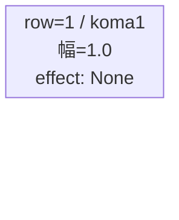
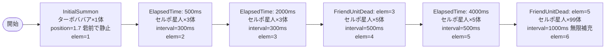

# vd_dan_boss_00001 インゲームデータ詳細解説

> 参照リポジトリ: `projects/glow-masterdata`
> リリースキー: 202604010

## インゲーム要件テキスト

ダンダダン Bossブロック。ボスは招き猫 ターボババア（`c_dan_00301_vd_Boss_Red`）で、開幕 InitialSummon で砦付近（position=1.7）に配置し、ダメージを受けるまで静止する。雑魚はセルポ星人（`e_dan_00001_vd_Normal_Red`）が ElapsedTime で序盤から段階的に出現し、FriendUnitDead で強化・補充される設計。UR対抗キャラ「ターボババアの霊力 オカルン」（`chara_dan_00002`）に対抗する赤属性 Boss ステージとして、セルポ星人が連続出現する中でボスが砦を守り続ける展開を狙う。

コマ設計は Bossブロック固定の1行構成。コマアセットキーは `dan_00007`（back_ground_offset=0.6）。

---

## レベルデザイン

### 敵キャラ設計

#### 敵キャラ選定（MstEnemyCharacter）

| mst_enemy_character_id | 日本語名 | 役割 | 備考 |
|------------------------|---------|------|------|
| `chara_dan_00301` | 招き猫 ターボババア | ボス | Boss種別、Red属性、VD専用 |
| `enemy_dan_00001` | セルポ星人 | 雑魚 | Normal種別、Red属性、VD専用 |

#### 敵キャラステータス（MstEnemyStageParameter）

> vd_all/data/MstEnemyStageParameter.csv より参照（既存VD専用パラメータ使用）

| MstEnemyStageParameter ID | 日本語名 | kind | role | color | base_hp | base_atk | base_spd | well_dist | knockback | combo | drop_bp |
|--------------------------|---------|------|------|-------|---------|----------|----------|-----------|-----------|-------|---------|
| `c_dan_00301_vd_Boss_Red` | 招き猫 ターボババア | Boss | Attack | Red | 50000 | 300 | 30 | 0.25 | 3 | 4 | 200 |
| `e_dan_00001_vd_Normal_Red` | セルポ星人 | Normal | Defense | Red | 10000 | 50 | 34 | 0.24 | 0 | 1 | 100 |

---

### コマ設計

※ Bossブロックは1行固定。各行のスパン合計 = 4。

| row | height | 選択パターン | コマ数 | 各幅 | 幅合計 |
|-----|--------|------------|-------|------|--------|
| 1 | 1.0 | パターン1 | 1 | 1.0 | 1.0 |

---

### 敵キャラシーケンス設計

> **c_キャラ同時出現ルール（プランナー確認済み）**: c_キャラ（`c_` プレフィックス）が複数体登場する場合、
> 初回のみ `ElapsedTime`、2体目以降は `FriendUnitDead`（前の c_キャラの sequence_element_id を
> condition_value に指定）でチェーンすること。また c_キャラの `summon_count` は必ず `1` とすること。`e_glo_*` は対象外。

#### どのフェーズで、どの敵を、いつ、どこに、どのくらい出現させるか

| elem | 出現タイミング | 敵 | 数 | 累計出現数/召喚位置 |
|------|-------------|---|---|-----------------|
| 1 | InitialSummon (0) | 招き猫 ターボババア | 1 | 累計1体 / position=1.7 |
| 2 | ElapsedTime: 500ms | セルポ星人 | 3 | 累計4体 / ランダム |
| 3 | ElapsedTime: 2000ms | セルポ星人 | 3 | 累計7体 / ランダム |
| 4 | FriendUnitDead: 3 | セルポ星人 | 5 | 累計12体 / ランダム |
| 5 | ElapsedTime: 4000ms | セルポ星人 | 5 | 累計17体 / ランダム |
| 6 | FriendUnitDead: 5 | セルポ星人 | 99 | 無限補充 / ランダム |

#### 敵キャラの固有ステータス調整（hp_coef / atk_coef）

| 波/フェーズ | 敵 | base_hp | hp_coef | 実HP | base_atk | atk_coef | 実ATK |
|-----------|---|---------|---------|------|----------|----------|-------|
| elem=1（ボス） | 招き猫 ターボババア | 50,000 | 1.0 | 50,000 | 300 | 1.0 | 300 |
| elem=2〜3（序盤） | セルポ星人 | 10,000 | 1.0 | 10,000 | 50 | 1.0 | 50 |
| elem=4〜5（中盤） | セルポ星人 | 10,000 | 1.0 | 10,000 | 50 | 1.0 | 50 |
| elem=6（終盤無限） | セルポ星人 | 10,000 | 1.0 | 10,000 | 50 | 1.0 | 50 |

※ VD固定のため全coefは1.0。

#### フェーズ切り替えはあるか

なし（VDではSwitchSequenceGroup使用禁止）

---

## 演出

### アセット

#### 背景

| 設定箇所 | アセットキー | 備考 |
|---------|------------|------|
| MstInGame.loop_background_asset_key | `dan_00001` | danシリーズ Boss固定値 |

#### BGM

| 設定 | 値 | 備考 |
|-----|---|------|
| bgm_asset_key | `SSE_SBG_003_004` | VD Bossブロック共通BGM |
| boss_bgm_asset_key | `""`（空文字） | BGM切り替えなし |

---

### 敵キャラオーラ

| オーラ種別 | 使用箇所 |
|----------|---------|
| Boss | ボス（招き猫 ターボババア）の召喚時（elem=1） |
| Default | セルポ星人（elem=2〜6）全て |

---

### 敵キャラ召喚アニメーション

- **elem=1（InitialSummon）**: 招き猫 ターボババア を砦前（position=1.7）に配置。`move_start_condition_type=Damage, move_start_condition_value=1` でダメージを受けるまで静止。Bossオーラ付きで存在感を演出。
- **elem=2〜6（SummonEnemy）**: セルポ星人を interval 指定で順次召喚。召喚アニメーションは None（通常召喚）。

---

## テーブル別設定値まとめ

### MstInGame

| カラム | 値 |
|--------|---|
| id | `vd_dan_boss_00001` |
| release_key | `202604010` |
| mst_auto_player_sequence_id | `""`（空文字） |
| mst_auto_player_sequence_set_id | `vd_dan_boss_00001` |
| bgm_asset_key | `SSE_SBG_003_004` |
| boss_bgm_asset_key | `""`（空文字） |
| loop_background_asset_key | `dan_00001` |
| player_outpost_asset_key | `""`（空文字） |
| mst_page_id | `vd_dan_boss_00001` |
| mst_enemy_outpost_id | `vd_dan_boss_00001` |
| mst_defense_target_id | `__NULL__` |
| boss_mst_enemy_stage_parameter_id | `c_dan_00301_vd_Boss_Red` |
| boss_count | （空） |
| normal_enemy_hp_coef | `1.0` |
| normal_enemy_attack_coef | `1.0` |
| normal_enemy_speed_coef | `1.0` |
| boss_enemy_hp_coef | `1.0` |
| boss_enemy_attack_coef | `1.0` |
| boss_enemy_speed_coef | `1.0` |

### MstPage

| カラム | 値 |
|--------|---|
| id | `vd_dan_boss_00001` |
| release_key | `202604010` |

### MstEnemyOutpost

| カラム | 値 |
|--------|---|
| id | `vd_dan_boss_00001` |
| hp | `100`（VD固定） |
| is_damage_invalidation | （空） |
| outpost_asset_key | （空） |
| artwork_asset_key | （空） |
| release_key | `202604010` |

### MstKomaLine（Bossブロックは1行固定）

| カラム | row=1 |
|--------|-------|
| id | `vd_dan_boss_00001_1` |
| mst_page_id | `vd_dan_boss_00001` |
| row | `1` |
| height | `1.0` |
| koma_line_layout_asset_key | `1` |
| release_key | `202604010` |
| koma1_asset_key | `dan_00007` |
| koma1_width | `1.0` |
| koma1_back_ground_offset | `0.6` |
| koma1_effect_type | `None` |
| koma1_effect_parameter1 | `0` |
| koma1_effect_parameter2 | `0` |
| koma1_effect_target_side | `All` |
| koma1_effect_target_colors | `All` |
| koma1_effect_target_roles | `All` |
| koma2_effect_type | `None` |
| koma3_effect_type | `None` |
| koma4_effect_type | `None` |

### MstAutoPlayerSequence

| elem | id | sequence_set_id | sequence_element_id | condition_type | condition_value | action_type | action_value | summon_count | summon_interval | summon_position | aura_type | death_type | enemy_hp_coef | enemy_attack_coef | enemy_speed_coef | move_start_condition_type | move_start_condition_value | defeated_score | summon_animation_type | release_key |
|------|-----|----------------|---------------------|---------------|----------------|-------------|-------------|-------------|----------------|----------------|-----------|-----------|--------------|------------------|-----------------|--------------------------|---------------------------|---------------|----------------------|------------|
| 1 | vd_dan_boss_00001_1 | vd_dan_boss_00001 | 1 | InitialSummon | 0 | SummonEnemy | c_dan_00301_vd_Boss_Red | 1 | 0 | 1.7 | Boss | Normal | 1.0 | 1.0 | 1.0 | Damage | 1 | 0 | None | 202604010 |
| 2 | vd_dan_boss_00001_2 | vd_dan_boss_00001 | 2 | ElapsedTime | 5 | SummonEnemy | e_dan_00001_vd_Normal_Red | 3 | 300 | （空） | Default | Normal | 1.0 | 1.0 | 1.0 | None | （空） | 0 | None | 202604010 |
| 3 | vd_dan_boss_00001_3 | vd_dan_boss_00001 | 3 | ElapsedTime | 20 | SummonEnemy | e_dan_00001_vd_Normal_Red | 3 | 300 | （空） | Default | Normal | 1.0 | 1.0 | 1.0 | None | （空） | 0 | None | 202604010 |
| 4 | vd_dan_boss_00001_4 | vd_dan_boss_00001 | 4 | FriendUnitDead | 3 | SummonEnemy | e_dan_00001_vd_Normal_Red | 5 | 500 | （空） | Default | Normal | 1.0 | 1.0 | 1.0 | None | （空） | 0 | None | 202604010 |
| 5 | vd_dan_boss_00001_5 | vd_dan_boss_00001 | 5 | ElapsedTime | 40 | SummonEnemy | e_dan_00001_vd_Normal_Red | 5 | 500 | （空） | Default | Normal | 1.0 | 1.0 | 1.0 | None | （空） | 0 | None | 202604010 |
| 6 | vd_dan_boss_00001_6 | vd_dan_boss_00001 | 6 | FriendUnitDead | 5 | SummonEnemy | e_dan_00001_vd_Normal_Red | 99 | 1000 | （空） | Default | Normal | 1.0 | 1.0 | 1.0 | None | （空） | 0 | None | 202604010 |

> ※ ElapsedTime の condition_value は 100ms 単位。5=500ms、20=2000ms、40=4000ms。
> ※ FriendUnitDead の condition_value は sequence_element_id の文字列値（elem=3を参照 → value=3、elem=5を参照 → value=5）。
> ※ ボスは MstInGame.boss_mst_enemy_stage_parameter_id（`c_dan_00301_vd_Boss_Red`）と MstAutoPlayerSequence の elem=1（InitialSummon）の両方に設定すること。
