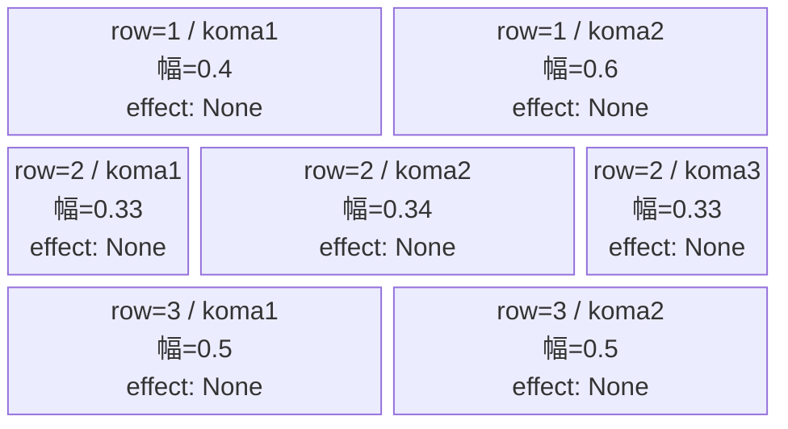
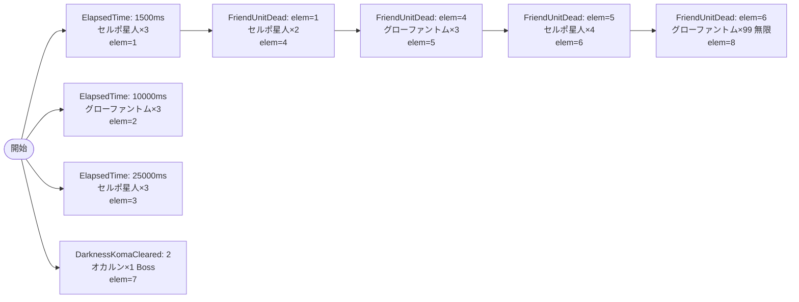

# vd_dan_normal_00001 インゲームデータ詳細解説

> 参照リポジトリ: `projects/glow-masterdata`
> リリースキー: 202604010

## インゲーム要件テキスト

開幕から赤属性のセルポ星人（`e_dan_00001_vd_Normal_Red`）が3体登場し、1000ms後にはグローファントム（`e_glo_00001_vd_Normal_Colorless`）が3体加わる。2500ms後にセルポ星人が再び3体出現する第2波構成。1体でも倒されると2体が追加補充され、7体倒された時点でセルポ星人が一気に4体押し寄せる。闇コマを2個クリアすると「ターボババアの霊力 オカルン」（`c_dan_00301_vd_Boss_Red`）が降臨する。さらに7体到達と同時にグローファントムが無限補充（interval=750ms）に切り替わり、終盤の物量プレッシャーを演出する。雑魚の合計出現数は19体以上（無限補充除く）。

コマは3行構成。row1は2コマ構成（幅0.4/0.6、パターン3・右広め）、row2は3コマ均等（幅0.33/0.34/0.33、パターン7）、row3は2コマ均等（幅0.5/0.5、パターン6）。コマアセットキーは作品対応の `dan_00007`（back_ground_offset=0.6）を使用する。

UR対抗キャラ「ターボババアの霊力 オカルン」（`chara_dan_00002` に対応）を意識した設計として、闇コマクリアトリガーで赤ボスが登場する演出を採用。プレイヤーのコマ選択がボス出現タイミングに影響し、積極的な闇コマ攻略を促す設計。

---

## レベルデザイン

### 敵キャラ設計

#### 敵キャラ選定（MstEnemyCharacter）

| mst_enemy_character_id | 日本語名 | 役割 | 備考 |
|------------------------|---------|------|------|
| enemy_dan_00001 | セルポ星人 | 雑魚 | 赤属性 Normal |
| enemy_glo_00001 | グローファントム | 雑魚 | 無色 Normal、VD汎用 |
| chara_dan_00301 | ターボババアの霊力 オカルン | ボス | 赤属性 Boss、VD専用 |

#### 敵キャラステータス（MstEnemyStageParameter）

> VD専用キュレーション済みCSV (`vd_all/data/MstEnemyStageParameter.csv`) より参照

| MstEnemyStageParameter ID | 日本語名 | kind | role | color | base_hp | base_atk | base_spd | well_dist | knockback | combo | drop_bp |
|--------------------------|---------|------|------|-------|---------|----------|----------|-----------|-----------|-------|---------|
| e_dan_00001_vd_Normal_Red | セルポ星人 | Normal | Defense | Red | 10000 | 50 | 34 | 0.24 | 0 | 1 | 100 |
| e_glo_00001_vd_Normal_Colorless | グローファントム | Normal | Attack | Colorless | 5000 | 100 | 34 | 0.22 | 3 | 1 | 150 |
| c_dan_00301_vd_Boss_Red | ターボババアの霊力 オカルン | Boss | Attack | Red | 50000 | 300 | 30 | 0.25 | 3 | 4 | 200 |

---

### コマ設計

※ columns は1つのみ。各行のスパン合計 = 4。

| row | height | 選択パターン | コマ数 | 各幅 | 幅合計 |
|-----|--------|------------|-------|------|--------|
| 1 | 0.33 | パターン3 | 2 | 0.4, 0.6 | 1.0 |
| 2 | 0.33 | パターン7 | 3 | 0.33, 0.34, 0.33 | 1.0 |
| 3 | 0.34 | パターン6 | 2 | 0.5, 0.5 | 1.0 |

- `koma1_asset_key`: `dan_00007`（series-koma-assets.csv より）
- `koma1_back_ground_offset`: `0.6`（koma-background-offset.md より dan_00007 の推奨値）
- `koma1_effect_target_colors`: `All`
- `koma1_effect_target_roles`: `All`
- koma2〜4 が存在する行も `koma2_effect_type` / `koma3_effect_type` / `koma4_effect_type` は `None` を設定

---

### 敵キャラシーケンス設計

> **c_キャラ同時出現ルール（プランナー確認済み）**: c_キャラ（`c_` プレフィックス）が複数体登場する場合、
> 初回のみ `ElapsedTime`、2体目以降は `FriendUnitDead`（前の c_キャラの sequence_element_id を
> condition_value に指定）でチェーンすること。また c_キャラの `summon_count` は必ず `1` とすること。`e_glo_*` は対象外。

#### どのフェーズで、どの敵を、いつ、どこに、どのくらい出現させるか

<!-- c_キャラ (c_dan_00301) は elem=7 のみ・summon_count=1 で登場。2体目以降なし -->

| elem | 出現タイミング | 敵 | 数 | 召喚位置/備考 |
|------|-------------|---|---|-----------------|
| 1 | ElapsedTime=150（1500ms後） | セルポ星人 (e_dan_00001_vd_Normal_Red) | 3 | ランダム |
| 2 | ElapsedTime=1000（10000ms後） | グローファントム (e_glo_00001_vd_Normal_Colorless) | 3 | ランダム |
| 3 | ElapsedTime=2500（25000ms後） | セルポ星人 (e_dan_00001_vd_Normal_Red) | 3 | ランダム |
| 4 | FriendUnitDead=1（elem1の1体倒したら） | セルポ星人 (e_dan_00001_vd_Normal_Red) | 2 | ランダム |
| 5 | FriendUnitDead=4（elem4の1体倒したら） | グローファントム (e_glo_00001_vd_Normal_Colorless) | 3 | ランダム |
| 6 | FriendUnitDead=5（elem5の1体倒したら） | セルポ星人 (e_dan_00001_vd_Normal_Red) | 4 | ランダム |
| 7 | DarknessKomaCleared=2（闇コマ2個クリア） | ターボババアの霊力 オカルン (c_dan_00301_vd_Boss_Red) | 1 | ランダム / aura=Boss |
| 8 | FriendUnitDead=6（elem6の1体倒したら） | グローファントム (e_glo_00001_vd_Normal_Colorless) | 99 | ランダム / interval=750ms |

**固定出現体数合計（elem8除く）**: 3+3+3+2+3+4+1 = **19体**（最低15体以上の条件を満たす）

#### 敵キャラの固有ステータス調整（hp_coef / atk_coef）

> VDでは全シーケンス行の enemy_hp_coef / enemy_attack_coef / enemy_speed_coef をすべて 1.0 固定とする

| 波/フェーズ | 敵 | base_hp | hp_coef | 実HP | base_atk | atk_coef | 実ATK |
|-----------|---|---------|---------|------|----------|----------|-------|
| elem1〜3 | セルポ星人 | 10000 | 1.0 | 10000 | 50 | 1.0 | 50 |
| elem2,5,8 | グローファントム | 5000 | 1.0 | 5000 | 100 | 1.0 | 100 |
| elem4,6 | セルポ星人 | 10000 | 1.0 | 10000 | 50 | 1.0 | 50 |
| elem7 | ターボババアの霊力 オカルン | 50000 | 1.0 | 50000 | 300 | 1.0 | 300 |

#### フェーズ切り替えはあるか

なし（VDでは SwitchSequenceGroup 使用禁止）

---

## 演出

### アセット

#### 背景

| 設定箇所 | アセットキー | 備考 |
|---------|------------|------|
| loop_background_asset_key | `""`（空文字） | danのNormalブロック。デフォルト背景適用 |

#### BGM

| 設定 | 値 | 備考 |
|-----|---|------|
| bgm_asset_key | `SSE_SBG_003_010` | normalブロック固定BGM |
| boss_bgm_asset_key | `""`（空文字） | VD全ブロック共通・空文字 |

---

### 敵キャラオーラ

| オーラ種別 | 使用箇所 |
|----------|---------|
| Default | elem1〜6,8（セルポ星人・グローファントム） |
| Boss | elem7（ターボババアの霊力 オカルン） |

---

### 敵キャラ召喚アニメーション

全シーケンス行の `summon_animation_type` は `None`（通常召喚）を使用。VD標準設定に従い落下演出（Fall）は使用しない。

elem7 のボス（`c_dan_00301_vd_Boss_Red`）は Boss オーラ付きで出現し、プレイヤーに強敵登場を視覚的に演出する。闇コマ2個クリアという行動に連動したタイミングで登場するため、「コマを攻略するほど敵が強くなる」緊張感を生む演出となる。

---

## テーブル設計まとめ

### MstInGame

| カラム | 値 |
|-------|---|
| id | `vd_dan_normal_00001` |
| release_key | `202604010` |
| mst_auto_player_sequence_id | `""`（空文字） |
| mst_auto_player_sequence_set_id | `vd_dan_normal_00001` |
| bgm_asset_key | `SSE_SBG_003_010` |
| boss_bgm_asset_key | `""`（空文字） |
| loop_background_asset_key | `""`（空文字） |
| player_outpost_asset_key | `""`（空文字） |
| mst_page_id | `vd_dan_normal_00001` |
| mst_enemy_outpost_id | `vd_dan_normal_00001` |
| mst_defense_target_id | `__NULL__` |
| boss_mst_enemy_stage_parameter_id | `""`（空文字・ノーマルブロックはボスなし） |
| boss_count | NULL |
| normal_enemy_hp_coef | `1.0` |
| normal_enemy_attack_coef | `1.0` |
| normal_enemy_speed_coef | `1.0` |
| boss_enemy_hp_coef | `1.0` |
| boss_enemy_attack_coef | `1.0` |
| boss_enemy_speed_coef | `1.0` |

> ※ VDのnormalブロックでは `boss_mst_enemy_stage_parameter_id` は空文字。ボスは `MstAutoPlayerSequence` の elem7 (DarknessKomaCleared) から召喚する。

### MstPage

| カラム | 値 |
|-------|---|
| id | `vd_dan_normal_00001` |
| release_key | `202604010` |

### MstEnemyOutpost

| カラム | 値 |
|-------|---|
| id | `vd_dan_normal_00001` |
| hp | `100`（VD固定） |
| is_damage_invalidation | `""`（空文字） |
| outpost_asset_key | `""`（空文字） |
| artwork_asset_key | `""`（空文字・確認推奨） |
| release_key | `202604010` |

### MstKomaLine（3行）

| id | mst_page_id | row | height | pattern | koma数 | koma_line_layout_asset_key |
|---|-------------|-----|--------|---------|-------|--------------------------|
| vd_dan_normal_00001_1 | vd_dan_normal_00001 | 1 | 0.33 | パターン3 | 2 | 3 |
| vd_dan_normal_00001_2 | vd_dan_normal_00001 | 2 | 0.33 | パターン7 | 3 | 7 |
| vd_dan_normal_00001_3 | vd_dan_normal_00001 | 3 | 0.34 | パターン6 | 2 | 6 |

全行共通設定:
- `koma1_asset_key`: `dan_00007`
- `koma1_back_ground_offset`: `0.6`
- `koma1_effect_type`: `None`
- `koma1_effect_parameter1`: `0`
- `koma1_effect_parameter2`: `0`
- `koma1_effect_target_side`: `All`
- `koma1_effect_target_colors`: `All`
- `koma1_effect_target_roles`: `All`
- koma2/3/4 が存在する行も `koma2_effect_type` 等は `None`（同様のアセットキー・幅を設定）
- `release_key`: `202604010`

### MstAutoPlayerSequence（8行）

| id | sequence_set_id | elem | condition_type | condition_value | action_value | count | interval | aura | death_type |
|---|----------------|------|---------------|----------------|-------------|-------|----------|------|-----------|
| vd_dan_normal_00001_1 | vd_dan_normal_00001 | 1 | ElapsedTime | 150 | e_dan_00001_vd_Normal_Red | 3 | 0 | Default | Normal |
| vd_dan_normal_00001_2 | vd_dan_normal_00001 | 2 | ElapsedTime | 1000 | e_glo_00001_vd_Normal_Colorless | 3 | 0 | Default | Normal |
| vd_dan_normal_00001_3 | vd_dan_normal_00001 | 3 | ElapsedTime | 2500 | e_dan_00001_vd_Normal_Red | 3 | 0 | Default | Normal |
| vd_dan_normal_00001_4 | vd_dan_normal_00001 | 4 | FriendUnitDead | 1 | e_dan_00001_vd_Normal_Red | 2 | 0 | Default | Normal |
| vd_dan_normal_00001_5 | vd_dan_normal_00001 | 5 | FriendUnitDead | 4 | e_glo_00001_vd_Normal_Colorless | 3 | 0 | Default | Normal |
| vd_dan_normal_00001_6 | vd_dan_normal_00001 | 6 | FriendUnitDead | 5 | e_dan_00001_vd_Normal_Red | 4 | 0 | Default | Normal |
| vd_dan_normal_00001_7 | vd_dan_normal_00001 | 7 | DarknessKomaCleared | 2 | c_dan_00301_vd_Boss_Red | 1 | 0 | Boss | Normal |
| vd_dan_normal_00001_8 | vd_dan_normal_00001 | 8 | FriendUnitDead | 6 | e_glo_00001_vd_Normal_Colorless | 99 | 750 | Default | Normal |

全行共通設定:
- `sequence_group_id`: `""`（空文字）
- `action_type`: `SummonEnemy`
- `summon_animation_type`: `None`
- `move_start_condition_type`: `None`
- `move_stop_condition_type`: `None`
- `move_restart_condition_type`: `None`
- `death_type`: `Normal`
- `defeated_score`: `0`
- `deactivation_condition_type`: `None`
- `enemy_hp_coef`: `1.0`
- `enemy_attack_coef`: `1.0`
- `enemy_speed_coef`: `1.0`
- `release_key`: `202604010`
