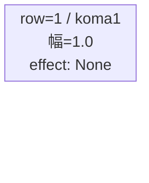
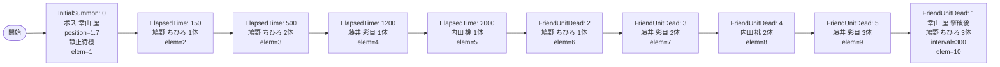

# vd_hut_boss_00001 インゲームデータ詳細解説

> 参照リポジトリ: `projects/glow-masterdata`
> リリースキー: 202604010

## インゲーム要件テキスト

ボスキャラは「幸山 厘」（`c_hut_00101_vd_Boss_Yellow`、Support / Yellow）を使用し、UR対抗キャラ「ひたむきギタリスト 鳩野 ちひろ」（`chara_hut_00001`）を意識した設計。ボスは開幕 `InitialSummon` で砦付近（position=1.7）に配置し、ダメージを受けるまで静止する演出とする。雑魚ウェーブは「鳩野 ちひろ」（`c_hut_00001_vd_Normal_Yellow`）・「藤井 彩目」（`c_hut_00201_vd_Normal_Yellow`）・「内田 桃」（`c_hut_00301_vd_Normal_Yellow`）の3キャラで構成し、ElapsedTime で序盤の定期ウェーブを送りつつ、FriendUnitDead で撃破数が増えるほど強化雑魚が追加される設計。終盤はボスを倒すと `FriendUnitDead` で c_hut キャラが大量追加される流れとなる。

コマ設計は boss ブロック固有の1行構成。コマアセットキーは `glo_00014`（hut シリーズ）を使用し、koma1_back_ground_offset は仮値 `-1.0` を設定する。

UR対抗の狙いとして、「ひたむきギタリスト 鳩野 ちひろ」のスキルがフィールド上で活きやすいよう、同色 Yellow の雑魚を連続して送り込む構成とした。

---

## レベルデザイン

### 敵キャラ設計

#### 敵キャラ選定（MstEnemyCharacter）

| mst_enemy_character_id | 日本語名 | 役割 | 備考 |
|------------------------|---------|------|------|
| `chara_hut_00101` | 幸山 厘 | ボス | bossブロックのメインボス |
| `chara_hut_00001` | 鳩野 ちひろ（ひたむきギタリスト） | 雑魚 | UR対抗キャラ。序盤〜中盤に登場 |
| `chara_hut_00201` | 藤井 彩目 | 雑魚 | 中盤以降の強化雑魚として登場 |
| `chara_hut_00301` | 内田 桃 | 雑魚 | 中盤以降の強化雑魚として登場 |

#### 敵キャラステータス（MstEnemyStageParameter）

> vd_all/data/MstEnemyStageParameter.csv より参照（リリースキー 202604010）

| MstEnemyStageParameter ID | 日本語名 | kind | role | color | base_hp | base_atk | base_spd | well_dist | knockback | combo | drop_bp |
|--------------------------|---------|------|------|-------|---------|----------|----------|-----------|-----------|-------|---------|
| `c_hut_00101_vd_Boss_Yellow` | 幸山 厘 | Boss | Support | Yellow | 10000 | 100 | 35 | 0.42 | 2 | 6 | 200 |
| `c_hut_00001_vd_Normal_Yellow` | 鳩野 ちひろ | Normal | Defense | Yellow | 10000 | 100 | 35 | 0.21 | 1 | 5 | 200 |
| `c_hut_00201_vd_Normal_Yellow` | 藤井 彩目 | Normal | Technical | Yellow | 10000 | 100 | 35 | 0.5 | 2 | 5 | 200 |
| `c_hut_00301_vd_Normal_Yellow` | 内田 桃 | Normal | Technical | Yellow | 10000 | 100 | 35 | 0.5 | 2 | 6 | 200 |

---

### コマ設計

※ boss ブロックはコマ1行固定。columns は4（koma1 スパン=4 で全幅）。

| row | height | 選択パターン | コマ数 | 各幅 | 幅合計 |
|-----|--------|------------|-------|------|--------|
| 1 | 1.0 | パターン1（1コマフル幅） | 1 | 1.0 | 1.0 |

---

### 敵キャラシーケンス設計

> **c_キャラ同時出現ルール（プランナー確認済み）**: c_キャラ（`c_` プレフィックス）が複数体登場する場合、
> 初回のみ `ElapsedTime`、2体目以降は `FriendUnitDead`（前の c_キャラの sequence_element_id を
> condition_value に指定）でチェーンすること。また c_キャラの `summon_count` は必ず `1` とすること。`e_glo_*` は対象外。

> **ボスの二重設定**: `MstInGame.boss_mst_enemy_stage_parameter_id` に `c_hut_00101_vd_Boss_Yellow` を設定し、さらに MstAutoPlayerSequence の `InitialSummon` でもボスを召喚することで、ボスをフィールドに配置する。

#### どのフェーズで、どの敵を、いつ、どこに、どのくらい出現させるか

| elem | 出現タイミング | 敵 | 数 | 累計出現数/召喚位置 |
|------|-------------|---|---|-----------------|
| 1 | InitialSummon=0 | 幸山 厘（ボス）| 1 | 1体 / position=1.7 |
| 2 | ElapsedTime=150（1500ms） | 鳩野 ちひろ | 1 | 2体 / ランダム |
| 3 | ElapsedTime=500（5000ms） | 鳩野 ちひろ | 2 | 4体 / ランダム |
| 4 | ElapsedTime=1200（12000ms） | 藤井 彩目 | 1 | 5体 / ランダム |
| 5 | ElapsedTime=2000（20000ms） | 内田 桃 | 1 | 6体 / ランダム |
| 6 | FriendUnitDead=2 | 鳩野 ちひろ | 1 | 7体 / ランダム |
| 7 | FriendUnitDead=3 | 藤井 彩目 | 2 | 9体 / ランダム |
| 8 | FriendUnitDead=4 | 内田 桃 | 2 | 11体 / ランダム |
| 9 | FriendUnitDead=5 | 藤井 彩目 | 3 | 14体 / ランダム |
| 10 | FriendUnitDead=1（ボス撃破後） | 鳩野 ちひろ | 3 | 17体 / interval=300 |

> FriendUnitDead=1 は elem=1（ボス）が倒されたとき発火。ボス撃破後に残党が追加される演出。

#### 敵キャラの固有ステータス調整（hp_coef / atk_coef）

| 波/フェーズ | 敵 | base_hp | hp_coef | 実HP | base_atk | atk_coef | 実ATK |
|-----------|---|---------|---------|------|----------|----------|-------|
| 開幕（ボス） | 幸山 厘 | 10000 | 5.0 | 50000 | 100 | 3.0 | 300 |
| 序盤 | 鳩野 ちひろ（elem2） | 10000 | 1.0 | 10000 | 100 | 1.0 | 100 |
| 中盤 | 鳩野 ちひろ（elem3） | 10000 | 1.5 | 15000 | 100 | 1.5 | 150 |
| 中盤 | 藤井 彩目（elem4） | 10000 | 1.5 | 15000 | 100 | 1.5 | 150 |
| 中盤 | 内田 桃（elem5） | 10000 | 1.5 | 15000 | 100 | 1.5 | 150 |
| 後半（FriendUnitDead） | 鳩野 ちひろ（elem6） | 10000 | 2.0 | 20000 | 100 | 2.0 | 200 |
| 後半（FriendUnitDead） | 藤井 彩目（elem7） | 10000 | 2.0 | 20000 | 100 | 2.0 | 200 |
| 後半（FriendUnitDead） | 内田 桃（elem8） | 10000 | 2.5 | 25000 | 100 | 2.5 | 250 |
| 後半（FriendUnitDead） | 藤井 彩目（elem9） | 10000 | 2.5 | 25000 | 100 | 2.5 | 250 |
| ボス後（FriendUnitDead） | 鳩野 ちひろ（elem10） | 10000 | 3.0 | 30000 | 100 | 2.0 | 200 |

#### フェーズ切り替えはあるか

なし（VDではSwitchSequenceGroup使用禁止）

---

## 演出

### アセット

#### 背景

| 設定箇所 | アセットキー | 備考 |
|---------|------------|------|
| loop_background_asset_key | `""`（空文字） | hut boss 未定のため空文字 |

#### BGM

| 設定 | 値 | 備考 |
|-----|---|------|
| bgm_asset_key | `SSE_SBG_003_004` | bossブロック固定BGM |
| boss_bgm_asset_key | `""`（空文字） | VD全ブロック共通で空文字 |

---

### 敵キャラオーラ

| オーラ種別 | 使用箇所 |
|----------|---------|
| Boss | 幸山 厘（ボス）：elem=1 の InitialSummon |
| Default | 雑魚キャラ全般（elem 2〜10） |

---

### 敵キャラ召喚アニメーション

- ボス（elem=1）: `InitialSummon` で position=1.7 に配置。`move_start_condition_type=Damage`（1ダメージで動き始める）。`summon_animation_type=None`
- 雑魚（elem 2〜10）: `summon_animation_type=None`（通常召喚）

---

## テーブルデータ設計サマリ

### MstInGame

| カラム | 値 |
|-------|---|
| id | `vd_hut_boss_00001` |
| release_key | `202604010` |
| mst_auto_player_sequence_id | `""`（空文字） |
| mst_auto_player_sequence_set_id | `vd_hut_boss_00001` |
| bgm_asset_key | `SSE_SBG_003_004` |
| boss_bgm_asset_key | `""`（空文字） |
| loop_background_asset_key | `""`（空文字） |
| player_outpost_asset_key | `""`（空文字） |
| mst_page_id | `vd_hut_boss_00001` |
| mst_enemy_outpost_id | `vd_hut_boss_00001` |
| mst_defense_target_id | `__NULL__` |
| boss_mst_enemy_stage_parameter_id | `c_hut_00101_vd_Boss_Yellow` |
| boss_count | （NULL） |
| normal_enemy_hp_coef | `1.0` |
| normal_enemy_attack_coef | `1.0` |
| normal_enemy_speed_coef | `1.0` |
| boss_enemy_hp_coef | `1.0` |
| boss_enemy_attack_coef | `1.0` |
| boss_enemy_speed_coef | `1.0` |

### MstPage

| カラム | 値 |
|-------|---|
| id | `vd_hut_boss_00001` |
| release_key | `202604010` |

### MstEnemyOutpost

| カラム | 値 |
|-------|---|
| id | `vd_hut_boss_00001` |
| hp | `100` |
| is_damage_invalidation | （空） |
| outpost_asset_key | （空） |
| artwork_asset_key | （空） |
| release_key | `202604010` |

### MstKomaLine（1行）

| カラム | 値 |
|-------|---|
| id | `vd_hut_boss_00001_1` |
| mst_page_id | `vd_hut_boss_00001` |
| row | `1` |
| height | `1.0` |
| koma_line_layout_asset_key | `1` |
| release_key | `202604010` |
| koma1_asset_key | `glo_00014` |
| koma1_width | `1.0` |
| koma1_back_ground_offset | `-1.0` |
| koma1_effect_type | `None` |
| koma1_effect_parameter1 | `0` |
| koma1_effect_parameter2 | `0` |
| koma1_effect_target_side | `All` |
| koma1_effect_target_colors | `All` |
| koma1_effect_target_roles | `All` |
| koma2_effect_type | `None` |
| koma3_effect_type | `None` |
| koma4_effect_type | `None` |

### MstAutoPlayerSequence（10行）

| elem | id | sequence_set_id | sequence_element_id | condition_type | condition_value | action_type | action_value | summon_count | summon_interval | summon_position | move_start_condition_type | move_start_condition_value | aura_type | death_type | enemy_hp_coef | enemy_attack_coef | enemy_speed_coef | defeated_score | summon_animation_type |
|------|----|----------------|---------------------|---------------|----------------|-------------|-------------|-------------|-----------------|-----------------|--------------------------|---------------------------|----------|------------|--------------|------------------|-----------------|----------------|----------------------|
| 1 | vd_hut_boss_00001_1 | vd_hut_boss_00001 | 1 | InitialSummon | 0 | SummonEnemy | c_hut_00101_vd_Boss_Yellow | 1 | 0 | 1.7 | Damage | 1 | Boss | Normal | 5.0 | 3.0 | 1.0 | 0 | None |
| 2 | vd_hut_boss_00001_2 | vd_hut_boss_00001 | 2 | ElapsedTime | 150 | SummonEnemy | c_hut_00001_vd_Normal_Yellow | 1 | 0 |  | None |  | Default | Normal | 1.0 | 1.0 | 1.0 | 0 | None |
| 3 | vd_hut_boss_00001_3 | vd_hut_boss_00001 | 3 | ElapsedTime | 500 | SummonEnemy | c_hut_00001_vd_Normal_Yellow | 2 | 300 |  | None |  | Default | Normal | 1.5 | 1.5 | 1.0 | 0 | None |
| 4 | vd_hut_boss_00001_4 | vd_hut_boss_00001 | 4 | ElapsedTime | 1200 | SummonEnemy | c_hut_00201_vd_Normal_Yellow | 1 | 0 |  | None |  | Default | Normal | 1.5 | 1.5 | 1.0 | 0 | None |
| 5 | vd_hut_boss_00001_5 | vd_hut_boss_00001 | 5 | ElapsedTime | 2000 | SummonEnemy | c_hut_00301_vd_Normal_Yellow | 1 | 0 |  | None |  | Default | Normal | 1.5 | 1.5 | 1.0 | 0 | None |
| 6 | vd_hut_boss_00001_6 | vd_hut_boss_00001 | 6 | FriendUnitDead | 2 | SummonEnemy | c_hut_00001_vd_Normal_Yellow | 1 | 0 |  | None |  | Default | Normal | 2.0 | 2.0 | 1.0 | 0 | None |
| 7 | vd_hut_boss_00001_7 | vd_hut_boss_00001 | 7 | FriendUnitDead | 3 | SummonEnemy | c_hut_00201_vd_Normal_Yellow | 2 | 300 |  | None |  | Default | Normal | 2.0 | 2.0 | 1.0 | 0 | None |
| 8 | vd_hut_boss_00001_8 | vd_hut_boss_00001 | 8 | FriendUnitDead | 4 | SummonEnemy | c_hut_00301_vd_Normal_Yellow | 2 | 300 |  | None |  | Default | Normal | 2.5 | 2.5 | 1.0 | 0 | None |
| 9 | vd_hut_boss_00001_9 | vd_hut_boss_00001 | 9 | FriendUnitDead | 5 | SummonEnemy | c_hut_00201_vd_Normal_Yellow | 3 | 300 |  | None |  | Default | Normal | 2.5 | 2.5 | 1.0 | 0 | None |
| 10 | vd_hut_boss_00001_10 | vd_hut_boss_00001 | 10 | FriendUnitDead | 1 | SummonEnemy | c_hut_00001_vd_Normal_Yellow | 3 | 300 |  | None |  | Default | Normal | 3.0 | 2.0 | 1.0 | 0 | None |
