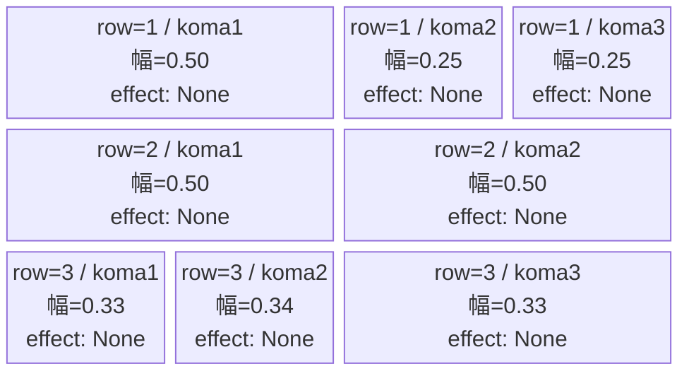
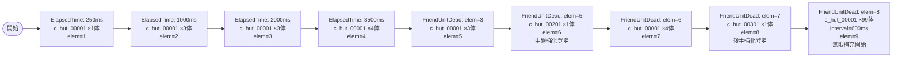

# vd_hut_normal_00001 インゲームデータ詳細解説

> 参照リポジトリ: `projects/glow-masterdata`
> リリースキー: 202604010

## インゲーム要件テキスト

序盤は c_hut_00001（鳩野 ちひろ / Defense-Yellow）が ElapsedTime=250ms で1体出現し、その後 ElapsedTime=1000ms / 2000ms / 3500ms と段階的に追加召喚する。5体撃破ごとに FriendUnitDead でチェーンし、c_hut_00201（Technical-Yellow）が登場して中盤の圧力を高める。さらに10体撃破トリガーで c_hut_00301（Technical-Yellow）が召喚され、終盤は c_hut_00001 の summon_count=99 無限補充に切り替わる。c_キャラは2体目以降 FriendUnitDead でチェーンし、フィールド上の同時出現は最大1体に制御する。合計出現体数は最低15体（無限補充除く初期ウェーブで18体以上）を確保する。

コマは3行構成。アセットキーは作品カラー `glo_00014` を使用。行1はパターン8（3コマ：幅0.5/0.25/0.25）、行2はパターン6（2コマ：幅0.5/0.5）、行3はパターン7（3コマ：幅0.33/0.34/0.33）。エフェクトはすべて None（ひたむきギタリスト 鳩野 ちひろ対抗のコマ効果は実装なし）。

UR対抗キャラ：ひたむきギタリスト 鳩野 ちひろ（chara_hut_00001）の Defense 特性に対抗するため、c_hut_00001 を主力として Defense ロールの敵を繰り返し召喚する設計。FriendUnitDead でのチェーンにより「倒すほど次の仲間が現れる」軽音楽部らしい連携演出を狙っている。

---

## レベルデザイン

### 敵キャラ設計

#### 敵キャラ選定（MstEnemyCharacter）
| mst_enemy_character_id | 日本語名 | 役割 | 備考 |
|------------------------|---------|------|------|
| chara_hut_00001 | 鳩野 ちひろ | 雑魚（主力） | UR対抗キャラ。Defense-Yellow |
| chara_hut_00201 | ひたむきギタリスト（中盤強化） | 雑魚（中盤） | Technical-Yellow。FriendUnitDead=5体で登場 |
| chara_hut_00301 | ひたむきギタリスト（後半強化） | 雑魚（後半） | Technical-Yellow。FriendUnitDead=10体で登場 |

#### 敵キャラステータス（MstEnemyStageParameter）
> 全て `vd_all/data/MstEnemyStageParameter.csv` 既存参照
| MstEnemyStageParameter ID | 日本語名 | kind | role | color | base_hp | base_atk | base_spd | well_dist | knockback | combo | drop_bp |
|--------------------------|---------|------|------|-------|---------|----------|----------|-----------|-----------|-------|---------|
| c_hut_00001_vd_Normal_Yellow | 鳩野 ちひろ | Normal | Defense | Yellow | 10000 | 100 | 35 | 0.21 | 1 | 5 | 200 |
| c_hut_00201_vd_Normal_Yellow | ひたむきギタリスト（中盤） | Normal | Technical | Yellow | 10000 | 100 | 35 | 0.5 | 2 | 5 | 200 |
| c_hut_00301_vd_Normal_Yellow | ひたむきギタリスト（後半） | Normal | Technical | Yellow | 10000 | 100 | 35 | 0.5 | 2 | 6 | 200 |

---

### コマ設計

※ columns は1つのみ。各行のスパン合計 = 4 になること。

| row | height | 選択パターン | コマ数 | 各幅 | 幅合計 |
|-----|--------|------------|-------|------|--------|
| 1 | 0.33 | パターン8 | 3 | 0.50, 0.25, 0.25 | 1.0 |
| 2 | 0.33 | パターン6 | 2 | 0.50, 0.50 | 1.0 |
| 3 | 0.34 | パターン7 | 3 | 0.33, 0.34, 0.33 | 1.0 |

---

### 敵キャラシーケンス設計

> **c_キャラ同時出現ルール（プランナー確認済み）**: c_キャラ（`c_` プレフィックス）が複数体登場する場合、
> 初回のみ `ElapsedTime`、2体目以降は `FriendUnitDead`（前の c_キャラの sequence_element_id を
> condition_value に指定）でチェーンすること。また c_キャラの `summon_count` は必ず `1` とすること。`e_glo_*` は対象外。

#### どのフェーズで、どの敵を、いつ、どこに、どのくらい出現させるか

| elem | 出現タイミング | 敵 | 数 | 累計出現数/召喚位置 |
|------|-------------|---|---|-----------------|
| 1 | ElapsedTime=250ms | c_hut_00001_vd_Normal_Yellow | 1 | 1体 / デフォルト |
| 2 | ElapsedTime=1000ms | c_hut_00001_vd_Normal_Yellow | 3 | 4体 / デフォルト (interval=200ms) |
| 3 | ElapsedTime=2000ms | c_hut_00001_vd_Normal_Yellow | 3 | 7体 / デフォルト (interval=300ms) |
| 4 | ElapsedTime=3500ms | c_hut_00001_vd_Normal_Yellow | 4 | 11体 / デフォルト (interval=400ms) |
| 5 | FriendUnitDead=3 | c_hut_00001_vd_Normal_Yellow | 3 | 〜14体 / デフォルト (interval=300ms) |
| 6 | FriendUnitDead=5 | c_hut_00201_vd_Normal_Yellow | 1 | 〜15体 / デフォルト（中盤強化）|
| 7 | FriendUnitDead=6 | c_hut_00001_vd_Normal_Yellow | 4 | 〜19体 / デフォルト (interval=400ms) |
| 8 | FriendUnitDead=7 | c_hut_00301_vd_Normal_Yellow | 1 | 〜20体 / デフォルト（後半強化）|
| 9 | FriendUnitDead=8 | c_hut_00001_vd_Normal_Yellow | 99 | 無限 / デフォルト (interval=600ms) |

#### 敵キャラの固有ステータス調整（hp_coef / atk_coef）
| 波/フェーズ | 敵 | base_hp | hp_coef | 実HP | base_atk | atk_coef | 実ATK |
|-----------|---|---------|---------|------|----------|----------|-------|
| 序盤〜終盤（elem 1〜5,7,9） | c_hut_00001_vd_Normal_Yellow | 10000 | 1.0 | 10000 | 100 | 1.0 | 100 |
| 中盤強化（elem 6） | c_hut_00201_vd_Normal_Yellow | 10000 | 1.0 | 10000 | 100 | 1.0 | 100 |
| 後半強化（elem 8） | c_hut_00301_vd_Normal_Yellow | 10000 | 1.0 | 10000 | 100 | 1.0 | 100 |

#### フェーズ切り替えはあるか
なし（VDではSwitchSequenceGroup使用禁止）

---

## 演出

### アセット

#### 背景
| 設定箇所 | アセットキー | 備考 |
|---------|------------|------|
| loop_background_asset_key | `""` | Normal通常。空文字（デフォルト背景適用） |

#### BGM
| 設定 | 値 | 備考 |
|-----|---|------|
| bgm_asset_key | `SSE_SBG_003_010` | VD normalブロック共通BGM |
| boss_bgm_asset_key | `""` | BGM切り替えなし。VD全ブロック共通 |

---

### 敵キャラオーラ
| オーラ種別 | 使用箇所 |
|----------|---------|
| Default | 全elem共通（c_hut_00001, c_hut_00201, c_hut_00301 すべて Default） |

---

### 敵キャラ召喚アニメーション
全要素で `summon_animation_type=None`（通常召喚）。FriendUnitDead のチェーン召喚では interval を設定することで「1体ずつ続けて現れる」リズム感を演出する。無限補充（elem=9）は interval=600ms で途切れない流れを実現。

---

## マスタデータ設定値まとめ

### MstInGame
| カラム | 値 |
|--------|---|
| id | `vd_hut_normal_00001` |
| release_key | `202604010` |
| mst_auto_player_sequence_id | `""` |
| mst_auto_player_sequence_set_id | `vd_hut_normal_00001` |
| bgm_asset_key | `SSE_SBG_003_010` |
| boss_bgm_asset_key | `""` |
| loop_background_asset_key | `""` |
| player_outpost_asset_key | `""` |
| mst_page_id | `vd_hut_normal_00001` |
| mst_enemy_outpost_id | `vd_hut_normal_00001` |
| mst_defense_target_id | `__NULL__` |
| boss_mst_enemy_stage_parameter_id | `""` |
| normal_enemy_hp_coef | `1.0` |
| normal_enemy_attack_coef | `1.0` |
| normal_enemy_speed_coef | `1.0` |
| boss_enemy_hp_coef | `1.0` |
| boss_enemy_attack_coef | `1.0` |
| boss_enemy_speed_coef | `1.0` |

### MstPage
| カラム | 値 |
|--------|---|
| id | `vd_hut_normal_00001` |
| release_key | `202604010` |

### MstEnemyOutpost
| カラム | 値 |
|--------|---|
| id | `vd_hut_normal_00001` |
| hp | `100` |
| release_key | `202604010` |

### MstKomaLine（3行）

| id | mst_page_id | row | height | layout | koma1_asset_key | koma1_width | koma1_bg_offset | koma1_effect | koma2_width | koma3_width |
|----|------------|-----|--------|--------|-----------------|-------------|-----------------|-------------|-------------|-------------|
| vd_hut_normal_00001_1 | vd_hut_normal_00001 | 1 | 0.33 | 8 | glo_00014 | 0.50 | 0.0 | None | 0.25 | 0.25 |
| vd_hut_normal_00001_2 | vd_hut_normal_00001 | 2 | 0.33 | 6 | glo_00014 | 0.50 | 0.0 | None | 0.50 | - |
| vd_hut_normal_00001_3 | vd_hut_normal_00001 | 3 | 0.34 | 7 | glo_00014 | 0.33 | 0.0 | None | 0.34 | 0.33 |

> koma1_back_ground_offset は hut シリーズの実績データなし。デフォルト仮値 `0.0`（中央表示）を設定。アセット担当者への確認推奨。

### MstAutoPlayerSequence（9行）

| id | sequence_set_id | seq_elem_id | condition_type | condition_value | action_value | summon_count | summon_interval | aura | death_type | enemy_hp_coef | enemy_atk_coef | enemy_spd_coef | defeated_score |
|----|----------------|------------|----------------|-----------------|--------------|-------------|-----------------|------|------------|--------------|----------------|----------------|----------------|
| vd_hut_normal_00001_1 | vd_hut_normal_00001 | 1 | ElapsedTime | 250 | c_hut_00001_vd_Normal_Yellow | 1 | 0 | Default | Normal | 1.0 | 1.0 | 1.0 | 0 |
| vd_hut_normal_00001_2 | vd_hut_normal_00001 | 2 | ElapsedTime | 1000 | c_hut_00001_vd_Normal_Yellow | 3 | 200 | Default | Normal | 1.0 | 1.0 | 1.0 | 0 |
| vd_hut_normal_00001_3 | vd_hut_normal_00001 | 3 | ElapsedTime | 2000 | c_hut_00001_vd_Normal_Yellow | 3 | 300 | Default | Normal | 1.0 | 1.0 | 1.0 | 0 |
| vd_hut_normal_00001_4 | vd_hut_normal_00001 | 4 | ElapsedTime | 3500 | c_hut_00001_vd_Normal_Yellow | 4 | 400 | Default | Normal | 1.0 | 1.0 | 1.0 | 0 |
| vd_hut_normal_00001_5 | vd_hut_normal_00001 | 5 | FriendUnitDead | 3 | c_hut_00001_vd_Normal_Yellow | 3 | 300 | Default | Normal | 1.0 | 1.0 | 1.0 | 0 |
| vd_hut_normal_00001_6 | vd_hut_normal_00001 | 6 | FriendUnitDead | 5 | c_hut_00201_vd_Normal_Yellow | 1 | 0 | Default | Normal | 1.0 | 1.0 | 1.0 | 0 |
| vd_hut_normal_00001_7 | vd_hut_normal_00001 | 7 | FriendUnitDead | 6 | c_hut_00001_vd_Normal_Yellow | 4 | 400 | Default | Normal | 1.0 | 1.0 | 1.0 | 0 |
| vd_hut_normal_00001_8 | vd_hut_normal_00001 | 8 | FriendUnitDead | 7 | c_hut_00301_vd_Normal_Yellow | 1 | 0 | Default | Normal | 1.0 | 1.0 | 1.0 | 0 |
| vd_hut_normal_00001_9 | vd_hut_normal_00001 | 9 | FriendUnitDead | 8 | c_hut_00001_vd_Normal_Yellow | 99 | 600 | Default | Normal | 1.0 | 1.0 | 1.0 | 0 |
