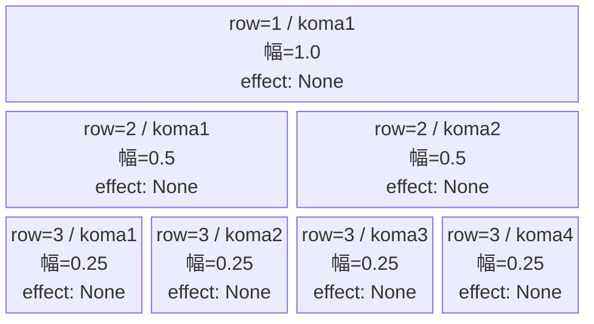

# vd_sur_normal_00001 インゲームデータ詳細解説

> 参照リポジトリ: `projects/glow-masterdata`
> リリースキー: 202604010

## インゲーム要件テキスト

醜鬼（`e_sur_00101_vd_Normal_Red`）が序盤から中盤にかけてElapsedTimeとFriendUnitDeadの両トリガーで波状に押し寄せる。開幕150msに3体、倒すごとに追加が入り、中盤5000ms以降は10体×複数ウェーブが連続して計20体近くが一気に押し寄せる。11体撃破を境に強化ボスキャラ「無窮の鎖 和倉 優希」（`c_sur_00801_vd_Boss_Red`）がBossオーラとともに登場し、以降は `OutpostDamage=1` で醜鬼の無限補充（interval=750ms）が発動する。UR対抗「万物を統べる総組長 山城 恋」（`chara_sur_00901`）はvd_all CSVに専用エントリが存在しないため今回は採用できないが、代わりにボス格相当の `c_sur_00801_vd_Boss_Red` を終盤決戦キャラとして位置づけ、難易度のピークを演出する。コマは3行・各行独立抽選（1〜4コマ）で、アセットキー `sur_00001`・背景オフセット `-1.0` を使用する。

---

## レベルデザイン

### 敵キャラ設計

#### 敵キャラ選定（MstEnemyCharacter）

| mst_enemy_character_id | 日本語名 | 役割 | 備考 |
|------------------------|---------|------|------|
| `enemy_sur_00101` | 醜鬼 | 雑魚 | surの基本雑魚。Red属性・Attack型 |
| `chara_sur_00801` | 無窮の鎖 和倉 優希 | ボス | vd_all CSVに存在するBoss。FriendUnitDead=11体で登場 |

#### 敵キャラステータス（MstEnemyStageParameter）

> vd_all/data/MstEnemyStageParameter.csv より取得

| MstEnemyStageParameter ID | 日本語名 | kind | role | color | base_hp | base_atk | base_spd | well_dist | knockback | combo | drop_bp |
|--------------------------|---------|------|------|-------|---------|----------|----------|-----------|-----------|-------|---------|
| `e_sur_00101_vd_Normal_Red` | 醜鬼 | Normal | Attack | Red | 400000 | 850 | 45 | 0.2 | 3 | 1 | 10 |
| `c_sur_00801_vd_Boss_Red` | 無窮の鎖 和倉 優希 | Boss | Defense | Red | 50000 | 300 | 32 | 0.24 | 3 | 4 | 100 |

---

### コマ設計

※ columns は1つのみ。各行のスパン合計 = 4 になること。

| row | height | 選択パターン | コマ数 | 各幅 | 幅合計 |
|-----|--------|------------|-------|------|--------|
| 1 | 0.33 | パターン1 | 1 | 1.0 | 1.0 |
| 2 | 0.33 | パターン6 | 2 | 0.5, 0.5 | 1.0 |
| 3 | 0.34 | パターン12 | 4 | 0.25, 0.25, 0.25, 0.25 | 1.0 |

---

### 敵キャラシーケンス設計

> **c_キャラ同時出現ルール（プランナー確認済み）**: c_キャラ（`c_` プレフィックス）が複数体登場する場合、
> 初回のみ `ElapsedTime`、2体目以降は `FriendUnitDead`（前の c_キャラの sequence_element_id を
> condition_value に指定）でチェーンすること。また c_キャラの `summon_count` は必ず `1` とすること。`e_glo_*` は対象外。

#### どのフェーズで、どの敵を、いつ、どこに、どのくらい出現させるか

```mermaid
flowchart LR
  Start([開始]) --> E1[ElapsedTime: 150\n醜鬼 Red×3\nelem=1]
  E1 --> E2[ElapsedTime: 1000\n醜鬼 Red×2\nelem=2]
  E2 --> E3[ElapsedTime: 1500\n醜鬼 Red×3\nelem=3]
  E3 --> E4[FriendUnitDead: 3\n醜鬼 Red×2\nelem=4]
  E4 --> E5[FriendUnitDead: 3\n醜鬼 Red×1\nelem=5]
  E5 --> E6[ElapsedTime: 3200\n醜鬼 Red×3 pos=1.3\nelem=6]
  E6 --> E7[ElapsedTime: 4000\n醜鬼 Red×10 interval=800\nelem=7]
  E7 --> E8[ElapsedTime: 5000\n醜鬼 Red×10 interval=1200\nelem=8]
  E8 --> E9[FriendUnitDead: 6\n醜鬼 Red×3 interval=100\nelem=9]
  E9 --> E10[FriendUnitDead: 7\n醜鬼 Red×3 interval=100\nelem=10]
  E10 --> E11[FriendUnitDead: 11\n和倉 優希 Boss×1 pos=1.7\nelem=11]
  E11 --> E12[OutpostDamage: 1\n醜鬼 Red×99 interval=750\nelem=12]
```

| elem | 出現タイミング | 敵 | 数 | 累計出現数/召喚位置 |
|------|-------------|---|---|-----------------|
| 1 | ElapsedTime=150 | 醜鬼（e_sur_00101_vd_Normal_Red） | 3 | 累計3 |
| 2 | ElapsedTime=1000 | 醜鬼（e_sur_00101_vd_Normal_Red） | 2 | 累計5 |
| 3 | ElapsedTime=1500 | 醜鬼（e_sur_00101_vd_Normal_Red） | 3 | 累計8 |
| 4 | FriendUnitDead=3 | 醜鬼（e_sur_00101_vd_Normal_Red） | 2 | 累計10 |
| 5 | FriendUnitDead=3 | 醜鬼（e_sur_00101_vd_Normal_Red） | 1 | 累計11 |
| 6 | ElapsedTime=3200 | 醜鬼（e_sur_00101_vd_Normal_Red） | 3 | 累計14 / pos=1.3 |
| 7 | ElapsedTime=4000 | 醜鬼（e_sur_00101_vd_Normal_Red） | 10 | 累計24 / interval=800ms |
| 8 | ElapsedTime=5000 | 醜鬼（e_sur_00101_vd_Normal_Red） | 10 | 累計34 / interval=1200ms |
| 9 | FriendUnitDead=6 | 醜鬼（e_sur_00101_vd_Normal_Red） | 3 | 累計37 / interval=100ms |
| 10 | FriendUnitDead=7 | 醜鬼（e_sur_00101_vd_Normal_Red） | 3 | 累計40 / interval=100ms |
| 11 | FriendUnitDead=11 | 無窮の鎖 和倉 優希（c_sur_00801_vd_Boss_Red） | 1 | 累計41 / pos=1.7 / aura=Boss |
| 12 | OutpostDamage=1 | 醜鬼（e_sur_00101_vd_Normal_Red） | 99 | 無限補充 / interval=750ms |

> **雑魚体数確認**: elems 1〜10 の醜鬼合計 = 3+2+3+2+1+3+10+10+3+3 = **40体**（最低15体以上の条件を満たす）

#### 敵キャラの固有ステータス調整（hp_coef / atk_coef）

| 波/フェーズ | 敵 | base_hp | hp_coef | 実HP | base_atk | atk_coef | 実ATK |
|-----------|---|---------|---------|------|----------|----------|-------|
| 序盤（elem1〜5） | 醜鬼 | 400000 | 1.0 | 400000 | 850 | 1.0 | 850 |
| 中盤（elem6〜8） | 醜鬼 | 400000 | 1.0 | 400000 | 850 | 1.0 | 850 |
| 後半（elem9〜10） | 醜鬼 | 400000 | 1.0 | 400000 | 850 | 1.0 | 850 |
| ボス（elem11） | 無窮の鎖 和倉 優希 | 50000 | 1.0 | 50000 | 300 | 1.0 | 300 |
| 無限補充（elem12） | 醜鬼 | 400000 | 1.0 | 400000 | 850 | 1.0 | 850 |

#### フェーズ切り替えはあるか

なし（VDではSwitchSequenceGroup使用禁止）

---

## 演出

### アセット

#### 背景

| 設定箇所 | アセットキー | 備考 |
|---------|------------|------|
| MstInGame.loop_background_asset_key | `""` | Normal通常＝空文字（デフォルト背景） |
| MstKomaLine.koma1_asset_key（全行共通） | `sur_00001` | series-koma-assets.csv参照 |

#### BGM

| 設定 | 値 | 備考 |
|-----|---|------|
| bgm_asset_key | `SSE_SBG_003_010` | VD normalブロック固定BGM |
| boss_bgm_asset_key | `""` | VD全ブロック共通・空文字 |

---

### 敵キャラオーラ

| オーラ種別 | 使用箇所 |
|----------|---------|
| Default | 醜鬼（elem1〜10、elem12）全て |
| Boss | 無窮の鎖 和倉 優希（elem11）登場時 |

---

### 敵キャラ召喚アニメーション

醜鬼（e_sur_00101_vd_Normal_Red）はすべて `summon_animation_type=None` で通常召喚。ボスキャラ「無窮の鎖 和倉 優希」（c_sur_00801_vd_Boss_Red）は elem=11 で `summon_position=1.7`（砦付近）に `summon_animation_type=None` で登場し、Bossオーラとともに出現する。OutpostDamage=1（拠点初ダメージ）で醜鬼の無限補充（summon_count=99、interval=750ms）が開始される。

---

## テーブル設定値まとめ

### MstInGame

| カラム | 値 |
|-------|---|
| id | `vd_sur_normal_00001` |
| release_key | `202604010` |
| mst_auto_player_sequence_id | `""` |
| mst_auto_player_sequence_set_id | `vd_sur_normal_00001` |
| bgm_asset_key | `SSE_SBG_003_010` |
| boss_bgm_asset_key | `""` |
| loop_background_asset_key | `""` |
| player_outpost_asset_key | `""` |
| mst_page_id | `vd_sur_normal_00001` |
| mst_enemy_outpost_id | `vd_sur_normal_00001` |
| mst_defense_target_id | `__NULL__` |
| boss_mst_enemy_stage_parameter_id | `""` |
| boss_count | （空） |
| normal_enemy_hp_coef | `1.0` |
| normal_enemy_attack_coef | `1.0` |
| normal_enemy_speed_coef | `1.0` |
| boss_enemy_hp_coef | `1.0` |
| boss_enemy_attack_coef | `1.0` |
| boss_enemy_speed_coef | `1.0` |

> **注意**: boss_mst_enemy_stage_parameter_id は空文字（ボスはMstAutoPlayerSequence側のelem=11 FriendUnitDead経由で召喚）。c_sur_00801_vd_Boss_Red は MstAutoPlayerSequence の SummonEnemy action_value で設定する。

### MstPage

| カラム | 値 |
|-------|---|
| id | `vd_sur_normal_00001` |
| release_key | `202604010` |

### MstEnemyOutpost

| カラム | 値 |
|-------|---|
| id | `vd_sur_normal_00001` |
| hp | `100` |
| is_damage_invalidation | （空） |
| outpost_asset_key | （空） |
| artwork_asset_key | （要確認） |
| release_key | `202604010` |

### MstKomaLine（3行）

| カラム | row=1 | row=2 | row=3 |
|-------|-------|-------|-------|
| id | `vd_sur_normal_00001_1` | `vd_sur_normal_00001_2` | `vd_sur_normal_00001_3` |
| mst_page_id | `vd_sur_normal_00001` | `vd_sur_normal_00001` | `vd_sur_normal_00001` |
| row | 1 | 2 | 3 |
| height | 0.33 | 0.33 | 0.34 |
| koma_line_layout_asset_key | 1 | 6 | 12 |
| koma1_asset_key | `sur_00001` | `sur_00001` | `sur_00001` |
| koma1_width | 1.0 | 0.5 | 0.25 |
| koma1_back_ground_offset | -1.0 | -1.0 | -1.0 |
| koma1_effect_type | None | None | None |
| koma1_effect_parameter1 | 0 | 0 | 0 |
| koma1_effect_parameter2 | 0 | 0 | 0 |
| koma1_effect_target_side | All | All | All |
| koma1_effect_target_colors | All | All | All |
| koma1_effect_target_roles | All | All | All |
| koma2_asset_key | （空） | `sur_00001` | `sur_00001` |
| koma2_width | （空） | 0.5 | 0.25 |
| koma2_effect_type | None | None | None |
| koma3_asset_key | （空） | （空） | `sur_00001` |
| koma3_width | （空） | （空） | 0.25 |
| koma3_effect_type | None | None | None |
| koma4_asset_key | （空） | （空） | `sur_00001` |
| koma4_width | （空） | （空） | 0.25 |
| koma4_effect_type | None | None | None |
| release_key | 202604010 | 202604010 | 202604010 |

### MstAutoPlayerSequence（12行）

sequence_set_id = `vd_sur_normal_00001`

| id | seq_elem_id | condition_type | condition_value | action_value | summon_count | summon_interval | summon_position | aura_type | death_type | enemy_hp_coef | enemy_attack_coef | enemy_speed_coef | defeated_score | summon_animation_type | move_start_condition_type | move_stop_condition_type | move_restart_condition_type | deactivation_condition_type |
|----|------------|---------------|----------------|-------------|-------------|----------------|----------------|-----------|-----------|--------------|------------------|-----------------|---------------|----------------------|--------------------------|--------------------------|----------------------------|----------------------------|
| vd_sur_normal_00001_1 | 1 | ElapsedTime | 150 | e_sur_00101_vd_Normal_Red | 3 | 300 | | Default | Normal | 1.0 | 1.0 | 1.0 | 0 | None | None | None | None | None |
| vd_sur_normal_00001_2 | 2 | ElapsedTime | 1000 | e_sur_00101_vd_Normal_Red | 2 | 50 | | Default | Normal | 1.0 | 1.0 | 1.0 | 0 | None | None | None | None | None |
| vd_sur_normal_00001_3 | 3 | ElapsedTime | 1500 | e_sur_00101_vd_Normal_Red | 3 | 50 | | Default | Normal | 1.0 | 1.0 | 1.0 | 0 | None | None | None | None | None |
| vd_sur_normal_00001_4 | 4 | FriendUnitDead | 3 | e_sur_00101_vd_Normal_Red | 2 | 50 | | Default | Normal | 1.0 | 1.0 | 1.0 | 0 | None | None | None | None | None |
| vd_sur_normal_00001_5 | 5 | FriendUnitDead | 3 | e_sur_00101_vd_Normal_Red | 1 | 0 | | Default | Normal | 1.0 | 1.0 | 1.0 | 0 | None | None | None | None | None |
| vd_sur_normal_00001_6 | 6 | ElapsedTime | 3200 | e_sur_00101_vd_Normal_Red | 3 | 100 | 1.3 | Default | Normal | 1.0 | 1.0 | 1.0 | 0 | None | None | None | None | None |
| vd_sur_normal_00001_7 | 7 | ElapsedTime | 4000 | e_sur_00101_vd_Normal_Red | 10 | 800 | | Default | Normal | 1.0 | 1.0 | 1.0 | 0 | None | None | None | None | None |
| vd_sur_normal_00001_8 | 8 | ElapsedTime | 5000 | e_sur_00101_vd_Normal_Red | 10 | 1200 | | Default | Normal | 1.0 | 1.0 | 1.0 | 0 | None | None | None | None | None |
| vd_sur_normal_00001_9 | 9 | FriendUnitDead | 6 | e_sur_00101_vd_Normal_Red | 3 | 100 | | Default | Normal | 1.0 | 1.0 | 1.0 | 0 | None | None | None | None | None |
| vd_sur_normal_00001_10 | 10 | FriendUnitDead | 7 | e_sur_00101_vd_Normal_Red | 3 | 100 | | Default | Normal | 1.0 | 1.0 | 1.0 | 0 | None | None | None | None | None |
| vd_sur_normal_00001_11 | 11 | FriendUnitDead | 11 | c_sur_00801_vd_Boss_Red | 1 | 0 | 1.7 | Boss | Normal | 1.0 | 1.0 | 1.0 | 0 | None | None | None | None | None |
| vd_sur_normal_00001_12 | 12 | OutpostDamage | 1 | e_sur_00101_vd_Normal_Red | 99 | 750 | | Default | Normal | 1.0 | 1.0 | 1.0 | 0 | None | None | None | None | None |
